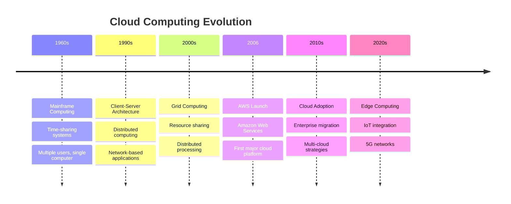
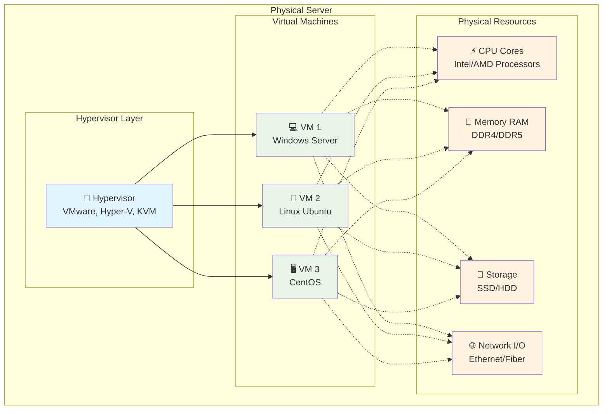
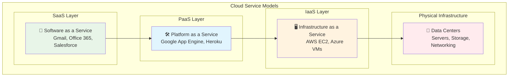
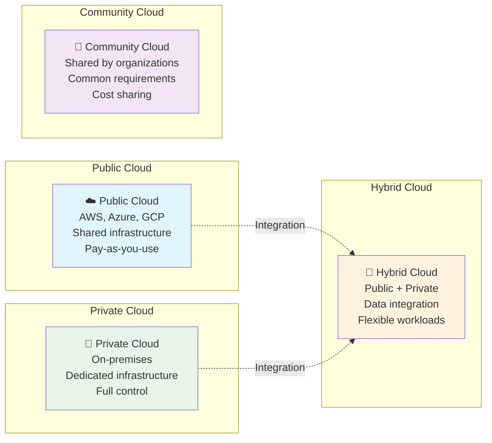
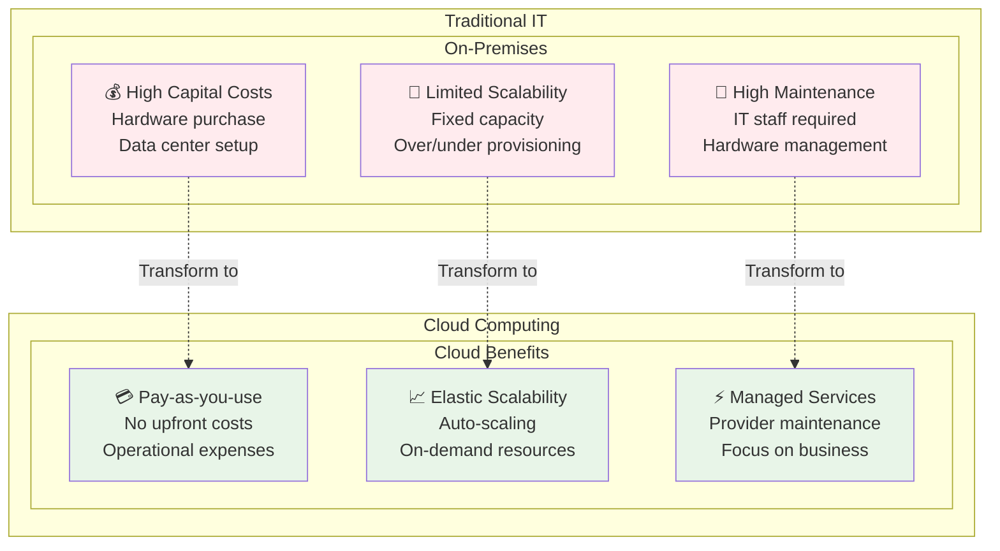
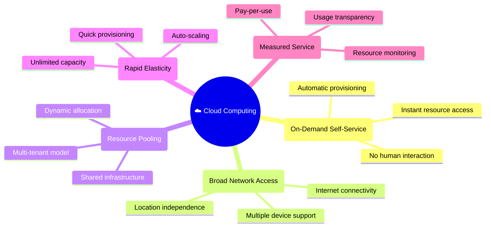
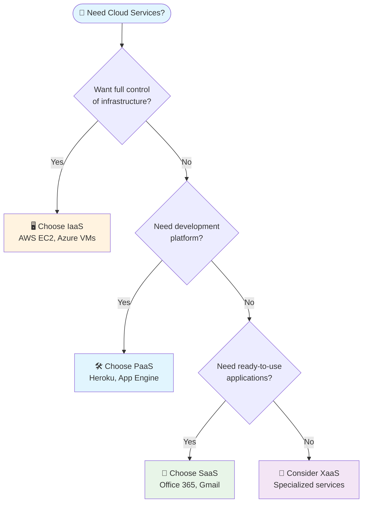

# ☁️ Cloud Computing Basic Concepts

**📚 Learn the Fundamentals | 🏗️ Understand Architecture | 🚀 Master Cloud Concepts**

---

## 📋 Overview

This guide covers the fundamental concepts of cloud computing, from its historical evolution to modern service models. Perfect for students beginning their cloud journey.

---

## 📜 Brief History of Cloud Computing

### **Timeline of Cloud Evolution**

### **Key Milestones:**
- **1960s:** Mainframe time-sharing systems
- **1990s:** Internet and distributed computing
- **2006:** Amazon launches AWS (EC2, S3)
- **2008:** Google App Engine, Microsoft Azure
- **2010s:** Enterprise cloud adoption
- **2020s:** Edge computing and AI integration

---

## 💻 Virtualization Fundamentals

### **What is Virtualization?**

Virtualization creates virtual versions of physical computing resources, allowing multiple operating systems to run on a single physical machine.

### **Core Components of Virtualization**

### **Resource Allocation Breakdown:**

| Resource | Description | Virtualization Method |
|----------|-------------|----------------------|
| **⚡ CPU** | Processing power | Time-slicing, CPU scheduling |
| **🧠 RAM** | System memory | Memory partitioning, ballooning |
| **💾 Disk I/O** | Storage access | Virtual disks, storage pools |
| **🌐 Network I/O** | Network connectivity | Virtual switches, VLANs |

---

## 🏗️ Cloud Service Models

### **Service Model Hierarchy**

### **Detailed Service Models:**

#### **🖥️ IaaS (Infrastructure as a Service)**
- **What you get:** Virtual machines, storage, networks
- **What you manage:** OS, applications, data
- **Examples:** AWS EC2, Azure VMs, Google Compute Engine
- **Use cases:** Web hosting, development environments

#### **🛠️ PaaS (Platform as a Service)**
- **What you get:** Development platform, runtime environment
- **What you manage:** Applications and data only
- **Examples:** Google App Engine, Heroku, AWS Elastic Beanstalk
- **Use cases:** Application development, API hosting

#### **📧 SaaS (Software as a Service)**
- **What you get:** Complete applications
- **What you manage:** User data and settings
- **Examples:** Gmail, Office 365, Salesforce, Dropbox
- **Use cases:** Email, productivity, CRM

#### **🔧 XaaS (Everything as a Service)**
- **Includes:** DaaS, FaaS, BaaS, and more
- **Examples:** 
  - **DaaS:** Desktop as a Service (Virtual desktops)
  - **FaaS:** Function as a Service (AWS Lambda)
  - **BaaS:** Backend as a Service (Firebase)

---

## 🌐 Cloud Deployment Models

### **Deployment Model Comparison**

### **Deployment Model Details:**

| Model | Ownership | Location | Security | Cost | Use Cases |
|-------|-----------|----------|----------|------|-----------|
| **☁️ Public** | Cloud provider | Provider's data center | Shared responsibility | Low upfront | Startups, web apps |
| **🏢 Private** | Organization | On-premises/dedicated | Full control | High upfront | Banking, healthcare |
| **🔄 Hybrid** | Mixed | Multiple locations | Balanced | Variable | Enterprise migration |
| **👥 Community** | Shared | Shared facility | Collaborative | Shared costs | Government, research |

---

## 🔄 Cloud Computing Benefits vs Traditional IT

### **Comparison Overview**

### **Key Benefits of Cloud Computing:**

#### **💰 Cost Benefits:**
- **No upfront investment** in hardware
- **Pay-as-you-use** pricing model
- **Reduced operational costs** (electricity, cooling, space)
- **Economies of scale** from cloud providers

#### **📈 Scalability Benefits:**
- **Elastic scaling** up or down based on demand
- **Global reach** with multiple regions
- **High availability** with redundancy
- **Disaster recovery** built-in

#### **⚡ Operational Benefits:**
- **Faster deployment** of applications
- **Automatic updates** and patches
- **Focus on core business** instead of IT infrastructure
- **Access from anywhere** with internet connection

---

## 🎯 Cloud Characteristics

### **Essential Cloud Characteristics**

---

## 📊 Simple Decision Matrix

### **When to Choose Which Service Model?**

---

## 🎓 Key Takeaways for Students

### **Remember These Concepts:**

1. **🏗️ Virtualization** enables cloud computing by sharing physical resources
2. **📊 Service Models** (IaaS, PaaS, SaaS) offer different levels of management
3. **🌐 Deployment Models** (Public, Private, Hybrid) suit different needs
4. **💰 Cost Benefits** come from shared infrastructure and pay-as-you-use
5. **📈 Scalability** allows resources to grow with your needs

### **Study Tips:**
- **Understand the differences** between service models
- **Practice identifying** real-world examples
- **Think about use cases** for each deployment model
- **Consider cost implications** of different approaches

---

## 🔗 Additional Learning Resources

- **📚 AWS Cloud Practitioner Essentials** - Free training course
- **🎥 YouTube:** "Cloud Computing Explained" videos
- **📖 Books:** "Cloud Computing: Concepts, Technology & Architecture"
- **🧪 Hands-on:** AWS Free Tier account for practice

---

**☁️ Master the cloud fundamentals and build your future! 🚀**

*Understanding these basics is your first step to cloud expertise*

---

**Cloud Basic Concepts Guide**  
**Created by:** Varun Kumar  
**Last Updated:** November 2024
