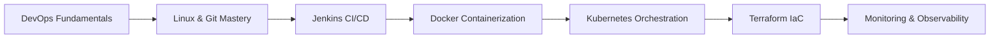

# Section 2: DevOps & Infrastructure as Code 🚀

> Comprehensive DevOps training program designed to advance your career as a Cloud & DevOps Engineer

## 📋 Table of Contents
- [Section Overview](#section-overview)
- [Learning Path](#learning-path)
- [Session Structure](#session-structure)
- [Technologies Covered](#technologies-covered)
- [Hands-On Projects](#hands-on-projects)
- [Prerequisites](#prerequisites)
- [Learning Outcomes](#learning-outcomes)
- [Assessment Methods](#assessment-methods)
- [Career Impact](#career-impact)
- [Getting Started](#getting-started)

## 🎯 Section Overview

This section focuses on **DevOps practices, Infrastructure as Code (IaC), and automation tools** that bridge the gap between development and operations. You'll master the complete DevOps toolchain through hands-on projects and real-world implementations.

### Key Focus Areas:
- **Continuous Integration & Continuous Deployment (CI/CD)**
- **End-to-end Product Automation**
- **Configuration Management**
- **Infrastructure-as-a-Service (IaaS)**
- **Container Orchestration & Management**
- **Cloud-native Application Development**

### Program Features:
- ✅ **Full hands-on approach** with real-world scenarios
- ✅ **Progressive skill building** from basics to advanced
- ✅ **Multi-cloud deployment** experience (AWS, GCP)
- ✅ **Industry best practices** and modern toolchain
- ✅ **Project-based learning** with portfolio development

## 🛤️ Learning Path



### Progression Timeline:
- **Weeks 1-2:** DevOps Culture & Linux Fundamentals
- **Weeks 3-4:** Version Control & CI/CD with Jenkins
- **Weeks 5-6:** Containerization with Docker
- **Weeks 7-8:** Container Orchestration with Kubernetes
- **Weeks 9-10:** Infrastructure as Code with Terraform
- **Weeks 11-12:** Monitoring, Security & Advanced Topics

## 📚 Session Structure

### Session 1: Introduction to DevOps
**Duration:** 2 weeks | **Focus:** DevOps culture, principles, and transformation

**Topics Covered:**
- DevOps vs Traditional IT approaches
- Cultural transformation and team collaboration
- DevOps roles and responsibilities (DevOps Engineer, SRE, Platform Engineer)
- Business value and ROI of DevOps adoption
- DevOps patterns and frameworks (CALMS, Three Ways, DORA metrics)
- Legacy system problems and DevOps solutions

**Learning Outcomes:**
- ✅ Understand DevOps principles and core concepts
- ✅ Identify the gap between traditional Dev and Ops teams
- ✅ Recognize DevOps roles and career opportunities
- ✅ Apply DevOps frameworks to real-world scenarios

---

### Session 2: Linux Fundamentals
**Duration:** 2 weeks | **Focus:** Essential Linux skills for DevOps professionals

**Topics Covered:**
- Command line proficiency and shell scripting
- File system navigation and permissions management
- Process management and system monitoring
- Package management and software installation
- Network configuration and troubleshooting
- System administration and security basics

**Learning Outcomes:**
- ✅ Master essential Linux commands and operations
- ✅ Write effective shell scripts for automation
- ✅ Manage system processes and resources
- ✅ Configure networking and security settings

---

### Session 3: Mastering Git
**Duration:** 2 weeks | **Focus:** Version control and collaborative development

**Topics Covered:**
- Git fundamentals and repository management
- Branching strategies and merge workflows
- Collaborative development with GitHub/GitLab
- Git hooks and automation integration
- Best practices for code versioning
- Advanced Git operations and troubleshooting

**Learning Outcomes:**
- ✅ Implement effective Git workflows
- ✅ Manage complex branching strategies
- ✅ Collaborate effectively using Git platforms
- ✅ Integrate Git with CI/CD pipelines

---

### Session 4: Jenkins - CI/CD Fundamentals
**Duration:** 2 weeks | **Focus:** Continuous Integration & Continuous Deployment automation

**Topics Covered:**
1. **Jenkins Installation & Setup**
   - Jenkins architecture and components
   - Installation on various platforms
   - Initial configuration and security setup

2. **Master-Slave Configuration & Multi-mode**
   - Distributed builds and scaling
   - Node management and configuration
   - Load balancing and resource optimization

3. **Job & Pipeline Creation**
   - Freestyle jobs and parameterized builds
   - Pipeline as Code (PaC) implementation
   - Declarative vs Scripted pipelines

4. **Build, Integration & Delivery Pipelines**
   - Multi-stage pipeline design
   - Integration with testing frameworks
   - Deployment automation and rollback strategies

5. **Advanced Jenkins Features**
   - Plugin ecosystem and management
   - Security and access control
   - Monitoring and maintenance

**Learning Outcomes:**
- ✅ Design and implement automated CI/CD pipelines
- ✅ Configure distributed Jenkins environments
- ✅ Create Pipeline as Code solutions
- ✅ Integrate testing and deployment automation

---

### Terraform Module: Infrastructure as Code
**Duration:** 2 weeks | **Focus:** Infrastructure automation and management

**Topics Covered:**
1. **Infrastructure as Code Principles**
   - IaC concepts and benefits
   - Declarative vs Imperative approaches
   - Version control for infrastructure

2. **Terraform Installation & Workflows**
   - Terraform architecture and components
   - Installation and configuration
   - Terraform workflow (init, plan, apply, destroy)

3. **Configuration Management & Orchestration**
   - HCL (HashiCorp Configuration Language)
   - Resource provisioning and dependencies
   - State management and backends

4. **Resource Provisioning & Deployments**
   - Multi-cloud resource management
   - Modules and reusable components
   - Environment management and promotion

**Learning Outcomes:**
- ✅ Automate cloud infrastructure provisioning
- ✅ Implement Infrastructure as Code best practices
- ✅ Manage infrastructure across multiple environments
- ✅ Create reusable Terraform modules

## 💻 Technologies Covered

### Core DevOps Tools


### Containerization & Orchestration


### Cloud Platforms


### Monitoring & Observability


## 🚀 Hands-On Projects

### Project 1: Basic DevOps Pipeline
**Objective:** Create a simple CI/CD pipeline with Jenkins
- Set up Git repository with sample Java application
- Configure Jenkins for automated builds and testing
- Implement basic deployment to AWS EC2
- Monitor application performance and logs

**Skills Developed:** Jenkins configuration, Git integration, AWS deployment

---

### Project 2: Java Application CI/CD
**Objective:** Setup comprehensive Java application CI/CD pipeline
- Implement multi-stage pipeline with testing phases
- Deploy application on AWS cloud platform
- Configure automated rollback mechanisms
- Integrate code quality and security scanning

**Skills Developed:** Advanced Jenkins pipelines, AWS services, quality gates

---

### Project 3: Web Application CI/CD on GCP
**Objective:** Setup Web application CI/CD pipeline with Jenkins
- Deploy application on Google Cloud Platform (GCP)
- Implement blue-green deployment strategy
- Configure monitoring and alerting
- Optimize for performance and cost

**Skills Developed:** GCP services, deployment strategies, monitoring

---

### Project 4: Infrastructure as Code with Terraform
**Objective:** Automate infrastructure provisioning
- Deploy cloud resources using Terraform
- Implement multi-cloud deployment (AWS & GCP)
- Create reusable modules and environments
- Integrate with CI/CD pipelines

**Skills Developed:** Terraform mastery, multi-cloud management, IaC best practices

---

### Capstone Project: Production-Ready Microservices
**Objective:** Deploy enterprise-grade microservice application
- Implement complete DevOps workflow
- Deploy on Kubernetes cluster with monitoring
- Apply security best practices (DevSecOps)
- Real client project implementation

**Skills Developed:** End-to-end DevOps implementation, enterprise practices

## 🔧 Prerequisites

### Technical Requirements
- **Basic Linux/Unix knowledge** - Command line familiarity
- **Programming fundamentals** - Any programming language
- **Networking basics** - TCP/IP, DNS, HTTP concepts
- **Cloud awareness** - Basic understanding of cloud services

### Software Requirements
- **Computer specifications:** Minimum 8GB RAM, 50GB free disk space
- **Operating System:** Linux, macOS, or Windows with WSL2
- **Internet connection:** Stable broadband for cloud platform access
- **Accounts:** AWS and GCP accounts (free tier eligible)

### Development Environment Setup

```bash
# Essential tools installation
# Git
sudo apt-get update && sudo apt-get install git -y

# Docker
curl -fsSL https://get.docker.com -o get-docker.sh
sh get-docker.sh

# AWS CLI
curl "https://awscli.amazonaws.com/awscli-exe-linux-x86_64.zip" -o "awscliv2.zip"
unzip awscliv2.zip && sudo ./aws/install

# Terraform
wget https://releases.hashicorp.com/terraform/1.5.0/terraform_1.5.0_linux_amd64.zip
unzip terraform_1.5.0_linux_amd64.zip && sudo mv terraform /usr/local/bin/

# kubectl
curl -LO "https://dl.k8s.io/release/$(curl -L -s https://dl.k8s.io/release/stable.txt)/bin/linux/amd64/kubectl"
chmod +x kubectl && sudo mv kubectl /usr/local/bin/

# Verify installations
git --version && docker --version && aws --version && terraform --version && kubectl version --client
```

## 🎓 Learning Outcomes

Upon completion of Section 2, you will be able to:

### Technical Mastery
- ✅ **Design and implement** end-to-end CI/CD pipelines
- ✅ **Automate infrastructure** provisioning with Terraform
- ✅ **Manage containerized applications** with Docker and Kubernetes
- ✅ **Configure and maintain** Jenkins automation servers
- ✅ **Implement DevOps best practices** in enterprise environments
- ✅ **Troubleshoot and optimize** DevOps workflows
- ✅ **Deploy applications** on multiple cloud platforms

### Professional Skills
- ✅ **Collaborate effectively** in cross-functional DevOps teams
- ✅ **Apply DevOps culture** and principles in organizations
- ✅ **Communicate technical concepts** to stakeholders
- ✅ **Lead DevOps transformation** initiatives
- ✅ **Optimize costs** and performance in cloud environments

### Career Readiness
- ✅ **DevOps Engineer** - Pipeline automation and infrastructure management
- ✅ **Site Reliability Engineer (SRE)** - System reliability and performance
- ✅ **Platform Engineer** - Internal developer platform creation
- ✅ **Cloud Engineer** - Cloud infrastructure and services
- ✅ **Automation Engineer** - Process automation and optimization

## 📊 Assessment Methods

### Practical Assessments (70%)
- **Hands-on Projects** - Real-world implementation scenarios
- **Code Reviews** - Infrastructure and pipeline configurations
- **Lab Exercises** - Guided practice with immediate feedback
- **Troubleshooting Scenarios** - Problem-solving under pressure

### Knowledge Assessments (30%)
- **Technical Quizzes** - Tool-specific knowledge validation
- **Case Studies** - Real-world problem analysis
- **Best Practices Reviews** - Industry standard implementations
- **Peer Reviews** - Collaborative learning and feedback

### Success Metrics
- **Project Completion Rate:** 100% of assigned projects
- **Code Quality Score:** Minimum 85% on code reviews
- **Technical Proficiency:** Pass all tool-specific assessments
- **Collaboration Score:** Effective teamwork in group projects

## 💼 Career Impact

### Industry Statistics (2025)
- **DevOps Adoption:** 91% of enterprises have implemented DevOps practices
- **Job Growth:** 156% projected growth for DevOps roles (2025-2030)
- **Salary Range:** $95,000 - $165,000 for DevOps engineers
- **ROI Impact:** 285% average return on DevOps investment

### Skills in High Demand
- **Container Orchestration:** Kubernetes expertise (82% usage in production)
- **Infrastructure as Code:** Terraform and CloudFormation (71% adoption)
- **CI/CD Automation:** Jenkins, GitHub Actions, GitLab CI (49% market share)
- **Cloud Platforms:** AWS, Azure, GCP certifications
- **Security Integration:** DevSecOps practices (73% vulnerability reduction)

### Certification Preparation
This program prepares you for:
- **AWS Certified DevOps Engineer** - Professional level
- **Google Cloud Professional DevOps Engineer** - Professional level
- **Certified Kubernetes Administrator (CKA)** - CNCF certification
- **HashiCorp Certified: Terraform Associate** - Infrastructure automation
- **Jenkins Engineer Certification** - CI/CD expertise

## 🚀 Getting Started

### Step 1: Environment Setup
1. **Clone the repository:**
   ```bash
   git clone https://github.com/manikcloud/cloud-devops-learning-path.git
   cd cloud-devops-learning-path/Section-2-DevOps
   ```

2. **Set up development environment** using the setup script above

3. **Configure cloud accounts:**
   ```bash
   # AWS Configuration
   aws configure
   
   # GCP Configuration (after installing gcloud CLI)
   gcloud auth login
   gcloud config set project YOUR_PROJECT_ID
   ```

### Step 2: Begin Learning Journey
1. **Start with Session 1:** Introduction to DevOps
2. **Follow the progressive path:** Complete each session in order
3. **Practice regularly:** Use hands-on labs and exercises
4. **Build projects:** Apply learning through practical implementations

### Step 3: Community Engagement
- **Join discussion forums** for peer learning
- **Participate in code reviews** and collaborative projects
- **Attend virtual meetups** and industry sessions
- **Contribute to open source** DevOps projects

## 📖 Resources & Support

### Documentation Links
- [Jenkins Documentation](https://www.jenkins.io/doc/) - Official Jenkins guides
- [Terraform Documentation](https://www.terraform.io/docs/) - Infrastructure as Code
- [Docker Documentation](https://docs.docker.com/) - Containerization guides
- [Kubernetes Documentation](https://kubernetes.io/docs/) - Container orchestration
- [AWS Documentation](https://docs.aws.amazon.com/) - Cloud services reference
- [GCP Documentation](https://cloud.google.com/docs) - Google Cloud guides

### Community Support
- **Course discussion forums** - Peer learning and Q&A
- **Weekly office hours** - Direct instructor support
- **Study groups** - Collaborative learning sessions
- **Industry mentorship** - Professional guidance and networking

### Additional Learning Resources
- **Video tutorials** - Supplementary visual learning
- **Practice labs** - Hands-on skill reinforcement
- **Industry blogs** - Latest trends and best practices
- **Certification guides** - Exam preparation materials

---

## 🎯 Ready to Transform Your Career?

**DevOps is not just about tools—it's about culture, collaboration, and continuous improvement.** This comprehensive program will equip you with both the technical skills and professional mindset needed to excel in modern DevOps environments.

Start your journey today and join the ranks of high-performing DevOps professionals who are driving digital transformation across industries.

**Next Step:** Begin with [Session 1: Introduction to DevOps](./Session-1_Introduction-to-DevOps/) to understand the fundamental principles that will guide your entire learning journey.

---

**Created by Varun Kumar Manik**  
*AWS Ambassador | Kubernetes Expert | DevOps Specialist*

**Program Inspiration:** Pragra DevOps Mastering Tools Program  
*"Onward & Upward"* 🚀

*Last Updated: July 2025*
