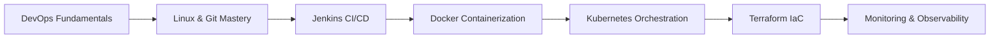

# Section 2: DevOps & Infrastructure as Code 🚀

> Comprehensive DevOps training program designed to advance your career as a Cloud & DevOps Engineer

## 📋 Table of Contents
- [Section Overview](#-section-overview)
- [Learning Path](#️-learning-path)
- [Session Structure](#-session-structure)
- [Technologies Covered](#-technologies-covered)
- [Hands-On Projects](#-hands-on-projects)
- [Prerequisites](#-prerequisites)
- [Learning Outcomes](#-learning-outcomes)
- [Assessment Methods](#-assessment-methods)
- [Career Impact](#-career-impact)
- [Getting Started](#-getting-started)

## 🎯 Section Overview

This section focuses on **DevOps practices, Infrastructure as Code (IaC), and automation tools** that bridge the gap between development and operations. You'll master the complete DevOps toolchain through hands-on projects and real-world implementations.

### Key Focus Areas:
- **Continuous Integration & Continuous Delivery/Deployment (CI/CD)**
- **End-to-end Product Automation**
- **Configuration Management**
- **Infrastructure-as-a-Service (IaaS)**
- **Container Orchestration & Management**
- **Cloud-native Application Development**

### Program Features:
- ✅ **Full hands-on approach** with real-world scenarios
- ✅ **Progressive skill building** from basics to advanced
- ✅ **Multi-cloud deployment** experience (AWS, GCP, Azure)
- ✅ **Industry best practices** and modern toolchain
- ✅ **Project-based learning** with portfolio development

## 🛤️ Learning Path

<div align="center">


</div>



### Progression Timeline:
- **Weeks 1-2:** DevOps Culture & Linux Fundamentals
- **Weeks 3-4:** Version Control & CI/CD with Jenkins
- **Weeks 5-6:** Containerization with Docker
- **Weeks 7-8:** Container Orchestration with Kubernetes
- **Weeks 9-10:** Infrastructure as Code with Terraform
- **Weeks 11-12:** Monitoring, Security & Advanced Topics

## 📚 Session Structure

<details>
<summary><strong>📖 Session 1: Introduction to DevOps</strong></summary>

**Duration:** 2 weeks | **Focus:** DevOps culture, principles, and transformation

### Topics Covered:
- DevOps vs Traditional IT approaches
- Cultural transformation and team collaboration
- DevOps roles and responsibilities (DevOps Engineer, SRE, Platform Engineer)
- Business value and ROI of DevOps adoption
- DevOps patterns and frameworks (CALMS, Three Ways, DORA metrics)
- Legacy system problems and DevOps solutions

### Learning Outcomes:
- ✅ Understand DevOps principles and core concepts
- ✅ Identify the gap between traditional Dev and Ops teams
- ✅ Recognize DevOps roles and career opportunities
- ✅ Apply DevOps frameworks to real-world scenarios

### Key Resources:
- [Session 1 Materials](./Session-1_Introduction-to-DevOps/)
- DevOps Culture Assessment
- Industry Case Studies
- Framework Implementation Guides

</details>

<details>
<summary><strong>🐧 Session 2: Linux Fundamentals</strong></summary>

**Duration:** 2 weeks | **Focus:** Essential Linux skills for DevOps professionals

### Topics Covered:
- Command line proficiency and shell scripting
- File system navigation and permissions management
- Process management and system monitoring
- Package management and software installation
- Network configuration and troubleshooting
- System administration and security basics

### Learning Outcomes:
- ✅ Master essential Linux commands and operations
- ✅ Write effective shell scripts for automation
- ✅ Manage system processes and resources
- ✅ Configure networking and security settings

### Practical Labs:
- Linux Command Line Mastery
- Shell Scripting for Automation
- System Administration Tasks
- Network Configuration Labs

### Key Resources:
- [Session 2 Materials](./Session-2_Linux-Fundamentals/)
- Linux Command Reference
- Shell Scripting Examples
- System Administration Guides

</details>

<details>
<summary><strong>🔀 Session 3: Mastering Git</strong></summary>

**Duration:** 2 weeks | **Focus:** Version control and collaborative development

### Topics Covered:
- Git fundamentals and repository management
- Branching strategies and merge workflows
- Collaborative development with GitHub/GitLab
- Git hooks and automation integration
- Best practices for code versioning
- Advanced Git operations and troubleshooting

### Learning Outcomes:
- ✅ Implement effective Git workflows
- ✅ Manage complex branching strategies
- ✅ Collaborate effectively using Git platforms
- ✅ Integrate Git with CI/CD pipelines

### Practical Labs:
- Git Workflow Implementation
- Branch Management Strategies
- Collaborative Development Scenarios
- Git Hooks and Automation

### Key Resources:
- [Session 3 Materials](./Session-3_Mastering-Git/)
- Git Best Practices Guide
- Branching Strategy Templates
- Collaboration Workflows

</details>

<details>
<summary><strong>⚙️ Session 4: Jenkins - CI/CD Fundamentals</strong></summary>

**Duration:** 2 weeks | **Focus:** Continuous Integration & Continuous Delivery/Deployment automation

### Topics Covered:

#### 1. Jenkins Installation & Setup
- Jenkins architecture and components
- Installation on various platforms (Linux, Windows, macOS)
- Initial configuration and security setup
- Plugin management and ecosystem

#### 2. Master-Slave Configuration & Multi-mode
- Distributed builds and scaling strategies
- Node management and configuration
- Load balancing and resource optimization
- Security considerations for distributed setups

#### 3. Job & Pipeline Creation
- Freestyle jobs and parameterized builds
- Pipeline as Code (PaC) implementation
- Declarative vs Scripted pipelines
- Pipeline syntax and best practices

#### 4. Build, Integration & Delivery Pipelines
- Multi-stage pipeline design
- Integration with testing frameworks
- Deployment automation and rollback strategies
- Environment promotion workflows

#### 5. Advanced Jenkins Features
- Plugin ecosystem and management
- Security and access control (RBAC)
- Monitoring and maintenance
- Integration with external tools

### Learning Outcomes:
- ✅ Design and implement automated CI/CD pipelines
- ✅ Configure distributed Jenkins environments
- ✅ Create Pipeline as Code solutions
- ✅ Integrate testing and deployment automation

### Practical Labs:
- Jenkins Installation and Configuration
- Pipeline Creation and Management
- Multi-stage Deployment Pipelines
- Integration with AWS, GCP, and Azure

### Key Resources:
- [Session 4 Materials](./Session-4_Jenkins/)
- Jenkins Pipeline Examples
- Plugin Configuration Guides
- Security Best Practices

</details>

<details>
<summary><strong>🏗️ Terraform Module: Infrastructure as Code</strong></summary>

**Duration:** 2 weeks | **Focus:** Infrastructure automation and management

### Topics Covered:

#### 1. Infrastructure as Code Principles
- IaC concepts and benefits
- Declarative vs Imperative approaches
- Version control for infrastructure
- Infrastructure testing and validation

#### 2. Terraform Installation & Workflows
- Terraform architecture and components
- Installation and configuration across platforms
- Terraform workflow (init, plan, apply, destroy)
- State management and remote backends

#### 3. Configuration Management & Orchestration
- HCL (HashiCorp Configuration Language) syntax
- Resource provisioning and dependencies
- Data sources and local values
- Functions and expressions

#### 4. Resource Provisioning & Deployments
- Multi-cloud resource management (AWS, GCP, Azure)
- Modules and reusable components
- Environment management and promotion
- Security and compliance considerations

### Learning Outcomes:
- ✅ Automate cloud infrastructure provisioning
- ✅ Implement Infrastructure as Code best practices
- ✅ Manage infrastructure across multiple environments
- ✅ Create reusable Terraform modules

### Practical Labs:
- Terraform Fundamentals
- Multi-cloud Resource Provisioning
- Module Development and Management
- State Management and Collaboration

### Key Resources:
- [Terraform Materials](./Terraform/)
- Terraform Configuration Examples
- Module Library and Templates
- Multi-cloud Deployment Guides

</details>

## 💻 Technologies Covered

### Core DevOps Tools


### Containerization & Orchestration


### Cloud Platforms


### Monitoring & Observability


## 🚀 Hands-On Projects

<details>
<summary><strong>🔧 Project 1: Basic DevOps Pipeline</strong></summary>

### Objective:
Create a simple CI/CD pipeline with Jenkins

### Project Scope:
- Set up Git repository with sample Java application
- Configure Jenkins for automated builds and testing
- Implement basic deployment to AWS EC2 and GCP Compute Engine
- Monitor application performance and logs

### Skills Developed:
- Jenkins configuration and management
- Git integration and webhooks
- AWS & GCP deployment strategies
- Basic monitoring and logging

### Deliverables:
- Functional CI/CD pipeline
- Deployment documentation
- Monitoring dashboard
- Project presentation

### Timeline: 1 week

</details>

<details>
<summary><strong>☕ Project 2: Java Application CI/CD</strong></summary>

### Objective:
Setup comprehensive Java application CI/CD pipeline

### Project Scope:
- Implement multi-stage pipeline with testing phases
- Deploy application on AWS and GCP cloud platforms
- Configure automated rollback mechanisms
- Integrate code quality and security scanning

### Skills Developed:
- Advanced Jenkins pipelines
- AWS & GCP services integration
- Quality gates and security scanning
- Automated testing strategies

### Deliverables:
- Production-ready CI/CD pipeline
- Multi-cloud deployment strategy
- Security and quality reports
- Performance benchmarks

### Timeline: 1.5 weeks

</details>

<details>
<summary><strong>🌐 Project 3: Web Application CI/CD Multi-Cloud</strong></summary>

### Objective:
Setup Web application CI/CD pipeline with Jenkins

### Project Scope:
- Deploy application on both AWS and Google Cloud Platform (GCP)
- Implement blue-green deployment strategy
- Configure monitoring and alerting across clouds
- Optimize for performance and cost

### Skills Developed:
- Multi-cloud services management
- Advanced deployment strategies
- Cross-cloud monitoring
- Cost optimization techniques

### Deliverables:
- Multi-cloud deployment pipeline
- Blue-green deployment implementation
- Comprehensive monitoring setup
- Cost analysis report

### Timeline: 2 weeks

</details>

<details>
<summary><strong>🏗️ Project 4: Infrastructure as Code with Terraform</strong></summary>

### Objective:
Automate infrastructure provisioning

### Project Scope:
- Deploy cloud resources using Terraform
- Implement multi-cloud deployment (AWS, GCP & Azure)
- Create reusable modules and environments
- Integrate with CI/CD pipelines

### Skills Developed:
- Terraform mastery and best practices
- Multi-cloud infrastructure management
- Module development and reusability
- IaC integration with CI/CD

### Deliverables:
- Terraform modules library
- Multi-cloud infrastructure templates
- Automated provisioning pipeline
- Documentation and best practices guide

### Timeline: 2 weeks

</details>

<details>
<summary><strong>🎯 Capstone Project: Production-Ready Microservices</strong></summary>

### Objective:
Deploy enterprise-grade microservice application

### Project Scope:
- Implement complete DevOps workflow
- Deploy on Kubernetes clusters (AWS EKS, GCP GKE, Azure AKS)
- Apply security best practices (DevSecOps)
- Real client project implementation

### Skills Developed:
- End-to-end DevOps implementation
- Enterprise-grade practices
- Kubernetes orchestration
- DevSecOps integration

### Deliverables:
- Production microservices deployment
- Complete DevOps workflow
- Security implementation
- Client presentation and handover

### Timeline: 3 weeks

</details>

## 🔧 Prerequisites

<details>
<summary><strong>📋 Technical Requirements</strong></summary>

### Knowledge Prerequisites:
- **Basic Linux/Unix knowledge** - Command line familiarity
- **Programming fundamentals** - Any programming language (Java, Python, JavaScript)
- **Networking basics** - TCP/IP, DNS, HTTP/HTTPS concepts
- **Cloud awareness** - Basic understanding of cloud services and concepts

### Software Requirements:
- **Computer specifications:** Minimum 8GB RAM, 50GB free disk space
- **Operating System:** Linux, macOS, or Windows with WSL2
- **Internet connection:** Stable broadband for cloud platform access
- **Accounts:** AWS, GCP, and Azure accounts (free tier eligible)

</details>

<details>
<summary><strong>🛠️ Development Environment Setup</strong></summary>

### Essential Tools Installation:

```bash
# Update system packages
sudo apt-get update && sudo apt-get upgrade -y

# Git installation
sudo apt-get install git -y

# Docker installation
curl -fsSL https://get.docker.com -o get-docker.sh
sh get-docker.sh
sudo usermod -aG docker $USER

# AWS CLI installation
curl "https://awscli.amazonaws.com/awscli-exe-linux-x86_64.zip" -o "awscliv2.zip"
unzip awscliv2.zip && sudo ./aws/install

# Google Cloud CLI installation
curl https://sdk.cloud.google.com | bash
exec -l $SHELL
gcloud init

# Azure CLI installation
curl -sL https://aka.ms/InstallAzureCLIDeb | sudo bash

# Terraform installation
wget https://releases.hashicorp.com/terraform/1.5.0/terraform_1.5.0_linux_amd64.zip
unzip terraform_1.5.0_linux_amd64.zip && sudo mv terraform /usr/local/bin/

# kubectl installation
curl -LO "https://dl.k8s.io/release/$(curl -L -s https://dl.k8s.io/release/stable.txt)/bin/linux/amd64/kubectl"
chmod +x kubectl && sudo mv kubectl /usr/local/bin/

# Jenkins CLI (optional)
wget http://localhost:8080/jnlpJars/jenkins-cli.jar

# Verify installations
echo "Verifying installations..."
git --version
docker --version
aws --version
gcloud --version
az --version
terraform --version
kubectl version --client
```

### IDE and Extensions:
- **Visual Studio Code** with extensions:
  - HashiCorp Terraform
  - Jenkins Pipeline Linter
  - Docker
  - Kubernetes
  - AWS Toolkit
  - Google Cloud Code

</details>

## 🎓 Learning Outcomes

<details>
<summary><strong>🔧 Technical Mastery</strong></summary>

Upon completion of Section 2, you will be able to:

### Core DevOps Skills:
- ✅ **Design and implement** end-to-end CI/CD pipelines using Jenkins
- ✅ **Automate infrastructure** provisioning with Terraform across AWS, GCP, and Azure
- ✅ **Manage containerized applications** with Docker and Kubernetes
- ✅ **Configure and maintain** Jenkins automation servers and distributed builds
- ✅ **Implement DevOps best practices** in enterprise environments
- ✅ **Troubleshoot and optimize** DevOps workflows and pipelines
- ✅ **Deploy applications** on multiple cloud platforms with consistency

### Advanced Capabilities:
- ✅ **Multi-cloud strategy** implementation and management
- ✅ **Infrastructure as Code** best practices and module development
- ✅ **Security integration** throughout the DevOps lifecycle
- ✅ **Monitoring and observability** setup and maintenance
- ✅ **Cost optimization** across cloud platforms and resources

</details>

<details>
<summary><strong>👥 Professional Skills</strong></summary>

### Collaboration and Leadership:
- ✅ **Collaborate effectively** in cross-functional DevOps teams
- ✅ **Apply DevOps culture** and principles in organizations
- ✅ **Communicate technical concepts** to stakeholders and management
- ✅ **Lead DevOps transformation** initiatives and change management
- ✅ **Mentor junior team members** in DevOps practices and tools

### Business Acumen:
- ✅ **Optimize costs** and performance in multi-cloud environments
- ✅ **Align technical solutions** with business objectives
- ✅ **Measure and report** on DevOps metrics and KPIs
- ✅ **Risk assessment** and mitigation in deployment strategies

</details>

<details>
<summary><strong>🚀 Career Readiness</strong></summary>

### Primary Career Paths:
- ✅ **DevOps Engineer** - Pipeline automation and infrastructure management
- ✅ **Site Reliability Engineer (SRE)** - System reliability and performance optimization
- ✅ **Platform Engineer** - Internal developer platform creation and management
- ✅ **Cloud Engineer** - Multi-cloud infrastructure and services
- ✅ **Automation Engineer** - Process automation and optimization

### Specialized Roles:
- ✅ **DevSecOps Engineer** - Security integration in DevOps workflows
- ✅ **Infrastructure Engineer** - Large-scale infrastructure management
- ✅ **Release Manager** - Release coordination and deployment strategies
- ✅ **Cloud Architect** - Multi-cloud architecture design and implementation

</details>

## 📊 Assessment Methods

<details>
<summary><strong>🛠️ Practical Assessments (70%)</strong></summary>

### Hands-on Evaluations:
- **Project Implementations** - Real-world scenario solutions
- **Code Reviews** - Infrastructure and pipeline configurations
- **Lab Exercises** - Guided practice with immediate feedback
- **Troubleshooting Scenarios** - Problem-solving under time pressure
- **Peer Reviews** - Collaborative assessment and learning

### Assessment Criteria:
- **Functionality** - Does the solution work as intended?
- **Best Practices** - Follows industry standards and conventions
- **Security** - Implements appropriate security measures
- **Documentation** - Clear and comprehensive documentation
- **Efficiency** - Optimized for performance and cost

</details>

<details>
<summary><strong>📚 Knowledge Assessments (30%)</strong></summary>

### Theoretical Evaluations:
- **Technical Quizzes** - Tool-specific knowledge validation
- **Case Studies** - Real-world problem analysis and solution design
- **Best Practices Reviews** - Industry standard implementations
- **Concept Explanations** - Understanding of DevOps principles
- **Architecture Reviews** - System design and decision rationale

### Success Metrics:
- **Project Completion Rate:** 100% of assigned projects
- **Code Quality Score:** Minimum 85% on code reviews
- **Technical Proficiency:** Pass all tool-specific assessments
- **Collaboration Score:** Effective teamwork in group projects
- **Innovation Factor:** Creative problem-solving approaches

</details>

## 💼 Career Impact

<details>
<summary><strong>📈 Industry Statistics (2025)</strong></summary>

### Market Trends:
- **DevOps Adoption:** 91% of enterprises have implemented DevOps practices
- **Job Growth:** 156% projected growth for DevOps roles (2025-2030)
- **Salary Range:** $95,000 - $165,000 for DevOps engineers (varies by location)
- **ROI Impact:** 285% average return on DevOps investment within 18 months

### Skills Demand Analysis:
- **Container Orchestration:** Kubernetes expertise (82% usage in production)
- **Infrastructure as Code:** Terraform and CloudFormation (71% adoption rate)
- **CI/CD Automation:** Jenkins, GitHub Actions, GitLab CI (49% market share)
- **Multi-Cloud Platforms:** AWS, GCP, Azure certifications in high demand
- **Security Integration:** DevSecOps practices (73% vulnerability reduction)

</details>

<details>
<summary><strong>🏆 Certification Preparation</strong></summary>

This program prepares you for industry-leading certifications:

### Cloud Platform Certifications:
- **AWS Certified DevOps Engineer** - Professional level
- **Google Cloud Professional DevOps Engineer** - Professional level
- **Microsoft Azure DevOps Engineer Expert** - Expert level

### Tool-Specific Certifications:
- **Certified Kubernetes Administrator (CKA)** - CNCF certification
- **HashiCorp Certified: Terraform Associate** - Infrastructure automation
- **Jenkins Engineer Certification** - CI/CD expertise
- **Docker Certified Associate (DCA)** - Container expertise

### Preparation Support:
- Practice exams and study guides
- Hands-on lab environments
- Certification-focused projects
- Expert guidance and mentorship

</details>

## 🚀 Getting Started

<details>
<summary><strong>🔧 Step 1: Environment Setup</strong></summary>

### Repository Setup:
```bash
# Clone the repository
git clone https://github.com/manikcloud/cloud-devops-learning-path.git
cd cloud-devops-learning-path/Section-2-DevOps

# Explore the structure
ls -la
```

### Development Environment:
Follow the [Development Environment Setup](#-development-environment-setup) section above for complete tool installation.

### Cloud Account Configuration:
```bash
# AWS Configuration
aws configure
# Enter your AWS Access Key ID, Secret Access Key, Region, and Output format

# GCP Configuration
gcloud auth login
gcloud config set project YOUR_PROJECT_ID

# Azure Configuration
az login
az account set --subscription YOUR_SUBSCRIPTION_ID
```

</details>

<details>
<summary><strong>📚 Step 2: Begin Learning Journey</strong></summary>

### Learning Sequence:
1. **Start with Session 1:** [Introduction to DevOps](./Session-1_Introduction-to-DevOps/)
2. **Progress systematically:** Complete each session in the prescribed order
3. **Practice regularly:** Use hands-on labs and exercises daily
4. **Build projects:** Apply learning through practical implementations
5. **Seek feedback:** Participate in code reviews and peer assessments

### Study Schedule Recommendation:
- **Daily commitment:** 2-3 hours of focused learning
- **Weekly goals:** Complete one major topic or lab
- **Project time:** Dedicate weekends to project work
- **Review sessions:** Weekly review of completed materials

</details>

<details>
<summary><strong>🤝 Step 3: Community Engagement</strong></summary>

### Learning Community:
- **Join discussion forums** for peer learning and Q&A
- **Participate in code reviews** and collaborative projects
- **Attend virtual meetups** and industry webinars
- **Contribute to open source** DevOps projects and tools

### Professional Networking:
- **LinkedIn DevOps groups** and professional connections
- **Local DevOps meetups** and conferences
- **Industry certifications** and badge sharing
- **Mentorship opportunities** both as mentee and mentor

</details>

## 📖 Resources & Support

<details>
<summary><strong>📚 Documentation Links</strong></summary>

### Official Documentation:
- [Jenkins Documentation](https://www.jenkins.io/doc/) - Comprehensive Jenkins guides and tutorials
- [Terraform Documentation](https://www.terraform.io/docs/) - Infrastructure as Code reference
- [Docker Documentation](https://docs.docker.com/) - Container platform guides
- [Kubernetes Documentation](https://kubernetes.io/docs/) - Container orchestration reference

### Cloud Platform Documentation:
- [AWS Documentation](https://docs.aws.amazon.com/) - Amazon Web Services reference
- [GCP Documentation](https://cloud.google.com/docs) - Google Cloud Platform guides
- [Azure Documentation](https://docs.microsoft.com/azure/) - Microsoft Azure reference

### Additional Resources:
- [Git Documentation](https://git-scm.com/doc) - Version control system reference
- [Linux Documentation](https://www.kernel.org/doc/) - Linux kernel and system guides
- [DevOps Institute](https://devopsinstitute.com/) - Industry best practices and research

</details>

<details>
<summary><strong>🎓 Community Support</strong></summary>

### Learning Support:
- **Course discussion forums** - Peer learning and technical Q&A
- **Weekly office hours** - Direct instructor support and guidance
- **Study groups** - Collaborative learning sessions and project work
- **Industry mentorship** - Professional guidance and career networking

### Technical Support:
- **Lab environment access** - Cloud-based practice environments
- **Tool installation guides** - Step-by-step setup instructions
- **Troubleshooting resources** - Common issues and solutions
- **Video tutorials** - Supplementary visual learning content

</details>

<details>
<summary><strong>📖 Additional Learning Resources</strong></summary>

### Supplementary Materials:
- **Video tutorials** - Visual learning supplements for complex topics
- **Practice labs** - Additional hands-on skill reinforcement
- **Industry blogs** - Latest trends, tools, and best practices
- **Certification guides** - Exam preparation materials and practice tests

### Recommended Reading:
- "The Phoenix Project" by Gene Kim
- "The DevOps Handbook" by Gene Kim, Jez Humble, Patrick Debois
- "Accelerate" by Nicole Forsgren, Jez Humble, Gene Kim
- "Site Reliability Engineering" by Google

</details>

---

## 🎯 Ready to Transform Your Career?

**DevOps is not just about tools—it's about culture, collaboration, and continuous improvement.** This comprehensive program will equip you with both the technical skills and professional mindset needed to excel in modern DevOps environments.

Start your journey today and join the ranks of high-performing DevOps professionals who are driving digital transformation across industries.

**Next Step:** Begin with [Session 1: Introduction to DevOps](./Session-1_Introduction-to-DevOps/) to understand the fundamental principles that will guide your entire learning journey.

---

**Created by Varun Kumar Manik**  
*AWS Ambassador | Kubernetes Expert | DevOps Specialist*

**Program Inspiration:** Pragra DevOps Mastering Tools Program  
*"Onward & Upward"* 🚀

*Last Updated: July 2025*
