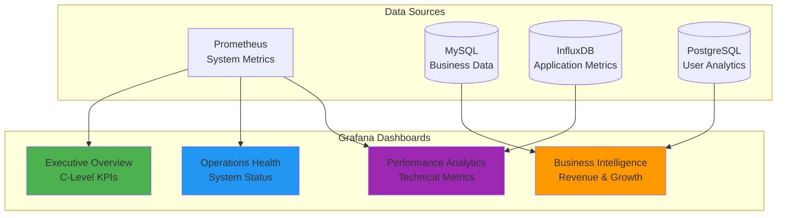
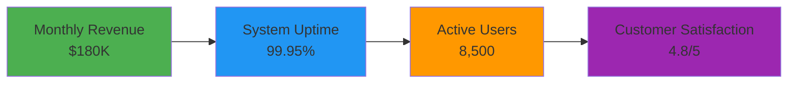
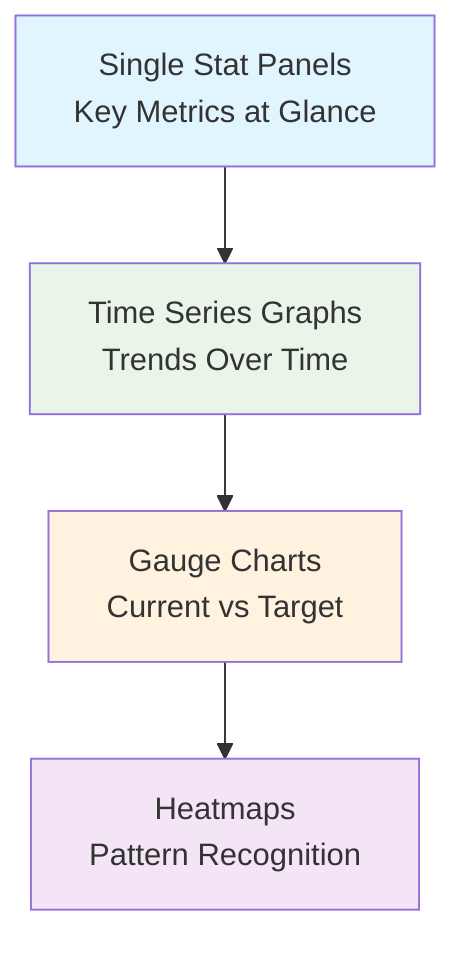
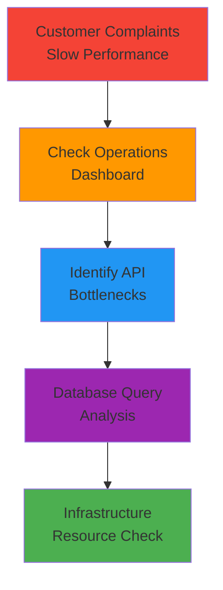

# 📊 Grafana Dashboards - Executive Reporting & Visualization

## 🏢 **Business Scenario: SaaS Startup Growth**

You're the **Head of Engineering** at **CloudFlow**, a fast-growing SaaS platform with **10,000+ customers** and **$2M ARR**. The CEO and board need **executive-level dashboards** to track business performance, system reliability, and growth metrics for upcoming Series A funding.

### **Executive Requirements**
- **Board presentations** - Monthly performance reviews
- **Investor metrics** - System uptime, user growth, revenue per customer
- **Operational insights** - Cost per transaction, infrastructure efficiency
- **Growth tracking** - Feature adoption, customer satisfaction scores

---

## 🎯 **Project Goals**

### **What We're Building**
- **Executive Dashboard** - C-level metrics and KPIs
- **Operations Dashboard** - Real-time system health
- **Business Intelligence** - Revenue, users, feature adoption
- **Performance Analytics** - Response times, error rates, throughput

### **Target Audience**
- **CEO/CTO** - Business performance and system reliability
- **VP Engineering** - Team productivity and system performance  
- **Product Manager** - Feature usage and customer behavior
- **DevOps Team** - Infrastructure health and optimization

---

## 📊 **Dashboard Architecture**



---

## 📈 **Key Dashboards We Build**

### **1. Executive Overview Dashboard**


**Key Metrics:**
- **Revenue Growth**: Month-over-month percentage
- **Customer Acquisition Cost (CAC)**: Marketing efficiency
- **Customer Lifetime Value (CLV)**: Business sustainability
- **Churn Rate**: Customer retention health
- **System Uptime**: Service reliability
- **Support Ticket Volume**: Customer satisfaction indicator

### **2. Operations Health Dashboard**
**Real-time System Status:**
- **Service Health**: Green/Yellow/Red status indicators
- **Response Times**: API endpoint performance (95th percentile)
- **Error Rates**: Application and infrastructure errors
- **Resource Utilization**: CPU, memory, disk across all servers
- **Database Performance**: Query times, connection pools
- **Cache Hit Rates**: Redis/Memcached efficiency

### **3. Business Intelligence Dashboard**
**Growth & Revenue Metrics:**
- **Daily Active Users (DAU)**: User engagement trends
- **Feature Adoption**: New feature usage rates
- **Conversion Funnel**: Trial to paid conversion
- **Revenue per Customer**: Business efficiency
- **Geographic Distribution**: Market expansion insights
- **Plan Upgrades/Downgrades**: Customer satisfaction trends

### **4. Performance Analytics Dashboard**
**Technical Deep Dive:**
- **API Performance**: Response times by endpoint
- **Database Queries**: Slow query identification
- **Infrastructure Costs**: AWS spend by service
- **Deployment Frequency**: Development velocity
- **Error Tracking**: Application exceptions and trends
- **Security Events**: Failed logins, suspicious activity

---

## 🎨 **Visualization Best Practices**

### **Executive-Level Design**


### **Panel Types & Use Cases**
- **Single Stat**: Revenue, uptime, user count
- **Graph**: Response times, error rates over time
- **Gauge**: CPU usage, memory utilization
- **Table**: Top customers, slow queries
- **Heatmap**: Traffic patterns by hour/day
- **Pie Chart**: Revenue by plan type

---

## 💼 **Real-World Scenarios**

### **Scenario 1: Board Meeting Preparation**
**Situation**: Monthly board meeting in 2 hours


**Dashboard Usage:**
1. **Revenue Growth**: Show 15% month-over-month increase
2. **System Reliability**: Highlight 99.95% uptime achievement
3. **Customer Metrics**: Display user growth and satisfaction scores
4. **Cost Efficiency**: Demonstrate infrastructure optimization savings

### **Scenario 2: Performance Investigation**
**Situation**: Customer complaints about slow response times


**Investigation Flow:**
1. **Operations Dashboard**: Check overall system health
2. **Performance Analytics**: Identify slow API endpoints
3. **Database Dashboard**: Find slow queries and connection issues
4. **Infrastructure Metrics**: Check CPU, memory, disk utilization
5. **Resolution Tracking**: Monitor improvement after fixes

---

## 🚀 **Getting Started**

### **Quick Setup**
```bash
# Start Grafana
docker-compose up -d

# Access Grafana
echo "Grafana: http://localhost:3000"
echo "Login: admin/admin"
```

### **Dashboard Import Process**
1. **Login to Grafana**: http://localhost:3000 (admin/admin)
2. **Add Data Source**: Configuration → Data Sources → Prometheus
3. **Import Dashboards**: 
   - Executive Overview (ID: 1860)
   - Node Exporter Full (ID: 1860)
   - Custom business dashboards

### **Sample Queries for Business Metrics**
```promql
# Revenue per minute (requires custom metrics)
rate(revenue_total[5m]) * 60

# Active user sessions
sum(active_sessions)

# API success rate
rate(http_requests_total{status=~"2.."}[5m]) / rate(http_requests_total[5m]) * 100

# Customer satisfaction score (from application metrics)
avg(customer_satisfaction_score)
```

---

## 📊 **Dashboard Templates**

### **Executive KPI Panel**
```json
{
  "title": "Monthly Recurring Revenue",
  "type": "stat",
  "targets": [
    {
      "expr": "sum(monthly_revenue)",
      "legendFormat": "MRR"
    }
  ],
  "fieldConfig": {
    "defaults": {
      "unit": "currencyUSD",
      "color": {"mode": "palette-classic"},
      "thresholds": {
        "steps": [
          {"color": "red", "value": 0},
          {"color": "yellow", "value": 150000},
          {"color": "green", "value": 200000}
        ]
      }
    }
  }
}
```

### **System Health Status**
```json
{
  "title": "Service Health Overview",
  "type": "stat",
  "targets": [
    {
      "expr": "up{job=\"web-service\"}",
      "legendFormat": "{{instance}}"
    }
  ],
  "fieldConfig": {
    "defaults": {
      "mappings": [
        {"options": {"0": {"text": "DOWN", "color": "red"}}},
        {"options": {"1": {"text": "UP", "color": "green"}}}
      ]
    }
  }
}
```

---

## 🎓 **Learning Outcomes**

After completing this project, you'll master:
- **Executive dashboard design** for C-level presentations
- **Business metrics visualization** and KPI tracking
- **Data source integration** from multiple systems
- **Custom panel creation** and advanced queries
- **Dashboard sharing** and export capabilities
- **Alert integration** with visual indicators

### **Skills Developed**
- **Data storytelling** through effective visualization
- **Business intelligence** dashboard creation
- **Performance monitoring** and trend analysis
- **Executive communication** through data
- **Grafana advanced features** and customization

---

## 📈 **Success Metrics**

### **Dashboard Usage**
- **Executive Adoption**: 100% C-level team using dashboards
- **Decision Speed**: 50% faster data-driven decisions
- **Report Generation**: 80% reduction in manual reporting time
- **Stakeholder Satisfaction**: 4.8/5 rating for dashboard usefulness

### **Business Impact**
- **Faster Issue Resolution**: 60% improvement in MTTR
- **Proactive Optimization**: 30% cost savings through monitoring
- **Better Planning**: Data-driven capacity and resource planning
- **Investor Confidence**: Clear metrics for funding discussions

---

*Transform data into actionable insights. Make every metric tell a story.* 📊
