# 🔍 **Nagios Monitoring - Infrastructure Monitoring Foundation**

## 🎯 **Why Monitor Infrastructure?**

### **The Monitoring Lifecycle:**

```mermaid
graph TD
    A[Services Running 🟢] --> B{Health Check}
    B --> C[All Good ✅]
    B --> D[Problem Detected ⚠️]
    C --> E[Users Happy 😊]
    D --> F[Alert Sent 📧]
    F --> G[Team Responds 🚀]
    G --> H[Problem Fixed 🔧]
    H --> E
    
    style A fill:#e1f5fe
    style C fill:#c8e6c9
    style D fill:#ffcdd2
    style E fill:#c8e6c9
    style F fill:#fff3e0
    style G fill:#e1f5fe
    style H fill:#c8e6c9
```



- **Prevent outages** - Catch issues early
- **Improve reliability** - Maintain service availability
- **Faster incident response** - Know what's broken and where
- **Performance optimization** - Identify bottlenecks
- **Compliance** - Meet SLA requirements

---

## 🏗️ **Nagios Architecture & Components**

### **System Architecture Overview:**


### **Core Components:**

#### **1. Nagios Core Engine**
- **Purpose:** Central monitoring daemon
- **Function:** Schedules checks, processes results, sends notifications
- **Location:** Runs on monitoring server

#### **2. Web Interface (CGI)**
- **Purpose:** Visual dashboard for monitoring
- **Function:** Display status, graphs, reports
- **Access:** Web browser interface

#### **3. Configuration Files**
- **hosts.cfg** - Defines what to monitor (servers, devices)
- **services.cfg** - Defines how to monitor (checks, tests)
- **commands.cfg** - Defines monitoring commands
- **contacts.cfg** - Defines who gets alerts

#### **4. Plugins**
- **Purpose:** Perform actual monitoring checks
- **Examples:** check_http, check_ping, check_disk
- **Location:** /usr/lib/nagios/plugins/

#### **5. Status Files**
- **status.dat** - Current status of all monitored items
- **nagios.log** - Historical events and alerts
- **retention.dat** - Persistent state information

### **Monitoring Flow:**

```mermaid
sequenceDiagram
    participant NC as Nagios Core
    participant P as Plugin
    participant T as Target Service
    participant WI as Web Interface
    participant U as User
    
    NC->>P: Execute check_http
    P->>T: HTTP Request
    T-->>P: HTTP Response (200 OK)
    P-->>NC: Status: OK
    NC->>NC: Update status.dat
    U->>WI: View Dashboard
    WI->>NC: Read status.dat
    WI-->>U: Show Green Status ✅
    
    Note over NC,T: Every 5 minutes
    Note over U,WI: Real-time dashboard
```



---

## 🎓 **Key Monitoring Concepts**

### **Host vs Service Monitoring**


#### **Host Monitoring:**
- **What:** The physical/virtual machine itself
- **Example:** Web server, database server, router
- **Status:** UP (working) or DOWN (failed)
- **Check:** Usually PING to test network connectivity

#### **Service Monitoring:**
- **What:** Specific applications or functions on a host
- **Example:** HTTP service, MySQL database, SSH access
- **Status:** OK, WARNING, CRITICAL, UNKNOWN
- **Check:** Application-specific tests

### **Status States Flow:**

```mermaid
stateDiagram-v2
    [*] --> OK
    OK --> WARNING: Performance degraded
    WARNING --> OK: Performance restored
    WARNING --> CRITICAL: Service failed
    CRITICAL --> OK: Service restored
    OK --> CRITICAL: Service failed suddenly
    CRITICAL --> UNKNOWN: Cannot determine status
    UNKNOWN --> OK: Status determined - working
    UNKNOWN --> CRITICAL: Status determined - failed
    
    note right of OK: 🟢 Green - Everything working
    note right of WARNING: 🟡 Yellow - Minor issues
    note right of CRITICAL: 🔴 Red - Major failure
    note right of UNKNOWN: ⚪ Gray - Status unclear
```



### **Check Types:**


#### **Active Checks:**
- **How:** Nagios initiates the check
- **When:** Scheduled intervals (every 5 minutes)
- **Example:** Nagios runs check_http against web server

#### **Passive Checks:**
- **How:** External system sends results to Nagios
- **When:** Event-driven or irregular intervals
- **Example:** Application sends performance data to Nagios

---

## 🚀 **Lab Setup & Prerequisites**

### **Lab Architecture:**


### **What You Need:**
- Docker installed and running
- Docker Compose installed
- Ports 8080, 8081, 8082 available
- Web browser for accessing dashboard

---

## 🏗️ **Step 1: Start the Lab Environment**

### **Clone Repository:**
```bash
git clone https://github.com/manikcloud/cloud-devops-learning-path.git
cd cloud-devops-learning-path/Section-2-DevOps/Session-10_Monitoring-Tools/01-nagios
```

### **Start All Services:**
```bash
# Start the monitoring environment
docker-compose up -d

# Verify all containers are running
docker ps
```

**Expected Output:**
```
CONTAINER ID   IMAGE                        PORTS                    NAMES
abc123def456   jasonrivers/nagios:latest    0.0.0.0:8080->80/tcp     nagios-server
def456ghi789   nginx:alpine                 0.0.0.0:8081->80/tcp     nginx-target
ghi789jkl012   httpd:alpine                 0.0.0.0:8082->80/tcp     apache-target
```

---

## 🌐 **Step 2: Access Nagios Dashboard**

### **Login to Nagios:**
1. **Open browser:** http://localhost:8080/nagios
2. **Username:** `admin`
3. **Password:** `nagios123`

### **Dashboard Navigation Flow:**


---

## 📊 **Step 3: Navigate the Monitoring Dashboard**

### **Status Visualization:**

```mermaid
graph TB
    subgraph "Normal Operations - All Green"
        A1[nginx-target: UP 🟢]
        A2[apache-target: UP 🟢]
        A3[HTTP Services: OK 🟢]
        A4[PING Services: OK 🟢]
    end
    
    subgraph "Service Failure - Red Alert"
        B1[nginx-target: DOWN 🔴]
        B2[apache-target: UP 🟢]
        B3[nginx HTTP: CRITICAL 🔴]
        B4[nginx PING: CRITICAL 🔴]
        B5[apache HTTP: OK 🟢]
        B6[apache PING: OK 🟢]
    end
    
    A1 -.->|Container Stopped| B1
    A3 -.->|Service Failed| B3
    A4 -.->|Host Unreachable| B4
    
    style A1 fill:#c8e6c9
    style A2 fill:#c8e6c9
    style A3 fill:#c8e6c9
    style A4 fill:#c8e6c9
    style B1 fill:#ffcdd2
    style B2 fill:#c8e6c9
    style B3 fill:#ffcdd2
    style B4 fill:#ffcdd2
    style B5 fill:#c8e6c9
    style B6 fill:#c8e6c9
```



### **Key Pages for Students:**

#### **Host Status Page:**
```
Navigation: Current Status → Hosts
URL: http://localhost:8080/nagios/cgi-bin/status.cgi?hostgroup=all&style=hostdetail
```

#### **Service Status Page:**
```
Navigation: Current Status → Services
URL: http://localhost:8080/nagios/cgi-bin/status.cgi?host=all
```

---

## 🧪 **Step 4: Hands-On Monitoring Exercises**

### **Exercise Flow:**

```mermaid
graph TD
    A[Start: All Services Green 🟢] --> B[Stop nginx Container]
    B --> C[Wait 3-5 Minutes]
    C --> D[Observe Red Status 🔴]
    D --> E[Analyze Impact]
    E --> F[Restart nginx Container]
    F --> G[Wait 3-5 Minutes]
    G --> H[Confirm Green Status 🟢]
    H --> I[Exercise Complete ✅]
    
    style A fill:#c8e6c9
    style D fill:#ffcdd2
    style H fill:#c8e6c9
    style I fill:#e3f2fd
```



### **Exercise 1: Observe Normal Operations (Green Status)**

#### **View Host Status:**
1. Navigate to **Current Status → Hosts**
2. Observe all hosts show **UP** status with 🟢 green background
3. Note the **Last Check** times and **Duration**

### **Exercise 2: Simulate Service Failure (Red Status)**

#### **Create a Failure:**
```bash
# Stop the nginx web server
docker-compose stop nginx-target

# Wait 3-5 minutes for Nagios to detect the failure
```

#### **Failure Impact Visualization:**

```mermaid
graph TD
    A[nginx Container Stopped] --> B[Network Unreachable]
    B --> C[PING Check Fails]
    B --> D[HTTP Check Fails]
    C --> E[Host Status: DOWN 🔴]
    D --> F[Service Status: CRITICAL 🔴]
    E --> G[Alert Generated 📧]
    F --> G
    G --> H[Problem Dashboard Updated]
    
    style A fill:#ffcdd2
    style B fill:#ffcdd2
    style C fill:#ffcdd2
    style D fill:#ffcdd2
    style E fill:#ffcdd2
    style F fill:#ffcdd2
    style G fill:#fff3e0
    style H fill:#e3f2fd
```



### **Exercise 3: Service Recovery**

#### **Recovery Flow:**

```mermaid
graph TD
    A[Restart nginx Container] --> B[Container Starts]
    B --> C[Network Accessible]
    C --> D[PING Check Succeeds]
    C --> E[HTTP Check Succeeds]
    D --> F[Host Status: UP 🟢]
    E --> G[Service Status: OK 🟢]
    F --> H[Recovery Alert 📧]
    G --> H
    H --> I[Dashboard Shows Green]
    
    style A fill:#e8f5e8
    style B fill:#c8e6c9
    style C fill:#c8e6c9
    style D fill:#c8e6c9
    style E fill:#c8e6c9
    style F fill:#c8e6c9
    style G fill:#c8e6c9
    style H fill:#e3f2fd
    style I fill:#c8e6c9
```



---

## 🔧 **Step 5: Understanding Configuration**

### **Configuration Relationship:**


### **Host Configuration (hosts.cfg):**
```bash
# View host definitions
cat nagios/config/hosts.cfg
```

### **Service Configuration (services.cfg):**
```bash
# View service definitions
cat nagios/config/services.cfg
```

---

## 📝 **Step 6: Monitor Logs and Events**

### **Log Event Flow:**

```mermaid
sequenceDiagram
    participant S as Service
    participant N as Nagios Core
    participant L as Log File
    participant W as Web Interface
    participant U as User
    
    S->>S: Service Fails
    N->>S: Check Service
    S-->>N: No Response
    N->>L: Write: SERVICE ALERT CRITICAL
    N->>N: Update Status
    U->>W: View Dashboard
    W->>N: Read Status
    W-->>U: Show Red Status 🔴
    
    Note over S,N: Check every 5 minutes
    Note over N,L: All events logged
    Note over U,W: Real-time updates
```



### **View Real-Time Logs:**
```bash
# Watch Nagios logs in real-time
docker-compose logs -f nagios

# View specific container logs
docker-compose logs nginx-target
docker-compose logs apache-target
```

---

## 🛠️ **Step 7: Troubleshooting Common Issues**

### **Troubleshooting Decision Tree:**


---

## 📊 **Step 8: Monitoring Best Practices**

### **Monitoring Strategy Pyramid:**


### **Alert Escalation Flow:**


---

## 🎯 **Step 9: Real-World Applications**

### **Enterprise Monitoring Architecture:**


### **DevOps Integration:**


---

## 🔧 **Step 5: Understanding Configuration**

### **Configuration Overview:**
Nagios uses multiple configuration files to define what to monitor and how. For detailed technical information, see our [Configuration Guide](./config-guide/CONFIGURATION-GUIDE.md).

### **Key Configuration Files:**


### **Quick Configuration Examples:**

#### **View Host Configuration:**
```bash
cat nagios/config/hosts.cfg
```

#### **View Service Configuration:**
```bash
cat nagios/config/services.cfg
```

#### **Basic Host Definition:**
```bash
define host {
    use                     linux-server        # Template
    host_name               nginx-target        # Unique name
    alias                   Nginx Web Server    # Description
    address                 nginx-target        # IP/hostname
    check_command           check-host-alive    # How to check
}
```

#### **Basic Service Definition:**
```bash
define service {
    use                     generic-service     # Template
    host_name               nginx-target        # Which host
    service_description     HTTP                # Service name
    check_command           check_http          # How to test
    check_interval          5                   # Every 5 minutes
}
```

**📚 For complete configuration details, examples, and best practices, see [Configuration Guide](./config-guide/CONFIGURATION-GUIDE.md)**

## 🧹 **Step 10: Cleanup and Next Steps**

### **Cleanup Process:**

```mermaid
graph TD
    A[Lab Complete] --> B[Stop Containers]
    B --> C[Remove Containers]
    C --> D[Clean Networks]
    D --> E[Remove Images Optional]
    E --> F[Verify Cleanup]
    F --> G[Environment Clean ✅]
    
    style A fill:#e3f2fd
    style G fill:#c8e6c9
```

### **Stop the Lab Environment:**
```bash
# Stop all containers
docker-compose down

# Remove containers and networks
docker-compose down --remove-orphans

# Remove images (optional)
docker-compose down --rmi all

# Clean up volumes (optional)
docker-compose down -v
```

### **Verify Cleanup:**
```bash
# Check no containers running
docker ps

# Check port availability
netstat -tlnp | grep -E "808[0-2]"
```

---

## 📚 **Advanced Topics to Explore**

### **Monitoring Evolution:**

```mermaid
graph TD
    A[Traditional Monitoring<br/>Nagios, Zabbix] --> B[Modern Metrics<br/>Prometheus, Grafana]
    B --> C[Observability<br/>Traces, Logs, Metrics]
    C --> D[AI/ML Monitoring<br/>Anomaly Detection]
    
    style A fill:#fff3e0
    style B fill:#e8f5e8
    style C fill:#e3f2fd
    style D fill:#f3e5f5
```

### **Technology Comparison:**

```mermaid
graph TB
    subgraph "Monitoring Tools Landscape"
        A[Nagios<br/>Traditional Infrastructure]
        B[Prometheus<br/>Metrics & Alerting]
        C[Grafana<br/>Visualization]
        D[ELK Stack<br/>Log Analysis]
        E[DataDog<br/>Cloud SaaS]
        F[New Relic<br/>APM]
    end
    
    A -.-> B
    B --> C
    A -.-> D
    B -.-> E
    C -.-> E
    D -.-> F
    
    style A fill:#fff3e0
    style B fill:#e8f5e8
    style C fill:#e3f2fd
    style D fill:#f3e5f5
    style E fill:#fce4ec
    style F fill:#e1f5fe
```

---

## 🎓 **Assessment and Learning Outcomes**

### **Learning Progress:**

```mermaid
graph TD
    A[Basic Concepts] --> B[Hands-On Practice]
    B --> C[Problem Solving]
    C --> D[Real-World Application]
    D --> E[Advanced Topics]
    
    A1[Host vs Service] --> A
    A2[Status States] --> A
    A3[Check Types] --> A
    
    B1[Navigate Dashboard] --> B
    B2[Simulate Failures] --> B
    B3[Read Logs] --> B
    
    C1[Troubleshoot Issues] --> C
    C2[Analyze Problems] --> C
    C3[Fix Configuration] --> C
    
    D1[Design Strategy] --> D
    D2[Best Practices] --> D
    D3[Integration] --> D
    
    E1[Custom Scripts] --> E
    E2[Advanced Tools] --> E
    E3[Cloud Monitoring] --> E
    
    style A fill:#e3f2fd
    style B fill:#e8f5e8
    style C fill:#fff3e0
    style D fill:#f3e5f5
    style E fill:#fce4ec
```

### **Competency Checklist:**
- [ ] Successfully started the monitoring environment
- [ ] Logged into Nagios web interface
- [ ] Navigated to host and service status pages
- [ ] Observed green (OK) status for all services
- [ ] Simulated service failure and observed red (CRITICAL) status
- [ ] Restored failed service and confirmed green (OK) status
- [ ] Reviewed configuration files and understood their purpose
- [ ] Analyzed log files and identified key events
- [ ] Troubleshot common issues independently

---

## 🆘 **Quick Reference**

### **Essential Commands:**
```bash
# Start monitoring
docker-compose up -d

# Check container status
docker ps

# View logs
docker-compose logs -f nagios

# Stop specific service (create failure)
docker-compose stop nginx-target

# Start specific service (restore)
docker-compose start nginx-target

# Stop everything
docker-compose down
```

### **Key URLs:**
- **Nagios Dashboard:** http://localhost:8080/nagios
- **Host Status:** http://localhost:8080/nagios/cgi-bin/status.cgi?hostgroup=all&style=hostdetail
- **Service Status:** http://localhost:8080/nagios/cgi-bin/status.cgi?host=all
- **Problems Only:** http://localhost:8080/nagios/cgi-bin/status.cgi?host=all&servicestatustypes=28
- **Nginx Target:** http://localhost:8081
- **Apache Target:** http://localhost:8082

### **Login Credentials:**
- **Username:** admin
- **Password:** nagios123

### **Status Color Guide:**
- 🟢 **Green (UP/OK)** - Everything working normally
- 🟡 **Yellow (WARNING)** - Minor issues, still functional
- 🔴 **Red (DOWN/CRITICAL)** - Major issues, service failed
- ⚪ **Gray (UNKNOWN)** - Cannot determine status

---

## 🎉 **Congratulations!**

You have successfully completed the Nagios monitoring lab! You now understand:

- **Infrastructure monitoring fundamentals**
- **Nagios architecture and components**
- **Visual monitoring with status indicators**
- **Incident simulation and response**
- **Real-world monitoring applications**
- **Best practices for production environments**

**Next Steps:**
- Explore advanced monitoring tools (Prometheus, Grafana)
- Learn about alerting and notification systems
- Study monitoring in cloud environments
- Practice with larger, more complex infrastructures

**You're now ready to implement monitoring in real DevOps environments!** 🚀
