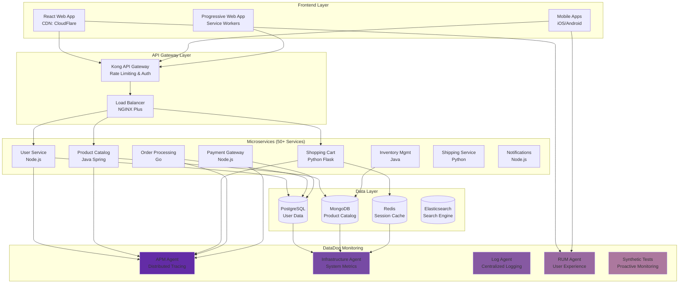
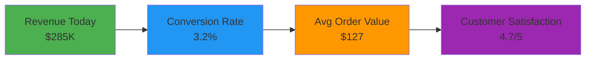

# 🐕 DataDog Integration - Enterprise APM & Observability

## 🏢 **Business Scenario: Scaling E-commerce Platform**

You're the **Principal Engineer** at **ShopFast**, a rapidly growing e-commerce platform processing **$100M+ annually** with **2M+ active customers**. The company just secured Series C funding and needs **enterprise-grade monitoring** to scale from 50 to 500 microservices.

### **Scaling Challenges**
- **Microservices Explosion**: 50+ services becoming 500+
- **Distributed Tracing**: Track requests across complex service mesh
- **Performance Optimization**: Sub-200ms response times at scale
- **Proactive Monitoring**: AI-powered anomaly detection
- **Cost Management**: Monitor infrastructure spend across multi-cloud

---

## 🎯 **Project Goals**

### **What We're Achieving**
- **Application Performance Monitoring (APM)** - End-to-end request tracing
- **Infrastructure Monitoring** - Multi-cloud resource optimization
- **Business Metrics Integration** - Revenue impact of performance
- **AI-Powered Insights** - Predictive analytics and anomaly detection
- **Custom Dashboards** - Executive and operational views

### **Enterprise Features**
- **Distributed Tracing** - Follow requests across 50+ microservices
- **Real User Monitoring (RUM)** - Actual user experience metrics
- **Synthetic Monitoring** - Proactive endpoint testing
- **Log Management** - Centralized logging with correlation
- **Security Monitoring** - Threat detection and compliance

---

## 🏗️ **E-commerce Platform Architecture**



---

## 📊 **Advanced Monitoring Features**

### **1. Distributed Tracing**

#### **Request Journey Visualization**
```python
# Instrumented Flask application with DataDog APM
from ddtrace import tracer
from flask import Flask, request
import requests
import time

app = Flask(__name__)

@tracer.wrap('ecommerce.checkout', service='checkout-service')
def process_checkout(user_id, cart_items):
    with tracer.trace('checkout.validate_user') as span:
        span.set_tag('user.id', user_id)
        user_data = validate_user(user_id)
    
    with tracer.trace('checkout.calculate_total') as span:
        span.set_tag('cart.item_count', len(cart_items))
        total_amount = calculate_total(cart_items)
        span.set_metric('checkout.amount', total_amount)
    
    with tracer.trace('checkout.process_payment') as span:
        span.set_tag('payment.method', 'credit_card')
        payment_result = process_payment(total_amount)
        span.set_tag('payment.status', payment_result['status'])
    
    with tracer.trace('checkout.update_inventory') as span:
        inventory_result = update_inventory(cart_items)
        span.set_metric('inventory.items_updated', len(cart_items))
    
    return {
        'order_id': generate_order_id(),
        'status': 'completed',
        'amount': total_amount
    }
```

#### **Trace Analysis Example**
```
Trace ID: abc123def456 (Checkout Request)
├── API Gateway (15ms)
│   ├── Authentication (8ms)
│   └── Rate Limiting (2ms)
├── User Service (25ms)
│   ├── Database Query (18ms)
│   └── Cache Lookup (3ms)
├── Cart Service (35ms)
│   ├── Redis Get (5ms)
│   ├── Price Calculation (20ms)
│   └── Tax Calculation (8ms)
├── Payment Service (180ms)
│   ├── Fraud Check (45ms)
│   ├── Bank API Call (120ms)
│   └── Transaction Log (10ms)
└── Order Service (40ms)
    ├── Database Insert (25ms)
    ├── Inventory Update (10ms)
    └── Email Notification (5ms)

Total Response Time: 295ms
```

### **2. Business Metrics Integration**

#### **Revenue Impact Monitoring**
```python
from datadog import statsd
import time

@app.route('/api/purchase')
def complete_purchase():
    start_time = time.time()
    
    try:
        # Process purchase
        order = process_order(request.json)
        
        # Business metrics
        statsd.increment('ecommerce.orders.completed',
                        tags=[f'plan:{order.plan}', f'region:{order.region}'])
        
        statsd.histogram('ecommerce.order.value', order.amount,
                        tags=[f'currency:{order.currency}'])
        
        statsd.increment('ecommerce.revenue.total', order.amount,
                        tags=['source:web'])
        
        # Customer metrics
        if order.is_new_customer:
            statsd.increment('ecommerce.customers.acquired',
                           tags=[f'channel:{order.acquisition_channel}'])
        
        # Performance metrics
        response_time = time.time() - start_time
        statsd.histogram('ecommerce.api.response_time', response_time,
                        tags=['endpoint:purchase'])
        
        return {'status': 'success', 'order_id': order.id}
        
    except Exception as e:
        statsd.increment('ecommerce.orders.failed',
                        tags=[f'error:{type(e).__name__}'])
        raise
```

### **3. Real User Monitoring (RUM)**

#### **Frontend Performance Tracking**
```javascript
// React application with DataDog RUM
import { datadogRum } from '@datadog/browser-rum';

datadogRum.init({
    applicationId: 'your-app-id',
    clientToken: 'your-client-token',
    site: 'datadoghq.com',
    service: 'shopfast-web',
    env: 'production',
    version: '1.2.3',
    sampleRate: 100,
    trackInteractions: true,
    defaultPrivacyLevel: 'mask-user-input'
});

// Custom business events
function trackPurchase(orderData) {
    datadogRum.addAction('purchase_completed', {
        order_id: orderData.id,
        amount: orderData.total,
        items_count: orderData.items.length,
        payment_method: orderData.payment_method,
        customer_type: orderData.customer_type
    });
}

// Performance monitoring
function trackPageLoad() {
    datadogRum.addTiming('custom_page_load', performance.now());
}

// Error tracking
window.addEventListener('error', (event) => {
    datadogRum.addError(event.error, {
        page: window.location.pathname,
        user_agent: navigator.userAgent
    });
});
```

---

## 🤖 **AI-Powered Features**

### **1. Anomaly Detection**
```yaml
# Automated anomaly detection rules
anomaly_detection:
  - metric: "ecommerce.api.response_time"
    algorithm: "agile"
    threshold: "2 standard deviations"
    alert_condition: "above"
    
  - metric: "ecommerce.orders.conversion_rate"
    algorithm: "robust"
    threshold: "3 standard deviations"
    alert_condition: "below"
    
  - metric: "ecommerce.revenue.per_minute"
    algorithm: "basic"
    threshold: "seasonal_adjustment"
    alert_condition: "below"
```

### **2. Predictive Analytics**
- **Traffic Forecasting**: Predict traffic spikes for auto-scaling
- **Capacity Planning**: Forecast resource needs based on growth trends
- **Performance Degradation**: Early warning before SLA violations
- **Cost Optimization**: Identify underutilized resources

### **3. Intelligent Alerting**
```yaml
# Smart alert rules with ML-based filtering
intelligent_alerts:
  - name: "High Error Rate with Context"
    condition: "error_rate > 5% AND traffic_increase < 50%"
    ml_filter: "exclude_deployment_related_errors"
    
  - name: "Revenue Drop Detection"
    condition: "revenue_per_minute < forecast_lower_bound"
    context: "exclude_maintenance_windows"
    
  - name: "Performance Regression"
    condition: "p95_response_time > baseline + 2*stddev"
    correlation: "check_recent_deployments"
```

---

## 📊 **Enterprise Dashboards**

### **Executive Business Dashboard**


### **Operations Performance Dashboard**
- **Service Map**: Visual representation of microservices dependencies
- **Error Tracking**: Real-time error rates and stack traces
- **Performance Metrics**: Response times, throughput, saturation
- **Infrastructure Health**: CPU, memory, disk, network across all services
- **Database Performance**: Query performance, connection pools, slow queries

### **Customer Experience Dashboard**
- **Real User Monitoring**: Actual user experience metrics
- **Core Web Vitals**: LCP, FID, CLS for SEO and UX
- **Conversion Funnel**: Step-by-step user journey analysis
- **Geographic Performance**: Response times by region
- **Device Performance**: Mobile vs desktop experience

---

## 🚨 **Advanced Alerting & Incident Response**

### **Multi-Channel Alert Routing**
```yaml
alert_routing:
  critical_alerts:
    - condition: "service_down OR error_rate > 10%"
    - channels: ["pagerduty", "slack_critical", "sms"]
    - escalation: "immediate"
    
  performance_alerts:
    - condition: "response_time > p95_baseline * 1.5"
    - channels: ["slack_performance", "email"]
    - escalation: "15_minutes"
    
  business_alerts:
    - condition: "revenue_drop > 20% OR conversion_rate < threshold"
    - channels: ["slack_business", "email_executives"]
    - escalation: "30_minutes"
```

### **Automated Incident Response**
```python
# Webhook integration for automated responses
@app.route('/webhook/datadog', methods=['POST'])
def handle_datadog_alert():
    alert_data = request.json
    
    if alert_data['alert_type'] == 'error_rate_spike':
        # Auto-scale application
        trigger_auto_scaling(alert_data['service'])
        
        # Create incident in PagerDuty
        create_incident(
            title=f"High error rate in {alert_data['service']}",
            service=alert_data['service'],
            urgency='high'
        )
        
        # Notify relevant teams
        send_slack_alert(
            channel='#incidents',
            message=f"🚨 Error rate spike detected in {alert_data['service']}"
        )
    
    return {'status': 'processed'}
```

---

## 🚀 **Getting Started**

### **Quick Setup**
```bash
# Start DataDog integrated application
docker-compose up --build -d

# Access application
echo "Application: http://localhost:5001"
echo "Metrics endpoint: http://localhost:5001/metrics"

# Generate sample traffic
curl http://localhost:5001/
curl http://localhost:5001/slow
curl http://localhost:5001/error
```

### **DataDog Configuration**
```yaml
# datadog.yaml configuration
api_key: "your-api-key"
site: "datadoghq.com"

apm_config:
  enabled: true
  env: "production"
  
logs_config:
  enabled: true
  
process_config:
  enabled: true
  
network_config:
  enabled: true
```

### **Custom Metrics Examples**
```python
# Business KPIs
statsd.gauge('ecommerce.active_users', active_user_count)
statsd.increment('ecommerce.feature.used', tags=['feature:checkout_v2'])
statsd.histogram('ecommerce.customer.lifetime_value', clv_amount)

# Performance metrics
statsd.timing('ecommerce.database.query_time', query_duration)
statsd.increment('ecommerce.cache.hit', tags=['cache_type:redis'])
```

---

## 🎓 **Learning Outcomes**

After completing this project, you'll master:
- **Enterprise APM implementation** with distributed tracing
- **Business metrics integration** with technical monitoring
- **AI-powered monitoring** and anomaly detection
- **Multi-cloud infrastructure** monitoring
- **Custom dashboard creation** for different stakeholders
- **Automated incident response** and alert management

### **Advanced Skills**
- **Microservices observability** at scale
- **Performance optimization** using APM data
- **Cost management** through monitoring insights
- **Predictive analytics** for capacity planning
- **Security monitoring** and threat detection

---

## 📈 **Success Metrics**

### **Technical Performance**
- **MTTR Improvement**: 70% faster incident resolution
- **Proactive Detection**: 85% of issues caught before user impact
- **Performance Optimization**: 40% improvement in response times
- **Cost Savings**: 25% reduction in infrastructure costs

### **Business Impact**
- **Revenue Protection**: $2M+ saved through proactive monitoring
- **Customer Experience**: 15% improvement in satisfaction scores
- **Operational Efficiency**: 50% reduction in manual monitoring tasks
- **Scalability**: Successfully scaled from 50 to 500+ microservices

---

*Scale with confidence. Monitor everything that matters.* 🐕
