# 📊 **Nagios + ELK Stack - Complete Monitoring & Log Analysis Lab**

## 🎯 **Real-World Use Case: E-Commerce Website Monitoring**

Imagine you're running an **e-commerce website** with multiple services:
- **Frontend (Nginx)** - Serves customer-facing website
- **API Gateway (Apache)** - Handles product catalog, orders, payments
- **Monitoring System (Nagios)** - Tracks service health

### **The Business Problem:**
```
🛒 Black Friday Sale Day:
├── 📈 Traffic spikes to 10x normal volume
├── 🚨 Some customers report "page not loading"
├── 💳 Payment failures increase
├── 📞 Support team overwhelmed with calls
└── 💰 Revenue loss due to poor user experience
```

**Traditional Approach Problems:**
- **Scattered logs** across multiple servers
- **Manual log checking** - SSH to each server
- **No real-time visibility** - Issues discovered hours later
- **Difficult correlation** - Can't connect frontend errors to backend issues
- **Slow troubleshooting** - Takes hours to find root cause

### **Integrated Solution:**

```mermaid
graph TB
    subgraph "E-Commerce Platform"
        WEB[🌐 Nginx Frontend<br/>Customer requests]
        API[⚙️ Apache API<br/>Product/Payment APIs]
        MON[🔍 Nagios Monitor<br/>Health checks]
    end
    
    subgraph "ELK Stack - Real-time Intelligence"
        E[📊 Elasticsearch<br/>Stores 1M+ log entries<br/>Sub-second search]
        L[⚙️ Logstash<br/>Processes 1000+ logs/sec<br/>Enriches data]
        K[📈 Kibana<br/>Real-time dashboards<br/>Instant alerts]
    end
    
    WEB --> L
    API --> L
    MON --> L
    L --> E
    E --> K
    
    K --> ALERT[🚨 Instant Alerts<br/>- High error rates<br/>- Slow responses<br/>- Traffic spikes]
    K --> DASH[📊 Live Dashboards<br/>- Customer journey<br/>- API performance<br/>- Revenue impact]
```


**Business Benefits:**
- **🚀 Faster incident response** - Minutes instead of hours
- **💰 Revenue protection** - Catch issues before customers leave
- **📊 Data-driven decisions** - Real-time business metrics
- **🔍 Root cause analysis** - Trace problems across services
- **📈 Performance optimization** - Identify bottlenecks proactively

---

## 📚 **What is ELK Stack? (Detailed Breakdown)**

### **🔍 E - Elasticsearch (The Brain)**
**What it does:** Distributed search and analytics engine
```json
{
  "timestamp": "2024-09-21T10:30:45Z",
  "clientip": "192.168.1.100",
  "method": "GET",
  "request": "/products/laptop",
  "response": 200,
  "bytes": 15420,
  "response_time": 0.245,
  "user_agent": "Chrome/91.0"
}
```

**Key Features:**
- **Indexing** - Organizes logs for lightning-fast search
- **Aggregations** - Calculates metrics (avg response time, error rates)
- **Clustering** - Scales across multiple servers
- **Near real-time** - Data available within 1 second

### **⚙️ L - Logstash (The Processor)**
**What it does:** Data processing pipeline that transforms raw logs
```ruby
# Raw nginx log:
192.168.1.100 - - [21/Sep/2024:10:30:45 +0000] "GET /products/laptop HTTP/1.1" 200 15420

# After Logstash processing:
{
  "clientip": "192.168.1.100",
  "method": "GET", 
  "request": "/products/laptop",
  "response": 200,
  "bytes": 15420,
  "response_category": "success",
  "log_source": "nginx"
}
```

### **📊 K - Kibana (The Eyes)**
**What it does:** Visualization and exploration interface
- **Discover** - Search and explore logs interactively
- **Visualize** - Create charts, graphs, maps
- **Dashboard** - Combine visualizations for overview
- **Alerting** - Notify teams of critical issues

---

## 🚀 **Step-by-Step Usage Guide**

### **Step 1: Start All Services**
```bash
# Navigate to directory
cd 02-nagios-elk

# Start complete stack (Nagios + ELK + Web Services)
docker-compose up -d

# Wait for services to initialize (2-3 minutes)
echo "⏳ Waiting for services to initialize..."
sleep 180

# Check all containers are running
docker-compose ps
```

### **Step 2: Verify Elasticsearch Health**
```bash
# Wait for Elasticsearch to be ready
timeout=300
elapsed=0
while ! curl -s http://localhost:9200/_cluster/health | grep -q "yellow\|green"; do
  if [ $elapsed -ge $timeout ]; then
    echo "❌ Elasticsearch failed to start"
    exit 1
  fi
  echo "   Elasticsearch starting... (${elapsed}s elapsed)"
  sleep 10
  elapsed=$((elapsed + 10))
done
echo "✅ Elasticsearch is ready!"

# Check cluster health
curl -s http://localhost:9200/_cluster/health?pretty
```

### **Step 3: Access Nagios Monitoring**
```bash
# Open browser: http://localhost:8080/nagios/
# Username: nagiosadmin
# Password: nagios

# What you'll see:
# - Click "Hosts" → nginx-elk, apache-elk status
# - Click "Services" → HTTP monitoring for both services
```

### **Step 4: Generate Comprehensive Test Data**
```bash
# Generate diverse web traffic patterns
echo "📊 Generating comprehensive test data..."

# Normal successful requests (200 responses)
echo "   → Generating normal traffic..."
for i in {1..25}; do
  curl -s http://localhost:8081/ > /dev/null
  curl -s http://localhost:8082/ > /dev/null
  echo -n "."
done
echo " ✅ Normal traffic complete"

# Different URL patterns
echo "   → Testing different endpoints..."
endpoints=("/" "/products" "/api/users" "/search" "/checkout" "/login" "/admin")
for endpoint in "${endpoints[@]}"; do
  for i in {1..5}; do
    curl -s "http://localhost:8081${endpoint}" > /dev/null
    curl -s "http://localhost:8082${endpoint}" > /dev/null
  done
done
echo " ✅ Endpoint testing complete"

# Generate 404 errors (client errors)
echo "   → Generating 404 errors..."
for i in {1..15}; do
  curl -s "http://localhost:8081/missing-page-${i}" > /dev/null
  curl -s "http://localhost:8082/not-found-${i}" > /dev/null
  echo -n "."
done
echo " ✅ 404 errors generated"

# Generate different file type requests
echo "   → Testing different file types..."
filetypes=(".css" ".js" ".png" ".jpg" ".pdf" ".xml" ".json")
for filetype in "${filetypes[@]}"; do
  for i in {1..3}; do
    curl -s "http://localhost:8081/assets/file${i}${filetype}" > /dev/null
    curl -s "http://localhost:8082/static/resource${i}${filetype}" > /dev/null
  done
done
echo " ✅ File type testing complete"

echo "🎉 Test data generation complete!"
echo "📊 Total requests generated: ~200+ log entries"
```

### **Step 5: Set Up Kibana for Log Analysis**
```bash
# 1. Wait for Kibana to be ready
echo "🔍 Checking Kibana availability..."
timeout=180
elapsed=0
while ! curl -s http://localhost:5601/api/status | grep -q "available"; do
  if [ $elapsed -ge $timeout ]; then
    echo "⚠️ Kibana taking longer than expected, but continuing..."
    break
  fi
  echo "   Kibana starting... (${elapsed}s elapsed)"
  sleep 15
  elapsed=$((elapsed + 15))
done
echo "✅ Kibana should be ready at http://localhost:5601"

# 2. Manual Kibana Setup Steps:
echo "📋 Manual Kibana Setup Steps:"
echo "   1. Open: http://localhost:5601"
echo "   2. Go to Management → Stack Management → Index Patterns"
echo "   3. Click 'Create index pattern'"
echo "   4. Enter pattern: web-logs-*"
echo "   5. Click 'Next step'"
echo "   6. Select '@timestamp' as time field"
echo "   7. Click 'Create index pattern'"
```

### **Step 6: Explore Logs in Kibana**
```bash
# Kibana Search Examples (use in Discover tab):
echo "🔍 Kibana Search Examples:"
echo "   Find 404 errors: response:404"
echo "   Find successful requests: response:200"
echo "   Find requests to specific files: request:\"/test*\""
echo "   Find large responses: bytes:>1000"
echo "   Find nginx logs only: log_source:nginx"
echo "   Find apache logs only: log_source:apache"
```

### **Step 7: Create Kibana Visualizations**
```bash
echo "📊 Create These Visualizations:"
echo ""
echo "1. Response Code Distribution (Pie Chart):"
echo "   - Visualization → Create → Pie Chart"
echo "   - Buckets → Split Slices → Terms → response.keyword"
echo "   - Save as 'Response Codes Distribution'"
echo ""
echo "2. Requests Over Time (Line Chart):"
echo "   - Visualization → Create → Line Chart"
echo "   - X-axis → Date Histogram → @timestamp"
echo "   - Y-axis → Count"
echo "   - Save as 'Requests Timeline'"
echo ""
echo "3. Top Requested URLs (Data Table):"
echo "   - Visualization → Create → Data Table"
echo "   - Buckets → Split Rows → Terms → request.keyword"
echo "   - Metrics → Count"
echo "   - Save as 'Top URLs'"
```

### **Step 8: Build Monitoring Dashboard**
```bash
echo "📋 Build Dashboard:"
echo "   1. Go to Dashboard → Create Dashboard"
echo "   2. Click 'Add' → Select your saved visualizations"
echo "   3. Arrange panels as desired"
echo "   4. Add filters: response:200 (successful requests only)"
echo "   5. Save as 'Web Traffic Analysis'"
```

### **Step 9: Test Incident Response Workflow**
```bash
echo "🚨 Testing Incident Response..."

# 1. Create Service Issue
echo "1. Simulating nginx failure..."
docker stop nginx-elk

echo "2. Check Nagios (should show CRITICAL for nginx)"
echo "   - Open: http://localhost:8080/nagios/"
echo "   - Click 'Services' - nginx should be red/CRITICAL"

echo "3. Check Kibana (nginx logs should stop appearing)"
echo "   - Open: http://localhost:5601"
echo "   - Go to Discover - look for nginx logs stopping"

# Wait for monitoring to detect
sleep 120

# 4. Restore Service
echo "4. Restoring nginx service..."
docker start nginx-elk

echo "5. Verify recovery in both Nagios and Kibana"
echo "   - Nagios should show nginx as OK (green)"
echo "   - Kibana should show nginx logs resuming"
```

---

## 📊 **Service Access Points**

| Service | URL | Credentials | Purpose |
|---------|-----|-------------|---------|
| **🔍 Nagios** | http://localhost:8080/nagios/ | nagiosadmin / nagios | Infrastructure monitoring |
| **📊 Kibana** | http://localhost:5601 | None | Log visualization |
| **🔍 Elasticsearch** | http://localhost:9200 | None | Search API |
| **🌐 Nginx** | http://localhost:8081 | None | Test web server |
| **🌐 Apache** | http://localhost:8082 | None | Test web server |
| **⚙️ Logstash** | localhost:5044 | None | Log processing |

---

## 🔧 **Advanced Configuration**

### **Logstash Processing Pipeline**
The current logstash configuration processes logs with these patterns:
```ruby
# Grok pattern processes logs into structured fields:
# - clientip: 172.18.0.1
# - method: GET
# - request: /index.html
# - response: 200
# - bytes: 612
# - response_category: success, client_error, server_error
# - log_source: nginx, apache
```

### **Elasticsearch Management**
```bash
# Check indices
curl http://localhost:9200/_cat/indices?v

# View index mapping
curl http://localhost:9200/web-logs-*/_mapping?pretty

# Check cluster health
curl http://localhost:9200/_cluster/health?pretty

# Get index statistics
curl http://localhost:9200/web-logs-*/_stats?pretty
```

---

## 🧪 **Advanced Testing Scenarios**

### **Load Testing**
```bash
# Generate high concurrent traffic
echo "🚀 Load Testing..."
for i in {1..50}; do
  # Parallel requests to simulate concurrent users
  curl -s http://localhost:8081/products > /dev/null &
  curl -s http://localhost:8082/api/status > /dev/null &
  
  # Don't overwhelm the system
  if [ $((i % 10)) -eq 0 ]; then
    wait  # Wait for background jobs to complete
    echo "   Completed batch $i/50"
  fi
done
wait
echo "✅ Load testing complete"
```

### **Error Pattern Analysis**
```bash
# Create different error patterns for analysis
echo "🔍 Generating Error Patterns..."

# Simulate different HTTP error codes
curl -s http://localhost:8081/400-bad-request > /dev/null
curl -s http://localhost:8082/401-unauthorized > /dev/null
curl -s http://localhost:8081/403-forbidden > /dev/null
curl -s http://localhost:8082/404-not-found > /dev/null
curl -s http://localhost:8081/500-server-error > /dev/null

echo "   Search in Kibana: response:>=400 (all errors)"
echo "   Search in Kibana: response:[400 TO 499] (client errors)"
echo "   Search in Kibana: response:[500 TO 599] (server errors)"
```

### **User Journey Simulation**
```bash
# Simulate realistic e-commerce user journeys
echo "👥 Simulating User Journeys..."
users=("alice" "bob" "charlie" "diana" "eve")
for user in "${users[@]}"; do
  echo "   Simulating journey for $user..."
  # Typical e-commerce user journey
  curl -s "http://localhost:8081/?user=$user" > /dev/null          # Homepage
  curl -s "http://localhost:8081/products?user=$user" > /dev/null  # Browse products
  curl -s "http://localhost:8081/search?q=laptop&user=$user" > /dev/null  # Search
  curl -s "http://localhost:8081/product/123?user=$user" > /dev/null       # View product
  curl -s "http://localhost:8082/cart/add?user=$user" > /dev/null          # Add to cart
  curl -s "http://localhost:8082/checkout?user=$user" > /dev/null          # Checkout
  sleep 2
done
echo "✅ User journey simulation complete"
```

---

## 🚨 **Troubleshooting Guide**

### **Common Issues & Solutions**

| Problem | Symptoms | Solution |
|---------|----------|----------|
| **Elasticsearch not starting** | Kibana shows connection error | `docker logs elasticsearch` - Check memory settings |
| **No logs in Kibana** | Empty Discover tab | Wait 2-3 minutes, generate more traffic |
| **Nagios shows all CRITICAL** | All services red | Check if target containers are running |
| **Logstash not processing** | Logs not appearing | `docker logs logstash` - Check configuration |
| **Kibana loading slowly** | Slow dashboard response | Reduce time range, optimize queries |

### **Diagnostic Commands**
```bash
# Check all container status
docker-compose ps

# View service logs
docker-compose logs elasticsearch --tail 50
docker-compose logs logstash --tail 50
docker-compose logs kibana --tail 50
docker-compose logs nagios-elk --tail 50

# Check Elasticsearch health
curl http://localhost:9200/_cluster/health?pretty

# List Elasticsearch indices
curl http://localhost:9200/_cat/indices?v

# Test web services
curl -I http://localhost:8081
curl -I http://localhost:8082

# Check log files in containers
docker exec -it logstash ls -la /var/log/
```

### **Performance Monitoring**
```bash
# Monitor Elasticsearch performance
curl http://localhost:9200/_nodes/stats?pretty

# Monitor system resources
docker stats

# Check index sizes
curl http://localhost:9200/_cat/indices?v&h=index,docs.count,store.size&s=store.size:desc
```

---

## 🛑 **Stop All Services**

```bash
# Stop and remove containers
docker-compose down

# Remove volumes (deletes all data)
docker-compose down -v

# Complete cleanup
docker system prune -a
```

---

## 📈 **What You'll Learn**

✅ **Infrastructure Monitoring** - Real-time service health with Nagios  
✅ **Log Aggregation** - Centralized log collection with ELK  
✅ **Data Visualization** - Interactive dashboards and charts  
✅ **Incident Response** - Correlate monitoring alerts with log events  
✅ **Performance Analysis** - Traffic patterns and bottleneck identification  
✅ **Troubleshooting Workflows** - Root cause analysis using integrated tools  
✅ **Production Concepts** - Scalability, security, and reliability  

## 🎯 **Success Criteria**

After completing this lab, you should be able to:
- [ ] ✅ Deploy complete monitoring + logging stack
- [ ] ✅ Access and navigate Nagios monitoring dashboard
- [ ] ✅ Set up Kibana index patterns and visualizations
- [ ] ✅ Generate and analyze different types of log data
- [ ] ✅ Create custom dashboards for business metrics
- [ ] ✅ Simulate and respond to service incidents
- [ ] ✅ Correlate monitoring alerts with log analysis
- [ ] ✅ Understand production monitoring best practices

---

*📊 Complete observability stack - Monitor everything, visualize insights, respond faster!* 🚀
