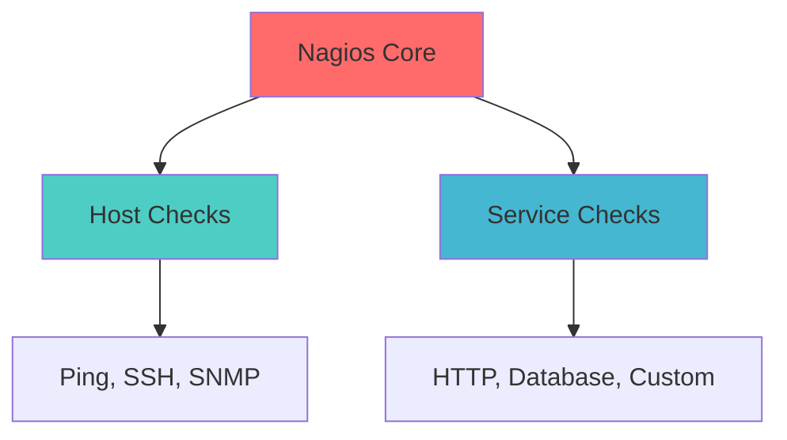

# 🔍 Nagios Monitoring Project

**Traditional infrastructure monitoring with Nagios**

---

## 🚀 Quick Start

```bash
# Start Nagios
docker-compose up -d

# Access web interface
echo "Nagios: http://localhost:8080/nagios"
echo "Login: nagiosadmin/nagios"
```

---

## 🎯 What You'll Learn

- Traditional monitoring approach
- Host and service checks
- Nagios configuration
- Alert notifications

---

## 📊 What's Included

- **Nagios Core** monitoring system
- **Web interface** for management
- **Basic host checks** configuration
- **Service monitoring** examples

---

## 🛠️ Getting Started

### **Step 1: Start Nagios**
```bash
docker-compose up -d
```

### **Step 2: Access Web Interface**
- URL: http://localhost:8080/nagios
- Username: nagiosadmin
- Password: nagios

### **Step 3: Explore Interface**
1. View **Hosts** - monitored systems
2. Check **Services** - monitored applications
3. Review **Alerts** - current issues
4. See **Reports** - historical data

---

## 📈 Monitoring Features

### **Host Monitoring**
- Ping checks
- SSH connectivity
- System resources

### **Service Monitoring**
- HTTP/HTTPS checks
- Database connectivity
- Application health

### **Alerting**
- Email notifications
- Escalation policies
- Acknowledgments

---

## 🔧 Configuration

- **docker-compose.yml** - Nagios service
- Default web credentials: nagiosadmin/nagios
- Configuration mounted from container

---

## 📊 Key Concepts



---

## 🧹 Cleanup

```bash
docker-compose down
```

---

*Perfect for understanding traditional monitoring approaches!* 🔍
