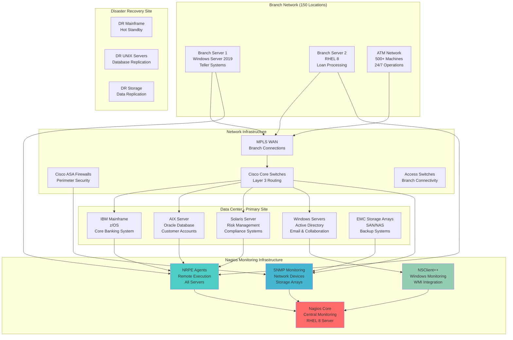
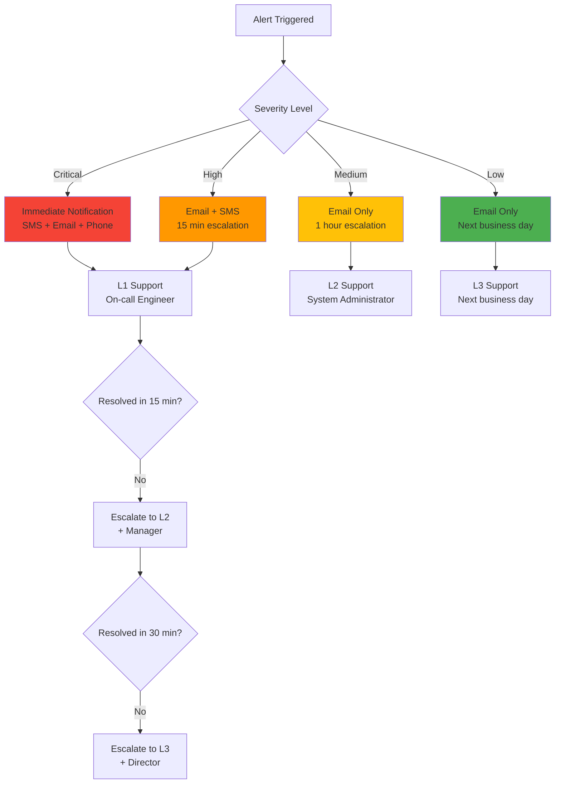

# 🔍 Nagios - Traditional Enterprise Infrastructure Monitoring

## 🏢 **Business Scenario: Legacy Banking Infrastructure**

You're the **Senior Systems Administrator** at **SecureBank**, a 150-year-old financial institution with **$50B+ assets** and **2M+ customers**. The bank operates critical legacy systems that require **99.99% uptime** and strict regulatory compliance (SOX, PCI-DSS, FFIEC).

### **Enterprise Constraints**
- **Legacy Systems**: 20+ year old mainframes and UNIX servers
- **Regulatory Compliance**: SOX, PCI-DSS, FFIEC auditing requirements
- **Change Resistance**: Strict change management, proven technologies only
- **High Availability**: Core banking systems require 99.99% uptime
- **Security First**: Air-gapped networks, strict access controls

---

## 🎯 **Project Goals**

### **What We're Monitoring**
- **Core Banking Systems** - Transaction processing, account management
- **ATM Network** - 500+ ATMs across 3 states
- **Branch Infrastructure** - 150 branch locations with local servers
- **Data Center Operations** - Primary and DR sites
- **Network Infrastructure** - Cisco routers, switches, firewalls

### **Compliance Requirements**
- **24/7 Monitoring** - Continuous oversight of critical systems
- **Audit Trails** - Complete logging for regulatory reviews
- **Incident Documentation** - Detailed records for compliance reporting
- **Change Tracking** - Monitor system modifications and updates
- **Performance Baselines** - Historical data for capacity planning

---

## 🏛️ **Traditional Banking Infrastructure**



---

## 📋 **Critical System Monitoring**

### **1. Core Banking System (Mainframe)**
```bash
# Host definition for mainframe
define host {
    host_name               mainframe-prod
    alias                   Core Banking Mainframe
    address                 10.1.1.10
    check_command           check-host-alive
    max_check_attempts      3
    check_interval          1
    retry_interval          1
    check_period            24x7
    notification_interval   5
    notification_period     24x7
    contacts                banking-ops,compliance-team
    register                1
}

# Critical services monitoring
define service {
    host_name               mainframe-prod
    service_description     CICS Transaction Server
    check_command           check_cics_regions
    max_check_attempts      2
    check_interval          2
    retry_interval          1
    notification_interval   5
    contacts                banking-ops,on-call-engineer
}

define service {
    host_name               mainframe-prod
    service_description     DB2 Database
    check_command           check_db2_subsystem
    max_check_attempts      2
    check_interval          5
    notification_interval   10
    contacts                dba-team,banking-ops
}
```

### **2. ATM Network Monitoring**
```bash
# ATM host template
define host {
    name                    atm-template
    check_command           check-host-alive
    max_check_attempts      3
    check_interval          5
    retry_interval          2
    check_period            24x7
    notification_interval   15
    notification_period     24x7
    contacts                atm-support,branch-ops
    register                0
}

# Individual ATM monitoring
define host {
    host_name               atm-downtown-001
    alias                   Downtown Branch ATM #1
    address                 192.168.100.10
    use                     atm-template
    hostgroups              atm-network,downtown-branch
}

# ATM service checks
define service {
    hostgroup_name          atm-network
    service_description     Cash Dispenser Status
    check_command           check_atm_cash_level
    check_interval          10
    notification_interval   30
}

define service {
    hostgroup_name          atm-network
    service_description     Network Connectivity
    check_command           check_atm_network
    check_interval          2
    notification_interval   5
}
```

### **3. Database Performance Monitoring**
```bash
# Oracle database monitoring
define service {
    host_name               oracle-prod-01
    service_description     Oracle Tablespace Usage
    check_command           check_oracle_tablespace!SYSTEM!90!95
    check_interval          10
    notification_interval   60
    contacts                dba-team
}

define service {
    host_name               oracle-prod-01
    service_description     Oracle Session Count
    check_command           check_oracle_sessions!800!900
    check_interval          5
    notification_interval   30
}

# Custom Oracle check command
define command {
    command_name            check_oracle_tablespace
    command_line            $USER1$/check_oracle --tablespace $ARG1$ --warning $ARG2$ --critical $ARG3$
}
```

---

## 🔔 **Enterprise Alerting & Escalation**

### **Escalation Matrix**


### **Contact Groups & Notifications**
```bash
# Contact definitions
define contact {
    contact_name            banking-ops-lead
    alias                   Banking Operations Lead
    email                   ops-lead@securebank.com
    pager                   555-1234
    service_notification_period    24x7
    host_notification_period       24x7
    service_notification_options   w,u,c,r
    host_notification_options      d,u,r
    service_notification_commands  notify-service-by-email,notify-service-by-sms
    host_notification_commands     notify-host-by-email,notify-host-by-sms
}

# Compliance team contact
define contact {
    contact_name            compliance-officer
    alias                   Compliance Officer
    email                   compliance@securebank.com
    service_notification_period    workhours
    service_notification_options   c,r
    service_notification_commands  notify-service-by-email
}

# Contact groups
define contactgroup {
    contactgroup_name       critical-systems
    alias                   Critical Systems Team
    members                 banking-ops-lead,system-admin-1,on-call-engineer
}
```

---

## 📊 **Compliance & Reporting**

### **SOX Compliance Monitoring**
```bash
# Financial system availability tracking
define service {
    host_name               financial-reporting-server
    service_description     SOX Financial Reports Access
    check_command           check_http_auth!443!/reports/sox!soxuser!password
    check_interval          5
    max_check_attempts      3
    notification_interval   15
    contacts                compliance-officer,cfo-office
    notes                   SOX Section 404 - Internal Controls
}

# Change management tracking
define service {
    host_name               change-mgmt-server
    service_description     Change Management System
    check_command           check_change_approvals
    check_interval          60
    contacts                compliance-officer,change-board
    notes                   Track all system changes for audit
}
```

### **PCI-DSS Compliance**
```bash
# Payment processing system monitoring
define service {
    host_name               payment-processor
    service_description     PCI Cardholder Data Environment
    check_command           check_pci_compliance
    check_interval          10
    max_check_attempts      2
    notification_interval   5
    contacts                security-team,pci-officer
    notes                   PCI-DSS Requirement 10 - Log Monitoring
}

# Security log monitoring
define service {
    host_name               security-log-server
    service_description     Security Event Logs
    check_command           check_security_logs
    check_interval          5
    contacts                security-team,compliance-officer
    notes                   Monitor for security violations
}
```

---

## 📈 **Performance Baselines & Capacity Planning**

### **Historical Performance Tracking**
```bash
# CPU utilization trending
define service {
    host_name               mainframe-prod
    service_description     CPU Utilization Trend
    check_command           check_cpu_trend!80!90
    check_interval          5
    process_perf_data       1
    retain_status_information       1
    retain_nonstatus_information    1
}

# Memory usage tracking
define service {
    host_name               oracle-prod-01
    service_description     Memory Usage Baseline
    check_command           check_memory_baseline!85!95
    check_interval          10
    process_perf_data       1
}
```

### **Capacity Planning Reports**
```bash
# Custom script for capacity reporting
#!/bin/bash
# /usr/local/nagios/libexec/check_capacity_trend

# Generate monthly capacity report
MONTH=$(date +%Y-%m)
REPORT_FILE="/var/log/nagios/capacity_report_${MONTH}.txt"

echo "=== Monthly Capacity Report - ${MONTH} ===" > $REPORT_FILE
echo "Generated: $(date)" >> $REPORT_FILE
echo "" >> $REPORT_FILE

# CPU utilization trends
echo "CPU Utilization Trends:" >> $REPORT_FILE
grep "CPU" /var/log/nagios/perfdata.log | tail -30 >> $REPORT_FILE

# Memory usage trends
echo "Memory Usage Trends:" >> $REPORT_FILE
grep "Memory" /var/log/nagios/perfdata.log | tail -30 >> $REPORT_FILE

# Storage capacity trends
echo "Storage Capacity Trends:" >> $REPORT_FILE
grep "Disk" /var/log/nagios/perfdata.log | tail -30 >> $REPORT_FILE

# Email report to capacity planning team
mail -s "Monthly Capacity Report - ${MONTH}" capacity-planning@securebank.com < $REPORT_FILE
```

---

## 🚀 **Getting Started**

### **Quick Setup**
```bash
# Start Nagios monitoring
docker-compose up -d

# Access Nagios web interface
echo "Nagios: http://localhost:8080/nagios"
echo "Login: nagiosadmin/nagios"
```

### **Key Monitoring Areas**
1. **System Health** - CPU, memory, disk, network utilization
2. **Service Availability** - Critical application services
3. **Network Infrastructure** - Switches, routers, firewalls
4. **Database Performance** - Query times, connection pools
5. **Security Events** - Failed logins, unauthorized access
6. **Compliance Metrics** - Audit trails, change tracking

### **Custom Check Scripts**
```bash
# Example: Check Oracle database connectivity
#!/bin/bash
# /usr/local/nagios/libexec/check_oracle_connection

ORACLE_SID="PROD"
ORACLE_USER="nagios"
ORACLE_PASS="monitoring123"

# Test connection
sqlplus -s ${ORACLE_USER}/${ORACLE_PASS}@${ORACLE_SID} <<EOF
SELECT 'OK' FROM dual;
EXIT;
EOF

if [ $? -eq 0 ]; then
    echo "OK - Oracle database connection successful"
    exit 0
else
    echo "CRITICAL - Oracle database connection failed"
    exit 2
fi
```

---

## 🎓 **Learning Outcomes**

After completing this project, you'll understand:
- **Traditional infrastructure monitoring** approaches
- **Enterprise compliance requirements** (SOX, PCI-DSS)
- **Legacy system integration** and monitoring challenges
- **Escalation procedures** and incident management
- **Performance baseline establishment** and capacity planning
- **Regulatory reporting** and audit trail maintenance

### **Enterprise Skills**
- **Change management** integration with monitoring
- **Compliance reporting** automation
- **Legacy system** monitoring techniques
- **Enterprise escalation** procedures
- **Audit trail** maintenance and reporting

---

## 📊 **Success Metrics**

### **Operational Excellence**
- **System Uptime**: 99.99% for core banking systems
- **MTTR**: <15 minutes for critical system issues
- **Alert Accuracy**: >98% (minimal false positives)
- **Compliance**: 100% audit trail coverage

### **Business Impact**
- **Regulatory Compliance**: Zero compliance violations
- **Customer Impact**: <0.01% transaction failures
- **Cost Avoidance**: $5M+ prevented through proactive monitoring
- **Audit Readiness**: 100% documentation compliance

---

*Reliable monitoring for mission-critical systems. Trust through proven technology.* 🔍
