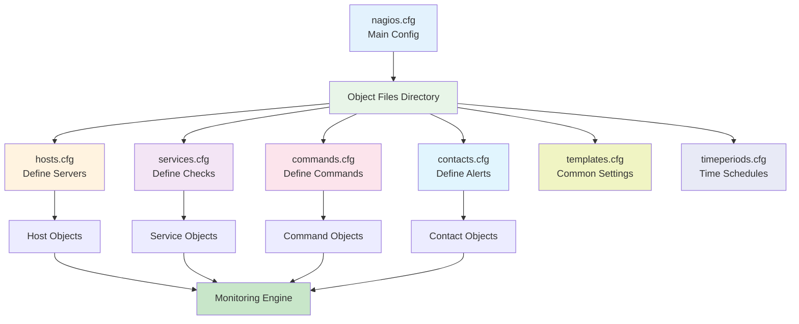
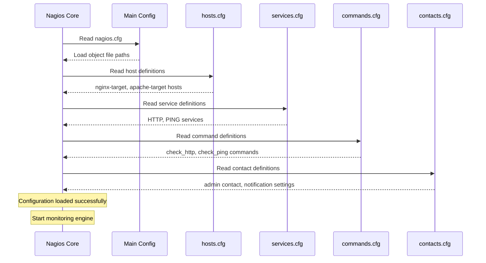
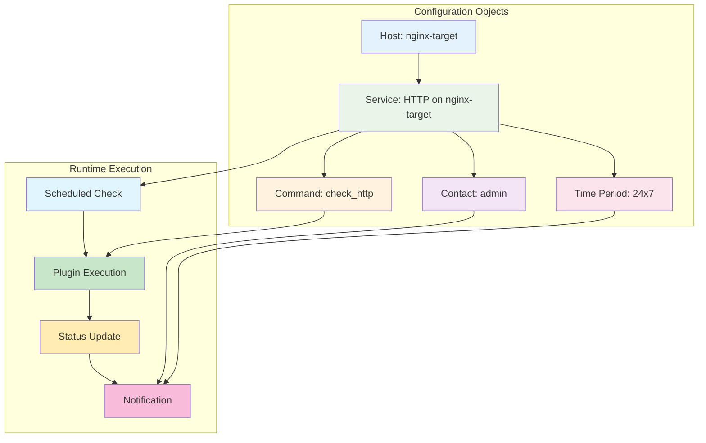

# 🔧 **Nagios Configuration Files - Technical Guide**

## 📁 **Configuration File Structure**



---

## 🏠 **1. hosts.cfg - Define What to Monitor**

### **Basic Host Definition:**
```bash
define host {
    use                     linux-server        # Template (inherit settings)
    host_name               nginx-target        # Unique name for this host
    alias                   Nginx Web Server    # Human-readable description
    address                 nginx-target        # IP address or hostname
    check_command           check-host-alive    # How to test if host is up
    max_check_attempts      3                   # Try 3 times before marking DOWN
    check_period            24x7                # When to check (always)
    notification_interval   30                  # Alert every 30 minutes if still down
    notification_period     24x7                # When to send alerts (always)
}
```

### **Host Settings Explained:**

| Setting | Purpose | Example Values |
|---------|---------|----------------|
| `use` | Inherit from template | linux-server, windows-server |
| `host_name` | Unique identifier | web-01, db-primary, router-01 |
| `alias` | Human description | "Production Web Server" |
| `address` | IP or hostname | 192.168.1.10, web.company.com |
| `check_command` | How to test host | check-host-alive, check_ping |
| `max_check_attempts` | Retries before DOWN | 3, 5, 10 |
| `check_period` | When to check | 24x7, workhours, weekends |
| `notification_interval` | Alert frequency | 30 (minutes), 60, 120 |

### **Advanced Host Examples:**

#### **Web Server with Custom Settings:**
```bash
define host {
    use                     linux-server
    host_name               web-server-prod
    alias                   Production Web Server
    address                 10.0.1.100
    check_command           check-host-alive
    max_check_attempts      5                   # More retries for critical server
    check_interval          2                   # Check every 2 minutes
    notification_interval   15                  # Alert every 15 minutes
    contact_groups          web-admins          # Who gets alerts
    notes                   Primary web server for customer portal
    notes_url               https://wiki.company.com/servers/web-prod
}
```

#### **Database Server:**
```bash
define host {
    use                     linux-server
    host_name               db-server-primary
    alias                   Primary Database Server
    address                 10.0.2.50
    parents                 core-switch         # Network dependency
    check_command           check-host-alive
    max_check_attempts      3
    notification_interval   5                   # Immediate alerts for DB
    contact_groups          dba-team,ops-team
}
```

---

## 🔧 **2. services.cfg - Define How to Monitor**

### **Basic Service Definition:**
```bash
define service {
    use                     generic-service     # Template for common settings
    host_name               nginx-target        # Which host this service runs on
    service_description     HTTP                # Name of the service check
    check_command           check_http          # Command to test the service
    max_check_attempts      3                   # Retry 3 times before CRITICAL
    check_interval          5                   # Check every 5 minutes
    retry_interval          1                   # If failed, retry every 1 minute
    check_period            24x7                # When to perform checks
    notification_interval   30                  # How often to repeat alerts
    notification_period     24x7                # When alerts are allowed
}
```

### **Service Settings Explained:**

| Setting | Purpose | Example Values |
|---------|---------|----------------|
| `host_name` | Target host | web-01, db-primary (must exist in hosts.cfg) |
| `service_description` | Service name | HTTP, MySQL, Disk Space, CPU Load |
| `check_command` | Test command | check_http, check_mysql, check_disk |
| `check_interval` | Normal frequency | 5 (minutes), 10, 15 |
| `retry_interval` | Retry frequency | 1 (minute), 2, 5 |
| `max_check_attempts` | Retries before alert | 3, 4, 5 |

### **Common Service Examples:**

#### **Web Server Services:**
```bash
# HTTP Service
define service {
    use                     generic-service
    host_name               web-server-prod
    service_description     HTTP
    check_command           check_http
    check_interval          2                   # Check every 2 minutes
    max_check_attempts      3
}

# HTTPS Service with SSL check
define service {
    use                     generic-service
    host_name               web-server-prod
    service_description     HTTPS
    check_command           check_http!-S       # -S flag for SSL
    check_interval          5
}

# Specific URL check
define service {
    use                     generic-service
    host_name               web-server-prod
    service_description     Login Page
    check_command           check_http!-u /login -e 200
}
```

#### **Database Services:**
```bash
# MySQL Connection
define service {
    use                     generic-service
    host_name               db-server-primary
    service_description     MySQL
    check_command           check_mysql!dbuser!dbpass
    check_interval          5
    max_check_attempts      2                   # Quick alerts for DB
}

# Database Query Performance
define service {
    use                     generic-service
    host_name               db-server-primary
    service_description     MySQL Query Time
    check_command           check_mysql_query!dbuser!dbpass!"SELECT 1"!1!5
}
```

#### **System Resource Services:**
```bash
# Disk Space
define service {
    use                     generic-service
    host_name               web-server-prod
    service_description     Root Disk
    check_command           check_disk!20%!10%!/
}

# CPU Load
define service {
    use                     generic-service
    host_name               web-server-prod
    service_description     CPU Load
    check_command           check_load!5.0!4.0!3.0!10.0!6.0!4.0
}

# Memory Usage
define service {
    use                     generic-service
    host_name               web-server-prod
    service_description     Memory
    check_command           check_memory!80!90
}
```

---

## ⚡ **3. commands.cfg - Define Test Commands**

### **Command Structure:**
```bash
define command {
    command_name    check_http                          # Name used in services.cfg
    command_line    $USER1$/check_http -H $HOSTADDRESS$ # Actual command to run
}
```

### **Variable Substitution:**

| Variable | Replaced With | Example |
|----------|---------------|---------|
| `$USER1$` | Plugin directory | /usr/lib/nagios/plugins/ |
| `$HOSTADDRESS$` | Host IP/hostname | 192.168.1.10 or web-server |
| `$ARG1$` | First argument | From check_command!arg1!arg2 |
| `$ARG2$` | Second argument | From check_command!arg1!arg2 |

### **Common Commands:**

#### **Basic Commands:**
```bash
# HTTP Check
define command {
    command_name    check_http
    command_line    $USER1$/check_http -H $HOSTADDRESS$
}

# HTTP with arguments
define command {
    command_name    check_http_url
    command_line    $USER1$/check_http -H $HOSTADDRESS$ -u $ARG1$
}

# PING Check
define command {
    command_name    check_ping
    command_line    $USER1$/check_ping -H $HOSTADDRESS$ -w $ARG1$ -c $ARG2$
}
```

#### **Advanced Commands:**
```bash
# MySQL Check
define command {
    command_name    check_mysql
    command_line    $USER1$/check_mysql -H $HOSTADDRESS$ -u $ARG1$ -p $ARG2$
}

# Disk Space Check
define command {
    command_name    check_disk
    command_line    $USER1$/check_disk -w $ARG1$ -c $ARG2$ -p $ARG3$
}

# Custom Script
define command {
    command_name    check_custom_app
    command_line    $USER1$/check_custom_app.sh -H $HOSTADDRESS$ -p $ARG1$
}
```

---

## 📞 **4. contacts.cfg - Define Alert Recipients**

### **Contact Definition:**
```bash
define contact {
    contact_name                    admin
    alias                          System Administrator
    email                          admin@company.com
    host_notification_period       24x7
    service_notification_period    24x7
    host_notification_options      d,u,r,f         # down, unreachable, recovery, flapping
    service_notification_options   w,u,c,r,f       # warning, unknown, critical, recovery, flapping
    host_notification_commands     notify-host-by-email
    service_notification_commands  notify-service-by-email
}
```

### **Contact Groups:**
```bash
define contactgroup {
    contactgroup_name       web-admins
    alias                   Web Administrators
    members                 admin,webmaster,oncall
}

define contactgroup {
    contactgroup_name       dba-team
    alias                   Database Administrators
    members                 dba1,dba2,admin
}
```

---

## 📋 **5. templates.cfg - Reusable Settings**

### **Host Templates:**
```bash
define host {
    name                    linux-server        # Template name
    check_command           check-host-alive
    max_check_attempts      3
    check_interval          5
    retry_interval          1
    check_period            24x7
    notification_interval   30
    notification_period     24x7
    notification_options    d,u,r               # down, unreachable, recovery
    contact_groups          admins
    register                0                   # Don't monitor this template
}

define host {
    name                    windows-server
    check_command           check-host-alive
    max_check_attempts      3
    check_interval          10                  # Less frequent for Windows
    retry_interval          2
    check_period            24x7
    notification_interval   60
    notification_period     workhours           # Only during work hours
    notification_options    d,u,r
    contact_groups          windows-admins
    register                0
}
```

### **Service Templates:**
```bash
define service {
    name                    generic-service
    active_checks_enabled   1
    passive_checks_enabled  1
    parallelize_check       1
    obsess_over_service     1
    check_freshness         0
    notifications_enabled   1
    event_handler_enabled   1
    flap_detection_enabled  1
    process_perf_data       1
    retain_status_information   1
    retain_nonstatus_information 1
    notification_interval   30
    is_volatile             0
    check_period            24x7
    max_check_attempts      3
    check_interval          5
    retry_interval          1
    contact_groups          admins
    notification_options    w,u,c,r
    notification_period     24x7
    register                0
}
```

---

## ⏰ **6. timeperiods.cfg - Define Schedules**

### **Common Time Periods:**
```bash
# 24/7 Monitoring
define timeperiod {
    timeperiod_name     24x7
    alias               24 Hours A Day, 7 Days A Week
    sunday              00:00-24:00
    monday              00:00-24:00
    tuesday             00:00-24:00
    wednesday           00:00-24:00
    thursday            00:00-24:00
    friday              00:00-24:00
    saturday            00:00-24:00
}

# Business Hours
define timeperiod {
    timeperiod_name     workhours
    alias               Standard Work Hours
    monday              09:00-17:00
    tuesday             09:00-17:00
    wednesday           09:00-17:00
    thursday            09:00-17:00
    friday              09:00-17:00
}

# Extended Hours
define timeperiod {
    timeperiod_name     extended-hours
    alias               Extended Business Hours
    monday              07:00-19:00
    tuesday             07:00-19:00
    wednesday           07:00-19:00
    thursday            07:00-19:00
    friday              07:00-19:00
    saturday            09:00-17:00
}

# Weekends Only
define timeperiod {
    timeperiod_name     weekends
    alias               Weekend Hours
    saturday            00:00-24:00
    sunday              00:00-24:00
}
```

---

## 🔄 **How Configuration Files Work Together**

### **Configuration Processing Flow:**



### **Object Relationships:**



---

## 🎯 **Best Practices**

### **1. Use Templates Effectively:**
```bash
# Good: Define common settings once
define host {
    name                    production-server
    use                     linux-server
    max_check_attempts      5                   # Override for production
    check_interval          2                   # More frequent checks
    notification_interval   10                  # Faster alerts
    contact_groups          ops-team,management
    register                0
}

# Use the template
define host {
    use                     production-server
    host_name               web-prod-01
    address                 10.0.1.100
}
```

### **2. Organize by Environment:**
```bash
# Development servers
define host {
    name                    dev-server
    use                     linux-server
    check_interval          15                  # Less frequent
    notification_interval   120                 # Less urgent alerts
    contact_groups          dev-team
    register                0
}

# Production servers
define host {
    name                    prod-server
    use                     linux-server
    check_interval          2                   # Very frequent
    notification_interval   5                   # Immediate alerts
    contact_groups          ops-team,management
    register                0
}
```

### **3. Service Dependencies:**
```bash
# Web service depends on database
define servicedependency {
    host_name                       web-server-01
    service_description             HTTP
    dependent_host_name             web-server-01
    dependent_service_description   Database Connection
    execution_failure_criteria     c,u         # critical, unknown
    notification_failure_criteria  c,u
}
```

---

## 🔍 **Troubleshooting Configuration**

### **Common Issues:**

#### **1. Syntax Errors:**
```bash
# Check configuration syntax
nagios -v /opt/nagios/etc/nagios.cfg

# Common errors:
# - Missing closing brace }
# - Undefined host_name in service
# - Invalid time period format
# - Duplicate object names
```

#### **2. Object Relationships:**
```bash
# Service references non-existent host
define service {
    host_name               web-server-99      # Host doesn't exist!
    service_description     HTTP
    check_command           check_http
}

# Fix: Ensure host exists in hosts.cfg
define host {
    use                     linux-server
    host_name               web-server-99
    address                 192.168.1.99
}
```

#### **3. Command Not Found:**
```bash
# Service uses undefined command
define service {
    service_description     Custom Check
    check_command           check_custom_app   # Command doesn't exist!
}

# Fix: Define the command
define command {
    command_name    check_custom_app
    command_line    $USER1$/check_custom_app.sh -H $HOSTADDRESS$
}
```

### **Validation Checklist:**
- [ ] All hosts referenced in services exist
- [ ] All commands referenced in services exist
- [ ] All contact groups referenced exist
- [ ] All time periods referenced exist
- [ ] No duplicate object names
- [ ] Proper syntax (braces, semicolons)
- [ ] File permissions allow Nagios to read

---

## 📚 **Advanced Configuration Topics**

### **1. Custom Variables:**
```bash
define host {
    use                     linux-server
    host_name               web-server-01
    address                 192.168.1.100
    _SNMP_COMMUNITY         public              # Custom variable
    _BACKUP_SCHEDULE        daily               # Custom variable
}

# Use in commands
define command {
    command_name    check_snmp_custom
    command_line    $USER1$/check_snmp -H $HOSTADDRESS$ -C $_HOSTSNMP_COMMUNITY$
}
```

### **2. Host Groups:**
```bash
define hostgroup {
    hostgroup_name          web-servers
    alias                   Web Servers
    members                 web-01,web-02,web-03
}

# Apply service to entire group
define service {
    use                     generic-service
    hostgroup_name          web-servers         # Instead of host_name
    service_description     HTTP
    check_command           check_http
}
```

### **3. Service Groups:**
```bash
define servicegroup {
    servicegroup_name       web-services
    alias                   Web Services
    members                 web-01,HTTP,web-01,HTTPS,web-02,HTTP
}
```

This comprehensive guide covers all aspects of Nagios configuration files with practical examples and best practices for students to understand and implement.
