# 🎯 Complete Monitoring Stack - Production-Ready Solution

## 🏢 **Business Scenario: FinTech Startup**

You're the **Senior DevOps Engineer** at **PayFlow**, a rapidly growing fintech startup that processes **$50M+ monthly** in digital payments. The company serves **500,000+ active users** across North America and Europe.

### **Critical Business Requirements**
- **99.9% uptime SLA** - Every minute of downtime costs $10,000
- **PCI-DSS compliance** - Handle sensitive payment data securely  
- **Real-time fraud detection** - Block suspicious transactions instantly
- **Regulatory reporting** - SOX compliance for financial audits
- **Scalability** - Handle 10x traffic during peak shopping seasons

---

## 🏗️ **Infrastructure Architecture**


---

## 💼 **Workload Characteristics**

### **Traffic Patterns**
- **Normal Load**: 2,000 RPS, 50,000 concurrent users
- **Peak Load**: 20,000 RPS during Black Friday/Cyber Monday
- **Geographic Distribution**: 
  - US East Coast: 40%
  - US West Coast: 30% 
  - Europe: 20%
  - Other: 10%

### **Transaction Types**


### **Critical Services**
1. **Payment Processing API** - Core revenue generator
2. **Fraud Detection Engine** - ML-based risk assessment
3. **User Authentication** - OAuth 2.0 + MFA
4. **Notification Service** - Real-time transaction alerts
5. **Reporting Engine** - Compliance and analytics

---

## 📊 **Comprehensive Monitoring Strategy**

### **Application Performance Monitoring**

#### **Key Metrics We Track**
```promql
# Payment success rate (must be >99.5%)
rate(payment_transactions_total{status="success"}[5m]) / 
rate(payment_transactions_total[5m]) * 100

# API response time (95th percentile <200ms)
histogram_quantile(0.95, 
  rate(http_request_duration_seconds_bucket{service="payment-api"}[5m]))

# Fraud detection accuracy
rate(fraud_detected_total{status="true_positive"}[1h]) / 
rate(fraud_detected_total[1h]) * 100

# Database connection pool utilization
pg_stat_activity_count / pg_settings_max_connections * 100
```

#### **Business Metrics Dashboard**
- **Revenue per Minute**: Real-time transaction value
- **Customer Acquisition Cost**: Marketing efficiency
- **Transaction Conversion Rate**: Checkout funnel analysis
- **Average Transaction Value**: Business growth indicator

### **Infrastructure Monitoring**

#### **Server Health Metrics**
```yaml
Critical Thresholds:
  CPU Usage: >85% for 5 minutes
  Memory Usage: >90% for 3 minutes
  Disk Usage: >90% 
  Network Latency: >100ms to database
  
Warning Thresholds:
  CPU Usage: >70% for 10 minutes
  Memory Usage: >80% for 10 minutes
  Disk I/O Wait: >20%
  Connection Pool: >80% utilized
```

#### **Database Performance**
- **Query Performance**: Slow query detection (>1 second)
- **Connection Pooling**: Active vs idle connections
- **Replication Lag**: Master-slave synchronization
- **Lock Contention**: Blocking queries and deadlocks

### **Security Monitoring**

#### **Threat Detection**
```json
{
  "alert_rules": [
    {
      "name": "Brute Force Attack",
      "condition": "failed_login_attempts > 10 in 5 minutes",
      "action": "block_ip_and_alert_security_team"
    },
    {
      "name": "Unusual Transaction Pattern",
      "condition": "transaction_amount > 3x user_average AND location != usual_location",
      "action": "flag_for_manual_review"
    },
    {
      "name": "API Abuse",
      "condition": "requests_per_minute > 1000 from single_ip",
      "action": "rate_limit_and_investigate"
    }
  ]
}
```

---

## 🚨 **Advanced Alerting System**

### **Alert Severity Levels**

```mermaid
graph TD
    CRITICAL[🔴 CRITICAL<br/>Page On-Call Engineer<br/>Response: <5 minutes]
    HIGH[🟠 HIGH<br/>Slack + Email<br/>Response: <15 minutes]
    MEDIUM[🟡 MEDIUM<br/>Email Only<br/>Response: <1 hour]
    LOW[🔵 LOW<br/>Dashboard Only<br/>Response: Next business day]
    
    CRITICAL --> EXAMPLES1[• Payment API down<br/>• Database unreachable<br/>• Security breach detected<br/>• Error rate >5%]
    HIGH --> EXAMPLES2[• High response times<br/>• Memory usage >90%<br/>• Fraud detection offline<br/>• Queue backlog growing]
    MEDIUM --> EXAMPLES3[• CPU usage >80%<br/>• Disk space <20%<br/>• Non-critical service slow<br/>• Cache hit rate low]
    LOW --> EXAMPLES4[• Deployment completed<br/>• Backup finished<br/>• Performance improved<br/>• Maintenance scheduled]
    
    style CRITICAL fill:#f44336
    style HIGH fill:#ff9800
    style MEDIUM fill:#ffc107
    style LOW fill:#2196f3
```



### **Escalation Policy**
```yaml
Escalation_Chain:
  Level_1: "DevOps Engineer (Primary)"
  Level_2: "DevOps Engineer (Secondary) + Engineering Manager"
  Level_3: "CTO + VP Engineering"
  
Escalation_Timing:
  - Alert fires: Immediate notification to Level 1
  - 15 minutes unacknowledged: Escalate to Level 2
  - 30 minutes unresolved: Escalate to Level 3
  - 1 hour unresolved: Executive escalation + incident commander
```

---

## 🎯 **Real-World Scenarios**

### **Scenario 1: Black Friday Traffic Surge**

**Situation**: Traffic increases 1000% in 2 hours


**Monitoring Response**:
1. **Auto-scaling alerts** trigger additional EC2 instances
2. **Database monitoring** shows increased connection pool usage
3. **Real-time dashboards** track revenue and conversion rates
4. **Fraud detection** adapts to higher transaction volumes
5. **Cost monitoring** tracks infrastructure spend in real-time

### **Scenario 2: Security Incident**

**Situation**: Suspicious login patterns detected


**Monitoring Actions**:
1. **Log analysis** identifies attack patterns and source IPs
2. **Automated blocking** prevents further attempts
3. **Security dashboard** shows attack scope and timeline
4. **Compliance logging** captures all events for audit trail
5. **Business impact** assessment through transaction monitoring

---

## 📈 **Success Metrics & KPIs**

### **Technical Performance**
- **System Uptime**: 99.95% (Target: 99.9%)
- **API Response Time**: 150ms average (Target: <200ms)
- **Error Rate**: 0.1% (Target: <0.5%)
- **MTTR**: 8 minutes (Target: <15 minutes)
- **MTTD**: 1.5 minutes (Target: <2 minutes)

### **Business Impact**
- **Revenue Protection**: $2M+ saved through proactive monitoring
- **Fraud Prevention**: 99.8% accuracy, $500K+ losses prevented
- **Customer Satisfaction**: 4.8/5 rating for payment experience
- **Compliance**: 100% audit trail coverage, zero violations

### **Operational Efficiency**
- **Alert Accuracy**: 96% (reduced false positives by 80%)
- **On-call Burden**: 70% reduction in after-hours incidents
- **Incident Resolution**: 60% faster with centralized monitoring
- **Team Productivity**: 40% more time for feature development

---

## 🚀 **Getting Started**

### **Quick Setup**
```bash
# Start the complete monitoring stack
./setup.sh

# Verify all services are running
docker-compose ps

# Access monitoring tools
echo "Grafana: http://localhost:3000 (admin/admin123)"
echo "Prometheus: http://localhost:9090"
echo "Kibana: http://localhost:5601"
```

### **Key Dashboards to Explore**
1. **Executive Overview** - Business metrics and system health
2. **Application Performance** - API response times and error rates  
3. **Infrastructure Health** - Server resources and database performance
4. **Security Monitoring** - Threat detection and compliance metrics
5. **Financial Metrics** - Transaction volumes and revenue tracking

### **Sample Alerts to Test**
```bash
# Generate high CPU load
docker run --rm -it progrium/stress --cpu 2 --timeout 60s

# Simulate API errors
curl -X POST http://localhost:8080/api/error

# Test memory usage alert
docker run --rm -it --memory=100m progrium/stress --vm 1 --vm-bytes 150m
```

---

## 🎓 **Learning Outcomes**

After completing this project, you'll understand:
- **Production monitoring architecture** for financial services
- **Multi-layered alerting strategies** with proper escalation
- **Business metrics integration** with technical monitoring
- **Security monitoring** and incident response workflows
- **Compliance requirements** for regulated industries
- **Cost optimization** through intelligent monitoring

This complete monitoring stack represents **enterprise-grade observability** that scales from startup to Fortune 500 company requirements.

---

*Ready to monitor like a pro? This is the foundation of reliable, scalable systems.* 🚀
