# 🎯 Complete Monitoring Stack

**Full monitoring solution with Prometheus, Grafana, ELK Stack, and AlertManager**

---

## 🚀 Quick Start

```bash
# Start everything
./setup.sh

# Access services
echo "Grafana: http://localhost:3000 (admin/admin123)"
echo "Prometheus: http://localhost:9090"
echo "Kibana: http://localhost:5601"
```

---

## 📊 What's Included

```mermaid
graph TB
    subgraph "Complete Stack"
        PROM[Prometheus<br/>📊 Metrics Collection]
        GRAF[Grafana<br/>📈 Dashboards]
        ELASTIC[Elasticsearch<br/>🔍 Log Storage]
        KIBANA[Kibana<br/>📝 Log Analysis]
        ALERT[AlertManager<br/>🚨 Notifications]
        NODE[Node Exporter<br/>💻 System Metrics]
    end
    
    style PROM fill:#e6522c
    style GRAF fill:#f46800
    style ELASTIC fill:#005571
    style KIBANA fill:#005571
    style ALERT fill:#f44336
    style NODE fill:#4caf50
```



---

## 🛠️ Services

| Service | Port | Purpose | Login |
|---------|------|---------|-------|
| **Grafana** | 3000 | Dashboards | admin/admin123 |
| **Prometheus** | 9090 | Metrics | - |
| **Kibana** | 5601 | Log Analysis | - |
| **Elasticsearch** | 9200 | Log Storage | - |
| **AlertManager** | 9093 | Alerts | - |
| **Node Exporter** | 9100 | System Metrics | - |

---

## 📈 Key Features

### **Metrics Collection**
- System metrics (CPU, Memory, Disk)
- Application metrics
- Custom metrics support

### **Visualization**
- Pre-built dashboards
- Custom dashboard creation
- Real-time monitoring

### **Alerting**
- CPU usage alerts
- Memory usage alerts
- Disk space alerts
- Service down alerts

### **Log Management**
- Centralized log collection
- Log parsing and analysis
- Search and filtering

---

## 🎯 Getting Started

### **Step 1: Start Stack**
```bash
./setup.sh
```

### **Step 2: Import Dashboard**
1. Open Grafana: http://localhost:3000
2. Login: admin/admin123
3. Go to "+" → Import
4. Use ID: 1860 (Node Exporter Full)
5. Select Prometheus data source

### **Step 3: View Metrics**
1. Open Prometheus: http://localhost:9090
2. Try queries:
   ```promql
   # CPU usage
   100 - (avg(irate(node_cpu_seconds_total{mode="idle"}[5m])) * 100)
   
   # Memory usage
   (node_memory_MemTotal_bytes - node_memory_MemAvailable_bytes) / node_memory_MemTotal_bytes * 100
   ```

### **Step 4: Check Alerts**
1. Go to Prometheus → Alerts
2. View configured alert rules
3. Check AlertManager: http://localhost:9093

---

## 📝 Configuration Files

- **docker-compose.yml** - All services definition
- **prometheus.yml** - Metrics collection config
- **alert_rules.yml** - Alert definitions
- **setup.sh** - Automated setup script
- **cleanup.sh** - Cleanup script

---

## 🆘 Troubleshooting

### **Services not starting?**
```bash
# Check Docker
docker ps -a

# View logs
docker-compose logs <service-name>

# Restart specific service
docker-compose restart <service-name>
```

### **Out of memory?**
```bash
# Check system resources
free -h
df -h

# Clean up Docker
docker system prune -f
```

### **Port conflicts?**
```bash
# Check what's using ports
netstat -tulpn | grep <port>

# Stop conflicting services
sudo systemctl stop <service>
```

---

## 🧹 Cleanup

```bash
# Stop and remove everything
./cleanup.sh

# Or manually
docker-compose down -v
```

---

*Complete monitoring stack ready! Perfect for production-like monitoring setup.* 🎯
