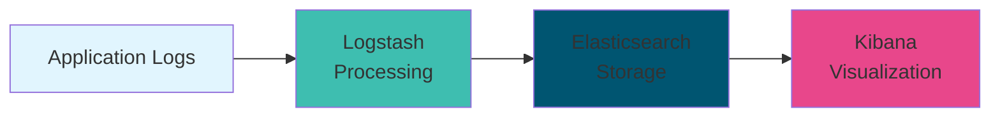
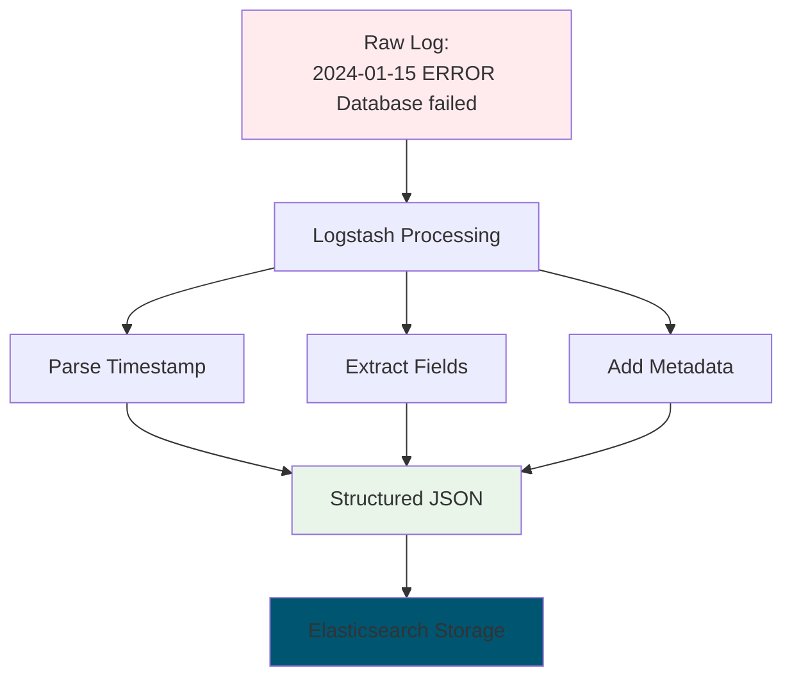

# 📝 ELK Stack Log Management

**Complete log management with Elasticsearch, Logstash, and Kibana**

---

## 🚀 Quick Start

```bash
# Start ELK stack
./start-elk.sh

# Generate sample logs
./generate-logs.sh

# Access Kibana
echo "Kibana: http://localhost:5601"
```

---

## 🎯 What You'll Learn

- Centralized log management
- Log parsing and enrichment
- Search and visualization
- Log-based alerting

---

## 📊 ELK Stack Components



---

## 🛠️ Getting Started

### **Step 1: Start ELK Stack**
```bash
./start-elk.sh
```

### **Step 2: Generate Logs**
```bash
./generate-logs.sh
```

### **Step 3: Access Kibana**
1. Open: http://localhost:5601
2. Go to **Management** → **Index Patterns**
3. Create pattern: `logs-*`
4. Select timestamp: `@timestamp`

### **Step 4: Explore Logs**
1. Go to **Discover**
2. Search and filter logs
3. Create visualizations
4. Build dashboards

---

## 📈 Log Processing Pipeline



---

## 🔧 Configuration Files

- **docker-compose.yml** - ELK services
- **logstash/pipeline/logstash.conf** - Log processing rules
- **start-elk.sh** - Setup script
- **generate-logs.sh** - Sample log generator

---

## 📊 Sample Log Queries

```json
# Search for errors
level: "ERROR"

# Find specific user activity
user: "john" AND action: "login"

# Time range queries
@timestamp: [now-1h TO now]

# Aggregation queries
service: "api-gateway" AND status: 500
```

---

## 📈 Visualization Examples

### **Log Volume Over Time**
- Chart type: Line chart
- X-axis: @timestamp
- Y-axis: Count

### **Error Rate by Service**
- Chart type: Pie chart
- Split: service.keyword
- Filter: level: "ERROR"

### **Response Time Distribution**
- Chart type: Histogram
- Field: response_time

---

## 🚨 Alerting

Create alerts based on:
- Error rate thresholds
- Log volume spikes
- Specific error patterns
- Service availability

---

## 🧹 Cleanup

```bash
docker-compose down -v
```

---

*Master log management with the ELK stack!* 📝
