# 📝 ELK Stack - Enterprise Security & Compliance Monitoring

## 🏢 **Business Scenario: Healthcare SaaS Platform**

You're the **Security Engineer** at **MedSecure**, a healthcare SaaS platform serving **200+ hospitals** and **50,000+ healthcare professionals**. The platform handles sensitive patient data (PHI) and must comply with **HIPAA, SOC 2, and GDPR** regulations.

### **Critical Security Requirements**
- **HIPAA Compliance** - Audit trail for all PHI access (7-year retention)
- **SOC 2 Type II** - Continuous security monitoring and reporting
- **GDPR Compliance** - Data access logging and breach notification
- **Threat Detection** - Real-time identification of security incidents
- **Forensic Analysis** - Detailed investigation capabilities for incidents

---

## 🏗️ **Healthcare Platform Architecture**


---

## 🔒 **Security Monitoring Use Cases**

### **1. HIPAA Audit Trail Monitoring**

#### **PHI Access Logging**
```json
{
  "timestamp": "2024-01-15T14:30:15Z",
  "event_type": "phi_access",
  "user_id": "dr_smith_12345",
  "user_role": "physician",
  "patient_id": "patient_67890",
  "patient_mrn": "MRN-2024-001",
  "action": "view_medical_record",
  "data_accessed": [
    "demographics",
    "lab_results", 
    "medications",
    "allergies"
  ],
  "access_method": "web_portal",
  "ip_address": "192.168.1.100",
  "session_id": "sess_abc123",
  "facility": "General Hospital",
  "department": "Emergency Medicine",
  "hipaa_authorization": "treatment",
  "retention_required": true,
  "compliance_tags": ["hipaa", "phi_access"]
}
```

#### **Data Export/Download Monitoring**
```json
{
  "timestamp": "2024-01-15T14:35:22Z",
  "event_type": "data_export",
  "user_id": "nurse_jane_54321",
  "action": "download_patient_report",
  "patient_count": 1,
  "data_types": ["lab_results", "vital_signs"],
  "file_format": "pdf",
  "file_size_mb": 2.5,
  "encryption_status": "encrypted",
  "download_reason": "patient_care",
  "supervisor_approval": "dr_johnson_98765",
  "alert_level": "medium",
  "compliance_tags": ["hipaa", "data_export", "audit_required"]
}
```

### **2. Security Threat Detection**

#### **Suspicious Access Patterns**
```json
{
  "timestamp": "2024-01-15T15:45:33Z",
  "event_type": "security_alert",
  "alert_type": "unusual_access_pattern",
  "user_id": "temp_user_99999",
  "anomaly_details": {
    "normal_access_hours": "08:00-18:00",
    "current_access_time": "03:30",
    "normal_patient_count": 5,
    "current_patient_count": 50,
    "normal_departments": ["cardiology"],
    "current_departments": ["cardiology", "oncology", "pediatrics", "emergency"]
  },
  "risk_score": 85,
  "automated_actions": ["session_flagged", "supervisor_notified"],
  "investigation_required": true,
  "compliance_impact": "potential_hipaa_violation"
}
```

#### **Failed Authentication Monitoring**
```json
{
  "timestamp": "2024-01-15T16:20:45Z",
  "event_type": "authentication_failure",
  "username": "admin",
  "source_ip": "203.0.113.45",
  "failure_reason": "invalid_password",
  "attempt_count": 15,
  "time_window": "5_minutes",
  "geolocation": {
    "country": "Unknown",
    "city": "Unknown",
    "is_tor_exit": true
  },
  "threat_indicators": [
    "brute_force_pattern",
    "tor_network_usage",
    "admin_account_targeting"
  ],
  "automated_response": "ip_blocked",
  "alert_level": "critical",
  "incident_id": "INC-2024-001"
}
```

### **3. Compliance Reporting**

#### **Data Breach Detection**
```json
{
  "timestamp": "2024-01-15T17:10:12Z",
  "event_type": "potential_data_breach",
  "breach_type": "unauthorized_access",
  "affected_records": 1250,
  "data_types": ["phi", "pii"],
  "detection_method": "anomaly_detection",
  "breach_indicators": [
    "bulk_data_access",
    "unusual_query_patterns",
    "off_hours_access"
  ],
  "notification_requirements": {
    "hipaa_breach_notification": "required_within_60_days",
    "state_attorney_general": "required_within_60_days",
    "affected_individuals": "required_within_60_days",
    "hhs_ocr": "required_within_60_days"
  },
  "estimated_impact": "high",
  "incident_commander": "security_team_lead",
  "legal_team_notified": true
}
```

---

## 📊 **Security Dashboards**

### **Executive Security Dashboard**

```mermaid
graph LR
    A[Security Score<br/>92/100] --> B[Active Threats<br/>3 Medium Risk]
    B --> C[Compliance Status<br/>✅ HIPAA ✅ SOC2]
    C --> D[Incident Response<br/>MTTR: 12 minutes]
    
    style A fill:#4caf50
    style B fill:#ff9800
    style C fill:#2196f3
    style D fill:#9c27b0
```


### **SOC Analyst Dashboard**
- **Real-time Threat Feed** - Active security events requiring attention
- **User Behavior Analytics** - Anomalous access patterns and risk scores
- **Compliance Violations** - HIPAA/GDPR policy violations
- **Incident Timeline** - Chronological view of security events
- **Threat Intelligence** - IOCs and attack pattern matching

### **Compliance Officer Dashboard**
- **Audit Trail Coverage** - Percentage of systems with complete logging
- **Data Access Reports** - PHI access by user, department, time
- **Retention Compliance** - Log retention status across all systems
- **Breach Risk Assessment** - Potential compliance violations
- **Regulatory Reporting** - Automated compliance report generation

---

## 🔍 **Advanced Log Analysis**

### **Elasticsearch Queries for Security**

#### **Find Suspicious Login Patterns**
```json
GET /security-logs-*/_search
{
  "query": {
    "bool": {
      "must": [
        {"term": {"event_type": "authentication"}},
        {"range": {"@timestamp": {"gte": "now-24h"}}},
        {"range": {"failed_attempts": {"gte": 5}}}
      ]
    }
  },
  "aggs": {
    "suspicious_ips": {
      "terms": {"field": "source_ip.keyword", "size": 10},
      "aggs": {
        "total_attempts": {"sum": {"field": "failed_attempts"}},
        "unique_users": {"cardinality": {"field": "username.keyword"}}
      }
    }
  }
}
```

#### **PHI Access Audit Query**
```json
GET /audit-logs-*/_search
{
  "query": {
    "bool": {
      "must": [
        {"term": {"event_type": "phi_access"}},
        {"range": {"@timestamp": {"gte": "now-30d"}}},
        {"term": {"patient_id": "patient_67890"}}
      ]
    }
  },
  "sort": [{"@timestamp": {"order": "desc"}}],
  "aggs": {
    "access_by_user": {
      "terms": {"field": "user_id.keyword"},
      "aggs": {
        "access_count": {"value_count": {"field": "user_id.keyword"}},
        "departments": {"terms": {"field": "department.keyword"}}
      }
    }
  }
}
```

#### **Data Exfiltration Detection**
```json
GET /activity-logs-*/_search
{
  "query": {
    "bool": {
      "must": [
        {"terms": {"event_type": ["data_export", "file_download"]}},
        {"range": {"file_size_mb": {"gte": 100}}},
        {"range": {"@timestamp": {"gte": "now-1h"}}}
      ]
    }
  },
  "aggs": {
    "large_downloads_by_user": {
      "terms": {"field": "user_id.keyword"},
      "aggs": {
        "total_size": {"sum": {"field": "file_size_mb"}},
        "download_count": {"value_count": {"field": "user_id.keyword"}}
      }
    }
  }
}
```

---

## 🚨 **Automated Security Alerting**

### **ElastAlert Rules**

#### **Brute Force Attack Detection**
```yaml
name: "Brute Force Attack Detection"
type: "frequency"
index: "security-logs-*"
num_events: 10
timeframe:
  minutes: 5

filter:
- term:
    event_type: "authentication_failure"

alert:
- "slack"
- "email"

slack:
  slack_webhook_url: "https://hooks.slack.com/services/YOUR/SLACK/WEBHOOK"
  slack_channel_override: "#security-alerts"

email:
- "security-team@medsecure.com"
- "soc-analyst@medsecure.com"

alert_text: |
  SECURITY ALERT: Brute Force Attack Detected
  
  Source IP: {0}
  Failed Attempts: {1}
  Time Window: 5 minutes
  
  Automated Response: IP has been blocked
  Investigation Required: Yes
```

#### **Unusual PHI Access Pattern**
```yaml
name: "Unusual PHI Access Pattern"
type: "spike"
index: "audit-logs-*"
threshold_ref: 3
spike_height: 5
spike_type: "up"
timeframe:
  hours: 1

filter:
- term:
    event_type: "phi_access"

alert:
- "email"
- "pagerduty"

email:
- "compliance-officer@medsecure.com"
- "privacy-officer@medsecure.com"

alert_text: |
  COMPLIANCE ALERT: Unusual PHI Access Pattern
  
  User: {0}
  Normal Access Rate: {1} records/hour
  Current Access Rate: {2} records/hour
  
  HIPAA Review Required: Yes
  Supervisor Notification: Sent
```

---

## 📈 **Compliance Metrics & KPIs**

### **Security Performance**
- **Threat Detection Time**: <2 minutes (Target: <5 minutes)
- **Incident Response Time**: 12 minutes (Target: <15 minutes)
- **False Positive Rate**: 8% (Target: <10%)
- **Security Score**: 92/100 (Target: >90)

### **Compliance Metrics**
- **Audit Trail Coverage**: 99.8% (Target: >99%)
- **Log Retention Compliance**: 100% (7-year HIPAA requirement)
- **Access Control Violations**: 0 (Target: 0)
- **Data Breach Incidents**: 0 (Target: 0)

### **Operational Efficiency**
- **Log Processing Rate**: 50,000 events/second
- **Storage Efficiency**: 70% compression ratio
- **Query Performance**: <3 seconds for complex searches
- **Dashboard Load Time**: <2 seconds

---

## 🚀 **Getting Started**

### **Quick Setup**
```bash
# Start ELK stack with security configuration
./start-elk.sh

# Generate sample security logs
./generate-logs.sh

# Access Kibana security dashboards
echo "Kibana: http://localhost:5601"
echo "Default Index: security-logs-*"
```

### **Security Dashboards to Explore**
1. **Security Overview** - Real-time threat landscape
2. **User Activity** - PHI access patterns and anomalies
3. **Compliance Monitoring** - HIPAA/GDPR audit trails
4. **Incident Response** - Active investigations and timelines
5. **Threat Intelligence** - IOCs and attack patterns

### **Sample Security Scenarios**
```bash
# Simulate brute force attack
for i in {1..20}; do
  echo "Failed login attempt $i" >> /var/log/auth.log
done

# Generate PHI access logs
python3 generate_phi_access.py --users 100 --records 1000

# Test compliance reporting
curl -X POST http://localhost:5601/api/reporting/generate/csv
```

---

## 🎓 **Learning Outcomes**

After completing this project, you'll master:
- **Healthcare security monitoring** with HIPAA compliance
- **Advanced log analysis** for threat detection
- **Compliance reporting** automation
- **Incident response** workflows
- **Data breach** detection and notification
- **Regulatory audit** preparation

This ELK implementation represents **enterprise-grade security monitoring** for regulated industries handling sensitive data.

---

*Secure healthcare data with confidence. Every log tells a story.* 🔒
