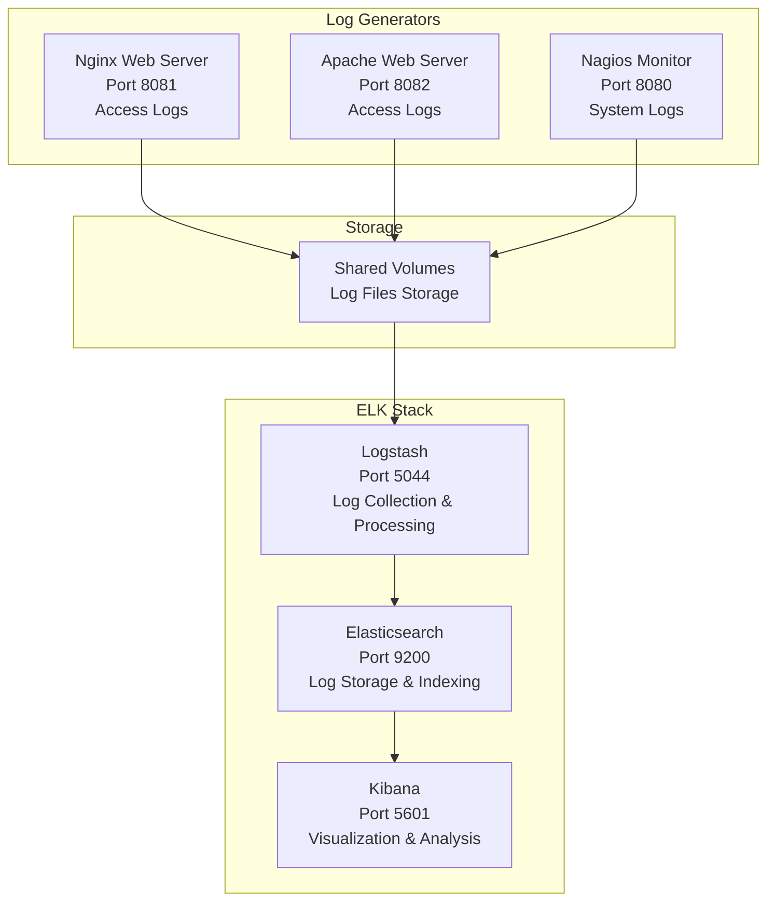

# 📊 **ELK Stack with Web Services - Complete Log Analysis Lab**

## 🎯 **Learning Objectives**

By the end of this lab, you will understand:
- **ELK Stack architecture** - Elasticsearch, Logstash, Kibana
- **Real-time log processing** and visualization
- **Log aggregation** from multiple web services
- **Kibana dashboard creation** and log analysis
- **Production log management** best practices
- **Troubleshooting** using centralized logs

---

## 📚 **What is ELK Stack?**

**ELK** is a powerful log analysis platform consisting of:

### **🔍 Elasticsearch**
- **Search engine** - Stores and indexes logs
- **Distributed** - Scales across multiple servers
- **Real-time** - Instant search and aggregation
- **RESTful API** - Easy integration

### **⚙️ Logstash**
- **Data processor** - Collects, transforms, ships logs
- **Input plugins** - Files, beats, databases, APIs
- **Filter plugins** - Parse, enrich, transform data
- **Output plugins** - Send to Elasticsearch, files, etc.

### **📊 Kibana**
- **Visualization** - Charts, graphs, dashboards
- **Discovery** - Search and explore logs
- **Analytics** - Real-time data analysis
- **Alerting** - Monitor and notify on patterns

---

## 🏗️ **Lab Architecture**



---

## 🚀 **Quick Start Guide**

### **Step 1: Start ELK Stack**
```bash
# Start all services
docker-compose up -d

# Verify containers
docker-compose ps
```

### **Step 2: Wait for Elasticsearch**
```bash
# Check Elasticsearch health
curl http://localhost:9200/_cluster/health
```

### **Step 3: Generate Log Data**
```bash
# Generate traffic
./generate-traffic.sh

# Or manually
for i in {1..20}; do 
  curl http://localhost:8081
  curl http://localhost:8082
done
```

---

## 📊 **Service Access Points**

| Service | URL | Purpose |
|---------|-----|---------|
| **📊 Kibana** | http://localhost:5601 | Log visualization |
| **🔍 Elasticsearch** | http://localhost:9200 | Search API |
| **🌐 Nginx** | http://localhost:8081 | Test web server |
| **🌐 Apache** | http://localhost:8082 | Test web server |
| **🔍 Nagios** | http://localhost:8080 | Monitoring (admin/nagios) |

---

## 🎯 **Hands-On ELK Exercises**

### **Exercise 1: Set Up Kibana**

1. **Access Kibana:** http://localhost:5601
2. **Create Index Pattern:**
   - Go to **Management** → **Index Patterns**
   - Create pattern: `web-logs-*`
   - Select **@timestamp** as time field
3. **View Logs:** Go to **Discover**

### **Exercise 2: Search and Filter**

```bash
# Try these searches in Kibana:
response:404          # Find 404 errors
response:200          # Successful requests
request:"/test*"      # Specific URLs
bytes:>1000          # Large responses
```

### **Exercise 3: Create Visualizations**

1. **Response Code Pie Chart:**
   - **Visualize** → **Pie chart**
   - **Buckets:** Terms on response.keyword
   - Save as "Response Codes"

2. **Requests Timeline:**
   - **Line chart**
   - **X-axis:** Date Histogram on @timestamp
   - Save as "Traffic Timeline"

### **Exercise 4: Build Dashboard**

1. **Create Dashboard**
2. **Add saved visualizations**
3. **Apply filters and save**

---

## 🔧 **Advanced Configuration**

### **Logstash Processing**
```ruby
# Current grok pattern processes logs into:
# - clientip: 172.18.0.1
# - method: GET
# - request: /index.html
# - response: 200
# - bytes: 612
```

### **Elasticsearch Management**
```bash
# Check indices
curl http://localhost:9200/_cat/indices?v

# View mapping
curl http://localhost:9200/web-logs-*/_mapping?pretty

# Cluster health
curl http://localhost:9200/_cluster/health?pretty
```

---

## 🚨 **Troubleshooting**

| Problem | Solution |
|---------|----------|
| **No data in Kibana** | Check logstash logs, generate more traffic |
| **Elasticsearch yellow** | Normal for single-node setup |
| **Slow performance** | Increase resources, optimize queries |

### **Diagnostic Commands**
```bash
# Check services
docker-compose ps
docker-compose logs elasticsearch
docker-compose logs logstash

# Test connectivity
curl http://localhost:9200/_cluster/health
curl http://localhost:9200/_cat/indices?v
```

---

## 🛑 **Cleanup**

```bash
# Stop services
docker-compose down

# Remove data
docker-compose down -v
```

---

## 📚 **Resources**

- [Elasticsearch Guide](https://www.elastic.co/guide/en/elasticsearch/reference/current/)
- [Logstash Reference](https://www.elastic.co/guide/en/logstash/current/)
- [Kibana User Guide](https://www.elastic.co/guide/en/kibana/current/)

---

## 🎉 **What You've Learned**

✅ **ELK Stack deployment** - Complete log analysis platform  
✅ **Real-time log processing** - Logstash parsing  
✅ **Data visualization** - Kibana dashboards  
✅ **Log search & analysis** - Complex queries  
✅ **Production concepts** - Scaling and maintenance  

*📊 Master log analysis with ELK Stack!*
