# 📊 **ELK Stack with Web Services - Complete Log Analysis Lab**

## 🎯 **Real-World Use Case: E-Commerce Website Monitoring**

Imagine you're running an **e-commerce website** with multiple services:
- **Frontend (Nginx)** - Serves customer-facing website
- **API Gateway (Apache)** - Handles product catalog, orders, payments
- **Monitoring System (Nagios)** - Tracks service health

### **The Business Problem:**
```
🛒 Black Friday Sale Day:
├── 📈 Traffic spikes to 10x normal volume
├── 🚨 Some customers report "page not loading"
├── 💳 Payment failures increase
├── 📞 Support team overwhelmed with calls
└── 💰 Revenue loss due to poor user experience
```

**Traditional Approach Problems:**
- **Scattered logs** across multiple servers
- **Manual log checking** - SSH to each server
- **No real-time visibility** - Issues discovered hours later
- **Difficult correlation** - Can't connect frontend errors to backend issues
- **Slow troubleshooting** - Takes hours to find root cause

### **ELK Stack Solution:**

```mermaid
graph TB
    subgraph "E-Commerce Platform"
        WEB[🌐 Nginx Frontend<br/>Customer requests]
        API[⚙️ Apache API<br/>Product/Payment APIs]
        MON[🔍 Nagios Monitor<br/>Health checks]
    end
    
    subgraph "ELK Stack - Real-time Intelligence"
        E[📊 Elasticsearch<br/>Stores 1M+ log entries<br/>Sub-second search]
        L[⚙️ Logstash<br/>Processes 1000+ logs/sec<br/>Enriches data]
        K[📈 Kibana<br/>Real-time dashboards<br/>Instant alerts]
    end
    
    WEB --> L
    API --> L
    MON --> L
    L --> E
    E --> K
    
    K --> ALERT[🚨 Instant Alerts<br/>- High error rates<br/>- Slow responses<br/>- Traffic spikes]
    K --> DASH[📊 Live Dashboards<br/>- Customer journey<br/>- API performance<br/>- Revenue impact]
```


**Business Benefits:**
- **🚀 Faster incident response** - Minutes instead of hours
- **💰 Revenue protection** - Catch issues before customers leave
- **📊 Data-driven decisions** - Real-time business metrics
- **🔍 Root cause analysis** - Trace problems across services
- **📈 Performance optimization** - Identify bottlenecks proactively

---

## 🎯 **Learning Objectives**

By the end of this lab, you will understand:
- **ELK Stack architecture** - How E, L, and K work together
- **Real-time log processing** - From generation to visualization
- **Log correlation** - Connecting events across services
- **Business intelligence** - Turning logs into actionable insights
- **Production deployment** - Scalable log management
- **Troubleshooting workflows** - Using ELK for incident response

---

## 📚 **What is ELK Stack? (Detailed Breakdown)**

### **🔍 E - Elasticsearch (The Brain)**
**What it does:** Distributed search and analytics engine
```json
{
  "timestamp": "2024-09-21T10:30:45Z",
  "clientip": "192.168.1.100",
  "method": "GET",
  "request": "/products/laptop",
  "response": 200,
  "bytes": 15420,
  "response_time": 0.245,
  "user_agent": "Chrome/91.0"
}
```

**Key Features:**
- **Indexing** - Organizes logs for lightning-fast search
- **Aggregations** - Calculates metrics (avg response time, error rates)
- **Clustering** - Scales across multiple servers
- **Near real-time** - Data available within 1 second

**Business Value:**
- Search through **millions of logs** in milliseconds
- Calculate **business KPIs** (conversion rates, revenue per hour)
- **Horizontal scaling** - Handle growing data volumes

### **⚙️ L - Logstash (The Processor)**
**What it does:** Data processing pipeline that transforms raw logs
```ruby
# Raw nginx log:
192.168.1.100 - - [21/Sep/2024:10:30:45 +0000] "GET /products/laptop HTTP/1.1" 200 15420

# After Logstash processing:
{
  "clientip": "192.168.1.100",
  "method": "GET", 
  "request": "/products/laptop",
  "response": 200,
  "bytes": 15420,
  "response_category": "success",
  "log_source": "nginx",
  "geoip": {"country": "US", "city": "New York"}
}
```

**Processing Pipeline:**
1. **INPUT** - Collect logs from files, databases, APIs
2. **FILTER** - Parse, enrich, transform data
3. **OUTPUT** - Send to Elasticsearch, files, alerts

**Business Value:**
- **Data normalization** - Consistent format across services
- **Real-time enrichment** - Add geographic, user context
- **Quality assurance** - Validate and clean data

### **📊 K - Kibana (The Eyes)**
**What it does:** Visualization and exploration interface
```
📈 Real-time Dashboards:
├── 🌍 Geographic traffic map
├── 📊 Response time trends  
├── 🚨 Error rate alerts
├── 💰 Revenue per minute
└── 👥 Active user count
```

**Key Features:**
- **Discover** - Search and explore logs interactively
- **Visualize** - Create charts, graphs, maps
- **Dashboard** - Combine visualizations for overview
- **Alerting** - Notify teams of critical issues

**Business Value:**
- **Executive dashboards** - Real-time business metrics
- **Operational visibility** - System health at a glance
- **Self-service analytics** - Teams can explore data independently

---

## 🏗️ **Lab Architecture & Data Flow**

```mermaid
graph TB
    subgraph "🌐 Web Services Layer"
        N[Nginx Container<br/>📝 Generates access logs<br/>🔗 Port 8081]
        A[Apache Container<br/>📝 Generates access logs<br/>🔗 Port 8082]
        NAG[Nagios Container<br/>📝 Generates system logs<br/>🔗 Port 8080]
    end
    
    subgraph "💾 Storage Layer"
        V[Shared Docker Volumes<br/>📁 /var/log/nginx/<br/>📁 /usr/local/apache2/logs/<br/>🔄 Real-time file watching]
    end
    
    subgraph "🔄 ELK Processing Layer"
        L[Logstash Container<br/>⚙️ Reads log files<br/>🔍 Parses with Grok patterns<br/>📊 Enriches data<br/>🔗 Port 5044]
        E[Elasticsearch Container<br/>💾 Stores processed logs<br/>🔍 Indexes for fast search<br/>📈 Aggregates metrics<br/>🔗 Port 9200]
        K[Kibana Container<br/>📊 Web interface<br/>🎨 Creates visualizations<br/>📋 Builds dashboards<br/>🔗 Port 5601]
    end
    
    N --> V
    A --> V
    NAG --> V
    V --> L
    L --> E
    E --> K
    
    style N fill:#e1f5fe
    style A fill:#e1f5fe
    style NAG fill:#fff3e0
    style V fill:#e0f2f1
    style L fill:#f3e5f5
    style E fill:#e8f5e8
    style K fill:#fff9c4
```



**Step-by-Step Data Journey:**
1. **🌐 Web Request** - User visits website
2. **📝 Log Generation** - Nginx/Apache write access log entry
3. **💾 File Storage** - Log written to shared volume
4. **👀 File Watching** - Logstash detects new log entry
5. **🔍 Parsing** - Logstash extracts fields (IP, URL, status)
6. **📊 Enrichment** - Adds metadata (response category, source)
7. **📤 Indexing** - Sends structured data to Elasticsearch
8. **💾 Storage** - Elasticsearch stores and indexes data
9. **📈 Visualization** - Kibana queries and displays data
10. **👁️ Monitoring** - Real-time dashboards update

---

## 🚀 **Complete Testing Guide - From Scratch**

### **Phase 1: Environment Setup & Verification**

```bash
# 1. Clone and navigate to project
git clone https://github.com/manikcloud/cloud-devops-learning-path.git
cd cloud-devops-learning-path/Section-2-DevOps/Session-10_Monitoring-Tools/05-nagios-elk

# 2. Start all services
echo "🚀 Starting ELK Stack..."
docker-compose up -d

# 3. Verify all containers are running
echo "📋 Checking container status..."
docker-compose ps

# Expected output: All containers should show "Up" status
# - elasticsearch (port 9200)
# - logstash (port 5044) 
# - kibana (port 5601)
# - nginx-target (port 8081)
# - apache-target (port 8082)
# - nagios-server (port 8080)
```

### **Phase 2: Wait for Services to Initialize**

```bash
# 4. Wait for Elasticsearch to be ready (critical step!)
echo "⏳ Waiting for Elasticsearch to initialize..."
timeout=300  # 5 minutes timeout
elapsed=0
while ! curl -s http://localhost:9200/_cluster/health | grep -q "yellow\|green"; do
  if [ $elapsed -ge $timeout ]; then
    echo "❌ Elasticsearch failed to start within 5 minutes"
    exit 1
  fi
  echo "   Still waiting... (${elapsed}s elapsed)"
  sleep 10
  elapsed=$((elapsed + 10))
done
echo "✅ Elasticsearch is ready!"

# 5. Verify Elasticsearch health
curl -s http://localhost:9200/_cluster/health?pretty
# Should show: "status" : "yellow" or "green"

# 6. Check if Kibana is accessible
echo "🔍 Checking Kibana availability..."
timeout=180  # 3 minutes for Kibana
elapsed=0
while ! curl -s http://localhost:5601/api/status | grep -q "available"; do
  if [ $elapsed -ge $timeout ]; then
    echo "⚠️  Kibana taking longer than expected, but continuing..."
    break
  fi
  echo "   Kibana starting... (${elapsed}s elapsed)"
  sleep 15
  elapsed=$((elapsed + 15))
done
echo "✅ Kibana should be ready at http://localhost:5601"
```

### **Phase 3: Generate Comprehensive Test Data**

```bash
# 7. Generate diverse web traffic patterns
echo "📊 Generating comprehensive test data..."

# Normal successful requests (200 responses)
echo "   → Generating normal traffic..."
for i in {1..25}; do
  curl -s http://localhost:8081/ > /dev/null
  curl -s http://localhost:8082/ > /dev/null
  echo -n "."
done
echo " ✅ Normal traffic complete"

# Different URL patterns
echo "   → Testing different endpoints..."
endpoints=("/" "/products" "/api/users" "/search" "/checkout" "/login" "/admin")
for endpoint in "${endpoints[@]}"; do
  for i in {1..5}; do
    curl -s "http://localhost:8081${endpoint}" > /dev/null
    curl -s "http://localhost:8082${endpoint}" > /dev/null
  done
done
echo " ✅ Endpoint testing complete"

# Generate 404 errors (client errors)
echo "   → Generating 404 errors..."
for i in {1..15}; do
  curl -s "http://localhost:8081/missing-page-${i}" > /dev/null
  curl -s "http://localhost:8082/not-found-${i}" > /dev/null
  echo -n "."
done
echo " ✅ 404 errors generated"

# Generate different file type requests
echo "   → Testing different file types..."
filetypes=(".css" ".js" ".png" ".jpg" ".pdf" ".xml" ".json")
for filetype in "${filetypes[@]}"; do
  for i in {1..3}; do
    curl -s "http://localhost:8081/assets/file${i}${filetype}" > /dev/null
    curl -s "http://localhost:8082/static/resource${i}${filetype}" > /dev/null
  done
done
echo " ✅ File type testing complete"

# Simulate high-traffic burst
echo "   → Simulating traffic burst..."
for i in {1..50}; do
  # Parallel requests to simulate concurrent users
  curl -s http://localhost:8081/products > /dev/null &
  curl -s http://localhost:8082/api/status > /dev/null &
  
  # Don't overwhelm the system
  if [ $((i % 10)) -eq 0 ]; then
    wait  # Wait for background jobs to complete
    echo -n " [${i}/50]"
  fi
done
wait
echo " ✅ Traffic burst complete"

echo "🎉 Test data generation complete!"
echo "📊 Total requests generated: ~200+ log entries"
```

### **Phase 4: Verify Log Processing**

```bash
# 8. Check Logstash is processing logs
echo "🔍 Verifying log processing..."
docker logs logstash --tail 20

# 9. Verify logs are reaching Elasticsearch
echo "📊 Checking Elasticsearch indices..."
curl -s "http://localhost:9200/_cat/indices?v" | grep web-logs

# 10. Sample the processed data
echo "🔍 Sampling processed log data..."
curl -s "http://localhost:9200/web-logs-*/_search?pretty&size=3" | jq '.hits.hits[]._source'

# Expected fields in processed logs:
# - clientip: IP address
# - method: HTTP method (GET, POST)
# - request: Requested URL
# - response: HTTP status code
# - bytes: Response size
# - log_source: nginx or apache
# - response_category: success, client_error, etc.
```

### **Phase 5: Kibana Setup & Verification**

```bash
# 11. Access Kibana and set up index pattern
echo "🎨 Setting up Kibana..."
echo "📋 Manual steps required:"
echo "   1. Open http://localhost:5601 in your browser"
echo "   2. Wait for Kibana to fully load (may take 2-3 minutes)"
echo "   3. Go to Management → Stack Management → Index Patterns"
echo "   4. Click 'Create index pattern'"
echo "   5. Enter pattern: web-logs-*"
echo "   6. Click 'Next step'"
echo "   7. Select '@timestamp' as time field"
echo "   8. Click 'Create index pattern'"
echo ""
echo "✅ After setup, go to Discover to see your logs!"
```

### **Phase 6: Advanced Testing & Validation**

```bash
# 12. Continuous traffic generation (run in background)
echo "🔄 Starting continuous traffic generation..."
cat > continuous_traffic.sh << 'EOF'
#!/bin/bash
echo "🔄 Continuous traffic generator started..."
counter=1
while true; do
  # Mix of successful and error requests
  curl -s http://localhost:8081/ > /dev/null
  curl -s http://localhost:8082/api/health > /dev/null
  
  # Occasional errors
  if [ $((counter % 10)) -eq 0 ]; then
    curl -s http://localhost:8081/error-page > /dev/null
  fi
  
  # Different request patterns
  case $((counter % 4)) in
    0) curl -s http://localhost:8081/products > /dev/null ;;
    1) curl -s http://localhost:8082/users > /dev/null ;;
    2) curl -s http://localhost:8081/search?q=test > /dev/null ;;
    3) curl -s http://localhost:8082/orders > /dev/null ;;
  esac
  
  echo "Generated request batch $counter"
  counter=$((counter + 1))
  sleep 2
done
EOF

chmod +x continuous_traffic.sh
./continuous_traffic.sh &
TRAFFIC_PID=$!
echo "🔄 Continuous traffic running (PID: $TRAFFIC_PID)"
echo "   Stop with: kill $TRAFFIC_PID"

# 13. Real-time monitoring commands
echo "📊 Real-time monitoring commands:"
echo "   Watch log count: watch 'curl -s http://localhost:9200/_cat/count/web-logs-*'"
echo "   Monitor processing: docker logs -f logstash"
echo "   Check cluster health: watch 'curl -s http://localhost:9200/_cluster/health?pretty'"
```

### **Phase 7: Validation Checklist**

```bash
# 14. Complete validation checklist
echo "✅ Validation Checklist:"
echo "   □ All containers running: $(docker-compose ps | grep -c 'Up')/6 containers"
echo "   □ Elasticsearch healthy: $(curl -s http://localhost:9200/_cluster/health | grep -o '"status":"[^"]*"')"
echo "   □ Indices created: $(curl -s http://localhost:9200/_cat/indices | grep -c web-logs)"
echo "   □ Logs processed: $(curl -s http://localhost:9200/web-logs-*/_count | jq '.count') entries"
echo "   □ Kibana accessible: http://localhost:5601"
echo "   □ Nagios accessible: http://localhost:8080 (admin/nagios)"
echo ""
echo "🎯 Success Criteria:"
echo "   ✅ Log count > 100 entries"
echo "   ✅ Multiple response codes (200, 404)"
echo "   ✅ Both nginx and apache logs present"
echo "   ✅ Real-time updates in Kibana"
```

---

## 📊 **Understanding the For Loop Testing Strategy**

### **Why We Use For Loops for Testing:**

```bash
# Simple loop explanation:
for i in {1..20}; do
  curl http://localhost:8081
  sleep 1
done
```

**What this accomplishes:**
1. **Volume Testing** - Generates sufficient data for analysis
2. **Pattern Recognition** - Creates predictable log patterns
3. **Performance Testing** - Tests system under load
4. **Data Variety** - Different URLs, response codes, timing

### **Advanced Loop Patterns:**

```bash
# 1. Error Rate Testing
for i in {1..100}; do
  if [ $((i % 5)) -eq 0 ]; then
    # Every 5th request is an error (20% error rate)
    curl -s http://localhost:8081/missing > /dev/null
  else
    # Normal successful request
    curl -s http://localhost:8081/ > /dev/null
  fi
done

# 2. Load Burst Simulation
for burst in {1..5}; do
  echo "Starting burst $burst..."
  for i in {1..20}; do
    # Parallel requests to simulate concurrent users
    curl -s http://localhost:8081/ > /dev/null &
    curl -s http://localhost:8082/ > /dev/null &
  done
  wait  # Wait for all background jobs
  echo "Burst $burst complete, cooling down..."
  sleep 10
done

# 3. User Journey Simulation
users=("user1" "user2" "user3" "user4" "user5")
for user in "${users[@]}"; do
  echo "Simulating journey for $user..."
  # Typical e-commerce user journey
  curl -s "http://localhost:8081/?user=$user" > /dev/null          # Homepage
  curl -s "http://localhost:8081/products?user=$user" > /dev/null  # Browse products
  curl -s "http://localhost:8081/search?q=laptop&user=$user" > /dev/null  # Search
  curl -s "http://localhost:8081/product/123?user=$user" > /dev/null       # View product
  curl -s "http://localhost:8081/cart/add?user=$user" > /dev/null          # Add to cart
  curl -s "http://localhost:8081/checkout?user=$user" > /dev/null          # Checkout
  sleep 2
done
```

### **What Each Loop Tests:**

| Loop Type | Purpose | Business Value |
|-----------|---------|----------------|
| **Volume Loop** | Generate sufficient data | Ensure system handles normal traffic |
| **Error Loop** | Test error handling | Validate error tracking and alerting |
| **Burst Loop** | Simulate traffic spikes | Test scalability and performance |
| **Journey Loop** | Realistic user behavior | Understand customer experience |
| **Continuous Loop** | Long-term stability | Monitor system over time |

---

## 🎉 **What You've Accomplished**

After completing this lab, you have:

✅ **Built a Production ELK Stack** - Complete log analysis platform  
✅ **Processed Real-time Data** - From generation to visualization  
✅ **Created Business Intelligence** - Turned logs into insights  
✅ **Mastered Troubleshooting** - Used logs to solve problems  
✅ **Understood Scalability** - Concepts for production deployment  
✅ **Gained DevOps Skills** - Essential monitoring and observability  

**Real-World Applications:**
- **E-commerce monitoring** - Track customer behavior and performance
- **API analytics** - Monitor service health and usage patterns  
- **Security analysis** - Detect suspicious activities and attacks
- **Performance optimization** - Identify bottlenecks and improvements
- **Business intelligence** - Revenue tracking and user analytics

*📊 You're now ready to implement ELK stack for any production system!*
