# 📊 Session 10: Comprehensive Monitoring & Observability Guide

<div align="center">


**📈 Monitor Systems | 🔍 Troubleshoot Issues | 📊 Visualize Data | 🚨 Alert on Problems**

</div>

---

## 🎯 Learning Path Integration


---

## 🧠 Why Monitoring Matters

### **The Problem Without Monitoring**

```mermaid
graph TB
    subgraph "Without Monitoring - Blind Operations"
        APP1[Your Application]
        DB1[Database]
        SERVER1[Web Server]
        
        PROBLEMS[❌ Problems:<br/>• System crashes unexpectedly<br/>• Performance degrades slowly<br/>• Users complain before you know<br/>• No data for troubleshooting<br/>• Reactive instead of proactive]
        
        APP1 -.->|Unknown Status| PROBLEMS
        DB1 -.->|Unknown Status| PROBLEMS
        SERVER1 -.->|Unknown Status| PROBLEMS
    end
    
    style APP1 fill:#ffebee
    style DB1 fill:#ffebee
    style SERVER1 fill:#ffebee
    style PROBLEMS fill:#ffcdd2
```



### **The Solution: Comprehensive Monitoring**

```mermaid
graph TB
    subgraph "With Monitoring - Full Visibility"
        APP2[Your Application]
        DB2[Database]
        SERVER2[Web Server]
        
        MONITOR[📊 Monitoring Stack]
        METRICS[📈 Metrics]
        LOGS[📝 Logs]
        ALERTS[🚨 Alerts]
        DASHBOARDS[📊 Dashboards]
        
        APP2 --> MONITOR
        DB2 --> MONITOR
        SERVER2 --> MONITOR
        
        MONITOR --> METRICS
        MONITOR --> LOGS
        MONITOR --> ALERTS
        MONITOR --> DASHBOARDS
        
        BENEFITS[✅ Benefits:<br/>• Proactive issue detection<br/>• Performance optimization<br/>• Root cause analysis<br/>• Capacity planning<br/>• Better user experience]
        
        DASHBOARDS --> BENEFITS
    end
    
    style MONITOR fill:#4caf50
    style METRICS fill:#2196f3
    style LOGS fill:#ff9800
    style ALERTS fill:#f44336
    style DASHBOARDS fill:#9c27b0
    style BENEFITS fill:#c8e6c9
```



---

## 🔧 The Three Pillars of Observability

```mermaid
graph TD
    subgraph "Observability Pillars"
        A[📊 METRICS<br/>Numbers & Measurements]
        B[📝 LOGS<br/>Event Records]
        C[🔍 TRACES<br/>Request Journey]
    end
    
    subgraph "What Each Provides"
        A --> A1[CPU Usage: 85%<br/>Memory: 2.1GB<br/>Response Time: 250ms<br/>Error Rate: 0.5%]
        B --> B1[2024-01-15 10:30:15 ERROR<br/>Database connection failed<br/>User: john@example.com<br/>Action: login_attempt]
        C --> C1[Request Flow:<br/>API Gateway → Service A<br/>→ Database → Service B<br/>→ Response: 450ms total]
    end
    
    style A fill:#2196f3
    style B fill:#ff9800
    style C fill:#4caf50
    style A1 fill:#e3f2fd
    style B1 fill:#fff3e0
    style C1 fill:#e8f5e8
```



---

## 🛠️ Complete Monitoring Stack Architecture

```mermaid
graph TB
    subgraph "Application Layer"
        APP[Web Application]
        API[API Services]
        DB[(Database)]
    end
    
    subgraph "Collection Layer"
        PROM[Prometheus<br/>📊 Metrics]
        FLUENTD[Fluentd<br/>📝 Log Collection]
        JAEGER[Jaeger<br/>🔍 Tracing]
    end
    
    subgraph "Storage Layer"
        TSDB[(Time Series DB)]
        ELASTIC[(Elasticsearch)]
        TRACE_DB[(Trace Storage)]
    end
    
    subgraph "Visualization Layer"
        GRAFANA[Grafana<br/>📊 Dashboards]
        KIBANA[Kibana<br/>📝 Log Analysis]
        JAEGER_UI[Jaeger UI<br/>🔍 Trace Viewer]
    end
    
    subgraph "Alerting Layer"
        ALERT[AlertManager<br/>🚨 Notifications]
        SLACK[Slack]
        EMAIL[Email]
        PAGER[PagerDuty]
    end
    
    APP --> PROM
    API --> PROM
    DB --> PROM
    
    APP --> FLUENTD
    API --> FLUENTD
    DB --> FLUENTD
    
    APP --> JAEGER
    API --> JAEGER
    
    PROM --> TSDB
    FLUENTD --> ELASTIC
    JAEGER --> TRACE_DB
    
    TSDB --> GRAFANA
    ELASTIC --> KIBANA
    TRACE_DB --> JAEGER_UI
    
    PROM --> ALERT
    ALERT --> SLACK
    ALERT --> EMAIL
    ALERT --> PAGER
    
    style PROM fill:#e6522c
    style GRAFANA fill:#f46800
    style ELASTIC fill:#005571
    style KIBANA fill:#005571
```



---

## 🚀 Quick Start with Existing Projects

### **🎯 Option 1: Complete Stack (Recommended)**
```bash
# Navigate to complete stack
cd 04-complete-stack

# Start everything
./start.sh

# Access services
echo "Grafana: http://localhost:3000 (admin/admin123)"
echo "Prometheus: http://localhost:9090"
```

### **🎯 Option 2: ELK Stack Project**
```bash
# Navigate to ELK project
cd 05-elk-project

# Start ELK stack
./start-elk.sh

# Generate sample logs
./generate-logs.sh

# Access Kibana
echo "Kibana: http://localhost:5601"
```

### **🎯 Option 3: Individual Tools**
```bash
# Grafana only
cd 01-grafana
docker-compose up -d

# DataDog integration
cd 02-datadog
docker-compose up -d

# Nagios monitoring
cd 03-nagios
docker-compose up -d
```

---

## 📈 Prometheus & Grafana Deep Dive

### **Prometheus Architecture**


### **Key Prometheus Queries for Students**

```promql
# CPU Usage
100 - (avg by(instance) (irate(node_cpu_seconds_total{mode="idle"}[5m])) * 100)

# Memory Usage
(node_memory_MemTotal_bytes - node_memory_MemAvailable_bytes) / node_memory_MemTotal_bytes * 100

# Disk Usage
(node_filesystem_size_bytes - node_filesystem_avail_bytes) / node_filesystem_size_bytes * 100

# HTTP Request Rate
rate(http_requests_total[5m])

# Error Rate
rate(http_requests_total{status=~"5.."}[5m]) / rate(http_requests_total[5m]) * 100
```

---

## 📝 ELK Stack for Log Management

### **ELK Stack Data Flow**


### **Log Processing Pipeline**

```mermaid
graph LR
    subgraph "Raw Logs"
        RAW[2024-01-15 10:30:15 ERROR<br/>Database connection failed<br/>User: john@example.com]
    end
    
    subgraph "Logstash Processing"
        PARSE[Parse Timestamp]
        EXTRACT[Extract Fields]
        ENRICH[Add Metadata]
        FILTER[Apply Filters]
    end
    
    subgraph "Structured Output"
        JSON[{<br/>"timestamp": "2024-01-15T10:30:15Z",<br/>"level": "ERROR",<br/>"message": "Database connection failed",<br/>"user": "john@example.com",<br/>"service": "auth-service"<br/>}]
    end
    
    RAW --> PARSE
    PARSE --> EXTRACT
    EXTRACT --> ENRICH
    ENRICH --> FILTER
    FILTER --> JSON
    
    style RAW fill:#ffebee
    style JSON fill:#e8f5e8
```

---

## 🚨 Alerting Strategy

### **Alert Severity Pyramid**

```mermaid
graph TD
    subgraph "Alert Pyramid"
        CRITICAL[🔴 CRITICAL<br/>System Down<br/>Immediate Response]
        WARNING[🟡 WARNING<br/>Performance Issues<br/>Monitor Closely]
        INFO[🔵 INFO<br/>General Events<br/>For Awareness]
    end
    
    subgraph "Response Actions"
        CRITICAL --> PAGE[📱 Page On-Call Engineer]
        WARNING --> SLACK[💬 Slack Notification]
        INFO --> LOG[📝 Log for Review]
    end
    
    subgraph "Examples"
        PAGE --> EX1[• Server crashed<br/>• Database unreachable<br/>• 50% error rate]
        SLACK --> EX2[• High CPU usage<br/>• Slow response times<br/>• Disk space low]
        LOG --> EX3[• Deployment completed<br/>• User logged in<br/>• Backup finished]
    end
    
    style CRITICAL fill:#f44336
    style WARNING fill:#ff9800
    style INFO fill:#2196f3
```



---

## 📊 Real-World Monitoring Scenarios

### **Scenario 1: E-commerce Website Monitoring**

```mermaid
graph TB
    subgraph "User Journey Monitoring"
        USER[👤 User] --> LB[Load Balancer]
        LB --> WEB[Web Server]
        WEB --> API[API Gateway]
        API --> AUTH[Auth Service]
        API --> CART[Cart Service]
        API --> PAY[Payment Service]
        CART --> DB[(Database)]
        PAY --> BANK[Bank API]
    end
    
    subgraph "Key Metrics to Monitor"
        METRICS[📊 Critical Metrics:<br/>• Page load time < 2s<br/>• API response time < 500ms<br/>• Error rate < 0.1%<br/>• Payment success rate > 99%<br/>• Database connections < 80%]
    end
    
    subgraph "Alerts"
        ALERTS[🚨 Alert Conditions:<br/>• Page load > 5s → Critical<br/>• Payment failures > 1% → Critical<br/>• High cart abandonment → Warning<br/>• Database slow queries → Warning]
    end
    
    WEB --> METRICS
    API --> METRICS
    METRICS --> ALERTS
    
    style USER fill:#e1f5fe
    style METRICS fill:#fff3e0
    style ALERTS fill:#ffebee
```



### **Scenario 2: Microservices Architecture**

```mermaid
graph TD
    subgraph "Service Mesh Monitoring"
        GATEWAY[API Gateway] --> USER_SVC[User Service]
        GATEWAY --> ORDER_SVC[Order Service]
        GATEWAY --> PRODUCT_SVC[Product Service]
        
        ORDER_SVC --> PAYMENT_SVC[Payment Service]
        ORDER_SVC --> INVENTORY_SVC[Inventory Service]
        ORDER_SVC --> NOTIFICATION_SVC[Notification Service]
    end
    
    subgraph "Distributed Tracing"
        TRACE[🔍 Trace ID: abc123<br/>Request Journey:<br/>Gateway (50ms) →<br/>Order Service (120ms) →<br/>Payment Service (300ms) →<br/>Total: 470ms]
    end
    
    subgraph "Service Health"
        HEALTH[💚 Service Health:<br/>✅ User Service: Healthy<br/>✅ Order Service: Healthy<br/>⚠️ Payment Service: Slow<br/>❌ Inventory Service: Down]
    end
    
    GATEWAY --> TRACE
    ORDER_SVC --> HEALTH
    
    style TRACE fill:#e8f5e8
    style HEALTH fill:#fff3e0
```

---

## 🎯 Hands-On Learning Path

### **Step 1: Start with Complete Stack**
```bash
cd 04-complete-stack
./start.sh
```

### **Step 2: Explore Individual Tools**
```bash
# Try each monitoring tool
cd 01-grafana && docker-compose up -d
cd ../02-datadog && docker-compose up -d
cd ../03-nagios && docker-compose up -d
```

### **Step 3: Deep Dive into ELK**
```bash
cd 05-elk-project
./start-elk.sh
./generate-logs.sh
```

### **Step 4: Test Everything**
```bash
# Run comprehensive tests
./test-all.sh
```

---

## 🎓 Learning Outcomes

By completing this session, students will:

- [ ] ✅ **Understand the three pillars** of observability (metrics, logs, traces)
- [ ] ✅ **Set up monitoring infrastructure** using Prometheus and Grafana
- [ ] ✅ **Implement log management** with ELK Stack
- [ ] ✅ **Create meaningful dashboards** for system visibility
- [ ] ✅ **Configure intelligent alerting** to prevent issues
- [ ] ✅ **Analyze system performance** using monitoring data
- [ ] ✅ **Troubleshoot issues** using observability tools
- [ ] ✅ **Plan capacity** based on monitoring insights

---

## 🚀 Integration with Course Sessions

### **Previous Sessions Integration**


### **Career Applications**
- **DevOps Engineer** - Implement monitoring for CI/CD pipelines
- **Site Reliability Engineer** - Ensure system reliability and performance
- **Cloud Architect** - Design observable cloud architectures
- **Platform Engineer** - Build monitoring platforms for development teams

---

## 📚 Additional Resources

### **Documentation Links**
- [Prometheus Documentation](https://prometheus.io/docs/)
- [Grafana Documentation](https://grafana.com/docs/)
- [Elasticsearch Guide](https://www.elastic.co/guide/)
- [Kubernetes Monitoring](https://kubernetes.io/docs/tasks/debug-application-cluster/resource-usage-monitoring/)

### **Best Practices**
- **Golden Signals**: Latency, Traffic, Errors, Saturation
- **SLI/SLO Framework**: Define and measure service reliability
- **Alert Fatigue Prevention**: Meaningful alerts only
- **Dashboard Design**: Clear, actionable visualizations

---

## 🆘 Troubleshooting Guide

### **Common Issues & Solutions**

1. **Services not starting:**
   ```bash
   # Check Docker status
   docker ps -a
   
   # Check logs
   docker-compose logs <service-name>
   
   # Restart services
   docker-compose restart
   ```

2. **Port conflicts:**
   ```bash
   # Check what's using ports
   netstat -tulpn | grep <port>
   
   # Kill processes if needed
   sudo kill -9 <pid>
   ```

3. **Memory issues:**
   ```bash
   # Check system resources
   free -h
   df -h
   
   # Clean up Docker
   docker system prune -f
   ```

---

*Ready to master monitoring and observability? Start with the [Complete Stack](./04-complete-stack/) and work through each project!* 🚀

---

*Part of the [Cloud DevOps Learning Path](../../README.md) | Previous: [Session 9 - OpenShift](../Session-9_OpenShift/) | Next: [Final Project](../Session-11_Final-Project/)*
