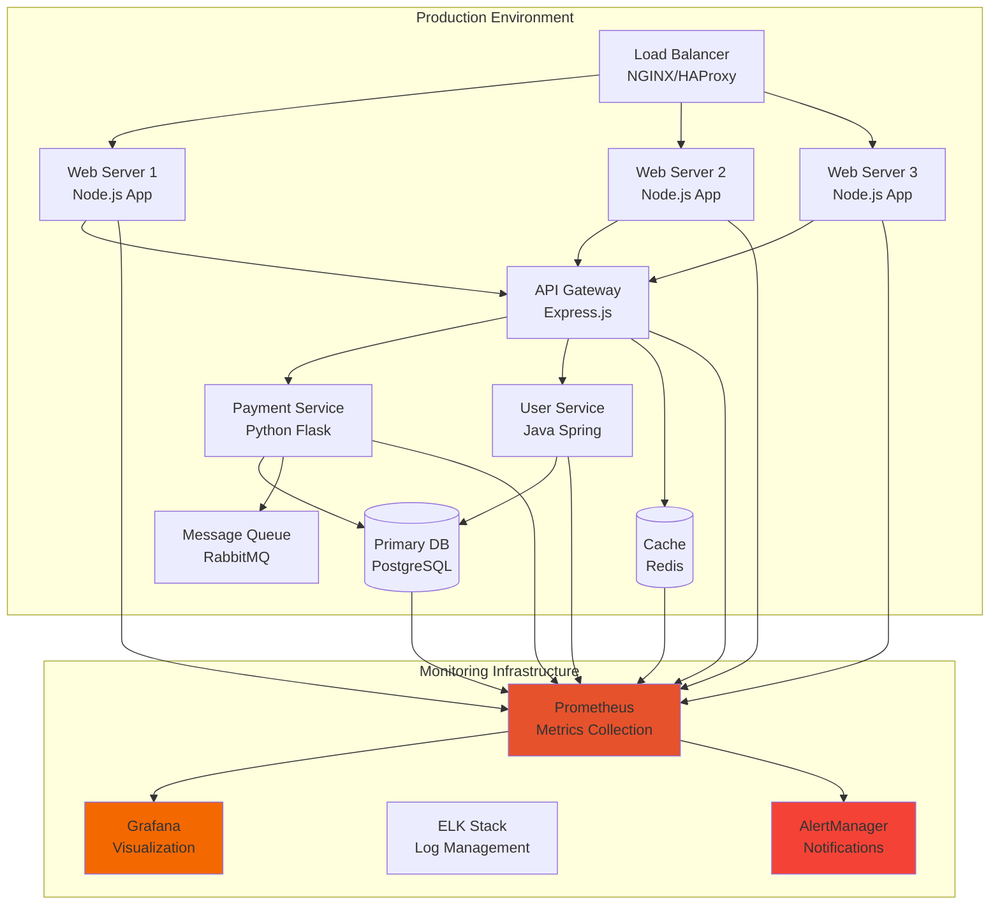
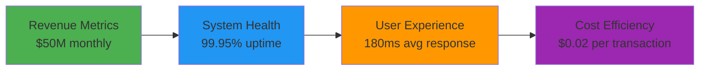
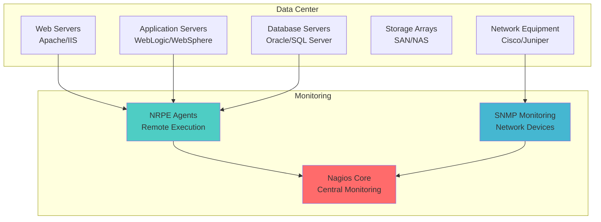
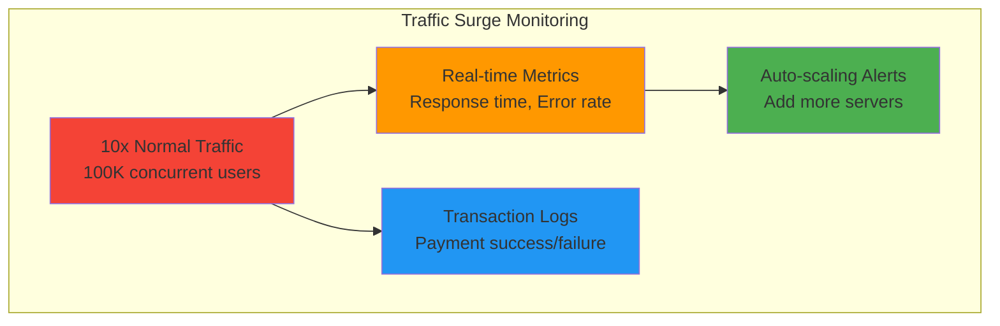
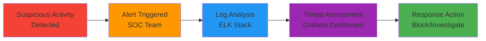

# 📊 Session 10: Detailed Project Explanations

## 🎯 Overall Session Goals

### **What We're Achieving**
- **Build production-ready monitoring infrastructure** for modern applications
- **Learn industry-standard monitoring tools** used by Fortune 500 companies
- **Implement observability best practices** for microservices and cloud-native apps
- **Create actionable alerting systems** that prevent downtime
- **Master log analysis** for troubleshooting and security monitoring

### **Real-World Application**
This session simulates monitoring a **modern e-commerce platform** with:
- **Frontend**: React web application
- **Backend**: Microservices API (Node.js/Python)
- **Database**: PostgreSQL/MongoDB clusters
- **Infrastructure**: Kubernetes on AWS/Azure
- **Traffic**: 10,000+ concurrent users, 1M+ daily transactions

---

## 🏗️ Project 1: Complete Monitoring Stack (04-complete-stack)

### **🎯 Project Goal**
Build a **comprehensive monitoring solution** that provides 360-degree visibility into application performance, infrastructure health, and user experience.

### **🏢 Business Scenario**
You're the **DevOps Engineer** at a growing fintech startup. The company processes $50M+ in transactions monthly and needs enterprise-grade monitoring to:
- **Ensure 99.9% uptime** for payment processing
- **Detect fraud patterns** in real-time
- **Scale infrastructure** based on traffic patterns
- **Meet compliance requirements** (SOX, PCI-DSS)

### **🖥️ Server Architecture**


### **💼 Workload Characteristics**
- **Traffic Pattern**: 1,000 RPS during business hours, 100 RPS overnight
- **Peak Load**: Black Friday - 10,000 RPS, $1M+ transactions/hour
- **Geographic Distribution**: US (60%), Europe (25%), Asia (15%)
- **Critical Services**: Payment processing, user authentication, fraud detection
- **SLA Requirements**: 99.9% uptime, <200ms API response time

### **📊 What We Monitor**

#### **Application Metrics**
```promql
# Transaction success rate
rate(payment_transactions_total{status="success"}[5m]) / rate(payment_transactions_total[5m]) * 100

# API response time (95th percentile)
histogram_quantile(0.95, rate(http_request_duration_seconds_bucket[5m]))

# Error rate by service
rate(http_requests_total{status=~"5.."}[5m]) / rate(http_requests_total[5m]) * 100
```

#### **Infrastructure Metrics**
- **CPU Usage**: Target <70% average, alert >85%
- **Memory Usage**: Target <80%, alert >90%
- **Disk I/O**: Monitor IOPS, latency, queue depth
- **Network**: Bandwidth utilization, packet loss, connection counts

#### **Business Metrics**
- **Revenue per minute**: Real-time transaction value
- **User conversion rate**: Signup to first purchase
- **Cart abandonment rate**: E-commerce funnel analysis
- **Fraud detection rate**: Security monitoring

### **🚨 Alerting Strategy**
```yaml
# Critical Alerts (Page immediately)
- Payment service down (>1 minute)
- Database connection pool exhausted
- Error rate >5% for >2 minutes
- Response time >1 second for >5 minutes

# Warning Alerts (Slack notification)
- CPU usage >80% for >10 minutes
- Memory usage >85% for >15 minutes
- Disk space <20%
- Queue depth >1000 messages
```

---

## 📊 Project 2: Grafana Dashboards (01-grafana)

### **🎯 Project Goal**
Master **data visualization** and create executive-level dashboards that tell the story of your infrastructure and application performance.

### **🏢 Business Scenario**
You're presenting to the **CTO and executive team** monthly. They need clear, actionable insights about:
- **System reliability** and uptime trends
- **Performance improvements** from infrastructure investments
- **Cost optimization** opportunities
- **Capacity planning** for next quarter's growth

### **📊 Dashboard Types We Build**

#### **Executive Dashboard**


#### **Operations Dashboard**
- **Real-time system status** - Green/Yellow/Red health indicators
- **Performance trends** - Response times, throughput, error rates
- **Resource utilization** - CPU, memory, disk, network across all servers
- **Alert summary** - Current issues and their severity

#### **Application Dashboard**
- **User journey metrics** - Login success, page load times, conversion rates
- **API performance** - Endpoint response times, success rates, payload sizes
- **Database performance** - Query times, connection pools, slow queries
- **Cache efficiency** - Hit rates, eviction rates, memory usage

### **🎨 Visualization Best Practices**
- **Single Stat Panels** - Key metrics at a glance (uptime, revenue, users)
- **Time Series Graphs** - Trends over time (response times, error rates)
- **Heatmaps** - Pattern recognition (traffic by hour/day)
- **Gauge Charts** - Current status vs targets (CPU, memory usage)

---

## 🐕 Project 3: DataDog Integration (02-datadog)

### **🎯 Project Goal**
Implement **enterprise-grade monitoring** with advanced features like APM (Application Performance Monitoring), distributed tracing, and AI-powered anomaly detection.

### **🏢 Business Scenario**
Your company is **scaling rapidly** (Series B funding, 500% user growth). You need enterprise monitoring that provides:
- **Distributed tracing** across 50+ microservices
- **AI-powered anomaly detection** for proactive issue resolution
- **Custom business metrics** for product and marketing teams
- **Compliance reporting** for SOC 2 and ISO 27001 audits

### **🔬 Advanced Monitoring Features**

#### **Application Performance Monitoring (APM)**
```python
# Instrumented Flask application
from datadog import initialize, statsd
from flask import Flask, request
import time
import random

app = Flask(__name__)

# DataDog configuration
initialize(
    api_key='your-api-key',
    app_key='your-app-key'
)

@app.route('/api/payment')
def process_payment():
    start_time = time.time()
    
    # Simulate payment processing
    processing_time = random.uniform(0.1, 0.5)
    time.sleep(processing_time)
    
    # Custom business metrics
    statsd.increment('payment.processed', 
                    tags=['method:credit_card', 'region:us-east'])
    statsd.histogram('payment.amount', 
                    random.uniform(10, 1000),
                    tags=['currency:usd'])
    
    # Performance metrics
    response_time = time.time() - start_time
    statsd.histogram('api.response_time', response_time,
                    tags=['endpoint:payment'])
    
    return {"status": "success", "transaction_id": "tx_123"}
```

#### **Distributed Tracing**
Track requests across microservices:
```
Request Journey (Trace ID: abc123):
├── API Gateway (50ms)
│   ├── Authentication Service (20ms)
│   ├── Payment Service (300ms)
│   │   ├── Fraud Detection (100ms)
│   │   ├── Bank API Call (180ms)
│   │   └── Database Write (20ms)
│   └── Notification Service (30ms)
└── Total Response Time: 450ms
```

### **🤖 AI-Powered Features**
- **Anomaly Detection**: Automatically detect unusual patterns in metrics
- **Forecasting**: Predict resource needs based on historical trends
- **Root Cause Analysis**: AI suggests likely causes for performance issues
- **Intelligent Alerting**: Reduce alert fatigue with ML-based filtering

---

## 🔍 Project 4: Nagios Traditional Monitoring (03-nagios)

### **🎯 Project Goal**
Understand **traditional infrastructure monitoring** and learn how modern tools evolved from legacy systems.

### **🏢 Business Scenario**
You're working at a **traditional enterprise** (bank, government, healthcare) with:
- **Legacy systems** running on physical servers
- **Strict compliance requirements** (HIPAA, SOX, PCI-DSS)
- **Change-resistant culture** preferring proven technologies
- **Hybrid infrastructure** mixing on-premises and cloud

### **🏛️ Traditional Infrastructure**


### **📋 Traditional Monitoring Checks**
```bash
# Host availability
define host {
    host_name               web-server-01
    address                 192.168.1.10
    check_command           check-host-alive
    max_check_attempts      3
    check_interval          5
    notification_interval   30
}

# Service checks
define service {
    host_name               web-server-01
    service_description     HTTP Service
    check_command           check_http
    max_check_attempts      3
    check_interval          5
}

# Database connectivity
define service {
    host_name               db-server-01
    service_description     Oracle Database
    check_command           check_oracle_health
    max_check_attempts      2
    check_interval          10
}
```

### **🔔 Traditional Alerting**
- **Email notifications** to on-call engineers
- **SMS alerts** for critical issues
- **Escalation policies** - L1 → L2 → L3 support
- **Maintenance windows** - Scheduled downtime handling

---

## 📝 Project 5: ELK Stack Log Management (05-elk-project)

### **🎯 Project Goal**
Master **centralized log management** for security monitoring, troubleshooting, and compliance reporting.

### **🏢 Business Scenario**
Your company faces **security and compliance challenges**:
- **SOC 2 audit** requires centralized log retention (1 year minimum)
- **Security team** needs real-time threat detection
- **DevOps team** needs faster troubleshooting capabilities
- **Legal team** needs audit trails for investigations

### **🔒 Security Use Cases**

#### **Threat Detection**
```json
# Suspicious login patterns
{
  "timestamp": "2024-01-15T10:30:15Z",
  "event_type": "authentication",
  "user": "admin",
  "source_ip": "192.168.1.100",
  "failed_attempts": 5,
  "time_window": "5_minutes",
  "alert_level": "high"
}

# SQL injection attempts
{
  "timestamp": "2024-01-15T10:35:22Z",
  "event_type": "web_request",
  "url": "/api/users?id=1' OR '1'='1",
  "source_ip": "203.0.113.45",
  "user_agent": "sqlmap/1.4.7",
  "alert_level": "critical"
}
```

#### **Compliance Logging**
```json
# Financial transaction audit trail
{
  "timestamp": "2024-01-15T10:40:33Z",
  "event_type": "financial_transaction",
  "transaction_id": "tx_789012",
  "user_id": "user_456",
  "amount": 1500.00,
  "currency": "USD",
  "payment_method": "credit_card",
  "merchant_id": "merchant_123",
  "compliance_flags": ["pci_dss", "sox"]
}
```

### **🔍 Log Analysis Workflows**

#### **Performance Troubleshooting**
```bash
# Find slow API endpoints
GET /logs-*/_search
{
  "query": {
    "bool": {
      "must": [
        {"range": {"response_time": {"gte": 1000}}},
        {"range": {"@timestamp": {"gte": "now-1h"}}}
      ]
    }
  },
  "aggs": {
    "slow_endpoints": {
      "terms": {"field": "endpoint.keyword"},
      "aggs": {
        "avg_response_time": {"avg": {"field": "response_time"}}
      }
    }
  }
}
```

#### **Error Pattern Analysis**
```bash
# Identify error spikes
GET /logs-*/_search
{
  "query": {
    "bool": {
      "must": [
        {"term": {"level": "ERROR"}},
        {"range": {"@timestamp": {"gte": "now-24h"}}}
      ]
    }
  },
  "aggs": {
    "errors_over_time": {
      "date_histogram": {
        "field": "@timestamp",
        "interval": "1h"
      }
    }
  }
}
```

### **📊 Log-Based Dashboards**
- **Security Dashboard**: Failed logins, suspicious IPs, attack patterns
- **Performance Dashboard**: Error rates, slow queries, response time trends
- **Business Dashboard**: User activity, feature usage, conversion funnels
- **Compliance Dashboard**: Audit trails, data access logs, retention policies

---

## 🎯 Integration Scenarios

### **Scenario 1: E-commerce Black Friday**


**Monitoring Strategy:**
- **Pre-event**: Load test monitoring setup, verify alert thresholds
- **During event**: Real-time dashboards, automated scaling, fraud detection
- **Post-event**: Performance analysis, cost optimization, lessons learned

### **Scenario 2: Security Incident Response**


**Response Workflow:**
1. **Detection**: Automated alerts from log analysis
2. **Investigation**: Centralized log search and correlation
3. **Assessment**: Security dashboards show attack scope
4. **Response**: Automated blocking, manual investigation
5. **Recovery**: System restoration, post-incident analysis

---

## 📈 Success Metrics

### **Technical KPIs**
- **MTTR (Mean Time To Recovery)**: <15 minutes for critical issues
- **MTTD (Mean Time To Detection)**: <2 minutes for system failures
- **Alert Accuracy**: >95% (minimize false positives)
- **Dashboard Load Time**: <3 seconds for all visualizations

### **Business KPIs**
- **Uptime**: 99.9% availability (8.76 hours downtime/year max)
- **Performance**: 95th percentile response time <200ms
- **Cost Efficiency**: Monitoring costs <2% of infrastructure budget
- **Compliance**: 100% audit trail coverage for financial transactions

### **Team Productivity**
- **Incident Resolution**: 50% faster with centralized monitoring
- **Proactive Issues**: 80% of problems detected before user impact
- **On-call Burden**: 60% reduction in false alerts
- **Knowledge Sharing**: Standardized dashboards across teams

---

*This comprehensive monitoring strategy ensures your applications are reliable, secure, and performant while meeting business and compliance requirements.* 🚀
