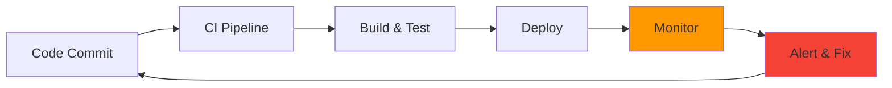
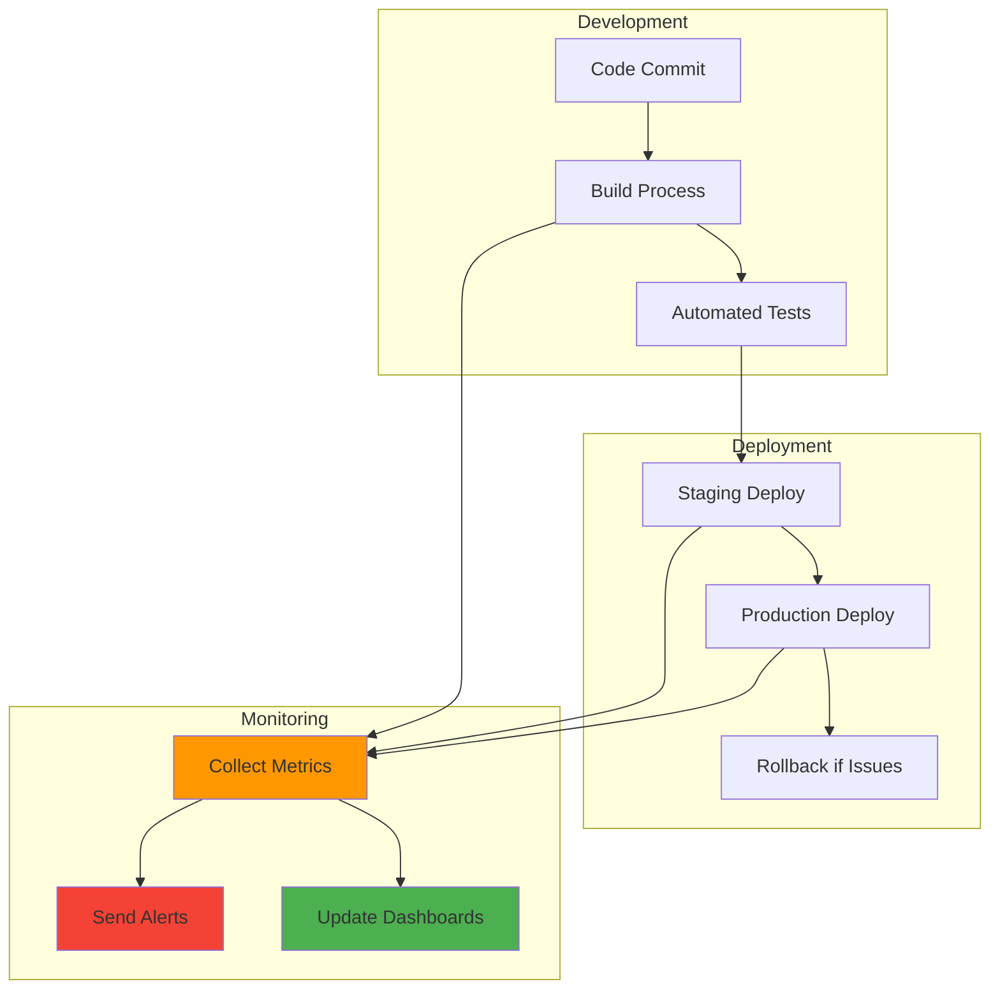

# 📊 Session 10: DevOps CI/CD Monitoring Tools

<div align="center">


**📈 Monitor CI/CD Pipelines | 📊 Track Deployments | 🚨 Alert on Issues**

</div>

---

## 🎯 DevOps CI/CD Monitoring Overview

In modern DevOps practices, monitoring is essential for:
- **CI/CD Pipeline Health** - Track build success rates, deployment times
- **Application Performance** - Monitor after deployment
- **Infrastructure Health** - Ensure systems can handle deployments
- **Security Compliance** - Log and audit all changes



---

## 🛠️ Available Monitoring Projects

### **📊 Complete Monitoring Stack (Recommended)**
```bash
cd 04-complete-stack
./setup.sh
```
**What you get:**
- **Prometheus** - Metrics collection
- **Grafana** - Dashboards and visualization
- **ELK Stack** - Log management
- **AlertManager** - Notifications

### **🔍 Traditional Monitoring**
```bash
cd 03-nagios
docker-compose up -d
```
**What you get:**
- **Nagios** - Infrastructure monitoring
- **SNMP** - Network device monitoring
- **Email alerts** - Traditional notifications

### **📝 Log Management**
```bash
cd 05-elk-project
./start-elk.sh
```
**What you get:**
- **Elasticsearch** - Log storage and search
- **Logstash** - Log processing
- **Kibana** - Log visualization

---

## 🚀 Quick Start for Students

### **Step 1: Start Complete Stack**
```bash
# Navigate to complete monitoring solution
cd 04-complete-stack

# One-command setup
./setup.sh

# Access monitoring tools
echo "Grafana: http://localhost:3000 (admin/admin123)"
echo "Prometheus: http://localhost:9090"
echo "Kibana: http://localhost:5601"
```

### **Step 2: Understand What You're Monitoring**
- **System Health** - CPU, memory, disk usage
- **Application Performance** - Response times, error rates
- **Deployment Success** - Build times, success rates
- **User Experience** - Page load times, availability

### **Step 3: Create Your First Dashboard**
1. Open Grafana: http://localhost:3000
2. Login: admin/admin123
3. Import dashboard ID: 1860 (Node Exporter)
4. Explore system metrics

---

## 📊 DevOps Monitoring Best Practices

### **What to Monitor in CI/CD**

#### **Build Pipeline Metrics**
```promql
# Build success rate
rate(jenkins_builds_success_total[5m]) / rate(jenkins_builds_total[5m]) * 100

# Average build time
avg(jenkins_build_duration_seconds)

# Failed deployments
rate(deployment_failures_total[1h])
```

#### **Application Health After Deployment**
```promql
# API response time
histogram_quantile(0.95, rate(http_request_duration_seconds_bucket[5m]))

# Error rate
rate(http_requests_total{status=~"5.."}[5m]) / rate(http_requests_total[5m]) * 100

# Service availability
up{job="web-service"}
```

### **Alert Strategy for DevOps**
```yaml
Critical Alerts (Immediate):
  - Deployment failed
  - Service down after deployment
  - Error rate > 5%

Warning Alerts (15 minutes):
  - Build time increased 50%
  - Response time > 1 second
  - High resource usage

Info Alerts (Email only):
  - Deployment completed
  - New version deployed
  - Performance improved
```

---

## 🔧 Monitoring Your DevOps Pipeline

### **CI/CD Pipeline Monitoring**


### **Key DevOps Metrics**
- **Deployment Frequency** - How often you deploy
- **Lead Time** - Code to production time
- **Mean Time to Recovery (MTTR)** - How fast you fix issues
- **Change Failure Rate** - Percentage of deployments causing issues

---

## 📈 Student Learning Path

### **Beginner (Start Here)**
1. **Complete Stack Setup** - Get familiar with monitoring tools
2. **Basic Dashboards** - Understand system metrics
3. **Simple Alerts** - Set up your first notifications

### **Intermediate**
1. **Custom Metrics** - Add application-specific monitoring
2. **Log Analysis** - Use ELK stack for troubleshooting
3. **Alert Tuning** - Reduce false positives

### **Advanced**
1. **CI/CD Integration** - Monitor your deployment pipeline
2. **Custom Dashboards** - Build team-specific views
3. **Automation** - Auto-remediation and scaling

---

## 🎯 Hands-On Exercises

### **Exercise 1: Monitor a Simple Application**
```bash
# Start monitoring stack
cd 04-complete-stack && ./setup.sh

# Deploy a simple web app
kubectl apply -f sample-app.yaml

# Create dashboard to monitor the app
# - Response times
# - Error rates
# - Resource usage
```

### **Exercise 2: Set Up Alerts**
```bash
# Configure alerts for:
# - High CPU usage (>80%)
# - Application errors (>5%)
# - Service down

# Test alerts by generating load
stress --cpu 4 --timeout 60s
```

### **Exercise 3: Log Analysis**
```bash
# Start ELK stack
cd 05-elk-project && ./start-elk.sh

# Generate logs
./generate-logs.sh

# Search for errors in Kibana
# Create log-based alerts
```

---

## 🆘 Troubleshooting

### **Common Issues**
```bash
# Services not starting?
docker ps -a
docker-compose logs <service>

# Port conflicts?
netstat -tulpn | grep <port>

# Out of memory?
free -h
docker system prune -f
```

### **Quick Fixes**
```bash
# Restart services
docker-compose restart

# Clean up and restart
./cleanup.sh && ./setup.sh

# Check service health
curl http://localhost:3000/api/health
```

---

## ✅ Success Checklist

### **Basic Level**
- [ ] Started complete monitoring stack
- [ ] Accessed Grafana dashboards
- [ ] Viewed Prometheus metrics
- [ ] Set up basic alerts
- [ ] Explored logs in Kibana

### **DevOps Level**
- [ ] Monitored application deployment
- [ ] Created custom dashboards
- [ ] Set up CI/CD pipeline alerts
- [ ] Analyzed deployment logs
- [ ] Implemented automated responses

---

## 🚀 Next Steps

### **Integration with Previous Sessions**
- **Session 4 (Jenkins)** - Monitor CI/CD pipelines
- **Session 7 (Kubernetes)** - Monitor container deployments
- **Session 8 (Terraform)** - Monitor infrastructure changes

### **Real-World Application**
- Monitor your final project deployment
- Set up alerts for production systems
- Create dashboards for your team
- Implement log-based troubleshooting

---

## 📚 Quick Reference

### **Access URLs**
- **Grafana**: http://localhost:3000 (admin/admin123)
- **Prometheus**: http://localhost:9090
- **Kibana**: http://localhost:5601
- **Nagios**: http://localhost:8080/nagios

### **Essential Commands**
```bash
# Start monitoring
cd 04-complete-stack && ./setup.sh

# Test services
./test-all.sh

# Clean up
./cleanup.sh
```

### **Key Metrics for DevOps**
```promql
# System health
up
node_cpu_seconds_total
node_memory_MemAvailable_bytes

# Application performance
http_request_duration_seconds
http_requests_total
```

---

*Monitor your DevOps pipeline. Build reliable, observable systems.* 🚀

---

*Part of the [Cloud DevOps Learning Path](../../README.md) | Previous: [Session 9 - OpenShift](../Session-9_OpenShift/) | Next: [Final Project](../Session-11_Final-Project/)*
