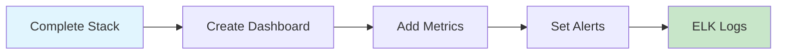

# 📊 Session 10 - Monitoring Tools

<div align="center">


**🎯 Simple Monitoring Setup | 📈 Grafana & Prometheus | 🔍 Real Metrics**

</div>

---

## 🚀 **Quick Start - Complete Stack**

```bash
# Start everything at once
cd 04-complete-stack
./start.sh

# Access services:
# Grafana: http://localhost:3000 (admin/admin123)
# Prometheus: http://localhost:9090
```

---

## 📁 **Available Projects**

### **🎯 [Complete Stack](./04-complete-stack/)** ⭐ **START HERE**
- Grafana + Prometheus + Node Exporter
- One command setup: `./start.sh`
- Pre-configured dashboards
- System metrics monitoring

### **📊 [Grafana Only](./01-grafana/)**
- Simple Grafana container
- Basic dashboard creation
- Data source configuration

### **📈 [App Monitoring](./02-datadog/)**
- Application metrics with Python
- Custom metrics collection
- Datadog alternative (free)

### **🔍 [Nagios](./03-nagios/)**
- Simple Nagios container
- Basic host/service monitoring
- Alert configuration

### **📋 [ELK Stack](./05-elk-project/)**
- Complete log analysis
- Elasticsearch + Logstash + Kibana
- Log processing and visualization

---

## 🎯 **Learning Path**



### **Step 1: Start Complete Stack**
```bash
cd 04-complete-stack
./start.sh
```

### **Step 2: Create First Dashboard**
1. Login to Grafana: http://localhost:3000
2. Add Prometheus data source: `http://prometheus:9090`
3. Import dashboard ID: `1860`
4. View system metrics

### **Step 3: Explore Metrics**
- CPU usage, memory, disk
- Network traffic
- Application requests

### **Step 4: Set Up Alerts**
- High CPU usage
- Low disk space
- Service down

---

## 📊 **What You'll Monitor**

### **System Metrics**
- CPU, Memory, Disk usage
- Network traffic
- System load

### **Application Metrics**
- Request count
- Response time
- Error rate

### **Log Analysis**
- Application logs
- Error tracking
- Performance analysis

---

## 🎯 **Project Assignment**

### **Build Your Monitoring Dashboard**
1. ✅ Start the complete monitoring stack
2. ✅ Create custom Grafana dashboard
3. ✅ Add at least 5 different metrics
4. ✅ Set up 2 alerts
5. ✅ Document your setup

### **Bonus Points**
- Custom application with metrics
- Log analysis with ELK
- Alert notifications
- Performance optimization

---

## 🛠️ **Troubleshooting**

### **Services Won't Start**
```bash
# Check Docker
docker --version
docker-compose --version

# Check ports
netstat -tulpn | grep :3000
```

### **Can't Access Grafana**
```bash
# Check container status
docker ps

# View logs
docker logs grafana
```

### **No Metrics Data**
```bash
# Check Prometheus targets
# Go to: http://localhost:9090/targets
```

---

## 📚 **Resources**

- [Grafana Documentation](https://grafana.com/docs/)
- [Prometheus Guide](https://prometheus.io/docs/)
- [Docker Compose Reference](https://docs.docker.com/compose/)

---

*Ready to monitor everything? Start with the complete stack!* 📊
