# 📊 Session 10: Monitoring Tools

<div align="center">


**📈 Monitor Systems | 📊 Visualize Data | 🚨 Get Alerts**

</div>

---

## 🎯 What You'll Learn


- **Collect metrics** with Prometheus
- **Visualize data** with Grafana  
- **Manage logs** with ELK Stack
- **Set up alerts** for problems
- **Create dashboards** for monitoring

---

## 🚀 Quick Start

### **Option 1: Complete Stack (Recommended)**
```bash
# Start everything at once
./setup.sh

# Access services
echo "Grafana: http://localhost:3000 (admin/admin123)"
echo "Prometheus: http://localhost:9090"
```

### **Option 2: Individual Tools**
```bash
# Try specific tools
cd 01-grafana && docker-compose up -d
cd 04-complete-stack && ./start.sh
cd 05-elk-project && ./start-elk.sh
```

---

## 📁 Available Projects

| Project | Description | Start Command |
|---------|-------------|---------------|
| **[01-grafana](./01-grafana/)** | Grafana dashboards | `docker-compose up -d` |
| **[02-datadog](./02-datadog/)** | DataDog integration | `docker-compose up -d` |
| **[03-nagios](./03-nagios/)** | Nagios monitoring | `docker-compose up -d` |
| **[04-complete-stack](./04-complete-stack/)** ⭐ | Full monitoring stack | `./start.sh` |
| **[05-elk-project](./05-elk-project/)** | ELK log management | `./start-elk.sh` |

---

## 🛠️ Monitoring Architecture

```mermaid
graph TB
    subgraph "Your Applications"
        APP[Web App]
        API[API Service]
        DB[(Database)]
    end
    
    subgraph "Monitoring Stack"
        PROM[Prometheus<br/>📊 Metrics]
        GRAF[Grafana<br/>📈 Dashboards]
        ELK[ELK Stack<br/>📝 Logs]
        ALERT[AlertManager<br/>🚨 Alerts]
    end
    
    APP --> PROM
    API --> PROM
    DB --> PROM
    
    PROM --> GRAF
    PROM --> ALERT
    
    APP --> ELK
    API --> ELK
    
    style PROM fill:#e6522c
    style GRAF fill:#f46800
    style ELK fill:#005571
    style ALERT fill:#f44336
```



---

## 📊 Key Concepts

### **The 3 Pillars of Monitoring**

```mermaid
graph TD
    A[📊 METRICS<br/>CPU: 85%<br/>Memory: 2.1GB<br/>Response: 250ms]
    B[📝 LOGS<br/>2024-01-15 ERROR<br/>Database failed<br/>User: john@example.com]
    C[🚨 ALERTS<br/>High CPU > 90%<br/>Disk space < 10%<br/>Service down]
    
    style A fill:#2196f3
    style B fill:#ff9800
    style C fill:#f44336
```



---

## 🎯 Hands-On Exercises

### **Exercise 1: Start Monitoring**
```bash
# Quick setup
./setup.sh

# Check services
docker ps
```

### **Exercise 2: Create Dashboard**
1. Open Grafana: http://localhost:3000
2. Login: admin/admin123
3. Import dashboard ID: 1860
4. View system metrics

### **Exercise 3: Set Up Alerts**
1. Go to Prometheus: http://localhost:9090/alerts
2. Check alert rules
3. Test high CPU alert

### **Exercise 4: Analyze Logs**
1. Open Kibana: http://localhost:5601
2. Create index pattern: `logs-*`
3. Explore log data

---

## 🔧 Configuration Files

- **prometheus.yml** - Metrics collection config
- **alert_rules.yml** - Alert definitions
- **docker-compose.yml** - Complete stack setup

---

## 🆘 Troubleshooting

### **Services not starting?**
```bash
# Check Docker
docker ps -a

# Check logs
docker-compose logs

# Restart
./cleanup.sh && ./setup.sh
```

### **Can't access dashboards?**
```bash
# Check ports
netstat -tulpn | grep 3000

# Check firewall
sudo ufw status
```

---

## ✅ Success Checklist

- [ ] Started monitoring stack
- [ ] Accessed Grafana dashboard
- [ ] Viewed Prometheus metrics
- [ ] Set up at least one alert
- [ ] Explored logs in Kibana

---

## 🚀 Next Steps

1. **Monitor your Kubernetes cluster** from Session 7
2. **Monitor infrastructure** deployed with Terraform from Session 8
3. **Prepare for final project** with monitoring strategy

---

## 📚 Quick Reference

### **Access URLs**
- Grafana: http://localhost:3000 (admin/admin123)
- Prometheus: http://localhost:9090
- Kibana: http://localhost:5601
- AlertManager: http://localhost:9093

### **Useful Commands**
```bash
# Start everything
./setup.sh

# Test all services
./test-all.sh

# Clean up
./cleanup.sh
```

---

*Ready to monitor like a pro? Start with `./setup.sh` and explore each project!* 🚀
