# 📊 **Monitoring Tools in DevOps & CI/CD - Complete Learning Path**

<div align="center">


**🎯 Monitor Everything | 📊 Visualize Data | 🚨 Alert Proactively | 🔍 Debug Faster**

</div>

---

## 🎯 **Learning Objectives**

By completing this session, you will master:
- **Monitoring fundamentals** in DevOps culture
- **CI/CD pipeline monitoring** strategies
- **Infrastructure monitoring** with Nagios
- **Log analysis** with ELK Stack
- **Observability** vs monitoring concepts
- **Production monitoring** best practices
- **Incident response** workflows

---

## 📚 **Why Monitoring is Critical in DevOps**

### **The DevOps Monitoring Challenge**


### **Business Impact of Poor Monitoring**

| Scenario | Without Monitoring | With Proper Monitoring |
|----------|-------------------|----------------------|
| **🛒 E-commerce Site Down** | Lost revenue: $10K/hour<br/>Customer churn: 25%<br/>Detection time: 2+ hours | Revenue protected<br/>Customer retention<br/>Detection: < 1 minute |
| **🏦 Banking API Slow** | Transaction failures<br/>Regulatory issues<br/>Brand damage | SLA compliance<br/>Proactive scaling<br/>Customer satisfaction |
| **🎮 Gaming Platform** | User exodus<br/>Negative reviews<br/>Competitive loss | Optimal performance<br/>User engagement<br/>Market leadership |

---

## 🏗️ **Monitoring in CI/CD Pipeline Architecture**

```mermaid
graph TB
    subgraph "Development Phase"
        DEV[👨‍💻 Developer] --> CODE[📝 Code Commit]
        CODE --> UNIT[🧪 Unit Tests]
        UNIT --> STATIC[🔍 Static Analysis]
    end
    
    subgraph "CI Pipeline Monitoring"
        BUILD[🔨 Build Process]
        TEST[🧪 Integration Tests]
        SECURITY[🔒 Security Scans]
        QUALITY[📊 Quality Gates]
        
        BUILD --> TEST
        TEST --> SECURITY
        SECURITY --> QUALITY
    end
    
    subgraph "CD Pipeline Monitoring"
        STAGING[🎭 Staging Deploy]
        SMOKE[💨 Smoke Tests]
        PERF[⚡ Performance Tests]
        PROD[🚀 Production Deploy]
        
        STAGING --> SMOKE
        SMOKE --> PERF
        PERF --> PROD
    end
    
    subgraph "Production Monitoring"
        INFRA[🖥️ Infrastructure]
        APP[📱 Application]
        USER[👥 User Experience]
        BUSINESS[💰 Business Metrics]
        
        INFRA --> APP
        APP --> USER
        USER --> BUSINESS
    end
    
    subgraph "Feedback Loop"
        ALERT[🚨 Alerts]
        INCIDENT[🔥 Incident Response]
        POSTMORTEM[📋 Post-mortem]
        IMPROVE[🔄 Improvements]
        
        ALERT --> INCIDENT
        INCIDENT --> POSTMORTEM
        POSTMORTEM --> IMPROVE
        IMPROVE --> DEV
    end
    
    STATIC --> BUILD
    QUALITY --> STAGING
    PROD --> INFRA
    BUSINESS --> ALERT
    
    style DEV fill:#e1f5fe
    style BUILD fill:#fff3e0
    style STAGING fill:#f3e5f5
    style INFRA fill:#e8f5e8
    style ALERT fill:#ffcdd2
```



---

## 📊 **The Four Pillars of Observability**

### **1. 📈 Metrics (What happened?)**
```
CPU Usage: 85% → Threshold: 80% → Alert: High CPU
Response Time: 2.5s → SLA: 1s → Alert: Performance Degradation
Error Rate: 5% → Threshold: 1% → Alert: High Error Rate
```

**Key Metrics Categories:**
- **Infrastructure**: CPU, Memory, Disk, Network
- **Application**: Response time, throughput, error rate
- **Business**: Revenue, conversions, user engagement
- **User Experience**: Page load time, transaction success

### **2. 📝 Logs (What exactly happened?)**
```
2024-09-21 10:30:45 ERROR [OrderService] Payment gateway timeout for order #12345
2024-09-21 10:30:46 WARN  [Database] Connection pool 90% full
2024-09-21 10:30:47 INFO  [LoadBalancer] Routing traffic to backup server
```

**Log Types:**
- **Application logs**: Business logic, errors, transactions
- **Infrastructure logs**: System events, security, performance
- **Audit logs**: Compliance, user actions, data changes
- **Security logs**: Authentication, authorization, threats

### **3. 🔍 Traces (How did it happen?)**
```
User Request → API Gateway → Auth Service → Order Service → Payment API → Database
     100ms         50ms         200ms        150ms         500ms       300ms
                                                            ↑ Bottleneck identified
```

**Distributed Tracing Benefits:**
- **Root cause analysis**: Find exact failure point
- **Performance optimization**: Identify slow components
- **Dependency mapping**: Understand service interactions
- **Capacity planning**: Optimize resource allocation

### **4. 🚨 Events (When did it happen?)**
```
Event: Deployment Started
Time: 2024-09-21 10:00:00
Impact: Traffic spike detected
Response: Auto-scaling triggered
Resolution: Additional instances launched
```

---

## 🛠️ **Lab Structure & Learning Path**

### **📁 01-nagios** - Infrastructure Monitoring Foundation
```
01-nagios/
├── 🎯 Focus: Traditional infrastructure monitoring
├── 🔧 Technology: Nagios Core
├── 📊 Monitors: Host/service availability
├── 🚨 Alerting: Email notifications
├── 💡 Learn: Monitoring fundamentals
└── 🎓 Skills: Basic monitoring setup
```

**What You'll Build:**
- Nagios monitoring server
- Web server targets (nginx, apache)
- Health check configurations
- Alert notification system

**Business Value:**
- **Uptime monitoring** - Ensure services are available
- **Performance tracking** - Monitor response times
- **Capacity planning** - Track resource utilization
- **Compliance** - Meet SLA requirements

### **📁 02-elk-stack** - Log Analysis & Observability
```
02-elk-stack/
├── 🎯 Focus: Centralized logging and analysis
├── 🔧 Technology: Elasticsearch, Logstash, Kibana
├── 📊 Processes: Real-time log analysis
├── 🚨 Insights: Pattern detection, anomalies
├── 💡 Learn: Log-driven troubleshooting
└── 🎓 Skills: Advanced observability
```

**What You'll Build:**
- Complete ELK stack deployment
- Multi-service log aggregation
- Real-time dashboards
- Log correlation and analysis

**Business Value:**
- **Faster troubleshooting** - Centralized log search
- **Proactive insights** - Trend analysis and predictions
- **Security monitoring** - Threat detection in logs
- **Performance optimization** - Identify bottlenecks

---

## 🚀 **CI/CD Pipeline Monitoring Strategies**

### **Build Stage Monitoring**
```yaml
# Jenkins Pipeline Monitoring Example
pipeline {
    agent any
    stages {
        stage('Build') {
            steps {
                script {
                    // Monitor build time
                    def startTime = System.currentTimeMillis()
                    sh 'mvn clean compile'
                    def buildTime = System.currentTimeMillis() - startTime
                    
                    // Send metrics to monitoring system
                    sh "curl -X POST http://metrics-server/api/metrics \
                        -d 'build_time_ms=${buildTime}&project=myapp&stage=build'"
                }
            }
        }
    }
}
```

**Key Build Metrics:**
- **Build duration** - Track build performance trends
- **Build success rate** - Identify flaky builds
- **Queue time** - Monitor CI/CD capacity
- **Artifact size** - Track application growth

### **Test Stage Monitoring**
```bash
# Test Metrics Collection
#!/bin/bash
TEST_START=$(date +%s)

# Run tests and capture results
mvn test > test_results.log 2>&1
TEST_EXIT_CODE=$?

TEST_END=$(date +%s)
TEST_DURATION=$((TEST_END - TEST_START))

# Extract test metrics
TOTAL_TESTS=$(grep -o "Tests run: [0-9]*" test_results.log | grep -o "[0-9]*")
FAILED_TESTS=$(grep -o "Failures: [0-9]*" test_results.log | grep -o "[0-9]*")
SKIPPED_TESTS=$(grep -o "Skipped: [0-9]*" test_results.log | grep -o "[0-9]*")

# Send to monitoring system
curl -X POST http://monitoring-api/metrics \
  -H "Content-Type: application/json" \
  -d "{
    \"test_duration\": $TEST_DURATION,
    \"total_tests\": $TOTAL_TESTS,
    \"failed_tests\": $FAILED_TESTS,
    \"success_rate\": $(echo "scale=2; ($TOTAL_TESTS-$FAILED_TESTS)/$TOTAL_TESTS*100" | bc)
  }"
```

### **Deployment Monitoring**
```yaml
# Kubernetes Deployment with Monitoring
apiVersion: apps/v1
kind: Deployment
metadata:
  name: myapp
  annotations:
    # Deployment tracking
    deployment.kubernetes.io/revision: "1"
    monitoring.company.com/alert-on-failure: "true"
spec:
  replicas: 3
  strategy:
    type: RollingUpdate
    rollingUpdate:
      maxSurge: 1
      maxUnavailable: 0
  template:
    spec:
      containers:
      - name: myapp
        image: myapp:v1.2.3
        # Health checks for monitoring
        livenessProbe:
          httpGet:
            path: /health
            port: 8080
          initialDelaySeconds: 30
          periodSeconds: 10
        readinessProbe:
          httpGet:
            path: /ready
            port: 8080
          initialDelaySeconds: 5
          periodSeconds: 5
```

---

## 📊 **Monitoring Best Practices in DevOps**

### **1. The Golden Signals (SRE Approach)**

```mermaid
graph TB
    subgraph "Golden Signals"
        L[📊 Latency<br/>How long requests take]
        T[🚀 Traffic<br/>How many requests]
        E[❌ Errors<br/>Rate of failed requests]
        S[💾 Saturation<br/>How full your service is]
    end
    
    subgraph "Implementation"
        L --> L1[Response time percentiles<br/>P50, P95, P99]
        T --> T1[Requests per second<br/>Concurrent users]
        E --> E1[Error rate percentage<br/>HTTP 4xx/5xx codes]
        S --> S1[CPU, Memory, Disk usage<br/>Queue lengths]
    end
    
    style L fill:#e1f5fe
    style T fill:#e8f5e8
    style E fill:#ffcdd2
    style S fill:#fff3e0
```



### **2. Monitoring Pyramid**

```
                    🎯 Business KPIs
                   Revenue, Conversions
                  ─────────────────────
                 👥 User Experience Metrics
                Page Load Time, Transaction Success
               ─────────────────────────────────
              📱 Application Performance Metrics
             Response Time, Throughput, Error Rate
            ───────────────────────────────────────
           🖥️ Infrastructure & System Metrics
          CPU, Memory, Disk, Network, Database
         ─────────────────────────────────────────
```

### **3. Alert Fatigue Prevention**

```yaml
# Smart Alerting Configuration
alerts:
  high_error_rate:
    condition: error_rate > 5% for 5 minutes
    severity: critical
    escalation:
      - immediate: on-call-engineer
      - 15min: team-lead
      - 30min: engineering-manager
    
  response_time_degradation:
    condition: p95_response_time > 2s for 10 minutes
    severity: warning
    throttle: 1 hour  # Prevent spam
    
  deployment_failure:
    condition: deployment_success_rate < 90%
    severity: critical
    auto_rollback: true
```

---

## 🔄 **Monitoring-Driven Development Workflow**

### **Phase 1: Development**
```bash
# Local monitoring setup
docker-compose up -d monitoring-stack

# Run application with metrics
./gradlew bootRun --args="--management.endpoints.web.exposure.include=*"

# Check metrics endpoint
curl http://localhost:8080/actuator/metrics
```

### **Phase 2: CI Pipeline**
```yaml
# .github/workflows/ci.yml
name: CI with Monitoring
on: [push, pull_request]

jobs:
  test:
    runs-on: ubuntu-latest
    steps:
    - uses: actions/checkout@v2
    
    - name: Run tests with coverage
      run: |
        mvn test jacoco:report
        
    - name: Send metrics to monitoring
      run: |
        curl -X POST ${{ secrets.METRICS_ENDPOINT }} \
          -d "test_coverage=$(grep -o 'Total.*[0-9]*%' target/site/jacoco/index.html | grep -o '[0-9]*')"
```

### **Phase 3: Staging Deployment**
```bash
# Deploy with monitoring
kubectl apply -f k8s/monitoring/
kubectl apply -f k8s/app/

# Automated smoke tests
./scripts/smoke-tests.sh --environment=staging

# Performance baseline
./scripts/performance-tests.sh --baseline=true
```

### **Phase 4: Production Deployment**
```bash
# Blue-green deployment with monitoring
kubectl patch service myapp -p '{"spec":{"selector":{"version":"green"}}}'

# Monitor deployment health
./scripts/monitor-deployment.sh --timeout=300

# Automated rollback on failure
if [ $? -ne 0 ]; then
  kubectl patch service myapp -p '{"spec":{"selector":{"version":"blue"}}}'
  echo "Deployment failed, rolled back to blue version"
fi
```

---

## 🚨 **Incident Response with Monitoring**

### **Incident Lifecycle**

```mermaid
graph TB
    A[🚨 Alert Triggered] --> B[📞 On-call Notified]
    B --> C[🔍 Initial Assessment]
    C --> D{Severity?}
    
    D -->|Critical| E[🚨 War Room]
    D -->|High| F[👥 Team Response]
    D -->|Medium| G[📋 Ticket Created]
    
    E --> H[🔧 Immediate Mitigation]
    F --> H
    G --> I[📅 Scheduled Fix]
    
    H --> J[✅ Service Restored]
    I --> J
    
    J --> K[📊 Post-mortem Analysis]
    K --> L[🔄 Process Improvement]
    L --> M[📚 Knowledge Base Update]
    
    style A fill:#ffcdd2
    style E fill:#ff5722
    style J fill:#4caf50
    style L fill:#2196f3
```



### **Monitoring-Driven Troubleshooting**

```bash
# 1. Alert received: High error rate
# 2. Check monitoring dashboards
curl "http://grafana.company.com/api/dashboards/uid/app-overview"

# 3. Analyze logs for error patterns
kubectl logs -f deployment/myapp | grep ERROR | tail -100

# 4. Check infrastructure metrics
kubectl top nodes
kubectl top pods

# 5. Trace specific failing requests
curl "http://jaeger.company.com/api/traces?service=myapp&lookback=1h"

# 6. Identify root cause and fix
kubectl rollout undo deployment/myapp

# 7. Verify resolution
./scripts/health-check.sh --verify-fix
```

---

## 📈 **Advanced Monitoring Concepts**

### **Synthetic Monitoring**
```javascript
// Synthetic user journey monitoring
const puppeteer = require('puppeteer');

async function syntheticTest() {
  const browser = await puppeteer.launch();
  const page = await browser.newPage();
  
  const startTime = Date.now();
  
  try {
    // Simulate user journey
    await page.goto('https://myapp.com');
    await page.click('#login-button');
    await page.type('#username', 'test@example.com');
    await page.type('#password', 'password');
    await page.click('#submit');
    
    // Wait for dashboard to load
    await page.waitForSelector('#dashboard');
    
    const endTime = Date.now();
    const journeyTime = endTime - startTime;
    
    // Send metrics
    await sendMetric('synthetic_journey_time', journeyTime);
    await sendMetric('synthetic_journey_success', 1);
    
  } catch (error) {
    await sendMetric('synthetic_journey_success', 0);
    await sendAlert('Synthetic test failed: ' + error.message);
  }
  
  await browser.close();
}

// Run every 5 minutes
setInterval(syntheticTest, 5 * 60 * 1000);
```

### **Chaos Engineering with Monitoring**
```yaml
# Chaos experiment with monitoring
apiVersion: chaos-mesh.org/v1alpha1
kind: PodChaos
metadata:
  name: pod-failure-experiment
spec:
  action: pod-failure
  mode: fixed-percent
  value: "20"  # Kill 20% of pods
  duration: "30s"
  selector:
    namespaces:
      - production
    labelSelectors:
      app: myapp
  
  # Monitor during chaos
  monitoring:
    metrics:
      - error_rate
      - response_time
      - availability
    alerts:
      - name: chaos-impact-alert
        condition: error_rate > 10%
        action: stop-experiment
```

---

## 🎓 **Learning Path & Next Steps**

### **Beginner Level (Weeks 1-2)**
- [ ] Complete **01-nagios** lab
- [ ] Understand monitoring fundamentals
- [ ] Set up basic alerts
- [ ] Practice incident response

### **Intermediate Level (Weeks 3-4)**
- [ ] Complete **02-elk-stack** lab
- [ ] Build custom dashboards
- [ ] Implement log analysis
- [ ] Create monitoring runbooks

### **Advanced Level (Weeks 5-6)**
- [ ] Integrate monitoring in CI/CD
- [ ] Implement SLI/SLO framework
- [ ] Set up distributed tracing
- [ ] Practice chaos engineering

### **Expert Level (Ongoing)**
- [ ] Design monitoring architecture
- [ ] Implement custom metrics
- [ ] Build monitoring automation
- [ ] Lead incident response

---

## 📚 **Additional Resources**

### **Books & Documentation**
- [Site Reliability Engineering (Google)](https://sre.google/books/)
- [Monitoring and Observability (Honeycomb)](https://www.honeycomb.io/blog/)
- [The Art of Monitoring (James Turnbull)](https://artofmonitoring.com/)

### **Tools & Platforms**
- **Open Source**: Prometheus, Grafana, ELK Stack, Jaeger
- **Cloud Native**: AWS CloudWatch, Azure Monitor, GCP Operations
- **Commercial**: Datadog, New Relic, Splunk, Dynatrace

### **Communities**
- [SRE Community](https://www.reddit.com/r/sre/)
- [DevOps Monitoring Slack](https://devops-monitoring.slack.com/)
- [CNCF Observability](https://github.com/cncf/tag-observability)

---

## 🎯 **Success Metrics**

After completing this session, you should be able to:

✅ **Design monitoring strategies** for any application  
✅ **Implement CI/CD pipeline monitoring** with automated alerts  
✅ **Build comprehensive dashboards** for different stakeholders  
✅ **Respond to incidents** using monitoring data effectively  
✅ **Optimize system performance** based on observability insights  
✅ **Establish SLI/SLO frameworks** for service reliability  

---

## 🚀 **Get Started**

### **Quick Start Path:**
1. **📖 Read this overview** - Understand monitoring concepts
2. **🔧 Start with 01-nagios** - Learn infrastructure monitoring
3. **📊 Progress to 02-elk-stack** - Master log analysis
4. **🎯 Apply to your projects** - Implement in real scenarios

### **Time Investment:**
- **Basic competency**: 2-3 days
- **Practical skills**: 1-2 weeks  
- **Advanced expertise**: 1-2 months
- **Mastery**: Ongoing practice

---

*📊 Master monitoring and transform your DevOps practice - Start with 01-nagios!* 🚀
