# 📊 Session 10: Monitoring Tools

<div align="center">


**📈 Monitor Systems | 📊 Visualize Data | 🚨 Get Alerts**

</div>

---

## 🎯 Learning Objectives

```mermaid
graph LR
    A[📊 Collect Metrics] --> B[📈 Visualize Data]
    B --> C[🚨 Set Alerts] --> D[🔍 Analyze Logs]
    
    style A fill:#e1f5fe
    style B fill:#e8f5e8
    style C fill:#fff3e0
    style D fill:#f3e5f5
```



By the end of this session, you'll master:
- **Metrics Collection** with Prometheus
- **Data Visualization** with Grafana  
- **Log Management** with ELK Stack
- **Alerting Systems** for proactive monitoring
- **Real-world monitoring** scenarios

---

## 🚀 Project Flow for Students

### **📋 Step 1: Start with Complete Stack (Recommended)**
```bash
# Navigate to complete monitoring solution
cd 04-complete-stack

# One-command setup
./setup.sh

# ✅ Result: Full monitoring stack running
# - Prometheus: http://localhost:9090
# - Grafana: http://localhost:3000 (admin/admin123)
# - Kibana: http://localhost:5601
```

### **📊 Step 2: Explore Individual Tools**
```bash
# Try Grafana dashboards only
cd 01-grafana
docker-compose up -d

# Test DataDog integration
cd 02-datadog  
docker-compose up -d

# Experience traditional monitoring
cd 03-nagios
docker-compose up -d
```

### **📝 Step 3: Deep Dive into Log Management**
```bash
# Master ELK Stack
cd 05-elk-project
./start-elk.sh

# Generate sample logs
./generate-logs.sh

# Analyze in Kibana: http://localhost:5601
```

### **🧪 Step 4: Test Everything**
```bash
# Run comprehensive tests
./test-all.sh

# Verify all services are working
```

---

## 🛠️ Monitoring Architecture

```mermaid
graph TB
    subgraph "Your Applications"
        APP[Web App]
        API[API Service]
        DB[(Database)]
    end
    
    subgraph "Monitoring Stack"
        PROM[Prometheus<br/>📊 Metrics]
        GRAF[Grafana<br/>📈 Dashboards]
        ELK[ELK Stack<br/>📝 Logs]
        ALERT[AlertManager<br/>🚨 Alerts]
    end
    
    APP --> PROM
    API --> PROM
    DB --> PROM
    
    PROM --> GRAF
    PROM --> ALERT
    
    APP --> ELK
    API --> ELK
    
    style PROM fill:#e6522c
    style GRAF fill:#f46800
    style ELK fill:#005571
    style ALERT fill:#f44336
```



---

## 📁 Available Projects

| Project | Purpose | Difficulty | Start Command |
|---------|---------|------------|---------------|
| **[04-complete-stack](./04-complete-stack/)** ⭐ | Full monitoring solution | Beginner | `./setup.sh` |
| **[01-grafana](./01-grafana/)** | Dashboard creation | Beginner | `docker-compose up -d` |
| **[02-datadog](./02-datadog/)** | Enterprise monitoring | Intermediate | `docker-compose up -d` |
| **[03-nagios](./03-nagios/)** | Traditional monitoring | Intermediate | `docker-compose up -d` |
| **[05-elk-project](./05-elk-project/)** | Log management | Advanced | `./start-elk.sh` |

---

## 🎯 Hands-On Learning Path

### **🔰 Beginner Path (Start Here)**
1. **Complete Stack** - Get familiar with all tools
2. **Grafana Project** - Learn dashboard creation
3. **Basic alerting** - Set up your first alerts

### **🚀 Intermediate Path**
1. **DataDog Integration** - Enterprise monitoring
2. **Nagios Setup** - Traditional monitoring approach
3. **Custom metrics** - Instrument your applications

### **🎓 Advanced Path**
1. **ELK Stack** - Master log management
2. **Custom dashboards** - Build production-ready visualizations
3. **Monitoring strategy** - Design complete monitoring solutions

---

## 📊 Key Concepts

### **The 3 Pillars of Monitoring**

```mermaid
graph TD
    A[📊 METRICS<br/>CPU: 85%<br/>Memory: 2.1GB<br/>Response: 250ms]
    B[📝 LOGS<br/>2024-01-15 ERROR<br/>Database failed<br/>User: john@example.com]
    C[🚨 ALERTS<br/>High CPU > 90%<br/>Disk space < 10%<br/>Service down]
    
    style A fill:#2196f3
    style B fill:#ff9800
    style C fill:#f44336
```



### **Why Monitoring Matters**
- **Proactive Issue Detection** - Find problems before users do
- **Performance Optimization** - Identify bottlenecks and improve
- **Root Cause Analysis** - Quickly troubleshoot when issues occur
- **Capacity Planning** - Scale resources based on actual usage
- **Better User Experience** - Ensure applications run smoothly

---

## 🎯 Quick Start Commands

### **🚀 One-Command Setup**
```bash
# Start complete monitoring stack
cd 04-complete-stack && ./setup.sh
```

### **🔍 Check Service Status**
```bash
# Test all services
./test-all.sh

# Check individual services
curl http://localhost:3000  # Grafana
curl http://localhost:9090  # Prometheus
curl http://localhost:5601  # Kibana
```

### **🧹 Clean Up**
```bash
# Stop all services (keeps images)
cd 04-complete-stack && docker-compose down

# Or use cleanup script
./cleanup.sh
```

---

## 📈 Real-World Scenarios

### **Scenario 1: Web Application Monitoring**
Monitor a typical web application with:
- **Frontend performance** - Page load times, user interactions
- **Backend APIs** - Response times, error rates, throughput
- **Database** - Query performance, connection pools
- **Infrastructure** - CPU, memory, disk, network

### **Scenario 2: Microservices Monitoring**
Track distributed systems with:
- **Service health** - Individual service status
- **Request tracing** - Follow requests across services
- **Dependencies** - Monitor service-to-service communication
- **Business metrics** - Orders, payments, user registrations

---

## ✅ Success Checklist

### **Basic Level (Must Complete)**
- [ ] Started complete monitoring stack
- [ ] Accessed Grafana dashboard (http://localhost:3000)
- [ ] Viewed Prometheus metrics (http://localhost:9090)
- [ ] Set up at least one alert
- [ ] Explored logs in Kibana (http://localhost:5601)

### **Intermediate Level**
- [ ] Created custom Grafana dashboard
- [ ] Configured log parsing with Logstash
- [ ] Set up Slack/email notifications
- [ ] Analyzed application performance trends
- [ ] Tested different monitoring tools

### **Advanced Level**
- [ ] Built comprehensive monitoring strategy
- [ ] Implemented custom metrics collection
- [ ] Created automated alerting workflows
- [ ] Designed production-ready dashboards
- [ ] Integrated monitoring with CI/CD pipeline

---

## 🆘 Troubleshooting

### **Services Not Starting?**
```bash
# Check Docker status
docker ps -a

# Check logs
docker-compose logs <service-name>

# Restart services
docker-compose restart
```

### **Port Conflicts?**
```bash
# Check what's using ports
netstat -tulpn | grep <port>

# Kill processes if needed
sudo kill -9 <pid>
```

### **Memory Issues?**
```bash
# Check system resources
free -h
df -h

# Clean up Docker (keeps images)
docker system prune -f
```

---

## 🚀 Next Steps

### **Integration with Previous Sessions**
1. **Monitor Kubernetes clusters** from Session 7
2. **Monitor Terraform infrastructure** from Session 8
3. **Add monitoring to OpenShift** from Session 9

### **Prepare for Final Project**
1. Plan monitoring strategy for your final project
2. Consider which metrics and logs will be important
3. Design alerting workflows for your application

### **Career Development**
- **DevOps Engineer** - Implement monitoring for CI/CD pipelines
- **Site Reliability Engineer** - Ensure system reliability
- **Cloud Architect** - Design observable architectures
- **Platform Engineer** - Build monitoring platforms

---

## 📚 Quick Reference

### **Access URLs**
- **Grafana**: http://localhost:3000 (admin/admin123)
- **Prometheus**: http://localhost:9090
- **Kibana**: http://localhost:5601
- **AlertManager**: http://localhost:9093

### **Essential Commands**
```bash
# Start monitoring
cd 04-complete-stack && ./setup.sh

# Test services
./test-all.sh

# View logs
docker-compose logs <service>

# Clean up
./cleanup.sh
```

### **Key Prometheus Queries**
```promql
# CPU usage
100 - (avg(irate(node_cpu_seconds_total{mode="idle"}[5m])) * 100)

# Memory usage
(node_memory_MemTotal_bytes - node_memory_MemAvailable_bytes) / node_memory_MemTotal_bytes * 100

# HTTP request rate
rate(http_requests_total[5m])
```

---

*Ready to master monitoring? Start with `cd 04-complete-stack && ./setup.sh` and explore each project!* 🚀

---

*Part of the [Cloud DevOps Learning Path](../../README.md) | Previous: [Session 9 - OpenShift](../Session-9_OpenShift/) | Next: [Final Project](../Session-11_Final-Project/)*
