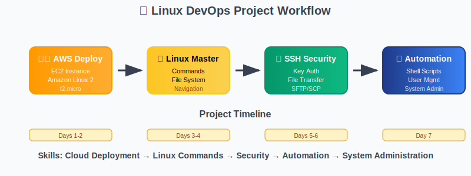

# 🚀 Project 1: Linux System Administration & Cloud Deployment
## *Complete Hands-On Linux Mastery with AWS Cloud*

<div align="center">


**Duration:** 1 Week | **Difficulty:** Beginner to Intermediate | **Type:** Hands-on Project

</div>

---

## 📋 Quick Navigation
<div align="center">

| [🎯 Overview](#-project-overview) | [🛠️ Setup Tools](#️-essential-tools--setup) | [☁️ AWS Deployment](#️-task-1-aws-linux-deployment) | [📁 File Operations](#-task-2-file-system-mastery) |
|:---:|:---:|:---:|:---:|
| [⚡ Commands](#-task-3-command-line-mastery) | [🎉 Completion](#-project-completion--next-steps) | | |

</div>

---

## 🎯 Project Overview

<div align="center">

### 🌟 **Master Linux Through Real-World Implementation**



</div>

This comprehensive hands-on project covers the complete Linux fundamentals through practical implementation. You'll deploy a Linux system on AWS cloud, master essential commands, configure secure access, automate tasks with scripts, and perform system administration.

### 🎪 **What You'll Build**
```
☁️ AWS EC2 Linux Server → 🔐 SSH Security Setup → 📜 Automation Scripts → 👥 User Management System
```

### 📅 **Project Timeline**
- **Days 1-2:** AWS deployment and basic navigation
- **Days 3-4:** Command mastery and file operations
- **Days 5-6:** SSH security and shell scripting
- **Day 7:** System administration and project completion

### 🎯 **Learning Objectives**
- ✅ **Deploy and manage** Linux systems on AWS cloud
- ✅ **Master 50+ essential** Linux commands with practical usage
- ✅ **Configure secure SSH** access with key-based authentication
- ✅ **Create automation scripts** for system administration tasks
- ✅ **Manage users, packages,** and system resources effectively
- ✅ **Use text editors** (Vi/Vim) for configuration management

---

## 🛠️ Essential Tools & Setup

<div align="center">

### 🔧 **Your DevOps Toolkit**

</div>

### 📱 **Required Software**

<table>
<tr>
<td width="50%">

#### 💻 **Local Machine Tools**
```bash
# Windows Users - Install WSL2
wsl --install -d Ubuntu

# macOS Users - Install Homebrew
/bin/bash -c "$(curl -fsSL https://raw.githubusercontent.com/Homebrew/install/HEAD/install.sh)"

# Linux Users - Update system
sudo apt update && sudo apt upgrade -y
```

#### 🔧 **Essential CLI Tools**
```bash
# Install AWS CLI
curl "https://awscli.amazonaws.com/awscli-exe-linux-x86_64.zip" -o "awscliv2.zip"
unzip awscliv2.zip && sudo ./aws/install

# Install useful tools
sudo apt install -y curl wget git vim htop tree jq
```

</td>
<td width="50%">

#### 🌐 **Online Tools & Accounts**
- **AWS Account** - [aws.amazon.com](https://aws.amazon.com) (Free Tier)
- **SSH Client** - Built-in terminal or PuTTY
- **Text Editor** - VS Code with Remote-SSH extension
- **Documentation** - [explainshell.com](https://explainshell.com) for command help

#### 📚 **Helpful Resources**
- **Command Reference** - [tldr.sh](https://tldr.sh) for quick examples
- **Regex Tester** - [regex101.com](https://regex101.com) for pattern matching
- **JSON Formatter** - [jsonformatter.org](https://jsonformatter.org)
- **Base64 Encoder** - [base64encode.org](https://base64encode.org)

</td>
</tr>
</table>

### 🎯 **Quick Setup Verification**
```bash
# Verify all tools are installed
echo "=== Tool Verification ==="
aws --version
git --version
vim --version | head -1
curl --version | head -1
echo "✅ All tools ready!"
```

---

## ☁️ Task 1: AWS Linux Deployment

<div align="center">

### 🚀 **Deploy Your Linux Server on AWS**


</div>

### 🎯 **Objective**
Deploy an Amazon Linux 2 EC2 instance with proper security configuration and establish SSH connectivity.

### 📋 **Step-by-Step Deployment**

<details>
<summary><strong>🖱️ Method 1: AWS Console (Recommended for Beginners)</strong></summary>

#### **Step 1: Launch EC2 Instance**
1. **Login to AWS Console** → Navigate to EC2 Dashboard
2. **Click "Launch Instance"** → Name: `Linux-DevOps-Lab`

#### **Step 2: Choose AMI**
```
✅ Amazon Linux 2 AMI (HVM) - Kernel 5.10, SSD Volume Type
   - Free tier eligible
   - 64-bit (x86)
```

#### **Step 3: Instance Configuration**
```
Instance Type: t2.micro (Free tier eligible)
- 1 vCPU
- 1 GiB Memory
- EBS-Only storage
- Low to Moderate network performance
```

#### **Step 4: Security Group Setup**
```bash
# Create new security group: "Linux-DevOps-SG"
# Inbound Rules:
SSH     | TCP | 22   | My IP (recommended) or 0.0.0.0/0
HTTP    | TCP | 80   | 0.0.0.0/0
HTTPS   | TCP | 443  | 0.0.0.0/0
Custom  | TCP | 8080 | 0.0.0.0/0  # For web applications
```

#### **Step 5: Key Pair Creation**
```bash
# Create new key pair: "linux-devops-key"
# Download: linux-devops-key.pem
# Save securely - you cannot download again!
```

</details>

<details>
<summary><strong>⚡ Method 2: AWS CLI (Advanced Users)</strong></summary>

#### **Complete CLI Deployment Script**
```bash
#!/bin/bash
# AWS EC2 Linux Deployment Script

# Set variables
KEY_NAME="linux-devops-key"
SECURITY_GROUP="Linux-DevOps-SG"
INSTANCE_NAME="Linux-DevOps-Lab"

# Create key pair
echo "🔑 Creating key pair..."
aws ec2 create-key-pair \
    --key-name $KEY_NAME \
    --query 'KeyMaterial' \
    --output text > ${KEY_NAME}.pem

# Set proper permissions
chmod 400 ${KEY_NAME}.pem
echo "✅ Key pair created: ${KEY_NAME}.pem"

# Create security group
echo "🛡️ Creating security group..."
SECURITY_GROUP_ID=$(aws ec2 create-security-group \
    --group-name $SECURITY_GROUP \
    --description "Security group for Linux DevOps lab" \
    --query 'GroupId' \
    --output text)

# Add security group rules
aws ec2 authorize-security-group-ingress \
    --group-id $SECURITY_GROUP_ID \
    --protocol tcp \
    --port 22 \
    --cidr 0.0.0.0/0

aws ec2 authorize-security-group-ingress \
    --group-id $SECURITY_GROUP_ID \
    --protocol tcp \
    --port 80 \
    --cidr 0.0.0.0/0

aws ec2 authorize-security-group-ingress \
    --group-id $SECURITY_GROUP_ID \
    --protocol tcp \
    --port 443 \
    --cidr 0.0.0.0/0

echo "✅ Security group created: $SECURITY_GROUP_ID"

# Launch instance
echo "🚀 Launching EC2 instance..."
INSTANCE_ID=$(aws ec2 run-instances \
    --image-id ami-0c02fb55956c7d316 \
    --instance-type t2.micro \
    --key-name $KEY_NAME \
    --security-group-ids $SECURITY_GROUP_ID \
    --tag-specifications "ResourceType=instance,Tags=[{Key=Name,Value=$INSTANCE_NAME}]" \
    --query 'Instances[0].InstanceId' \
    --output text)

echo "✅ Instance launched: $INSTANCE_ID"
echo "⏳ Waiting for instance to be running..."

# Wait for instance to be running
aws ec2 wait instance-running --instance-ids $INSTANCE_ID

# Get public IP
PUBLIC_IP=$(aws ec2 describe-instances \
    --instance-ids $INSTANCE_ID \
    --query 'Reservations[0].Instances[0].PublicIpAddress' \
    --output text)

echo "🎉 Instance is ready!"
echo "📍 Public IP: $PUBLIC_IP"
echo "🔗 SSH Command: ssh -i ${KEY_NAME}.pem ec2-user@$PUBLIC_IP"
```

</details>

### 🔐 **SSH Connection Setup**

#### **Step 1: Secure Your Key File**
```bash
# Set proper permissions (CRITICAL!)
chmod 400 linux-devops-key.pem

# Verify permissions
ls -la linux-devops-key.pem
# Should show: -r-------- (400 permissions)
```

#### **Step 2: Connect to Your Instance**
```bash
# Replace YOUR_PUBLIC_IP with actual IP from AWS console
ssh -i linux-devops-key.pem ec2-user@YOUR_PUBLIC_IP

# Example:
ssh -i linux-devops-key.pem ec2-user@54.123.45.67

# First connection will ask to verify fingerprint - type 'yes'
```

#### **Step 3: Verify Connection**
```bash
# Once connected, run these commands to verify
whoami          # Should show: ec2-user
hostname        # Shows instance hostname
uname -a        # Shows Linux kernel info
uptime          # Shows system uptime
```

### 🎯 **Success Criteria**
- ✅ EC2 instance running and accessible
- ✅ SSH connection established successfully
- ✅ Can execute basic commands on remote server
- ✅ Security group properly configured

---

## 📁 Task 2: File System Mastery

<div align="center">

### 🗂️ **Master Linux File System Operations**


</div>

### 🎯 **Objective**
Master essential file and directory operations, understand Linux file system hierarchy, and practice file permissions management.

### 🧭 **File System Navigation**

#### **Essential Navigation Commands**
```bash
# Print current directory
pwd
# Output: /home/ec2-user

# List directory contents (multiple ways)
ls                    # Basic listing
ls -l                # Long format with details
ls -la               # Include hidden files
ls -lh               # Human readable file sizes
ls -lt               # Sort by modification time
ls -lS               # Sort by file size

# Change directories
cd /                 # Go to root directory
cd ~                 # Go to home directory
cd /var/log          # Go to specific directory
cd ..                # Go up one level
cd -                 # Go to previous directory

# Directory tree visualization
tree /etc            # Show directory tree (install with: sudo yum install tree)
```

#### **File System Exploration Exercise**
```bash
# Explore the Linux file system hierarchy
echo "=== Linux File System Exploration ==="

# Root directory contents
echo "📁 Root directory (/):"
ls -la /

# Important system directories
echo "📁 System binaries (/bin):"
ls -la /bin | head -10

echo "📁 Configuration files (/etc):"
ls -la /etc | head -10

echo "📁 User home directories (/home):"
ls -la /home

echo "📁 Variable data (/var):"
ls -la /var

echo "📁 Temporary files (/tmp):"
ls -la /tmp
```

### 📝 **File Operations**

#### **Creating Files and Directories**
```bash
# Create directories
mkdir my-project                    # Single directory
mkdir -p projects/web/frontend      # Nested directories
mkdir dir1 dir2 dir3               # Multiple directories

# Create files (multiple methods)
touch file1.txt                    # Empty file
echo "Hello World" > file2.txt     # File with content
cat > file3.txt << EOF             # Multi-line file
This is line 1
This is line 2
This is line 3
EOF

# Create file with current date
echo "Created on: $(date)" > timestamp.txt

# Create multiple files
touch file{1..5}.txt               # Creates file1.txt to file5.txt
```

#### **File Content Operations**
```bash
# View file contents (different methods)
cat filename.txt                   # Display entire file
less filename.txt                  # Page through file (q to quit)
more filename.txt                  # Page through file (older version)
head filename.txt                  # First 10 lines
head -n 5 filename.txt            # First 5 lines
tail filename.txt                  # Last 10 lines
tail -n 5 filename.txt            # Last 5 lines
tail -f /var/log/messages         # Follow file changes (Ctrl+C to stop)

# File information
file filename.txt                  # File type information
wc filename.txt                    # Word, line, character count
wc -l filename.txt                # Line count only
stat filename.txt                 # Detailed file statistics
```

#### **Copy, Move, and Delete Operations**
```bash
# Copy operations
cp source.txt destination.txt      # Copy file
cp source.txt /tmp/               # Copy to directory
cp -r directory1 directory2       # Copy directory recursively
cp -v source.txt dest.txt         # Verbose output
cp -i source.txt dest.txt         # Interactive (ask before overwrite)

# Move/rename operations
mv oldname.txt newname.txt         # Rename file
mv file.txt /tmp/                 # Move file to directory
mv directory1 directory2          # Rename directory

# Delete operations
rm filename.txt                    # Delete file
rm -i filename.txt                # Interactive delete (ask confirmation)
rm -f filename.txt                # Force delete (no confirmation)
rm -r directory                   # Delete directory recursively
rm -rf directory                  # Force delete directory (DANGEROUS!)

# Safe delete practice
mkdir trash
mv unwanted-file.txt trash/       # Move to trash instead of rm
```

### 🔍 **Search and Find Operations**

#### **Finding Files and Directories**
```bash
# Find command examples
find . -name "*.txt"               # Find all .txt files in current directory
find /home -name "config*"         # Find files starting with "config"
find /var -type f -name "*.log"    # Find log files
find /tmp -type d -name "test*"    # Find directories starting with "test"
find . -size +100M                # Find files larger than 100MB
find . -mtime -7                   # Files modified in last 7 days
find . -user ec2-user              # Files owned by ec2-user

# Locate command (faster, uses database)
sudo updatedb                      # Update locate database
locate filename.txt                # Find file quickly
locate -i FILENAME.TXT            # Case insensitive search

# Which and whereis
which ls                          # Location of ls command
whereis ls                        # All locations of ls
```

#### **Search Inside Files**
```bash
# Grep command examples
grep "error" /var/log/messages     # Search for "error" in log file
grep -i "error" /var/log/messages  # Case insensitive search
grep -n "error" /var/log/messages  # Show line numbers
grep -r "TODO" /home/ec2-user/     # Recursive search in directory
grep -v "info" /var/log/messages   # Exclude lines with "info"
grep -c "error" /var/log/messages  # Count matching lines

# Advanced grep with regex
grep "^error" file.txt             # Lines starting with "error"
grep "error$" file.txt             # Lines ending with "error"
grep "[0-9]" file.txt              # Lines containing numbers
```

### 🔐 **File Permissions Management**

#### **Understanding Permissions**
```bash
# View permissions
ls -l filename.txt
# Output example: -rw-r--r-- 1 ec2-user ec2-user 1024 Jan 15 10:30 filename.txt
#                  ↑         ↑        ↑         ↑    ↑
#                  permissions owner   group    size date

# Permission breakdown:
# - = file, d = directory, l = link
# rw-r--r-- = owner(rw-), group(r--), others(r--)
# r = read (4), w = write (2), x = execute (1)
```

#### **Changing Permissions**
```bash
# Numeric method (recommended)
chmod 755 script.sh               # rwxr-xr-x (owner: all, group/others: read+execute)
chmod 644 document.txt            # rw-r--r-- (owner: read+write, others: read)
chmod 600 private.txt             # rw------- (owner: read+write, others: none)
chmod 777 shared.txt              # rwxrwxrwx (all permissions for everyone - AVOID!)

# Symbolic method
chmod u+x script.sh               # Add execute for owner
chmod g-w file.txt                # Remove write for group
chmod o=r file.txt                # Set others to read only
chmod a+r file.txt                # Add read for all (owner, group, others)

# Recursive permissions
chmod -R 755 /path/to/directory   # Apply to directory and all contents
```

#### **Changing Ownership**
```bash
# Change file owner
sudo chown newowner filename.txt

# Change owner and group
sudo chown newowner:newgroup filename.txt

# Change group only
sudo chgrp newgroup filename.txt

# Recursive ownership change
sudo chown -R ec2-user:ec2-user /home/ec2-user/projects/
```

### 🎯 **Practical Exercise: File System Lab**
```bash
#!/bin/bash
# File System Mastery Lab

echo "🚀 Starting File System Lab..."

# Create project structure
mkdir -p ~/devops-lab/{scripts,configs,logs,backups}
cd ~/devops-lab

# Create sample files
echo "#!/bin/bash" > scripts/backup.sh
echo "echo 'Backup script'" >> scripts/backup.sh
chmod +x scripts/backup.sh

echo "server_name=web01" > configs/server.conf
echo "port=8080" >> configs/server.conf

echo "$(date): System started" > logs/system.log
echo "$(date): Application ready" >> logs/system.log

# Set proper permissions
chmod 755 scripts/
chmod 644 configs/*
chmod 640 logs/*
chmod 700 backups/

# Display results
echo "📁 Project structure created:"
tree ~/devops-lab

echo "🔐 Permissions set:"
ls -la ~/devops-lab/*/

echo "✅ File System Lab completed!"
```

### 🎯 **Success Criteria**
- ✅ Navigate Linux file system confidently
- ✅ Create, copy, move, and delete files/directories
- ✅ Search for files and content effectively
- ✅ Understand and manage file permissions
- ✅ Complete practical file system lab

---

*Continue to [Task 3: Command Line Mastery](#-task-3-command-line-mastery) →*

## ⚡ Task 3: Command Line Mastery

<div align="center">

### 🔧 **Advanced Linux Command Proficiency**

</div>

### 🎯 **Objective**
Master advanced Linux commands for system monitoring, process management, network operations, and package management.

### 📊 **System Information & Monitoring**

#### **System Status Commands**
```bash
# System information
uname -a                    # Complete system information
hostname                    # System hostname
whoami                      # Current username
id                         # User and group IDs
uptime                     # System uptime and load average
date                       # Current date and time
cal                        # Calendar display
w                          # Who is logged in and what they're doing

# Hardware information
lscpu                      # CPU information
lsmem                      # Memory information
lsblk                      # Block devices (disks)
lsusb                      # USB devices
lspci                      # PCI devices
dmidecode                  # Hardware details (requires sudo)
```

#### **Process Management**
```bash
# Process viewing
ps aux                     # All processes with details
ps -ef                     # All processes (different format)
pstree                     # Process tree view
top                        # Real-time process viewer
htop                       # Enhanced process viewer (install: sudo yum install htop)

# Process control
kill PID                   # Terminate process by ID
kill -9 PID               # Force kill process
killall process_name       # Kill all processes by name
pkill pattern             # Kill processes matching pattern
nohup command &           # Run command in background (survives logout)
jobs                      # List background jobs
bg %1                     # Put job 1 in background
fg %1                     # Bring job 1 to foreground

# Process monitoring script
cat > monitor_processes.sh << 'EOF'
#!/bin/bash
echo "=== System Process Monitor ==="
echo "Date: $(date)"
echo "Uptime: $(uptime)"
echo ""
echo "Top 10 CPU consuming processes:"
ps aux --sort=-%cpu | head -11
echo ""
echo "Top 10 Memory consuming processes:"
ps aux --sort=-%mem | head -11
echo ""
echo "Total processes: $(ps aux | wc -l)"
EOF

chmod +x monitor_processes.sh
./monitor_processes.sh
```

#### **Disk and Memory Usage**
```bash
# Disk usage
df -h                      # Disk space usage (human readable)
df -i                      # Inode usage
du -sh /path/to/directory  # Directory size
du -sh * | sort -hr        # Sort directories by size
ncdu /                     # Interactive disk usage (install: sudo yum install ncdu)

# Memory usage
free -h                    # Memory usage (human readable)
free -m                    # Memory usage in MB
cat /proc/meminfo          # Detailed memory information
vmstat                     # Virtual memory statistics
vmstat 1 5                 # Monitor every 1 second, 5 times

# Storage information
lsblk -f                   # File system information
mount | column -t          # Mounted file systems
findmnt                    # Tree view of mounted file systems
```

### 🌐 **Basic Network Operations**

#### **Network Service Management**
```bash
# Basic network service control
sudo systemctl status network        # Check network service status
sudo systemctl start network         # Start network service
sudo systemctl stop network          # Stop network service
sudo systemctl restart network       # Restart network service

# Check network connectivity
ping -c 4 google.com                 # Test internet connectivity
ping -c 4 8.8.8.8                   # Test DNS connectivity

# Basic network information
hostname                             # Show system hostname
hostname -I                          # Show IP addresses
ip addr show                         # Show network interfaces (modern)
ifconfig                            # Show network interfaces (legacy)
```

#### **Simple Network Utilities**
```bash
# Download files
wget https://example.com/file.zip    # Download file
curl -O https://example.com/file.zip # Download file with curl

# Basic network testing
telnet hostname 80                   # Test port connectivity
nc -zv hostname 80                   # Test port with netcat
```

### 📦 **Package Management**

#### **Amazon Linux / CentOS / RHEL (YUM/DNF)**
```bash
# Package information
yum list installed        # List installed packages
yum list available        # List available packages
yum search keyword        # Search for packages
yum info package-name     # Package information
yum history              # Package transaction history

# Package operations
sudo yum update          # Update all packages
sudo yum install package-name     # Install package
sudo yum remove package-name      # Remove package
sudo yum reinstall package-name   # Reinstall package
sudo yum clean all       # Clean package cache

# Useful packages to install
sudo yum install -y \
    git \
    vim \
    htop \
    tree \
    wget \
    curl \
    unzip \
    tar \
    nc \
    telnet \
    bind-utils \
    net-tools

# DNF (newer package manager on recent systems)
sudo dnf update
sudo dnf install package-name
sudo dnf search keyword
```

#### **Ubuntu/Debian (APT)**
```bash
# Package operations (if using Ubuntu)
sudo apt update                    # Update package list
sudo apt upgrade                   # Upgrade packages
sudo apt install package-name      # Install package
sudo apt remove package-name       # Remove package
sudo apt autoremove               # Remove unused packages
sudo apt search keyword           # Search packages
apt list --installed             # List installed packages
```

### 🔧 **System Services Management**

#### **Systemctl Commands**
```bash
# Service status
systemctl status service-name     # Check service status
systemctl is-active service-name  # Check if service is active
systemctl is-enabled service-name # Check if service is enabled

# Service control
sudo systemctl start service-name    # Start service
sudo systemctl stop service-name     # Stop service
sudo systemctl restart service-name  # Restart service
sudo systemctl reload service-name   # Reload configuration

# Service management
sudo systemctl enable service-name   # Enable service at boot
sudo systemctl disable service-name  # Disable service at boot
sudo systemctl mask service-name     # Mask service (prevent start)
sudo systemctl unmask service-name   # Unmask service

# System information
systemctl list-units --type=service  # List all services
systemctl list-units --failed        # List failed services
systemctl get-default                # Show default target
sudo systemctl set-default multi-user.target  # Set default target
```

### 🎯 **Command Line Mastery Lab**
```bash
#!/bin/bash
# Advanced Command Line Lab

echo "🚀 Starting Advanced Command Line Lab..."

# Create lab directory
mkdir -p ~/command-lab
cd ~/command-lab

# System information gathering
echo "=== System Information ===" > system_report.txt
echo "Date: $(date)" >> system_report.txt
echo "Hostname: $(hostname)" >> system_report.txt
echo "Kernel: $(uname -r)" >> system_report.txt
echo "Uptime: $(uptime)" >> system_report.txt
echo "" >> system_report.txt

# Process information
echo "=== Top Processes ===" >> system_report.txt
ps aux --sort=-%cpu | head -6 >> system_report.txt
echo "" >> system_report.txt

# Disk usage
echo "=== Disk Usage ===" >> system_report.txt
df -h >> system_report.txt
echo "" >> system_report.txt

# Memory usage
echo "=== Memory Usage ===" >> system_report.txt
free -h >> system_report.txt
echo "" >> system_report.txt

# Network information
echo "=== Network Information ===" >> system_report.txt
ip addr show >> system_report.txt
echo "" >> system_report.txt

# Service status
echo "=== Service Status ===" >> system_report.txt
systemctl list-units --type=service --state=running | head -10 >> system_report.txt

echo "✅ System report generated: system_report.txt"
echo "📊 Report contents:"
cat system_report.txt

echo "🎉 Advanced Command Line Lab completed!"
```

### 🎯 **Success Criteria**
- ✅ Monitor system resources effectively
- ✅ Manage processes and services
- ✅ Perform basic network operations
- ✅ Install and manage packages
- ✅ Generate comprehensive system reports

---

## 🎉 Project Completion & Next Steps

<div align="center">

### 🏆 **Congratulations! You've Mastered Core Linux Fundamentals**

</div>

### 📊 **Project Summary**
You have successfully completed all three essential Linux tasks:

<table>
<tr>
<td width="50%">

### ✅ **Skills Acquired**
- **☁️ AWS EC2 Deployment** - Cloud Linux server setup and management
- **📁 File System Mastery** - Navigation, operations, and permissions
- **⚡ Command Line Proficiency** - Essential commands and system administration

</td>
<td width="50%">

### 📈 **Professional Readiness**
- **Cloud Operations** - AWS infrastructure deployment
- **System Administration** - Process and service management
- **File Management** - Comprehensive file operations
- **Network Basics** - Service management and connectivity

</td>
</tr>
</table>

### 🎯 **Portfolio Deliverables**
- ✅ **Running AWS EC2 Instance** with proper configuration
- ✅ **File System Operations** demonstration and documentation
- ✅ **System Monitoring Scripts** and command proficiency
- ✅ **Linux Administration** tasks completed successfully

### 🛤️ **Next Learning Path**
Ready to advance your DevOps journey? Continue with:

1. **[Session 3: Mastering Git](../Session-3_Mastering-Git/)** - Version control and collaboration
2. **[Session 4: Jenkins CI/CD](../Session-4_Jenkins/)** - Continuous integration and deployment
3. **[Terraform Module](../Terraform/)** - Infrastructure as Code automation

### 🔐 **SSH Security Note**
SSH security and advanced file transfer will be covered in detail in **Session 3: Mastering Git** where you'll learn:
- SSH key generation and management
- Secure Git repository access
- Advanced authentication methods
- Security best practices for DevOps workflows

### 🎓 **Certification Preparation**
This project prepares you for:
- **Linux Professional Institute (LPI)** - LPIC-1 certification
- **Red Hat Certified System Administrator** - RHCSA
- **AWS Certified SysOps Administrator** - Cloud operations
- **CompTIA Linux+** - Vendor-neutral Linux certification

### 💼 **Career Applications**
The skills you've developed are directly applicable to:
- **DevOps Engineer** positions requiring Linux administration
- **System Administrator** roles in cloud environments
- **Cloud Engineer** roles requiring server management
- **Site Reliability Engineer** positions with infrastructure focus

---

<div align="center">

## 🚀 **Ready for Version Control Mastery?**

### *"You've mastered the foundation - now let's learn collaboration!"*

**Next Challenge:** [Master Git Version Control →](../Session-3_Mastering-Git/)

---

**Created by Varun Kumar Manik**  
*AWS Ambassador | Kubernetes Expert | DevOps Specialist*

**Project 1: Linux System Administration & Cloud Deployment**  
*Core Fundamentals Completed Successfully! 🎉*

</div>
