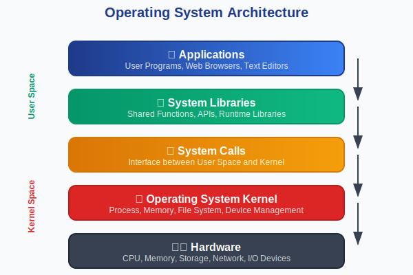
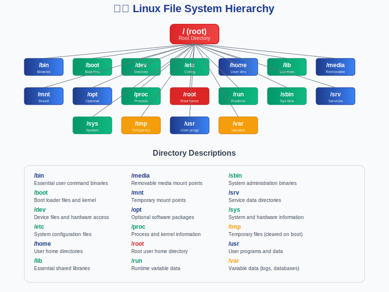
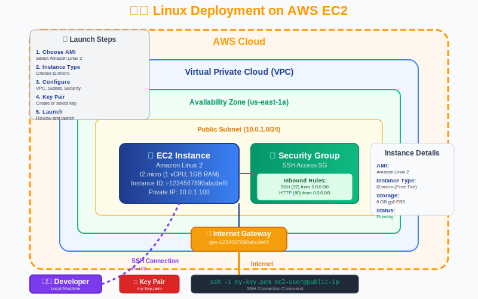

# 🐧 Session 2: Linux Fundamentals
## *Essential Linux Skills for DevOps Professionals*

<div align="center">


**Duration:** 2 Weeks | **Level:** Beginner to Intermediate | **Type:** Hands-on + Theory

</div>

---

## 📋 Presentation Navigation
<div align="center">

| [🎯 Overview](#-slide-1-session-overview) | [📚 Learning Goals](#-slide-2-learning-objectives) | [💻 Operating Systems](#-slide-3-operating-systems-fundamentals) | [🐧 Linux Overview](#-slide-4-linux-operating-system) |
|:---:|:---:|:---:|:---:|
| [📁 File System](#-slide-5-linux-file-system--navigation) | [⚡ Basic Commands](#-slide-6-essential-linux-commands) | [🔧 Advanced Commands](#-slide-7-advanced-linux-commands) | [📝 Text Editors](#-slide-8-text-editors--file-management) |
| [☁️ Cloud Deployment](#-slide-9-linux-on-aws-cloud) | [🔐 SSH & Security](#-slide-10-ssh--secure-access) | [📜 Shell Scripting](#-slide-11-shell-scripting-mastery) | [👥 User Management](#-slide-12-user--system-administration) |
| [🎓 Next Steps](#-slide-13-next-steps--takeaways) | | | |

</div>

---

## 🎯 Slide 1: Session Overview

<div align="center">

### 🌟 **Master Linux for DevOps Excellence**

</div>

> **Mission:** Build essential Linux skills for cloud computing and DevOps automation

### 🎪 **Why Linux Matters for DevOps**
```
🌐 90% of Cloud Infrastructure    📊 95% of Container Platforms    🔧 100% of DevOps Tools
💰 Lower TCO than Windows        🔒 Superior Security Model       🚀 Automation-Friendly
```

### 📅 **Session Structure**
- **Week 1:** Linux Fundamentals & Command Line Mastery
- **Week 2:** Shell Scripting & System Administration

### 🎯 **Target Audience**
- DevOps engineers transitioning to Linux
- System administrators exploring cloud
- Developers needing server-side skills
- IT professionals building automation

---

## 📚 Slide 2: Learning Objectives

<div align="center">

### 🎓 **By the End of This Session, You Will:**

</div>

<table>
<tr>
<td width="50%">

### 🧠 **Core Linux Skills**
- ✅ **Navigate** Linux file systems confidently
- ✅ **Execute** basic and advanced commands
- ✅ **Manage** files, directories, and permissions
- ✅ **Use** text editors (vi/vim) effectively

</td>
<td width="50%">

### 🛠️ **DevOps Applications**
- ✅ **Deploy** Linux instances on AWS cloud
- ✅ **Implement** secure SSH access with keys
- ✅ **Write** shell scripts for automation
- ✅ **Administer** users and system resources

</td>
</tr>
</table>

### 🎯 **Success Metrics**
```
Command Proficiency: 50+ commands | Shell Scripting: 5+ scripts | AWS Deployment: Live instance
```

---

## 💻 Slide 3: Operating Systems Fundamentals

<div align="center">

### 🖥️ **Understanding Operating Systems**



</div>

### 🏗️ **Operating System Functions**

<table>
<tr>
<td width="33%">

### ⚙️ **Process Management**
*Running Programs*
- 🔄 Process scheduling
- 🧵 Thread management
- 💾 Memory allocation
- 🔒 Resource protection

</td>
<td width="33%">

### 📁 **File System**
*Data Organization*
- 🗂️ File storage
- 📂 Directory structure
- 🔐 Access permissions
- 💿 Device management

</td>
<td width="33%">

### 🌐 **Networking**
*System Communication*
- 🔗 Network protocols
- 🛡️ Security layers
- 📡 Remote access
- 🔄 Data transfer

</td>
</tr>
</table>

### 📊 **OS Market Share (Server Environment)**
```
Linux: 96.3% | Windows Server: 1.9% | Unix: 1.8%
```

---

## 🐧 Slide 4: Linux Operating System

<div align="center">

### 🌟 **Linux: The DevOps Foundation**


</div>

<table>
<tr>
<td width="50%">

### 🏗️ **Linux Architecture Layers**
- **🖥️ Hardware** - Physical components
- **🔧 Kernel** - Core operating system
- **📚 System Libraries** - Shared functions
- **🐚 Shell** - Command interface
- **📱 Applications** - User programs

### 🎯 **Why Linux for DevOps?**
- 🆓 **Open Source** - Free and customizable
- 🛡️ **Security** - Strong permission model
- ⚡ **Performance** - Efficient resource usage
- 🤖 **Automation** - Script-friendly environment

</td>
<td width="50%">

### 📦 **Popular Linux Distributions**

**🏢 Enterprise:**
- **Red Hat Enterprise Linux** - Commercial support
- **Amazon Linux** - AWS-optimized
- **CentOS** - Community enterprise
- **SUSE Linux** - Enterprise-focused

**👥 Community:**
- **Ubuntu** - User-friendly, popular
- **Debian** - Stable, reliable
- **Fedora** - Cutting-edge features
- **Arch Linux** - Minimalist approach

</td>
</tr>
</table>

### 📈 **Linux Adoption Statistics**
```
Cloud Servers: 90% | Containers: 99% | Supercomputers: 100% | Mobile (Android): 71%
```

---

## 📁 Slide 5: Linux File System & Navigation

<div align="center">

### 🗂️ **Linux File System Hierarchy**



</div>

<table>
<tr>
<td width="50%">

### 📂 **Key Directories**
- **`/`** - Root directory (everything starts here)
- **`/home`** - User home directories
- **`/etc`** - Configuration files
- **`/var`** - Variable data (logs, databases)
- **`/usr`** - User programs and libraries
- **`/bin`** - Essential user binaries
- **`/sbin`** - System administration binaries
- **`/tmp`** - Temporary files

</td>
<td width="50%">

### 🧭 **Navigation Commands**
```bash
# Directory Navigation
pwd                 # Print working directory
ls -la             # List files (detailed)
cd /path/to/dir    # Change directory
cd ~               # Go to home directory
cd ..              # Go up one level
cd -               # Go to previous directory

# Path Types
/absolute/path     # Absolute path
relative/path      # Relative path
~/user/path        # Home directory path
```

</td>
</tr>
</table>

### 💡 **File System Best Practices**
- Use absolute paths in scripts
- Understand permission inheritance
- Regular cleanup of `/tmp` directory
- Monitor `/var/log` for system health

---

## ⚡ Slide 6: Essential Linux Commands

<div align="center">

### 🔧 **Command Line Mastery**

</div>

<table>
<tr>
<td width="33%">

### 📁 **File Operations**
```bash
# Create & Manage Files
touch filename
mkdir dirname
cp source dest
mv old new
rm filename
rm -rf dirname

# File Content
cat filename
less filename
head -n 10 file
tail -f logfile
grep "pattern" file
```

</td>
<td width="33%">

### 🔍 **Search & Find**
```bash
# Find Files
find /path -name "*.txt"
find /path -type f -size +100M
locate filename
which command

# Search Content
grep -r "pattern" /path
grep -i "text" file
grep -n "line" file
awk '{print $1}' file
sed 's/old/new/g' file
```

</td>
<td width="33%">

### 📊 **System Information**
```bash
# System Status
ps aux
top
htop
df -h
du -sh /path
free -h
uptime
uname -a

# Network
netstat -tulpn
ss -tulpn
ping hostname
curl -I url
```

</td>
</tr>
</table>

### 🎯 **Command Efficiency Tips**
```
Use Tab completion | History with ↑↓ arrows | Aliases for frequent commands | Pipe commands with |
```

---

## 🔧 Slide 7: Advanced Linux Commands

<div align="center">

### 🚀 **Power User Commands**

</div>

<table>
<tr>
<td width="50%">

### 📦 **Package Management**

**🔴 Red Hat/CentOS/Amazon Linux:**
```bash
# YUM/DNF Package Manager
yum update
yum install package-name
yum remove package-name
yum search keyword
yum list installed

# DNF (newer)
dnf update
dnf install package-name
dnf info package-name
```

**🟠 Ubuntu/Debian:**
```bash
# APT Package Manager
apt update
apt upgrade
apt install package-name
apt remove package-name
apt search keyword
apt list --installed
```

</td>
<td width="50%">

### ⚙️ **System Control**
```bash
# Service Management
systemctl start service
systemctl stop service
systemctl restart service
systemctl enable service
systemctl status service
systemctl list-units

# Process Management
kill PID
killall process-name
nohup command &
jobs
bg %1
fg %1
```

</td>
</tr>
</table>

### 🗜️ **Archive & Compression**
```bash
tar -czf archive.tar.gz directory/    # Create compressed archive
tar -xzf archive.tar.gz              # Extract archive
zip -r archive.zip directory/        # Create zip file
unzip archive.zip                    # Extract zip file
```

---

## 📝 Slide 8: Text Editors & File Management

<div align="center">

### ✏️ **Mastering Vi/Vim Editor**

</div>

<table>
<tr>
<td width="50%">

### 🎮 **Vim Modes & Navigation**
```bash
# Vim Modes
i          # Insert mode
Esc        # Normal mode
:          # Command mode
v          # Visual mode

# Navigation (Normal mode)
h j k l    # Left, Down, Up, Right
w b        # Word forward/backward
0 $        # Line start/end
gg G       # File start/end
/pattern   # Search forward
n N        # Next/previous search
```

</td>
<td width="50%">

### ⚡ **Vim Editing Commands**
```bash
# Editing (Normal mode)
x          # Delete character
dd         # Delete line
yy         # Copy line
p P        # Paste after/before
u          # Undo
Ctrl+r     # Redo
:%s/old/new/g  # Replace all

# Save & Exit (Command mode)
:w         # Save
:q         # Quit
:wq        # Save and quit
:q!        # Quit without saving
```

</td>
</tr>
</table>

### 📋 **File Permissions**
```bash
chmod 755 file    # rwxr-xr-x (owner: all, group/others: read+execute)
chmod 644 file    # rw-r--r-- (owner: read+write, others: read only)
chown user:group file    # Change ownership
chgrp group file         # Change group
```

---

## ☁️ Slide 9: Linux on AWS Cloud

<div align="center">

### 🌐 **Deploying Linux in the Cloud**



</div>

<table>
<tr>
<td width="50%">

### 🚀 **EC2 Instance Launch Process**
1. **🔐 Access AWS Console**
   - Login to AWS Management Console
   - Navigate to EC2 service

2. **📱 Choose AMI**
   - Amazon Linux 2
   - Ubuntu Server 20.04 LTS
   - Red Hat Enterprise Linux
   - CentOS

3. **⚙️ Configure Instance**
   - Instance type (t2.micro for free tier)
   - VPC and subnet selection
   - Security group configuration

</td>
<td width="50%">

### 🔒 **Security Configuration**
```bash
# Security Group Rules
Type: SSH
Protocol: TCP
Port: 22
Source: Your IP (recommended)

# Key Pair Management
# Download .pem file securely
# Set proper permissions
chmod 400 my-key.pem
```

### 💰 **Instance Types**
- **t2.micro** - 1 vCPU, 1GB RAM (Free Tier)
- **t3.small** - 2 vCPU, 2GB RAM
- **m5.large** - 2 vCPU, 8GB RAM
- **c5.large** - 2 vCPU, 4GB RAM

</td>
</tr>
</table>

### 🎯 **Best Practices**
- Use IAM roles instead of access keys
- Regular security updates
- Monitor with CloudWatch
- Backup with snapshots

---

## 🔐 Slide 10: SSH & Secure Access

<div align="center">

### 🛡️ **Secure Shell (SSH) Mastery**

</div>

<table>
<tr>
<td width="50%">

### 🔑 **SSH Key Authentication**
```bash
# Generate SSH Key Pair
ssh-keygen -t rsa -b 4096 -C "email@example.com"
ssh-keygen -t ed25519 -C "email@example.com"

# Copy Public Key to Server
ssh-copy-id user@hostname
cat ~/.ssh/id_rsa.pub | ssh user@host "mkdir -p ~/.ssh && cat >> ~/.ssh/authorized_keys"

# Connect with Private Key
ssh -i ~/.ssh/private-key user@hostname
ssh -i ~/Downloads/my-key.pem ec2-user@ec2-ip
```

</td>
<td width="50%">

### 📁 **SFTP & SCP File Transfer**
```bash
# SFTP Commands
sftp user@hostname
get remote-file        # Download
put local-file         # Upload
get -r remote-dir      # Download directory
put -r local-dir       # Upload directory

# SCP Commands
scp file user@host:/path/      # Upload file
scp user@host:/file /local/    # Download file
scp -r dir user@host:/path/    # Upload directory
scp -i key file user@host:/    # With private key
```

</td>
</tr>
</table>

### ⚙️ **SSH Configuration**
```bash
# ~/.ssh/config
Host myserver
    HostName server.example.com
    User myusername
    IdentityFile ~/.ssh/my-private-key
    Port 22

# Connect using alias: ssh myserver
```

---

## 📜 Slide 11: Shell Scripting Mastery

<div align="center">

### 🤖 **Automation with Shell Scripts**

</div>

<table>
<tr>
<td width="50%">

### 📝 **Basic Script Structure**
```bash
#!/bin/bash
# Script description

# Variables
NAME="DevOps"
COUNT=10
FRUITS=("apple" "banana" "orange")

# Output
echo "Hello, $NAME!"
echo "Count: $COUNT"
echo "First fruit: ${FRUITS[0]}"

# Environment variables
echo "Home: $HOME"
echo "User: $USER"
echo "Path: $PATH"
```

</td>
<td width="50%">

### 🔄 **Control Structures**
```bash
# If-else statements
if [ $AGE -gt 18 ]; then
    echo "Adult"
elif [ $AGE -eq 18 ]; then
    echo "Just turned adult"
else
    echo "Minor"
fi

# For loops
for i in {1..5}; do
    echo "Number: $i"
done

# While loops
counter=1
while [ $counter -le 5 ]; do
    echo "Counter: $counter"
    ((counter++))
done
```

</td>
</tr>
</table>

### 🔧 **Advanced Scripting**
```bash
# Functions
greet() {
    local name=$1
    echo "Hello, $name!"
}

# Error handling
set -e  # Exit on error
command || { echo "Command failed"; exit 1; }

# File operations
while IFS= read -r line; do
    echo "Processing: $line"
done < "input.txt"
```

---

## 👥 Slide 12: User & System Administration

<div align="center">

### 🔧 **System Administration Essentials**

</div>

<table>
<tr>
<td width="50%">

### 👤 **User Management**
```bash
# Create Users
sudo useradd -m username
sudo useradd -m -s /bin/bash username
sudo passwd username

# Modify Users
sudo usermod -c "Full Name" username
sudo usermod -d /new/home username
sudo usermod -a -G sudo username

# Delete Users
sudo userdel username
sudo userdel -r username  # Remove home dir
```

</td>
<td width="50%">

### 👥 **Group Management**
```bash
# Group Operations
sudo groupadd groupname
sudo groupmod -n newname oldname
sudo groupdel groupname

# User-Group Relations
sudo gpasswd -a user group    # Add user to group
sudo gpasswd -d user group    # Remove user from group
groups username               # List user's groups
id username                   # User and group IDs
```

</td>
</tr>
</table>

### 🔐 **Permission Management**
```bash
# Numeric permissions (rwx = 421)
chmod 755 file    # rwxr-xr-x
chmod 644 file    # rw-r--r--
chmod 600 file    # rw-------

# Symbolic permissions
chmod u+x file    # Add execute for owner
chmod g-w file    # Remove write for group
chmod o=r file    # Set others to read only
chmod a+r file    # Add read for all
```

---

## 🎓 Slide 13: Next Steps & Takeaways

<div align="center">

### 🌟 **Your Linux Journey Continues**

</div>

<table>
<tr>
<td width="50%">

### 🎯 **Key Takeaways**
1. 🐧 **Linux is Essential** - Foundation for DevOps
2. 📝 **Command Line Power** - Efficiency and automation
3. 🔐 **Security First** - SSH keys and permissions
4. 🤖 **Scripting Skills** - Automate repetitive tasks
5. ☁️ **Cloud Integration** - AWS EC2 deployment
6. 👥 **System Administration** - User and resource management
7. 📚 **Continuous Learning** - Practice makes perfect

</td>
<td width="50%">

### 🛤️ **Learning Path Forward**
- **Next Session:** [Mastering Git](../Session-3_Mastering-Git/)
- **Then:** [Jenkins CI/CD](../Session-4_Jenkins/)
- **Advanced:** [Terraform IaC](../Terraform/)

### 🎯 **Immediate Actions**
- ✅ Complete Linux fundamentals assessment
- 🚀 Launch your first AWS EC2 instance
- 📜 Write your first shell script
- 🔐 Set up SSH key authentication

</td>
</tr>
</table>

---

## 🛠️ Hands-On Activities

<details>
<summary><strong>🔬 Lab 1: Linux System Exploration</strong></summary>

### Objective
Launch and explore a Linux system on AWS EC2

### Tasks
1. **AWS EC2 Setup**
   - Launch Amazon Linux 2 instance
   - Configure security groups
   - Connect via SSH

2. **File System Exploration**
   - Navigate directory hierarchy
   - Understand file permissions
   - Practice basic commands

3. **System Information**
   - Check system resources
   - Monitor processes
   - Explore log files

### Deliverables
- Running EC2 instance
- Command execution screenshots
- System exploration report

</details>

<details>
<summary><strong>⚡ Lab 2: Command Line Mastery</strong></summary>

### Objective
Master essential Linux commands and operations

### Tasks
1. **File Operations**
   - Create, copy, move, delete files
   - Work with directories
   - Manage permissions

2. **Text Processing**
   - Use grep, awk, sed
   - Process log files
   - Search and filter data

3. **System Monitoring**
   - Monitor processes with top/htop
   - Check disk usage
   - Analyze system performance

### Deliverables
- Command reference sheet
- Text processing examples
- System monitoring report

</details>

<details>
<summary><strong>🔐 Lab 3: SSH & Security Configuration</strong></summary>

### Objective
Implement secure remote access and file transfer

### Tasks
1. **SSH Key Setup**
   - Generate SSH key pairs
   - Configure key-based authentication
   - Set up SSH config file

2. **Secure File Transfer**
   - Practice SFTP commands
   - Use SCP for file copying
   - Implement secure workflows

3. **Security Hardening**
   - Configure SSH daemon
   - Set up firewall rules
   - Implement access controls

### Deliverables
- SSH key configuration
- Secure access documentation
- Security checklist

</details>

<details>
<summary><strong>📜 Lab 4: Shell Scripting Project</strong></summary>

### Objective
Create practical automation scripts

### Tasks
1. **System Monitoring Script**
   - Check disk usage
   - Monitor memory and CPU
   - Generate alerts

2. **User Management Script**
   - Automate user creation
   - Set up permissions
   - Generate reports

3. **Backup Automation**
   - Create backup scripts
   - Schedule with cron
   - Implement rotation

### Deliverables
- 3 working shell scripts
- Script documentation
- Automation demonstration

</details>

---

## 📚 Resources & References

<details>
<summary><strong>📖 Essential Reading</strong></summary>

### Books
- 📚 **"The Linux Command Line"** by William Shotts
- 📚 **"Linux Administration: A Beginner's Guide"** by Wale Soyinka
- 📚 **"UNIX and Linux System Administration Handbook"** by Evi Nemeth
- 📚 **"Learning the bash Shell"** by Cameron Newham

### Online Documentation
- 📄 **Linux Documentation Project** - Comprehensive guides
- 📄 **GNU/Linux Command-Line Tools** - Command reference
- 📄 **Bash Guide for Beginners** - Shell scripting basics
- 📄 **Advanced Bash-Scripting Guide** - Advanced techniques

</details>

<details>
<summary><strong>🌐 Online Resources</strong></summary>

### Interactive Learning
- 🌐 [Linux Journey](https://linuxjourney.com/) - Interactive tutorials
- 🌐 [OverTheWire Wargames](https://overthewire.org/wargames/) - Security challenges
- 🌐 [Explainshell](https://explainshell.com/) - Command explanation
- 🌐 [Bash Academy](https://guide.bash.academy/) - Bash scripting guide

### Video Content
- 🎥 **YouTube Channels:** Linux Academy, TechWorld with Nana
- 🎥 **Course Platforms:** Pluralsight, Udemy, Linux Academy
- 🎥 **Conference Talks:** LinuxCon, Open Source Summit

</details>

<details>
<summary><strong>🛠️ Tools & Utilities</strong></summary>

### Essential Tools
- **Terminal Emulators:** iTerm2 (Mac), Windows Terminal, GNOME Terminal
- **SSH Clients:** OpenSSH, PuTTY, MobaXterm
- **Text Editors:** Vim, Nano, Emacs
- **File Managers:** Midnight Commander, Ranger

### Cloud Platforms
- ☁️ **AWS EC2** - Elastic Compute Cloud
- ☁️ **Google Cloud Compute** - Virtual machines
- ☁️ **Azure Virtual Machines** - Cloud computing
- ☁️ **DigitalOcean Droplets** - Simple cloud servers

</details>

---

## 📊 Assessment & Certification

<div align="center">

### 🎯 **Knowledge Validation**

</div>

<table>
<tr>
<td width="50%">

### 📝 **Assessment Methods**
- **Practical Labs:** Command line proficiency (40%)
- **Shell Scripts:** Automation projects (30%)
- **System Admin:** User and permission management (20%)
- **Security:** SSH and access control (10%)

### 🏆 **Passing Criteria**
- Overall score: 80% or higher
- All labs completed successfully
- Working shell scripts demonstrated
- Security best practices implemented

</td>
<td width="50%">

### 🎓 **Certification Preparation**
- **Linux Professional Institute (LPI)** - LPIC-1
- **Red Hat Certified System Administrator** - RHCSA
- **CompTIA Linux+** - Vendor-neutral certification
- **AWS Certified SysOps Administrator** - Cloud focus

### 📈 **Career Benefits**
- Linux skills premium: 15-25% salary increase
- DevOps role preparation
- Cloud platform readiness
- Automation capabilities

</td>
</tr>
</table>

---

<div align="center">

## 🚀 **Ready to Master Linux?**

### *"In the world of DevOps, Linux is not just an option—it's the foundation"*

**Next Session:** [Mastering Git →](../Session-3_Mastering-Git/)

---

**Created by Varun Kumar Manik**  
*AWS Ambassador | Kubernetes Expert | DevOps Specialist*

**Session 2: Linux Fundamentals** | **Section 2: DevOps & Infrastructure as Code**  
*Last Updated: July 2025*

</div>
