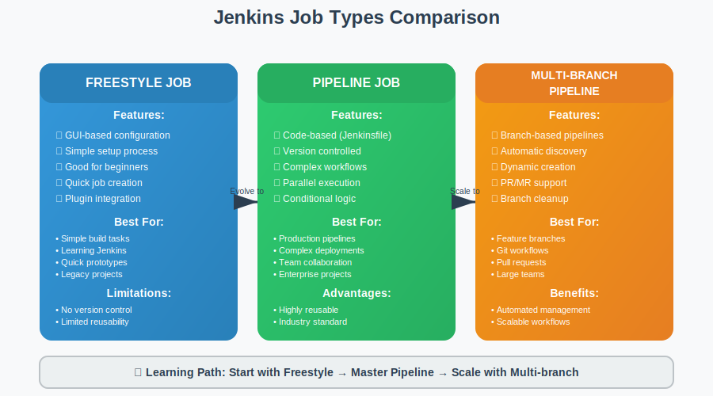

# 🔧 Module 03: Basic Jobs

**🎯 Create Your First Jobs | 🔧 Freestyle & Maven | 📊 Build Automation**

---

## 📋 Module Overview

This module introduces you to creating and managing basic Jenkins jobs. You'll learn the fundamentals of job configuration, build triggers, and automation using both Freestyle and Maven-based approaches.

### 🎯 **Learning Objectives**
- ✅ Create and configure Freestyle jobs
- ✅ Set up Maven-based build jobs
- ✅ Configure build triggers and schedules
- ✅ Understand job parameters and variables
- ✅ Implement basic build automation

---

## 🛤️ Module Structure

<table>
<tr>
<th width="10%">Project</th>
<th width="30%">Name</th>
<th width="40%">Description</th>
<th width="20%">Skills</th>
</tr>

<tr>
<td><strong>3.1</strong></td>
<td><strong><a href="./3.1_free_style">Freestyle Jobs</a></strong></td>
<td>Create basic freestyle Jenkins jobs with build steps and post-build actions</td>
<td>Job Configuration, Build Steps, Shell Commands</td>
</tr>

<tr>
<td><strong>3.2</strong></td>
<td><strong><a href="./3.2_maven_style">Maven Jobs</a></strong></td>
<td>Configure Maven-based jobs for Java application builds with dependency management</td>
<td>Maven Integration, Java Builds, Dependency Management</td>
</tr>

</table>

---

## 📚 Theory: Jenkins Job Types

### **Freestyle Jobs**
Freestyle jobs are the most flexible job type in Jenkins, allowing you to configure builds using a web-based interface.

#### **Key Features:**
- 🎯 **GUI Configuration** - Easy point-and-click setup
- 🔧 **Flexible Build Steps** - Execute shell commands, batch files, or scripts
- 📊 **Plugin Integration** - Use any Jenkins plugin
- 🔄 **Simple Workflow** - Perfect for straightforward build processes

#### **Best Use Cases:**
- Simple build and deployment tasks
- Learning Jenkins fundamentals
- Quick prototyping and testing
- Legacy project integration

### **Maven Jobs**
Maven jobs are specialized for Java projects that use Maven as their build tool.

#### **Key Features:**
- ☕ **Java-Focused** - Optimized for Java/Maven projects
- 📦 **Dependency Management** - Automatic dependency resolution
- 🧪 **Test Integration** - Built-in test execution and reporting
- 📊 **Artifact Management** - Automatic artifact archiving

#### **Best Use Cases:**
- Java application builds
- Maven-based projects
- Automated testing workflows
- Enterprise Java development

---

## 🚀 Getting Started

### **Prerequisites**
- ✅ Jenkins installed and running (Module 02 completed)
- ✅ Basic understanding of build processes
- ✅ Java and Maven knowledge (for Maven jobs)
- ✅ Access to Jenkins web interface

### **Learning Path**
1. **Start with Freestyle Jobs** - Learn basic job creation
2. **Master Build Configuration** - Understand build steps and triggers
3. **Progress to Maven Jobs** - Java-specific build automation
4. **Practice Job Management** - Create, modify, and delete jobs

---

## 📊 Expected Outcomes

After completing this module, you will have:

### **Practical Skills**
- ✅ **Job Creation** - Create various types of Jenkins jobs
- ✅ **Build Configuration** - Configure build steps and parameters
- ✅ **Trigger Management** - Set up automated build triggers
- ✅ **Result Analysis** - Understand build results and logs

### **Technical Knowledge**
- ✅ **Jenkins UI Navigation** - Efficient use of Jenkins interface
- ✅ **Build Process Understanding** - How builds work in Jenkins
- ✅ **Maven Integration** - Java build automation
- ✅ **Troubleshooting** - Debug common build issues

---

## 🔍 Key Concepts Covered

### **Job Configuration**
- Build triggers (SCM polling, webhooks, scheduled builds)
- Build environment setup
- Build steps configuration
- Post-build actions

### **Build Management**
- Build history and logs
- Workspace management
- Artifact archiving
- Build parameters

### **Integration Points**
- Source control integration
- Plugin usage and configuration
- Notification setup
- Build result publishing

---

## ➡️ Next Steps

Once you've mastered basic jobs:
1. **Practice Different Scenarios** - Try various build configurations
2. **Explore Build Triggers** - Set up automated builds
3. **Proceed to Module 04** - [Pipeline Fundamentals](../04_pipeline_fundamentals/README.md)

---

### 🎯 **Ready to Create Your First Jenkins Jobs?**

**Start Building: [3.1 Freestyle Jobs](./3.1_free_style/README.md)**

*Master the fundamentals of Jenkins job creation and build automation!*

