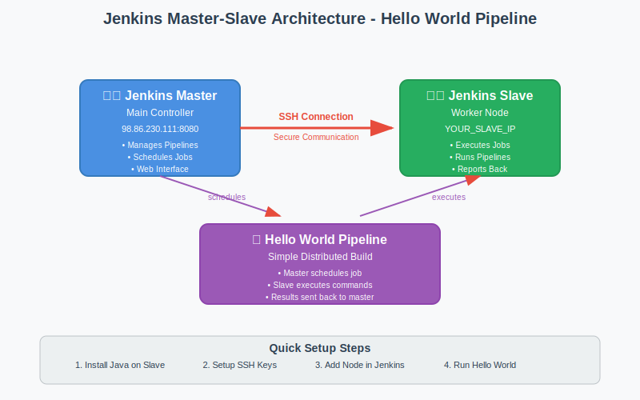

# 🏗️ Jenkins Master-Slave Architecture

<div align="center">


**🎯 Simple Setup | 🔄 Distributed Builds | 🚀 Hello World Pipeline**

</div>

---

## 🌟 Overview

Learn Jenkins Master-Slave architecture with a **simple Hello World pipeline** running on two EC2 instances. This demonstrates how to distribute build workloads across multiple servers.

### **🎯 What You'll Learn:**
- **Master-Slave Setup** - Connect two EC2 instances
- **Distributed Builds** - Run jobs on remote slave
- **Simple Pipeline** - Hello World example
- **SSH Connection** - Secure slave communication

---

## 🏗️ Architecture



*Simple Jenkins Master-Slave setup for distributed Hello World pipeline execution*

```
┌─────────────────┐    SSH    ┌─────────────────┐
│  Jenkins Master │ ────────► │  Jenkins Slave  │
│  (Main Server)  │           │  (Worker Node)  │
│  98.86.230.111  │           │  YOUR_SLAVE_IP  │
└─────────────────┘           └─────────────────┘
```

---

## 🚀 Quick Setup Guide

### **Prerequisites:**
- ✅ **Jenkins Master** - Already running (98.86.230.111:8080)
- ✅ **Second EC2 Instance** - Your new Linux VM
- ✅ **SSH Access** - Between master and slave

---

## 📋 Step-by-Step Setup

### **Step 1: Prepare Slave Server**

**On your second EC2 instance:**

```bash
# Update system
sudo yum update -y

# Install Java (required for Jenkins slave)
sudo yum install java-17-amazon-corretto -y

# Verify Java installation
java -version

# Create jenkins user
sudo useradd -m jenkins

# Create SSH directory for jenkins user
sudo mkdir -p /home/jenkins/.ssh
sudo chown jenkins:jenkins /home/jenkins/.ssh
sudo chmod 700 /home/jenkins/.ssh
```

### **Step 2: Generate SSH Keys on Master**

**On Jenkins Master (98.86.230.111):**

```bash
# Switch to jenkins user
sudo su - jenkins

# Generate SSH key pair
ssh-keygen -t rsa -b 4096 -f ~/.ssh/jenkins_slave_key

# Display public key (copy this)
cat ~/.ssh/jenkins_slave_key.pub
```

### **Step 3: Configure SSH Access**

**On Slave Server:**

```bash
# Add master's public key to slave
sudo su - jenkins
echo "PASTE_PUBLIC_KEY_HERE" >> ~/.ssh/authorized_keys
chmod 600 ~/.ssh/authorized_keys

# Test SSH connection from master
# ssh -i ~/.ssh/jenkins_slave_key jenkins@YOUR_SLAVE_IP
```

### **Step 4: Add Slave Node in Jenkins**

**In Jenkins Web UI:**

1. **Navigate to Nodes:**
   ```
   Jenkins Dashboard → Manage Jenkins → Manage Nodes and Clouds
   ```

2. **Add New Node:**
   ```
   New Node → Node name: "slave-node-1" → Permanent Agent → OK
   ```

3. **Configure Node:**
   ```yaml
   Name: slave-node-1
   Description: Simple Hello World Slave
   Number of executors: 2
   Remote root directory: /home/jenkins
   Labels: linux slave hello-world
   Usage: Use this node as much as possible
   Launch method: Launch agents via SSH
   Host: YOUR_SLAVE_IP
   Credentials: Add → SSH Username with private key
     Username: jenkins
     Private Key: Enter directly → [Paste private key content]
   Host Key Verification Strategy: Non verifying Verification Strategy
   ```

4. **Save and Launch:**
   ```
   Save → Launch agent
   ```

---

## 🎯 Hello World Pipeline

### **Create Simple Pipeline Job:**

1. **New Pipeline:**
   ```
   Jenkins Dashboard → New Item → Pipeline → Name: "hello-world-slave"
   ```

2. **Pipeline Script:**
   ```groovy
   pipeline {
       agent {
           label 'slave'
       }
       
       stages {
           stage('Hello from Slave') {
               steps {
                   script {
                       echo "🎉 Hello World from Jenkins Slave!"
                       echo "Running on: ${env.NODE_NAME}"
                       echo "Workspace: ${env.WORKSPACE}"
                       
                       // Show system info
                       sh 'hostname'
                       sh 'whoami'
                       sh 'pwd'
                       sh 'date'
                       sh 'uname -a'
                   }
               }
           }
           
           stage('Simple Commands') {
               steps {
                   echo "Executing simple commands on slave..."
                   sh 'echo "This is running on the slave node!"'
                   sh 'ls -la'
                   sh 'df -h'
                   sh 'free -m'
               }
           }
           
           stage('Create Test File') {
               steps {
                   sh '''
                   echo "Hello from Jenkins Slave Node!" > hello-slave.txt
                   echo "Generated on: $(date)" >> hello-slave.txt
                   echo "Hostname: $(hostname)" >> hello-slave.txt
                   cat hello-slave.txt
                   '''
               }
           }
       }
       
       post {
           success {
               echo "✅ Hello World pipeline completed successfully on slave!"
           }
           failure {
               echo "❌ Pipeline failed on slave node"
           }
       }
   }
   ```

---

## 🔧 Troubleshooting

### **Common Issues:**

#### **SSH Connection Failed:**
```bash
# Check SSH connectivity from master
ssh -i ~/.ssh/jenkins_slave_key jenkins@YOUR_SLAVE_IP

# Verify SSH service on slave
sudo systemctl status sshd
sudo systemctl start sshd
```

#### **Java Not Found:**
```bash
# Install Java on slave
sudo yum install java-17-amazon-corretto -y

# Check Java path
which java
/usr/bin/java -version
```

#### **Permission Issues:**
```bash
# Fix jenkins user permissions
sudo chown -R jenkins:jenkins /home/jenkins
sudo chmod 700 /home/jenkins/.ssh
sudo chmod 600 /home/jenkins/.ssh/authorized_keys
```

---

## 🎯 Testing Your Setup

### **Verify Slave Connection:**

1. **Check Node Status:**
   ```
   Jenkins → Manage Nodes → slave-node-1 should show "In sync"
   ```

2. **Run Hello World Pipeline:**
   ```
   Build Now → Check Console Output
   Should show: "Running on slave-node-1"
   ```

3. **Expected Output:**
   ```
   🎉 Hello World from Jenkins Slave!
   Running on: slave-node-1
   Workspace: /home/jenkins/workspace/hello-world-slave
   [slave-node-1] $ hostname
   YOUR_SLAVE_HOSTNAME
   [slave-node-1] $ whoami
   jenkins
   ```

---

## 🏆 Success Indicators

### **✅ Setup Complete When:**
- Slave node shows "In sync" status
- Hello World pipeline runs on slave
- Console output shows slave hostname
- Files created in slave workspace
- No SSH connection errors

### **🎉 Congratulations!**
You've successfully set up Jenkins Master-Slave architecture with a working Hello World pipeline!

---

## 🚀 Next Steps

### **Expand Your Setup:**
1. **Add More Slaves** - Scale to multiple worker nodes
2. **Label-Based Routing** - Route specific jobs to specific slaves
3. **Load Balancing** - Distribute builds across slaves
4. **Monitoring** - Track slave performance and usage

### **Advanced Pipelines:**
1. **Parallel Builds** - Run jobs simultaneously on multiple slaves
2. **Matrix Builds** - Test across different environments
3. **Conditional Execution** - Route based on conditions

---

*Simple, effective, and ready for production scaling!* 🚀
