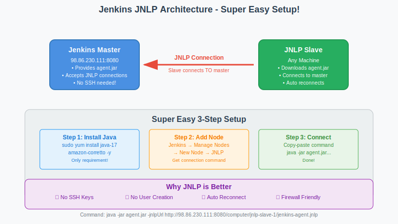

# 🚀 Jenkins Master-Slave with JNLP - Super Easy Setup!

<div align="center">


**🎯 No SSH Keys | 🔄 Auto Connection | 🚀 5-Minute Setup**

</div>

---

## 📖 Introduction

Welcome to **Jenkins Master-Slave Architecture** - one of the most powerful concepts in modern DevOps! This hands-on tutorial will teach you how to **distribute your build workloads** across multiple machines, dramatically improving your CI/CD pipeline performance and scalability.

### **🎯 What You'll Learn:**
In this practical session, you'll master the art of **distributed Jenkins builds** by setting up a master-slave architecture using the **JNLP (Java Network Launch Protocol)** approach. This is the **easiest and most beginner-friendly** method to get started with Jenkins distributed computing.

### **🚀 Real-World Impact:**
By the end of this tutorial, you'll understand how companies like **Netflix, Amazon, and Google** scale their build infrastructure to handle **thousands of builds per day** across multiple environments. You'll have hands-on experience with:

- **Distributed Computing** - Spread builds across multiple machines
- **Load Balancing** - Automatically distribute work to available nodes
- **Scalability** - Add more build capacity instantly
- **Resource Optimization** - Use different machines for different types of builds

### **💼 Professional Value:**
This knowledge is **essential for DevOps Engineers** and directly applicable to:
- **Enterprise CI/CD pipelines** with high build volumes
- **Multi-environment deployments** (dev, staging, production)
- **Resource optimization** and cost management
- **Build performance improvement** and parallel execution

### **🎪 Why This Matters:**
Imagine you're working at a growing tech company. Your single Jenkins server is struggling with:
- **Long build queues** - Developers waiting hours for builds
- **Resource constraints** - CPU and memory limitations
- **Single point of failure** - If Jenkins goes down, all builds stop
- **Mixed workloads** - Different projects competing for resources

**Jenkins Master-Slave architecture solves all these problems!** You'll learn to create a **resilient, scalable build infrastructure** that can grow with your organization's needs.

---

## 🌟 Why JNLP is Better

### **✅ Advantages over SSH:**
- **No SSH key management** - Zero key generation/copying
- **No user creation** - Works with any user
- **Firewall friendly** - Outbound connection only
- **Auto reconnection** - Slave reconnects automatically
- **Simpler troubleshooting** - Just download and run
- **Works anywhere** - Even behind NAT/firewalls

### **🎯 Perfect for:**
- Quick testing and demos
- Development environments
- When SSH is complicated
- Temporary slave nodes
- Learning Jenkins concepts

---

## 🏗️ Architecture



*JNLP slave connects TO master - much simpler than SSH setup*

```
┌─────────────────┐           ┌─────────────────┐
│  Jenkins Master │◄──────────│  Jenkins Slave  │
│  (Main Server)  │   JNLP    │  (Any Machine)  │
│  98.86.230.111  │ Connection│  Downloads Agent │
└─────────────────┘           └─────────────────┘
```

**Slave connects TO master (not master TO slave)**

---

## 🚀 Super Quick Setup

### **Step 1: Prepare Slave Machine**

**On your second EC2 instance (or any machine):**

```bash
# Update system
sudo yum update -y

# Install Java (required for Jenkins agent)
sudo yum install java-17-amazon-corretto -y

# Install Git (required for SCM operations)
sudo yum install git -y

# Verify installations
java -version
git --version

# Create workspace (any user can do this)
mkdir -p ~/jenkins-workspace
cd ~/jenkins-workspace
```

### **Step 2: Create JNLP Node in Jenkins**

**In Jenkins Web UI:**

1. **Add New Node:**
   ```
   Jenkins Dashboard → Manage Jenkins → Manage Nodes and Clouds
   → New Node → Node name: "jnlp-slave-1" → Permanent Agent → OK
   ```

2. **Configure Node:**
   ```yaml
   Name: jnlp-slave-1
   Description: JNLP Slave - Super Easy Setup
   Number of executors: 2
   Remote root directory: /home/ec2-user/jenkins-workspace
   Labels: jnlp easy slave
   Usage: Use this node as much as possible
   Launch method: Launch agent by connecting it to the master
   ```

3. **Save Configuration:**
   ```
   Click "Save"
   ```

### **Step 3: Get Connection Command**

**After saving, Jenkins will show:**

1. **Download agent.jar:**
   ```
   Click on "jnlp-slave-1" node
   You'll see: "Run from agent command line:"
   ```

2. **Copy the command** (it looks like this):
   ```bash
   curl -sO http://98.86.230.111:8080/jnlpJars/agent.jar
   java -jar agent.jar -jnlpUrl http://98.86.230.111:8080/computer/jnlp-slave-1/jenkins-agent.jnlp -secret YOUR_SECRET_KEY -workDir "/home/ec2-user/jenkins-workspace"
   ```

### **Step 4: Connect Slave**

**On your slave machine:**

```bash
# Navigate to workspace
cd ~/jenkins-workspace

# Run the exact command from Jenkins UI (copy-paste it)
curl -sO http://98.86.230.111:8080/jnlpJars/agent.jar
java -jar agent.jar -jnlpUrl http://98.86.230.111:8080/computer/jnlp-slave-1/jenkins-agent.jnlp -secret YOUR_SECRET_KEY -workDir "/home/ec2-user/jenkins-workspace"
```

**You should see:**
```
INFO: Connected
INFO: Handshaking
INFO: Handshake complete
INFO: Connected to Jenkins
```

---

## 🎯 Create Hello World Pipeline Job

### **Step 1: Create New Pipeline Job**

**In Jenkins Web UI:**

1. **Create Pipeline:**
   ```
   Jenkins Dashboard → New Item
   → Enter name: "hello-world-jnlp"
   → Select "Pipeline"
   → Click "OK"
   ```

2. **Configure Pipeline:**
   ```
   Scroll down to "Pipeline" section
   Definition: Pipeline script
   ```

3. **Use Jenkinsfile from Repository:**
   ```
   Definition: Pipeline script from SCM
   SCM: Git
   Repository URL: https://github.com/manikcloud/cloud-devops-learning-path.git
   Branch: */main
   Script Path: Section-2-DevOps/Session-4_Jenkins/05_master_slave_architecture/Jenkinsfile
   ```

4. **Save and Build:**
   ```
   Click "Save"
   Click "Build Now"
   ```

# 2. Create workspace
mkdir -p ~/jenkins-workspace && cd ~/jenkins-workspace

# 3. Get command from Jenkins UI and run it
curl -sO http://98.86.230.111:8080/jnlpJars/agent.jar
java -jar agent.jar -jnlpUrl http://98.86.230.111:8080/computer/jnlp-slave-1/jenkins-agent.jnlp -secret YOUR_SECRET -workDir "$(pwd)"
```

### **Pipeline Label:**
```groovy
agent {
    label 'jnlp'
}
```

---

## 🎉 Success!

**JNLP setup is complete when:**
- ✅ Slave shows "Connected" in Jenkins
- ✅ Pipeline runs with `label 'jnlp'`
- ✅ No SSH keys needed
- ✅ Auto-reconnects if disconnected
- ✅ Works from anywhere with internet

**Perfect for quick demos and development environments!** 🚀

---

*JNLP: When you want Jenkins slaves without the SSH complexity!*
