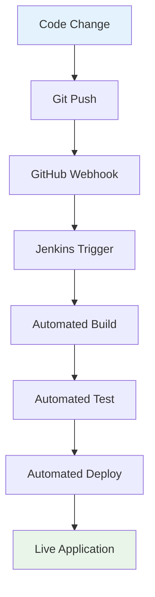

```mermaid
graph LR
    A[Developer] -->|git push| B[GitHub Repository]
    B -->|Webhook| C[Jenkins Server]
    C -->|Trigger| D[Pipeline Execution]
    D -->|Build & Test| E[Maven Build]
    E -->|Deploy| F[Tomcat Server]
    F -->|Live App| G[Address Book]
    
    style A fill:#e1f5fe
    style B fill:#f3e5f5
    style C fill:#e8f5e8
    style D fill:#fff3e0
    style E fill:#fce4ec
    style F fill:#e0f2f1
    style G fill:#f1f8e9
```

# 🔗 Git Integration with Webhook Automation

<div align="center">


**🎯 Automatic Pipeline Triggering | 🔄 Real-time CI/CD | 🚀 Production-Ready Workflow**

</div> 

---

## 🌟 Overview

This section demonstrates **enterprise-grade Git integration** with Jenkins using GitHub webhooks. You'll configure automatic pipeline triggering whenever code is pushed to your repository, creating a seamless continuous integration workflow that mirrors professional development environments.

### **🎯 What You'll Achieve**
- **Automatic Builds** - Pipeline triggers on every git push
- **Real-time Integration** - Instant feedback on code changes  
- **Professional Workflow** - Industry-standard CI/CD practices
- **Zero Manual Intervention** - Fully automated deployment pipeline

---

## 🏗️ Architecture Overview



---

## 📋 Prerequisites

### **✅ Required Setup**
- ✅ Jenkins server running and accessible
- ✅ GitHub repository with your project code
- ✅ Jenkins pipeline already working (from 6.2_pipeline)
- ✅ Public IP address for Jenkins server
- ✅ Port 8080 open for webhook access

### **🔧 Required Jenkins Plugins**
- ✅ **GitHub Integration Plugin** - For webhook support
- ✅ **Pipeline Plugin** - Core pipeline functionality
- ✅ **Git Plugin** - Git SCM integration

---

## 🚀 Step-by-Step Implementation

### **Phase 1: Jenkins Plugin Installation**

#### **Step 1: Install Required Plugins**

1. **Navigate to Plugin Manager:**
   ```
   Jenkins Dashboard → Manage Jenkins → Manage Plugins → Available
   ```

2. **Search and Install These Plugins:**
   - **GitHub Integration Plugin**

3. **Installation Process:**
   ```bash
   # Search for each plugin
   # Check the checkbox
   # Click "Install without restart"
   # Wait for installation to complete
   ```

4. **Restart Jenkins (if required):**
   ```bash
   # If plugins require restart
   sudo systemctl restart jenkins
   
   # Verify Jenkins is running
   sudo systemctl status jenkins
   ```

---

### **Phase 2: Jenkins Pipeline Configuration**

#### **Step 2: Create Webhook-Enabled Pipeline**

1. **Create New Pipeline Job:**
   ```
   Jenkins Dashboard → New Item → Pipeline → Enter name: "AddressBook-Webhook"
   ```

2. **Configure Build Triggers:**
   ```yaml
   Build Triggers:
   ✅ GitHub hook trigger for GITScm polling
   ```

3. **Pipeline Configuration:**
   ```yaml
   Pipeline Definition: Pipeline script from SCM
   SCM: Git
   Repository URL: https://github.com/YOUR_USERNAME/cloud-devops-learning-path.git
   Branch: */main
   Script Path: Section-2-DevOps/Session-4_Jenkins/06_final_project/6.3_git_integration/Jenkinsfile
   ```

#### **Step 3: Configure Webhook URL**

**GitHub Webhook URL:**
```bash
http://98.86.230.111:8080/github-webhook/
```

---

### **Phase 3: GitHub Repository Setup**

#### **Step 4: Fork/Clone Repository**

1. **Fork the Repository:**
   ```bash
   # Go to: https://github.com/manikcloud/cloud-devops-learning-path
   # Click "Fork" button
   # Select your GitHub account
   ```

2. **Clone Your Fork:**
   ```bash
   # Clone your forked repository
   git clone https://github.com/YOUR_USERNAME/cloud-devops-learning-path.git
   cd cloud-devops-learning-path
   
   # Verify remote
   git remote -v
   ```

#### **Step 5: Configure GitHub Webhook**

1. **Navigate to Repository Settings:**
   ```
   Your GitHub Repository → Settings → Webhooks → Add webhook
   ```

2. **Webhook Configuration:**
   ```yaml
   Payload URL: http://98.86.230.111:8080/github-webhook/
   Content type: application/json
   Secret: (leave empty)
   
   Which events would you like to trigger this webhook?
   ✅ Just the push event
   
   Active: ✅ (checked)
   ```

3. **Save Webhook:**
   ```bash
   # Click "Add webhook"
   # GitHub will test the connection
   # Look for green checkmark ✅
   ```

---

### **Phase 4: Security Configuration**

#### **Step 6: Jenkins Security Settings**

1. **Configure Global Security:**
   ```
   Manage Jenkins → Configure Global Security
   ```

2. **Authorization Settings:**
   ```yaml
   Authorization: Logged-in users can do anything
   OR
   Authorization: Anyone can do anything (for testing only)
   
   ⚠️ Note: Use proper authorization in production
   ```

---

### **Phase 5: Testing & Validation**

#### **Step 8: Visual Verification Feature**

**🎨 Background Color Change for Easy Testing:**

This version includes a **visual indicator** to easily verify webhook deployments:

```java
// File: src/main/java/com/mankikdemo/tutorial/addressbook/AddressbookUI.java
// CSS injection for visual confirmation:
getPage().getStyles().add(".v-ui { background-color: #e3f2fd !important; }");
```

**How to See the Visual Change:**
1. **Access the application:** `http://98.86.230.111:8090/addressbook/`
2. **Click "Registration" button** 
3. **Notice the light blue background** - this confirms 6.3 version is deployed

**Visual Differences:**
- **6.2 Pipeline Version:** White background (no color change)
- **6.3 Git Integration Version:** Light blue background when Registration form opens
- **Easy Verification:** Instantly confirm webhook deployment worked

**Color Customization Options:**
```java
// Light Blue (current)
getPage().getStyles().add(".v-ui { background-color: #e3f2fd !important; }");

// Light Green  
getPage().getStyles().add(".v-ui { background-color: #e8f5e8 !important; }");

// Light Red
getPage().getStyles().add(".v-ui { background-color: #ffebee !important; }");
```

#### **Step 9: Test Webhook Integration**

1. **Manual Webhook Test:**
   ```bash
   curl -X POST http://98.86.230.111:8080/github-webhook/
   
   # Should trigger the pipeline
   ```

2. **GitHub Webhook Test:**
   ```
   GitHub Repository → Settings → Webhooks → Your webhook → Recent Deliveries
   # Should show successful delivery with 200 response
   ```

#### **Step 10: End-to-End Test**

1. **Make a Code Change:**
   ```bash
   # In your local repository
   cd cloud-devops-learning-path
   
   # Make a small change
   echo "<!-- Webhook test -->" >> Section-2-DevOps/Session-4_Jenkins/06_final_project/6.3_git_integration/README.md
   
   # Commit and push
   git add .
   git commit -m "Test webhook trigger"
   git push origin main
   ```

2. **Verify Pipeline Execution:**
   ```
   Jenkins Dashboard → AddressBook-Webhook → Build History
   # Should show new build triggered automatically
   ```

3. **Check Build Logs:**
   ```
   Click on build number → Console Output
   # Should show: "Started by GitHub push by YOUR_USERNAME"
   ```

---

## 🔍 Troubleshooting Guide

### **Common Issues & Solutions**

#### **Issue 1: Webhook Not Triggering**

**Symptoms:**
- GitHub shows webhook delivery but Jenkins doesn't trigger
- 404 error in webhook delivery

**Solutions:**
```bash
# Check Jenkins URL accessibility
curl -I http://YOUR_JENKINS_IP:8080

# Verify webhook URL format
http://YOUR_JENKINS_IP:8080/generic-webhook-trigger/invoke?token=YOUR_TOKEN

# Check Jenkins logs
sudo tail -f /var/log/jenkins/jenkins.log
```

#### **Issue 2: Authentication Errors**

**Symptoms:**
- 403 Forbidden errors
- Authentication required messages

**Solutions:**
```yaml
# Jenkins Security Configuration:
Manage Jenkins → Configure Global Security
Authorization: "Anyone can do anything" (for testing)

# Or create API token:
User → Configure → API Token → Add new Token
```

---

## 📊 Monitoring & Validation

### **Webhook Health Check**

#### **Dashboard Monitoring**
```yaml
Jenkins Dashboard Indicators:
✅ Build triggered automatically
✅ "Started by GitHub push" in build logs  
✅ Webhook delivery successful in GitHub
✅ Pipeline completes successfully
```

#### **GitHub Webhook Status**
```yaml
Repository → Settings → Webhooks → Your webhook
Recent Deliveries:
✅ Green checkmark (successful)
❌ Red X (failed) - check response details
```

### **Performance Metrics**
```yaml
Expected Performance:
- Webhook trigger time: < 5 seconds
- Pipeline start time: < 30 seconds  
- Total build time: 3-5 minutes
- Deployment time: < 1 minute
```

---

## 🎯 Success Criteria

### **✅ Validation Checklist**

- [ ] **Plugin Installation** - All required plugins installed
- [ ] **Pipeline Configuration** - Webhook trigger enabled
- [ ] **GitHub Webhook** - Successfully configured and active
- [ ] **Security Settings** - Proper access configuration
- [ ] **Network Access** - Jenkins accessible from GitHub
- [ ] **Automatic Triggering** - Push triggers pipeline
- [ ] **Build Success** - Pipeline completes successfully
- [ ] **Application Deployment** - App accessible after build

### **🚀 Professional Workflow Achieved**



---

## 🎓 Learning Outcomes

### **🔧 Technical Skills Mastered**
- **Webhook Configuration** - GitHub to Jenkins integration
- **Automated Triggering** - Event-driven CI/CD pipelines
- **Security Implementation** - Secure webhook communication
- **Network Configuration** - Firewall and access management
- **Troubleshooting** - Debug webhook and pipeline issues

### **💼 Professional Competencies**
- **DevOps Automation** - End-to-end pipeline automation
- **Integration Patterns** - Tool integration best practices
- **Monitoring & Alerting** - Pipeline health monitoring
- **Security Practices** - Secure CI/CD implementation
- **Production Readiness** - Enterprise-grade workflows

---

## 🚀 Next Steps

### **🔄 Continuous Improvement**
1. **Multi-branch Pipelines** - Support feature branches
2. **Pull Request Integration** - PR-based builds
3. **Slack/Email Notifications** - Build status alerts
4. **Quality Gates** - Code quality checks
5. **Blue-Green Deployment** - Zero-downtime deployments

### **📈 Advanced Topics**
- **GitOps Workflows** - Git-driven deployments
- **Container Integration** - Docker-based pipelines
- **Kubernetes Deployment** - Cloud-native CI/CD
- **Infrastructure as Code** - Terraform integration

---

<div align="center">

## 🎉 **Congratulations!**

### *You've Successfully Implemented Enterprise-Grade Git Integration!*

**Your CI/CD pipeline now automatically responds to code changes, providing instant feedback and seamless deployment - exactly like professional development teams!**

---

**⭐ Star this repository if it helped you!**  
**🔄 Share your success with the community!**  
**🤝 Connect with fellow DevOps engineers!**

---

*Created with ❤️ for DevOps Excellence*

</div>
