```mermaid
graph LR
    A[Developer] -->|git push| B[GitHub Repository]
    B -->|Webhook| C[Jenkins Server]
    C -->|Trigger| D[Pipeline Execution]
    D -->|Build & Test| E[Maven Build]
    E -->|Deploy| F[Tomcat Server]
    F -->|Live App| G[Address Book]
    
    style A fill:#e1f5fe
    style B fill:#f3e5f5
    style C fill:#e8f5e8
    style D fill:#fff3e0
    style E fill:#fce4ec
    style F fill:#e0f2f1
    style G fill:#f1f8e9
```

# 🔗 Git Integration with Webhook Automation

<div align="center">


**🎯 Automatic Pipeline Triggering | 🔄 Real-time CI/CD | 🚀 Production-Ready Workflow**

</div> 

---

## 🌟 Overview

This section demonstrates **enterprise-grade Git integration** with Jenkins using GitHub webhooks. You'll configure automatic pipeline triggering whenever code is pushed to your repository, creating a seamless continuous integration workflow that mirrors professional development environments.

### **🎯 What You'll Achieve**
- **Automatic Builds** - Pipeline triggers on every git push
- **Real-time Integration** - Instant feedback on code changes  
- **Professional Workflow** - Industry-standard CI/CD practices
- **Zero Manual Intervention** - Fully automated deployment pipeline

---

## 🏗️ Architecture Overview



---

## 📋 Prerequisites

### **✅ Required Setup**
- ✅ Jenkins server running and accessible
- ✅ GitHub repository with your project code
- ✅ Jenkins pipeline already working (from 6.2_pipeline)
- ✅ Public IP address for Jenkins server
- ✅ Port 8080 open for webhook access

### **🔧 Required Jenkins Plugins**
- ✅ **GitHub Integration Plugin** - For webhook support
- ✅ **Pipeline Plugin** - Core pipeline functionality
- ✅ **Git Plugin** - Git SCM integration

---

## 🚀 Step-by-Step Implementation

### **Phase 1: Jenkins Plugin Installation**

#### **Step 1: Install Required Plugins**

1. **Navigate to Plugin Manager:**
   ```
   Jenkins Dashboard → Manage Jenkins → Manage Plugins → Available
   ```

2. **Search and Install These Plugins:**
   - **GitHub Integration Plugin**

3. **Installation Process:**
   ```bash
   # Search for each plugin
   # Check the checkbox
   # Click "Install without restart"
   # Wait for installation to complete
   ```

4. **Restart Jenkins (if required):**
   ```bash
   # If plugins require restart
   sudo systemctl restart jenkins
   
   # Verify Jenkins is running
   sudo systemctl status jenkins
   ```

---

### **Phase 2: Jenkins Pipeline Configuration**

#### **Step 2: Create Webhook-Enabled Pipeline**

1. **Create New Pipeline Job:**
   ```
   Jenkins Dashboard → New Item → Pipeline → Enter name: "AddressBook-Webhook"
   ```

2. **Configure Build Triggers:**
   ```yaml
   Build Triggers:
   ✅ GitHub hook trigger for GITScm polling
   ```

3. **Pipeline Configuration:**
   ```yaml
   Pipeline Definition: Pipeline script from SCM
   SCM: Git
   Repository URL: https://github.com/YOUR_USERNAME/cloud-devops-learning-path.git
   Branch: */main
   Script Path: Section-2-DevOps/Session-4_Jenkins/06_final_project/6.3_git_integration/Jenkinsfile
   ```

#### **Step 3: Configure Webhook URL**

**GitHub Webhook URL:**
```bash
http://98.86.230.111:8080/github-webhook/
```

---

### **Phase 3: GitHub Repository Setup**

#### **Step 4: Fork/Clone Repository**

1. **Fork the Repository:**
   ```bash
   # Go to: https://github.com/manikcloud/cloud-devops-learning-path
   # Click "Fork" button
   # Select your GitHub account
   ```

2. **Clone Your Fork:**
   ```bash
   # Clone your forked repository
   git clone https://github.com/YOUR_USERNAME/cloud-devops-learning-path.git
   cd cloud-devops-learning-path
   
   # Verify remote
   git remote -v
   ```

#### **Step 5: Configure GitHub Webhook**

1. **Navigate to Repository Settings:**
   ```
   Your GitHub Repository → Settings → Webhooks → Add webhook
   ```

2. **Webhook Configuration:**
   ```yaml
   Payload URL: http://98.86.230.111:8080/github-webhook/
   Content type: application/json
   Secret: (leave empty)
   
   Which events would you like to trigger this webhook?
   ✅ Just the push event
   
   Active: ✅ (checked)
   ```

3. **Save Webhook:**
   ```bash
   # Click "Add webhook"
   # GitHub will test the connection
   # Look for green checkmark ✅
   ```

---

### **Phase 4: Security Configuration**

#### **Step 6: Jenkins Security Settings**

1. **Configure Global Security:**
   ```
   Manage Jenkins → Configure Global Security
   ```

2. **Authorization Settings:**
   ```yaml
   Authorization: Logged-in users can do anything
   OR
   Authorization: Anyone can do anything (for testing only)
   
   ⚠️ Note: Use proper authorization in production
   ```

---

### **Phase 5: Testing & Validation**

#### **Step 8: 🚀 Real DevOps in Action - Live Code-to-Production Demo**

**🎯 GAME CHANGER: Experience True Continuous Deployment**

This is where **DevOps magic happens** - you'll witness the complete automation cycle that powers modern software development:

**The Real-World Developer Experience:**
```
Developer writes code → Git push → Automatic build → Live deployment → Instant feedback
```

**🎨 Visual Verification Feature - See Your Changes Live:**

We've implemented a **visual indicator** that demonstrates the power of automated deployment:

```java
// File: src/main/java/com/mankikdemo/tutorial/addressbook/AddressbookUI.java
// This single line change triggers the entire CI/CD pipeline:
getPage().getStyles().add(".v-ui { background-color: #e3f2fd !important; }");
```

**🔥 The DevOps Workflow You'll Experience:**

1. **Code Change** - Modify the background color (like a real feature update)
2. **Git Push** - Commit your change to GitHub
3. **Webhook Trigger** - GitHub automatically notifies Jenkins
4. **Pipeline Execution** - Jenkins builds, tests, and deploys automatically
5. **Live Application** - Your change is instantly visible to users
6. **Visual Confirmation** - See the color change when clicking "Registration"

**💡 Why This Matters in Real Development:**

- **Zero Manual Deployment** - No SSH, no manual file copying, no downtime
- **Instant Feedback Loop** - See your changes live within minutes
- **Production-Ready Process** - Same workflow used by Netflix, Amazon, Google
- **Developer Productivity** - Focus on code, not deployment mechanics
- **Quality Assurance** - Automated testing prevents broken deployments

**🎯 How to Experience the Magic:**

1. **Access Application:** `http://98.86.230.111:8090/addressbook/`
2. **Note Current State:** Click "Registration" - observe background color
3. **Make Code Change:** Modify the color value in the code
4. **Git Push:** Watch Jenkins automatically deploy your change
5. **Refresh & Click Registration:** See your change live in production!

**Visual Confirmation Results:**
- **Before Your Change:** Previous background color
- **After Webhook Deployment:** New background color appears
- **Success Indicator:** Your code change is now serving real users

**🏆 Professional Impact:**
This demonstrates the **core DevOps principle**: *"Code committed by developers should automatically flow to production with minimal human intervention."*

**Color Customization for Testing:**
```java
// Try different colors to see immediate deployment results:

// Professional Blue (current)
getPage().getStyles().add(".v-ui { background-color: #e3f2fd !important; }");

// Success Green (for successful deployments)
getPage().getStyles().add(".v-ui { background-color: #e8f5e8 !important; }");

// Alert Red (for urgent updates)
getPage().getStyles().add(".v-ui { background-color: #ffebee !important; }");

// Warning Orange (for staging environments)
getPage().getStyles().add(".v-ui { background-color: #fff3e0 !important; }");
```

**🎉 Congratulations!** 
You've just implemented the same continuous deployment workflow used by leading tech companies worldwide. This is **real DevOps engineering** in action!

#### **Step 9: Test Webhook Integration**

1. **Manual Webhook Test:**
   ```bash
   curl -X POST http://98.86.230.111:8080/github-webhook/
   
   # Should trigger the pipeline
   ```

2. **GitHub Webhook Test:**
   ```
   GitHub Repository → Settings → Webhooks → Your webhook → Recent Deliveries
   # Should show successful delivery with 200 response
   ```

#### **Step 10: End-to-End Test**

1. **Make a Code Change:**
   ```bash
   # In your local repository
   cd cloud-devops-learning-path
   
   # Make a small change
   echo "<!-- Webhook test -->" >> Section-2-DevOps/Session-4_Jenkins/06_final_project/6.3_git_integration/README.md
   
   # Commit and push
   git add .
   git commit -m "Test webhook trigger"
   git push origin main
   ```

2. **Verify Pipeline Execution:**
   ```
   Jenkins Dashboard → AddressBook-Webhook → Build History
   # Should show new build triggered automatically
   ```

3. **Check Build Logs:**
   ```
   Click on build number → Console Output
   # Should show: "Started by GitHub push by YOUR_USERNAME"
   ```

---

## 🎯 **Congratulations! You've Mastered Real DevOps Engineering**

### **🏆 What You've Accomplished:**

You've just implemented the **same continuous deployment workflow** used by leading technology companies worldwide. This isn't just a tutorial - this is **production-grade DevOps engineering**.

### **💼 Professional Skills Mastered:**

#### **🔧 Technical Expertise:**
- **End-to-End CI/CD Pipeline** - Complete automation from code to production
- **Webhook Integration** - Event-driven deployment triggers
- **Infrastructure as Code** - Automated server provisioning and configuration
- **Version Control Integration** - Git-based workflow management
- **Automated Testing & Deployment** - Zero-touch production releases
- **Monitoring & Observability** - Pipeline health and application monitoring

#### **🚀 DevOps Methodologies:**
- **Continuous Integration** - Automated code integration and testing
- **Continuous Deployment** - Automated production releases
- **Infrastructure Automation** - Repeatable, consistent environments
- **Configuration Management** - Standardized system configurations
- **Security Best Practices** - Secure credential management and access control

### **🌟 Industry Impact:**

**This workflow powers:**
- **Netflix** - Thousands of deployments per day
- **Amazon** - Continuous feature releases
- **Google** - Global-scale application updates
- **Microsoft** - Cloud service deployments
- **Spotify** - Real-time feature rollouts

### **📈 Career Advancement:**

**You're now qualified for roles like:**
- **DevOps Engineer** ($100K - $165K)
- **Site Reliability Engineer** ($110K - $180K)
- **Cloud Engineer** ($95K - $150K)
- **Platform Engineer** ($105K - $170K)
- **CI/CD Specialist** ($90K - $140K)

### **🎯 Next Level Opportunities:**

**Ready to advance further? Consider:**
- **Multi-Environment Pipelines** (Dev → Staging → Production)
- **Blue-Green Deployments** (Zero-downtime releases)
- **Canary Deployments** (Gradual feature rollouts)
- **Container Orchestration** (Kubernetes, Docker Swarm)
- **Infrastructure as Code** (Terraform, CloudFormation)
- **Monitoring & Alerting** (Prometheus, Grafana, ELK Stack)

### **🔥 The DevOps Mindset You've Developed:**

- **Automation First** - If it can be automated, it should be
- **Fail Fast, Learn Faster** - Quick feedback loops drive improvement
- **Infrastructure as Code** - Everything should be version-controlled
- **Continuous Improvement** - Always optimize the pipeline
- **Collaboration Culture** - Breaking down silos between teams

### **🎉 Welcome to the DevOps Community!**

You've joined an elite group of engineers who understand that **great software isn't just about code - it's about the entire delivery pipeline**. You now have the skills to:

- **Eliminate manual deployments** forever
- **Reduce deployment time** from hours to minutes
- **Increase deployment frequency** while reducing failures
- **Enable rapid feature delivery** to users
- **Build resilient, scalable systems**

**Keep building, keep automating, and keep pushing the boundaries of what's possible with DevOps!** 🚀

---

*"The best DevOps engineers don't just deploy code - they architect the future of software delivery."*

---

