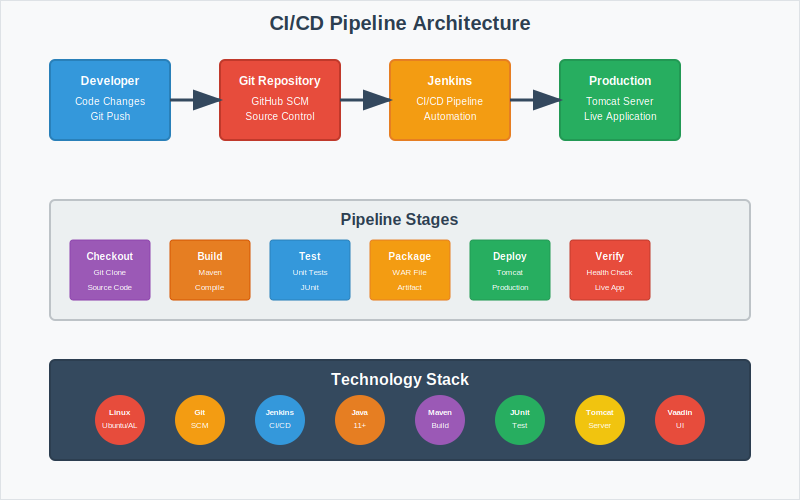

# 🎯 Final Project: Enterprise CI/CD Pipeline with Address Book Application

<div align="center">


**🚀 Complete DevOps Implementation | 📱 Real-World Application | 🔧 Production-Ready Pipeline**

</div>

---

## 🌟 Project Overview

This capstone project demonstrates a **complete DevOps implementation** using industry-standard tools and practices. You'll build an end-to-end CI/CD pipeline for a real Address Book web application, progressing from manual deployment to full automation.

<div align="center">

### 🎯 **What You'll Master**
*Transform from manual deployment to enterprise-grade automation*

</div>

## 🏗️ Architecture & Technology Stack

<div align="center">



</div>

---

## 🎯 Project Objectives

### **🚀 Primary Goals**
- **Master CI/CD Concepts** - Understand continuous integration and deployment
- **Hands-on DevOps Tools** - Work with industry-standard tools
- **Real Application Deployment** - Deploy actual web application
- **Automation Skills** - Transform manual processes to automated pipelines
- **Production Readiness** - Learn enterprise deployment practices

### **📚 Learning Outcomes**
- **Linux System Administration** - Ubuntu & Amazon Linux proficiency
- **Git Version Control** - Source code management and collaboration
- **Jenkins Pipeline Development** - CI/CD automation and orchestration
- **Java Application Building** - Maven build lifecycle and dependency management
- **Automated Testing** - JUnit integration and test automation
- **Web Application Deployment** - Tomcat server configuration and WAR deployment
- **Infrastructure as Code** - Pipeline as code with Jenkinsfile

---

## 🏗️ Technology Deep Dive

<table>
<tr>
<th width="20%">Technology</th>
<th width="25%">Purpose</th>
<th width="30%">Skills Gained</th>
<th width="25%">Industry Relevance</th>
</tr>

<tr>
<td><strong>🐧 Linux</strong><br><small>Ubuntu/Amazon Linux</small></td>
<td>Server Operating System</td>
<td>• Command line proficiency<br>• System administration<br>• Package management</td>
<td>90% of servers run Linux</td>
</tr>

<tr>
<td><strong>📚 Git</strong><br><small>Version Control</small></td>
<td>Source Code Management</td>
<td>• Repository management<br>• Branching strategies<br>• Collaboration workflows</td>
<td>Industry standard for SCM</td>
</tr>

<tr>
<td><strong>🔧 Jenkins</strong><br><small>CI/CD Platform</small></td>
<td>Build Automation</td>
<td>• Pipeline development<br>• Job configuration<br>• Plugin ecosystem</td>
<td>Leading CI/CD tool</td>
</tr>

<tr>
<td><strong>☕ Java</strong><br><small>Programming Language</small></td>
<td>Application Development</td>
<td>• Object-oriented programming<br>• Enterprise applications<br>• JVM ecosystem</td>
<td>Enterprise standard</td>
</tr>

<tr>
<td><strong>🔨 Maven</strong><br><small>Build Tool</small></td>
<td>Dependency Management</td>
<td>• Build lifecycle<br>• Dependency resolution<br>• Project structure</td>
<td>Java build standard</td>
</tr>

<tr>
<td><strong>🧪 JUnit</strong><br><small>Testing Framework</small></td>
<td>Automated Testing</td>
<td>• Unit test development<br>• Test automation<br>• Quality assurance</td>
<td>Testing best practices</td>
</tr>

<tr>
<td><strong>🌐 Tomcat</strong><br><small>Web Server</small></td>
<td>Application Deployment</td>
<td>• Web server configuration<br>• Application deployment<br>• Production management</td>
<td>Java web standard</td>
</tr>

</table>

---

## 📋 Prerequisites & Environment

### **💻 System Requirements**
- **Operating System:** Ubuntu 20.04+ or Amazon Linux 2/2023
- **Hardware:** 2+ CPU cores, 4GB+ RAM, 20GB+ storage
- **Network:** Public IP address with internet access
- **Security:** SSH access, ports 8080 (Jenkins) and 8090 (Tomcat) open

### **🔧 Required Software Stack**
- **Java 11+** - Runtime environment and development kit
- **Maven 3.6+** - Build automation and dependency management
- **Git** - Version control system
- **Jenkins 2.400+** - CI/CD automation server
- **Jetty 11.0.24+** - Lightweight web server (Recommended)
- **Tomcat 9.0.108+** - Alternative web application server

### **☁️ Cloud Platform Support**
- **AWS EC2** - Amazon Linux 2/2023, Ubuntu instances
- **Azure VM** - Ubuntu virtual machines
- **Google Cloud** - Compute Engine instances
- **On-Premises** - Physical or virtual Linux servers

---

## 🎯 Project Structure & Learning Path

### **📁 Project Organization**
```
06_final_project/
├── README.md                    # This comprehensive guide
├── 6.1_manual/                  # Phase 1: Manual Deployment
│   ├── src/                     # Address Book source code
│   ├── pom.xml                  # Maven project configuration
│   ├── build.xml                # Ant build configuration
│   └── README.md                # Manual deployment guide
└── 6.2_pipeline/                # Phase 2: Pipeline Automation
    ├── src/                     # Same application source
    ├── pom.xml                  # Same Maven configuration
    ├── Jenkinsfile              # Pipeline as code
    └── README.md                # Pipeline automation guide
```

### **🎓 Learning Progression**

#### **Phase 0: Infrastructure Setup**
- **Duration:** 30-45 minutes
- **Focus:** Environment preparation and tool installation
- **Skills:** Linux administration, software installation, system configuration

#### **Phase 1: Manual Deployment** → [6.1_manual/](./6.1_manual/)
- **Duration:** 45-60 minutes
- **Focus:** Understanding the deployment process step-by-step
- **Skills:** Maven builds, WAR deployment, Tomcat configuration, troubleshooting

#### **Phase 2: Pipeline Automation** → [6.2_pipeline/](./6.2_pipeline/)
- **Duration:** 60-90 minutes
- **Focus:** Automating manual processes with Jenkins
- **Skills:** Pipeline development, SCM integration, automated deployment, monitoring

---

## 🚀 Address Book Application

### **📱 Application Features**
- **Contact Management** - Add, edit, delete contacts
- **Search & Filter** - Real-time contact search
- **Responsive UI** - Modern Vaadin-based interface
- **Data Persistence** - In-memory contact storage
- **RESTful Architecture** - Clean separation of concerns

### **🏗️ Technical Architecture**
- **Frontend:** Vaadin 7 Framework (Java-based UI)
- **Backend:** Java servlets and business logic
- **Build System:** Maven with standard directory structure
- **Testing:** JUnit unit tests with Maven Surefire
- **Packaging:** WAR file for Tomcat deployment
- **Configuration:** Standard Java web application structure

### **📊 Application Metrics**
- **Lines of Code:** ~2,000 Java LOC
- **Test Coverage:** Unit tests for core functionality
- **Build Time:** ~2-3 minutes (clean build)
- **Deployment Size:** ~15MB WAR file
- **Startup Time:** ~10-15 seconds on Tomcat

---

## 🔧 Installation Guide

### **🐧 Ubuntu/Debian Systems**

#### **System Update & Java Installation**
```bash
# Update system packages
sudo apt update && sudo apt upgrade -y

# Install OpenJDK 11
sudo apt install openjdk-11-jdk maven git -y

# Verify installations
java -version && mvn -version && git --version
```

#### **Step 4: Install Jetty (Recommended)**
```bash
# Install Jetty
sudo apt install jetty9 -y

# Start and enable Jetty
sudo systemctl enable jetty9
sudo systemctl start jetty9
sudo systemctl status jetty9
```

<details>
<summary><strong>🔧 Alternative: Tomcat Installation (Click to expand)</strong></summary>

#### **Tomcat 9 Installation**
```bash
# Install Tomcat 9
sudo apt install tomcat9 tomcat9-admin -y

# Configure and start service
sudo systemctl enable tomcat9
sudo systemctl start tomcat9

# Check service status
sudo systemctl status tomcat9
```

### **🔧 Ubuntu Tomcat Service Management**
```bash
# Start Tomcat
sudo systemctl start tomcat9

# Stop Tomcat
sudo systemctl stop tomcat9

# Restart Tomcat
sudo systemctl restart tomcat9

# Check status
sudo systemctl status tomcat9

# Enable auto-start on boot
sudo systemctl enable tomcat9

# View logs
sudo journalctl -u tomcat9 -f
# OR
sudo tail -f /var/log/tomcat9/catalina.out
```

</details>
```

### **🔴 Amazon Linux/RHEL Systems**

#### **System Update & Java Installation**
```bash
# Update system (Amazon Linux 2)
sudo yum update -y

# Update system (Amazon Linux 2023)
sudo dnf update -y

# Install Java and Maven
sudo yum install java-11-amazon-corretto-devel maven git -y
# OR for AL2023: sudo dnf install java-11-amazon-corretto-devel maven git -y
```

#### **Install Jetty (Recommended)**
```bash
# Download and install Jetty
cd /tmp
wget https://repo1.maven.org/maven2/org/eclipse/jetty/jetty-home/11.0.24/jetty-home-11.0.24.tar.gz
sudo tar -xzf jetty-home-11.0.24.tar.gz -C /opt/
sudo mv /opt/jetty-home-11.0.24 /opt/jetty
sudo useradd -r -s /bin/false jetty
sudo chown -R jetty:jetty /opt/jetty

# For this project, we'll use Maven Jetty plugin instead
# This provides easier development and deployment
```

<details>
<summary><strong>🔧 Alternative: Tomcat Installation (Click to expand)</strong></summary>

#### **Tomcat 9 Manual Installation**

> **📋 Tomcat Version Options:**
> - **Tomcat 9.0.108** (Latest stable - Recommended for production)
> - **Tomcat 10.1.44** (Latest major version - Jakarta EE)
> - **Tomcat 11.x** (Latest development - Preview features)

```bash
# Create tomcat user and download latest Tomcat 9.0.108
sudo useradd -r -m -U -d /opt/tomcat -s /bin/false tomcat
cd /tmp && wget https://downloads.apache.org/tomcat/tomcat-9/v9.0.108/bin/apache-tomcat-9.0.108.tar.gz

# Extract and configure
sudo tar xf apache-tomcat-9.0.108.tar.gz -C /opt/tomcat
sudo ln -s /opt/tomcat/apache-tomcat-9.0.108 /opt/tomcat/latest
sudo chown -RH tomcat: /opt/tomcat/latest
sudo sh -c 'chmod +x /opt/tomcat/latest/bin/*.sh'

# Create systemd service file
sudo tee /etc/systemd/system/tomcat.service > /dev/null <<EOF
[Unit]
Description=Tomcat 9 servlet container
After=network.target

[Service]
Type=forking
User=tomcat
Group=tomcat
Environment="JAVA_HOME=/usr/lib/jvm/java-11-amazon-corretto"
Environment="JAVA_OPTS=-Djava.security.egd=file:///dev/urandom -Djava.awt.headless=true"
Environment="CATALINA_BASE=/opt/tomcat/latest"
Environment="CATALINA_HOME=/opt/tomcat/latest"
Environment="CATALINA_PID=/opt/tomcat/latest/temp/tomcat.pid"
Environment="CATALINA_OPTS=-Xms512M -Xmx1024M -server -XX:+UseParallelGC"
ExecStart=/opt/tomcat/latest/bin/startup.sh
ExecStop=/opt/tomcat/latest/bin/shutdown.sh

[Install]
WantedBy=multi-user.target
EOF

# Start and enable Tomcat service
sudo systemctl daemon-reload
sudo systemctl enable tomcat
sudo systemctl start tomcat

# Check service status
sudo systemctl status tomcat
```

### **🔧 Tomcat Service Management Commands**
```bash
# Start Tomcat
sudo systemctl start tomcat

# Stop Tomcat
sudo systemctl stop tomcat

# Restart Tomcat
sudo systemctl restart tomcat

# Check status
sudo systemctl status tomcat

# Enable auto-start on boot
sudo systemctl enable tomcat

# Disable auto-start on boot
sudo systemctl disable tomcat

# View logs
sudo journalctl -u tomcat -f
```

</details>

---

## 🚀 Jetty Configuration & Usage

## 🚀 Jetty Configuration & Usage

### **🎯 Why Jetty for This Project?**
- **Lightweight** - Faster startup and lower memory usage
- **Maven Integration** - Built-in Maven plugin for easy development
- **Development Friendly** - Hot reload and quick testing
- **Production Ready** - Scales well for enterprise applications

### **🔧 Running with Maven Jetty Plugin**
```bash
# Navigate to project directory
cd your-project-directory

# Run with Jetty (default port 8080)
mvn jetty:run

# Run with custom port
mvn jetty:run -Djetty.port=8090

# Run in background
mvn jetty:run &

# Stop Jetty
Ctrl+C (if running in foreground)
# OR kill the process if running in background
```

<details>
<summary><strong>🔧 Tomcat Service Management (Click to expand)</strong></summary>

## 🔧 Tomcat Service Management

### **📋 Service Commands Summary**

<table>
<tr>
<th width="30%">Action</th>
<th width="35%">Ubuntu (tomcat9)</th>
<th width="35%">Amazon Linux (tomcat)</th>
</tr>

<tr>
<td><strong>Start Service</strong></td>
<td><code>sudo systemctl start tomcat9</code></td>
<td><code>sudo systemctl start tomcat</code></td>
</tr>

<tr>
<td><strong>Stop Service</strong></td>
<td><code>sudo systemctl stop tomcat9</code></td>
<td><code>sudo systemctl stop tomcat</code></td>
</tr>

<tr>
<td><strong>Restart Service</strong></td>
<td><code>sudo systemctl restart tomcat9</code></td>
<td><code>sudo systemctl restart tomcat</code></td>
</tr>

<tr>
<td><strong>Check Status</strong></td>
<td><code>sudo systemctl status tomcat9</code></td>
<td><code>sudo systemctl status tomcat</code></td>
</tr>

<tr>
<td><strong>Enable Auto-start</strong></td>
<td><code>sudo systemctl enable tomcat9</code></td>
<td><code>sudo systemctl enable tomcat</code></td>
</tr>

<tr>
<td><strong>View Logs</strong></td>
<td><code>sudo journalctl -u tomcat9 -f</code><br><code>sudo tail -f /var/log/tomcat9/catalina.out</code></td>
<td><code>sudo journalctl -u tomcat -f</code><br><code>sudo tail -f /opt/tomcat/latest/logs/catalina.out</code></td>
</tr>

</table>

### **🔍 Service Verification**
```bash
# Check if service is running
sudo systemctl is-active tomcat9    # Ubuntu
sudo systemctl is-active tomcat     # Amazon Linux

# Check if service is enabled
sudo systemctl is-enabled tomcat9   # Ubuntu
sudo systemctl is-enabled tomcat    # Amazon Linux

# Test Tomcat is responding
curl -I http://localhost:8090

# Check process
ps aux | grep tomcat

# Check port usage
sudo netstat -tlnp | grep 8090
```

</details>

---

## 🔐 Jenkins Configuration

### **🔧 Jenkins Setup Steps**
1. **Access Jenkins:** `http://YOUR_SERVER_IP:8080`
2. **Install Required Plugins:**
   - Pipeline Plugin
   - Maven Integration Plugin
   - Deploy to Container Plugin
   - JUnit Plugin
  
   - 


### **🔑 Credentials Configuration**
```yaml
Tomcat Deployment Credentials:
  Credential ID: tomcat-9
  Type: Username with password
  Username: admin
  Password: admin
  Description: Tomcat 9 Deployment Access
```

### **🛠️ Tool Configuration**
```yaml
Maven Configuration:
  Name: my_mvn
  Install automatically: ✅
  Version: Latest stable (3.9.x)
```

---

## 🎯 Success Metrics & Validation

### **✅ Phase 1 Success Criteria**
- [ ] Application builds successfully with Maven
- [ ] WAR file deploys to Tomcat without errors
- [ ] Web interface accessible via browser
- [ ] All CRUD operations functional
- [ ] No errors in application logs

### **✅ Phase 2 Success Criteria**
- [ ] Jenkins pipeline executes all stages successfully
- [ ] Automated deployment matches manual deployment
- [ ] Pipeline completes in under 5 minutes
- [ ] Application automatically available after pipeline
- [ ] Pipeline can be triggered by code changes

### **📊 Performance Benchmarks**
- **Manual Deployment Time:** 8-12 minutes
- **Automated Pipeline Time:** 3-5 minutes
- **Build Success Rate:** >95%
- **Deployment Success Rate:** >98%
- **Application Startup Time:** <30 seconds

---

## 🚀 Getting Started

<div align="center">

### **🎯 Ready to Begin Your DevOps Journey?**

**Step 1:** Complete infrastructure setup (this README)  
**Step 2:** Master manual deployment → [6.1_manual/](./6.1_manual/)  
**Step 3:** Automate with pipelines → [6.2_pipeline/](./6.2_pipeline/)

</div>

### **🔧 Quick Start Checklist**
- [ ] Linux server with public IP ready
- [ ] Security groups configured (ports 22, 8080, 8090)
- [ ] SSH access established
- [ ] Ready to install software stack

---

## 🎓 Career Impact

### **💼 Industry Skills Gained**
- **DevOps Engineering** - CI/CD pipeline development
- **Site Reliability Engineering** - Automated deployment practices
- **Cloud Engineering** - Infrastructure and application management
- **Software Engineering** - Build automation and testing

### **📈 Market Value**
- **DevOps Engineers:** $95K - $165K annually
- **Jenkins Specialists:** High demand across industries
- **CI/CD Expertise:** Essential for modern development teams
- **Automation Skills:** 40%+ salary premium over manual processes

---

<div align="center">

## 🚀 **Transform Your Career with Enterprise DevOps Skills**

**From Manual Deployment to Full Automation Mastery**

[](./6.1_manual/)
[](./6.2_pipeline/)

---

**Created with ❤️ by [Varun Kumar Manik](https://github.com/manikcloud)**  
*AWS Ambassador | Kubernetes Expert | DevOps Specialist*

</div>
