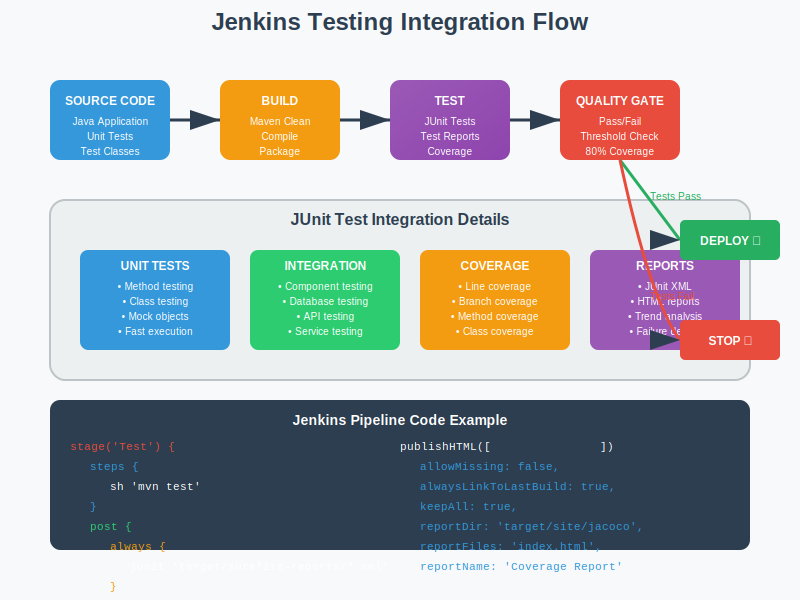

# 🧪 Module 06: Testing Integration

<div align="center">


**🎯 Automated Testing | 📊 Quality Gates | 🧪 JUnit Integration**

</div>

---

## 📋 Module Overview

This module focuses on integrating automated testing into your Jenkins pipelines. You'll learn to implement comprehensive testing strategies, quality gates, and test reporting using JUnit and Maven.

<div align="center">



</div>

### 🎯 **Learning Objectives**
- ✅ Integrate JUnit testing with Jenkins pipelines
- ✅ Configure Maven for automated test execution
- ✅ Implement quality gates and coverage thresholds
- ✅ Generate and publish test reports
- ✅ Create fail-fast testing strategies

---

## 🛤️ Module Structure

<table>
<tr>
<th width="10%">Project</th>
<th width="30%">Name</th>
<th width="40%">Description</th>
<th width="20%">Skills</th>
</tr>

<tr>
<td><strong>6.1</strong></td>
<td><strong><a href="./6.1_junit_maven">JUnit with Maven</a></strong></td>
<td>Integrate JUnit testing with Maven builds in Jenkins pipelines</td>
<td>JUnit Testing, Maven Integration, Test Reports, Quality Gates</td>
</tr>

</table>

---

## 📚 Theory: Testing in CI/CD

### **Testing Pyramid**
The testing pyramid represents the ideal distribution of different types of tests in a comprehensive testing strategy.

```
        /\
       /  \
      / UI \
     /Tests \
    /________\
   /          \
  / Integration \
 /    Tests     \
/________________\
/                \
/   Unit Tests   \
/__________________\
```

#### **Test Types:**
- 🧪 **Unit Tests** - Test individual methods and classes
- 🔗 **Integration Tests** - Test component interactions
- 🖥️ **UI Tests** - Test user interface functionality
- 🚀 **End-to-End Tests** - Test complete user workflows

### **Quality Gates**
Quality gates are checkpoints in your pipeline that ensure code meets quality standards before proceeding to the next stage.

#### **Common Quality Metrics:**
- 📊 **Test Coverage** - Percentage of code covered by tests
- 🧪 **Test Pass Rate** - Percentage of tests that pass
- 🐛 **Bug Density** - Number of bugs per lines of code
- 🔍 **Code Complexity** - Cyclomatic complexity metrics
- 📏 **Code Duplication** - Percentage of duplicated code

---

## 🧪 **JUnit Integration**

### **Basic JUnit Pipeline**
```groovy
pipeline {
    agent any
    
    tools {
        maven 'Maven-3.8.1'
        jdk 'JDK-11'
    }
    
    stages {
        stage('Checkout') {
            steps {
                checkout scm
            }
        }
        
        stage('Build') {
            steps {
                sh 'mvn clean compile'
            }
        }
        
        stage('Test') {
            steps {
                sh 'mvn test'
            }
            post {
                always {
                    // Publish JUnit test results
                    junit 'target/surefire-reports/*.xml'
                    
                    // Archive test reports
                    publishHTML([
                        allowMissing: false,
                        alwaysLinkToLastBuild: true,
                        keepAll: true,
                        reportDir: 'target/surefire-reports',
                        reportFiles: 'index.html',
                        reportName: 'Test Report'
                    ])
                }
            }
        }
        
        stage('Package') {
            when {
                expression { currentBuild.result != 'FAILURE' }
            }
            steps {
                sh 'mvn package -DskipTests'
            }
        }
    }
}
```

### **Advanced Testing Pipeline**
```groovy
pipeline {
    agent any
    
    environment {
        MAVEN_OPTS = '-Xmx1024m'
    }
    
    stages {
        stage('Unit Tests') {
            steps {
                sh 'mvn clean test'
            }
            post {
                always {
                    junit 'target/surefire-reports/*.xml'
                }
            }
        }
        
        stage('Integration Tests') {
            steps {
                sh 'mvn integration-test'
            }
            post {
                always {
                    junit 'target/failsafe-reports/*.xml'
                }
            }
        }
        
        stage('Code Coverage') {
            steps {
                sh 'mvn jacoco:report'
            }
            post {
                always {
                    publishHTML([
                        allowMissing: false,
                        alwaysLinkToLastBuild: true,
                        keepAll: true,
                        reportDir: 'target/site/jacoco',
                        reportFiles: 'index.html',
                        reportName: 'Code Coverage Report'
                    ])
                }
            }
        }
        
        stage('Quality Gate') {
            steps {
                script {
                    def coverage = readFile('target/site/jacoco/index.html')
                    def coverageMatch = coverage =~ /Total.*?(\d+)%/
                    
                    if (coverageMatch) {
                        def coveragePercent = coverageMatch[0][1] as Integer
                        echo "Code coverage: ${coveragePercent}%"
                        
                        if (coveragePercent < 80) {
                            error("Code coverage ${coveragePercent}% is below threshold of 80%")
                        }
                    }
                }
            }
        }
    }
}
```

---

## 📊 **Test Reporting & Analysis**

### **JUnit Test Results**
Jenkins automatically processes JUnit XML reports and provides:
- 📈 **Test Trends** - Historical test performance
- 🧪 **Test Results** - Pass/fail status for each test
- ⏱️ **Execution Time** - Test duration analysis
- 📊 **Failure Analysis** - Detailed failure information

### **Maven Surefire Configuration**
```xml
<plugin>
    <groupId>org.apache.maven.plugins</groupId>
    <artifactId>maven-surefire-plugin</artifactId>
    <version>3.0.0-M7</version>
    <configuration>
        <includes>
            <include>**/*Test.java</include>
            <include>**/*Tests.java</include>
        </includes>
        <excludes>
            <exclude>**/*IntegrationTest.java</exclude>
        </excludes>
        <reportFormat>xml</reportFormat>
        <reportsDirectory>${project.build.directory}/surefire-reports</reportsDirectory>
    </configuration>
</plugin>
```

### **Failsafe for Integration Tests**
```xml
<plugin>
    <groupId>org.apache.maven.plugins</groupId>
    <artifactId>maven-failsafe-plugin</artifactId>
    <version>3.0.0-M7</version>
    <configuration>
        <includes>
            <include>**/*IntegrationTest.java</include>
            <include>**/*IT.java</include>
        </includes>
    </configuration>
    <executions>
        <execution>
            <goals>
                <goal>integration-test</goal>
                <goal>verify</goal>
            </goals>
        </execution>
    </executions>
</plugin>
```

---

## 🎯 **Quality Gates Implementation**

### **Coverage-based Quality Gate**
```groovy
stage('Quality Gate') {
    steps {
        script {
            // Read coverage report
            def jacocoReport = readFile('target/site/jacoco/index.html')
            
            // Extract coverage percentage
            def matcher = jacocoReport =~ /Total.*?(\d+)%/
            
            if (matcher.find()) {
                def coverage = matcher.group(1) as Integer
                echo "Code Coverage: ${coverage}%"
                
                // Set quality gate thresholds
                if (coverage < 60) {
                    error("QUALITY GATE FAILED: Coverage ${coverage}% < 60% (minimum)")
                } else if (coverage < 80) {
                    unstable("QUALITY GATE WARNING: Coverage ${coverage}% < 80% (target)")
                    currentBuild.result = 'UNSTABLE'
                } else {
                    echo "QUALITY GATE PASSED: Coverage ${coverage}% >= 80%"
                }
            } else {
                error("Could not parse coverage report")
            }
        }
    }
}
```

### **Test-based Quality Gate**
```groovy
stage('Test Quality Gate') {
    steps {
        script {
            def testResults = currentBuild.rawBuild.getAction(hudson.tasks.junit.TestResultAction.class)
            
            if (testResults) {
                def total = testResults.totalCount
                def failed = testResults.failCount
                def skipped = testResults.skipCount
                def passed = total - failed - skipped
                
                def passRate = (passed / total) * 100
                
                echo "Test Results: ${passed}/${total} passed (${passRate.round(2)}%)"
                
                if (failed > 0) {
                    error("QUALITY GATE FAILED: ${failed} test(s) failed")
                } else if (passRate < 95) {
                    unstable("QUALITY GATE WARNING: Pass rate ${passRate.round(2)}% < 95%")
                } else {
                    echo "QUALITY GATE PASSED: All tests passed"
                }
            }
        }
    }
}
```

---

## 🔧 **Best Practices**

### **Test Organization**
- 🧪 **Naming Conventions** - Clear, descriptive test names
- 📁 **Package Structure** - Organize tests by functionality
- 🏷️ **Test Categories** - Use JUnit categories for test grouping
- 🔄 **Test Data** - Separate test data from test logic

### **Performance Optimization**
- ⚡ **Parallel Execution** - Run tests in parallel when possible
- 🎯 **Test Selection** - Run only relevant tests for changes
- 💾 **Resource Management** - Proper setup and teardown
- 🔄 **Test Isolation** - Ensure tests don't interfere with each other

### **Reporting Standards**
- 📊 **Consistent Metrics** - Use standard coverage and quality metrics
- 📈 **Trend Analysis** - Track metrics over time
- 🎯 **Actionable Reports** - Provide clear guidance on failures
- 📝 **Documentation** - Document test strategies and standards

---

## 🚀 Getting Started

### **Prerequisites**
- ✅ Java project with JUnit tests
- ✅ Maven build configuration
- ✅ Jenkins with JUnit plugin
- ✅ Understanding of testing concepts

### **Setup Steps**
1. **Configure Maven** - Set up Surefire and Failsafe plugins
2. **Write Tests** - Create comprehensive unit and integration tests
3. **Create Pipeline** - Implement testing pipeline
4. **Set Quality Gates** - Define coverage and quality thresholds

---

## 📊 Expected Outcomes

After completing this module, you will have:

### **Testing Skills**
- ✅ **Test Integration** - Seamless testing in CI/CD pipelines
- ✅ **Quality Assurance** - Automated quality gate implementation
- ✅ **Report Generation** - Comprehensive test reporting
- ✅ **Failure Analysis** - Effective test failure debugging

### **Quality Management**
- ✅ **Coverage Tracking** - Monitor and improve test coverage
- ✅ **Quality Metrics** - Implement meaningful quality measurements
- ✅ **Continuous Improvement** - Iterative quality enhancement
- ✅ **Risk Mitigation** - Prevent defects through automated testing

---

## ➡️ Next Steps

Once you've mastered testing integration:
1. **Expand Test Coverage** - Add more comprehensive tests
2. **Optimize Performance** - Improve test execution speed
3. **Proceed to Module 07** - [Notifications & Monitoring](../07_notifications_monitoring/README.md)

---

<div align="center">

### 🎯 **Ready to Build Quality into Your Pipeline?**

**Start Testing: [6.1 JUnit with Maven](./6.1_junit_maven/README.md)**

*Ensure code quality with comprehensive automated testing!*

</div>
