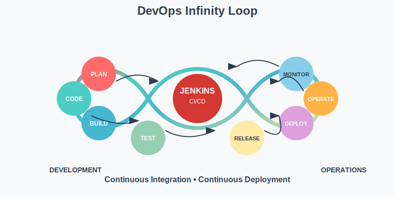
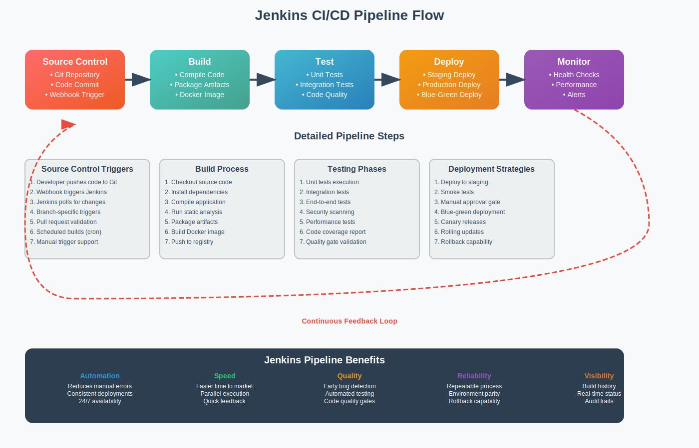
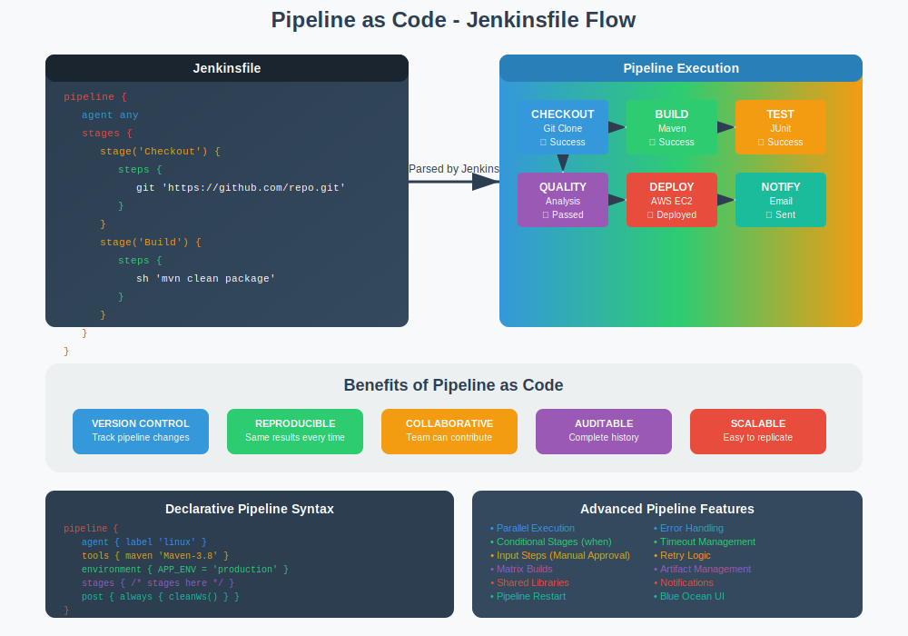

# 🚀 Jenkins - Continuous Integration & Continuous Deployment

<div align="center">


**🎯 Master CI/CD Pipelines | 🔧 Automate Deployments | 📊 Build Production Systems**

</div>

---

## 📋 Module Overview

This comprehensive Jenkins module covers the fundamentals of **Continuous Integration and Continuous Deployment** and integrations with other tools. By the end of this module, you will be able to create fully automated pipelines for production-ready applications.

<div align="center">



</div>

### 🎯 **Learning Objectives**
- ✅ Understand CI/CD concepts and Jenkins architecture
- ✅ Install and configure Jenkins on AWS infrastructure
- ✅ Create and manage various types of Jenkins jobs
- ✅ Implement Pipeline as Code with Jenkinsfiles
- ✅ Set up Master-Slave architecture for scalability
- ✅ Deploy Java applications to AWS using automated pipelines

---

## 📚 Theory & Concepts

### 🔄 **What is Continuous Integration (CI)?**

**Continuous Integration** is a development practice where developers integrate code into a shared repository frequently, preferably several times a day. Each integration is verified by an automated build and automated tests.

<div align="center">



</div>

#### **Key Benefits of CI:**
- 🚀 **Early Bug Detection** - Issues are caught quickly
- 🔄 **Faster Development** - Reduced integration problems
- 📊 **Better Code Quality** - Automated testing ensures standards
- 👥 **Team Collaboration** - Shared codebase with frequent updates

### 🚀 **What is Continuous Deployment (CD)?**

**Continuous Deployment** extends CI by automatically deploying all code changes to production after passing automated tests. **Continuous Delivery** is similar but requires manual approval for production deployment.

#### **CD Pipeline Stages:**
1. **Source** - Code repository (Git)
2. **Build** - Compile and package application
3. **Test** - Automated testing (unit, integration, acceptance)
4. **Deploy** - Release to staging/production environments
5. **Monitor** - Track application performance and health

### 🏗️ **Jenkins Architecture**

Jenkins follows a **Master-Slave architecture**:

<div align="center">


</div>

#### **Jenkins Master:**
- 📊 **Central Controller** - Manages the entire CI/CD process
- 🗂️ **Job Scheduler** - Distributes builds to slave nodes
- 🔧 **Configuration Management** - Stores all job configurations
- 📈 **UI Interface** - Web-based dashboard for management

#### **Jenkins Slaves (Agents):**
- ⚡ **Build Executors** - Run actual build jobs
- 🔧 **Tool Installation** - Host specific build tools
- 📦 **Environment Isolation** - Separate environments for different projects
- 🌐 **Scalability** - Add more slaves as needed

### 🔧 **Types of Jenkins Jobs**

#### **1. Freestyle Jobs**
- 🎯 **Simple Configuration** - GUI-based setup
- 🔧 **Flexible** - Can run any commands or scripts
- 📊 **Good for Beginners** - Easy to understand and configure

#### **2. Pipeline Jobs**
- 📜 **Code-based Configuration** - Defined in Jenkinsfile
- 🔄 **Version Controlled** - Pipeline definition stored in SCM
- 🏗️ **Complex Workflows** - Support for parallel execution, conditions
- 🚀 **Industry Standard** - Modern approach to CI/CD

<div align="center">



</div>

#### **3. Multi-branch Pipeline**
- 🌿 **Branch-based** - Automatically creates pipelines for branches
- 🔄 **Dynamic** - Pipelines created/deleted with branches
- 👥 **Team Collaboration** - Perfect for feature branch workflows

---

## 🏗️ **AWS Infrastructure Design**

<div align="center">


</div>

Our Jenkins setup uses AWS EC2 instances with proper security groups and networking configuration for optimal performance and security.

---

## 🛤️ Learning Path Structure

<table>
<tr>
<th width="5%">#</th>
<th width="25%">Module</th>
<th width="45%">Description</th>
<th width="25%">Key Skills</th>
</tr>

<!-- MODULE 1: INFRASTRUCTURE SETUP -->
<tr>
<td colspan="4" align="center"><strong>🏗️ MODULE 1: INFRASTRUCTURE SETUP</strong></td>
</tr>

<tr>
<td>01</td>
<td><strong><a href="./01_infrastructure_setup">Infrastructure Setup</a></strong></td>
<td>Create AWS EC2 instances with Terraform for Jenkins infrastructure</td>
<td>Terraform, AWS EC2, Infrastructure as Code</td>
</tr>

<!-- MODULE 2: JENKINS INSTALLATION -->
<tr>
<td colspan="4" align="center"><strong>⚙️ MODULE 2: JENKINS INSTALLATION</strong></td>
</tr>

<tr>
<td>02</td>
<td><strong><a href="./02_jenkins_installation">Jenkins Installation</a></strong></td>
<td>Install and configure Jenkins with security settings</td>
<td>Jenkins Installation, Security Configuration</td>
</tr>

<!-- MODULE 3: BASIC JOBS -->
<tr>
<td colspan="4" align="center"><strong>🔧 MODULE 3: BASIC JOBS</strong></td>
</tr>

<tr>
<td>03</td>
<td><strong><a href="./03_basic_jobs">Basic Jobs</a></strong></td>
<td>Create freestyle and Maven-based Jenkins jobs</td>
<td>Freestyle Jobs, Maven Integration, Build Configuration</td>
</tr>

<!-- MODULE 4: PIPELINE FUNDAMENTALS -->
<tr>
<td colspan="4" align="center"><strong>📜 MODULE 4: PIPELINE FUNDAMENTALS</strong></td>
</tr>

<tr>
<td>04</td>
<td><strong><a href="./04_pipeline_fundamentals">Pipeline Fundamentals</a></strong></td>
<td>Introduction to Jenkins pipelines and Pipeline as Code</td>
<td>Pipeline Syntax, Jenkinsfile, Groovy Basics</td>
</tr>

<!-- MODULE 5: ADVANCED PIPELINES -->
<tr>
<td colspan="4" align="center"><strong>🚀 MODULE 5: ADVANCED PIPELINES</strong></td>
</tr>

<tr>
<td>05</td>
<td><strong><a href="./05_advanced_pipelines">Advanced Pipelines</a></strong></td>
<td>Advanced pipeline features, parameters, and triggers</td>
<td>Parameterized Builds, Pipeline Management, Advanced Features</td>
</tr>

<!-- MODULE 6: TESTING INTEGRATION -->
<tr>
<td colspan="4" align="center"><strong>🧪 MODULE 6: TESTING INTEGRATION</strong></td>
</tr>

<tr>
<td>06</td>
<td><strong><a href="./06_testing_integration">Testing Integration</a></strong></td>
<td>Integrate unit testing with JUnit in Jenkins pipelines</td>
<td>Unit Testing, JUnit, Test Reports, Quality Gates</td>
</tr>

<!-- MODULE 7: NOTIFICATIONS & MONITORING -->
<tr>
<td colspan="4" align="center"><strong>📧 MODULE 7: NOTIFICATIONS & MONITORING</strong></td>
</tr>

<tr>
<td>07</td>
<td><strong><a href="./07_notifications_monitoring">Notifications & Monitoring</a></strong></td>
<td>Configure email notifications and build monitoring</td>
<td>Email Notifications, Build Monitoring, Alerting</td>
</tr>

<!-- MODULE 8: REAL-WORLD PROJECTS -->
<tr>
<td colspan="4" align="center"><strong>🌍 MODULE 8: REAL-WORLD PROJECTS</strong></td>
</tr>

<tr>
<td>08</td>
<td><strong><a href="./08_real_world_projects">Real-World Projects</a></strong></td>
<td>Deploy Python Flask and PHP applications with Docker</td>
<td>Multi-language Support, Docker Integration, Real Applications</td>
</tr>

<!-- MODULE 9: MASTER-SLAVE ARCHITECTURE -->
<tr>
<td colspan="4" align="center"><strong>🏗️ MODULE 9: MASTER-SLAVE ARCHITECTURE</strong></td>
</tr>

<tr>
<td>09</td>
<td><strong><a href="./09_master_slave_architecture">Master-Slave Architecture</a></strong></td>
<td>Configure Jenkins Master-Slave setup for scalability</td>
<td>Distributed Builds, Jenkins Architecture, Scalability</td>
</tr>

<!-- MODULE 10: FINAL PROJECT -->
<tr>
<td colspan="4" align="center"><strong>🎯 MODULE 10: CAPSTONE PROJECT</strong></td>
</tr>

<tr>
<td>10</td>
<td><strong><a href="./10_final_project">Final Project</a></strong></td>
<td><strong>Term Project 2: Complete Java Application CI/CD with AWS Deployment</strong><br>
End-to-end pipeline with Jenkins deploying Java application to AWS</td>
<td>Complete CI/CD, AWS Deployment, Production Pipeline</td>
</tr>

</table>

---

## 🎯 **Term Project 2: Java Application CI/CD Pipeline**

### **Project Overview**
Build a complete CI/CD pipeline that demonstrates industry-standard practices:

#### **Pipeline Features:**
- ✅ **Source Control Integration** - Git webhook triggers
- ✅ **Automated Building** - Maven/Gradle build process
- ✅ **Comprehensive Testing** - Unit tests with JUnit
- ✅ **Quality Gates** - Build fails if tests fail
- ✅ **AWS Deployment** - Automated deployment to EC2
- ✅ **Notifications** - Email alerts for build status
- ✅ **Rollback Capability** - Ability to rollback deployments

#### **Technologies Integrated:**
- **Jenkins** - CI/CD Orchestration
- **AWS EC2** - Deployment Target
- **Terraform** - Infrastructure Management
- **Maven** - Build Tool
- **JUnit** - Testing Framework
- **Git** - Version Control
- **Docker** - Containerization (optional)

---

## 🔧 **Jenkins Pipeline Concepts**

### **Declarative vs Scripted Pipelines**

#### **Declarative Pipeline (Recommended):**
```groovy
pipeline {
    agent any
    
    stages {
        stage('Build') {
            steps {
                sh 'mvn clean compile'
            }
        }
        
        stage('Test') {
            steps {
                sh 'mvn test'
            }
        }
        
        stage('Deploy') {
            steps {
                sh 'mvn deploy'
            }
        }
    }
}
```

#### **Key Benefits:**
- 🎯 **Structured Syntax** - Easier to read and maintain
- 🔒 **Built-in Security** - Safer execution environment
- 📊 **Better Validation** - Syntax validation before execution
- 🎨 **Visual Pipeline** - Better Blue Ocean integration

### **Pipeline Stages Explained**

#### **1. Checkout Stage**
```groovy
stage('Checkout') {
    steps {
        git branch: 'main', url: 'https://github.com/user/repo.git'
    }
}
```

#### **2. Build Stage**
```groovy
stage('Build') {
    steps {
        sh 'mvn clean package'
    }
}
```

#### **3. Test Stage**
```groovy
stage('Test') {
    steps {
        sh 'mvn test'
    }
    post {
        always {
            junit 'target/surefire-reports/*.xml'
        }
    }
}
```

#### **4. Deploy Stage**
```groovy
stage('Deploy') {
    when {
        branch 'main'
    }
    steps {
        sh 'scp target/*.jar user@server:/opt/app/'
        sh 'ssh user@server "sudo systemctl restart myapp"'
    }
}
```

---

## 🚀 Getting Started

### **Prerequisites**
- ✅ AWS Account with appropriate permissions
- ✅ Basic understanding of Linux commands
- ✅ Git version control knowledge
- ✅ Java development basics
- ✅ Understanding of Maven build tool

### **Learning Path**
1. **Start with Module 01** - Set up your infrastructure
2. **Follow Sequential Order** - Each module builds on the previous
3. **Complete All Exercises** - Hands-on practice is essential
4. **Build the Final Project** - Demonstrate your complete understanding

### **Time Commitment**
- **Total Duration**: 4-6 weeks
- **Per Module**: 3-5 hours
- **Final Project**: 8-10 hours

---

## 📊 Learning Outcomes

By completing this module, you will:

### **Technical Skills**
- ✅ Design and implement production-ready CI/CD pipelines
- ✅ Configure Jenkins for enterprise environments
- ✅ Integrate multiple tools in automation workflows
- ✅ Deploy applications to cloud infrastructure automatically
- ✅ Implement proper testing strategies in pipelines
- ✅ Set up monitoring and notification systems

### **Professional Skills**
- ✅ DevOps best practices and methodologies
- ✅ Infrastructure automation and management
- ✅ Problem-solving in CI/CD environments
- ✅ Team collaboration in DevOps workflows
- ✅ Production deployment strategies

---

## 🛠️ Tools & Technologies

<div align="center">

| Category | Tools | Purpose |
|----------|-------|---------|
| **CI/CD** | Jenkins, Pipeline as Code | Automation & Orchestration |
| **Cloud** | AWS EC2, S3, IAM | Infrastructure & Deployment |
| **IaC** | Terraform | Infrastructure Management |
| **Build Tools** | Maven | Java Application Building |
| **Testing** | JUnit | Unit Testing & Quality |
| **Version Control** | Git, GitHub | Source Code Management |
| **Containerization** | Docker | Application Packaging |

</div>

---

## 📈 Career Impact

### **Job Roles This Prepares You For**
- 🎯 **DevOps Engineer** - $85,000 - $130,000
- 🎯 **CI/CD Specialist** - $80,000 - $120,000
- 🎯 **Build & Release Engineer** - $75,000 - $115,000
- 🎯 **Site Reliability Engineer (SRE)** - $90,000 - $140,000
- 🎯 **Cloud Automation Engineer** - $85,000 - $125,000

### **Industry Certifications Alignment**
- ✅ **AWS Certified DevOps Engineer** - Professional
- ✅ **Jenkins Certified Engineer** - CloudBees
- ✅ **Docker Certified Associate** - Docker Inc.

---

## 🎓 **Best Practices Covered**

### **Pipeline Design**
- 🔄 **Fail Fast Principle** - Quick feedback on issues
- 🔒 **Security First** - Secure credential management
- 📊 **Monitoring & Logging** - Comprehensive observability
- 🚀 **Scalability** - Design for growth

### **Code Quality**
- 🧪 **Automated Testing** - Comprehensive test coverage
- 📋 **Code Standards** - Consistent coding practices
- 🔍 **Static Analysis** - Code quality checks
- 📊 **Metrics Collection** - Performance monitoring

---

## 🤝 Support & Community

- 📧 **Questions**: Create issues in the repository
- 💬 **Discussions**: Use GitHub Discussions for community help
- 📚 **Documentation**: Each module includes detailed README files
- 🎥 **Video Guides**: Available for complex setups and configurations

---

<div align="center">

### 🚀 **Ready to Master Jenkins CI/CD?**

**Start Your Journey: [Module 01 - Infrastructure Setup](./01_infrastructure_setup/README.md)**

*Transform your development workflow with professional CI/CD practices!*

---

### 💡 **Remember**
*"The goal of CI/CD is not just automation, but creating a culture of continuous improvement and rapid, reliable delivery."*

</div>

---

**📝 Note**: This is a comprehensive hands-on learning module. Each section builds upon the previous one, creating a complete understanding of Jenkins and CI/CD practices. Take your time with each module and ensure you understand the concepts before moving forward. The final project will demonstrate your mastery of all concepts learned throughout the course.
