# 🐳 Docker Basics - Commands & Networking

## 🔄 Docker Container Lifecycle

<div align="center">

### 📊 **Complete Docker Lifecycle Flow**
*From image creation to container termination*

```mermaid
graph TD
    A[📝 Dockerfile] --> B[🔨 docker build]
    B --> C[📦 Docker Image]
    
    C --> D[🚀 docker run]
    D --> E[🟢 Running Container]
    
    E --> F{Container State}
    
    F -->|docker stop| G[⏸️ Stopped Container]
    F -->|docker pause| H[⏸️ Paused Container]
    F -->|docker kill| I[💀 Killed Container]
    F -->|Process Exit| J[🔴 Exited Container]
    
    G -->|docker start| E
    G -->|docker rm| K[🗑️ Removed]
    
    H -->|docker unpause| E
    H -->|docker stop| G
    
    I -->|docker rm| K
    J -->|docker start| E
    J -->|docker rm| K
    
    E -->|docker exec| L[🔧 Execute Commands]
    L --> E
    
    E -->|docker logs| M[📋 View Logs]
    M --> E
    
    C -->|docker push| N[☁️ Registry]
    N -->|docker pull| C
    
    style A fill:#e1f5fe
    style C fill:#f3e5f5
    style E fill:#e8f5e8
    style G fill:#fff3e0
    style K fill:#ffebee
    style N fill:#e0f2f1
```

</div>



### 🎯 **Lifecycle Commands Quick Reference**

| Phase | Command | Description |
|-------|---------|-------------|
| **Build** | `docker build -t myapp .` | Create image from Dockerfile |
| **Run** | `docker run -d --name mycontainer myapp` | Create and start container |
| **Stop** | `docker stop mycontainer` | Gracefully stop container |
| **Start** | `docker start mycontainer` | Restart stopped container |
| **Pause** | `docker pause mycontainer` | Pause all processes |
| **Unpause** | `docker unpause mycontainer` | Resume paused container |
| **Kill** | `docker kill mycontainer` | Force stop container |
| **Remove** | `docker rm mycontainer` | Delete stopped container |
| **Inspect** | `docker inspect mycontainer` | View container details |

---

## 📋 Essential Docker Commands

### **Container Management**
```bash
# Run containers
docker run hello-world
docker run -it ubuntu bash
docker run -d nginx
docker run -d -p 8080:80 nginx

# List containers
docker ps                    # Running containers
docker ps -a                 # All containers

# Stop and start containers
docker stop <container-id>
docker start <container-id>
docker restart <container-id>

# Remove containers
docker rm <container-id>
docker rm -f <container-id>  # Force remove
```

### **Image Management**
```bash
# List and pull images
docker images
docker pull ubuntu
docker pull nginx:latest

# Remove images
docker rmi <image-id>

# Build image
docker build -t myapp .
```

### **Container Information**
```bash
# View logs
docker logs <container-id>
docker logs -f <container-id>  # Follow logs

# Execute commands
docker exec -it <container-id> bash
docker exec <container-id> ls -la

# Inspect container
docker inspect <container-id>
docker stats <container-id>
```

### **Cleanup**
```bash
# System cleanup
docker system prune

# Copy files
docker cp file.txt container:/path/
docker cp container:/path/file.txt ./
```

---

## 🌐 Docker Networking Basics

### **Network Types**

#### **Bridge Network (Default)**
- Containers get their own IP addresses
- Need port mapping to access from outside
- Containers can talk to each other

```bash
# Default behavior
docker run -d --name web nginx
docker run -d --name app alpine
```

#### **Host Network**
- Container uses host's network directly
- No port mapping needed
- Faster performance

```bash
# Use host network
docker run -d --network host nginx
# Access via: http://localhost:80
```

#### **Custom Networks**
- Better isolation and control
- Containers can use names to communicate
- Recommended for multi-container apps

```bash
# Create custom network
docker network create mynetwork

# Run containers on custom network
docker run -d --network mynetwork --name web nginx
docker run -d --network mynetwork --name db mysql

# Containers can ping each other by name
docker exec web ping db
```

### **Port Mapping**
```bash
# Map host port to container port
docker run -d -p 8080:80 nginx
# Access via: http://localhost:8080

# Multiple port mappings
docker run -d -p 8080:80 -p 8443:443 nginx
```

### **Network Commands**
```bash
# List networks
docker network ls

# Create network
docker network create mynet

# Connect container to network
docker network connect mynet container-name

# Inspect network
docker network inspect mynet

# Remove network
docker network rm mynet
```

---

## 🚀 Quick Examples

### **Example 1: Simple Web Server**
```bash
docker run -d -p 8080:80 --name webserver nginx
docker ps
docker logs webserver
# Access: http://localhost:8080
```

### **Example 2: Interactive Container**
```bash
docker run -it --name myubuntu ubuntu bash
# Inside container: apt update && apt install curl -y
exit
docker start myubuntu
docker exec -it myubuntu bash
```

### **Example 3: Container Communication**
```bash
docker network create webapp-net
docker run -d --network webapp-net --name db mysql:8.0
docker run -d --network webapp-net --name web -p 3000:3000 node:16
# Web can connect to db using hostname 'db'
```

---

## 📋 Quick Reference

### **Essential Commands**
```bash
# Basic workflow
docker pull nginx
docker run -d -p 8080:80 --name myweb nginx
docker ps
docker logs myweb
docker stop myweb
docker rm myweb
```

### **Network Quick Setup**
```bash
docker network create mynet
docker run -d --network mynet --name app1 nginx
docker run -d --network mynet --name app2 alpine
docker exec app2 ping app1
```

---

*Master these basics and you're ready for Docker containerization!* 🚀
