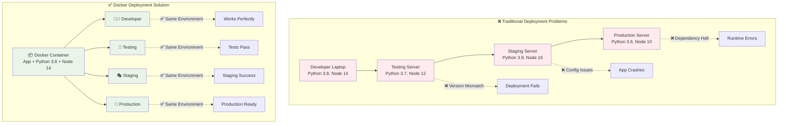
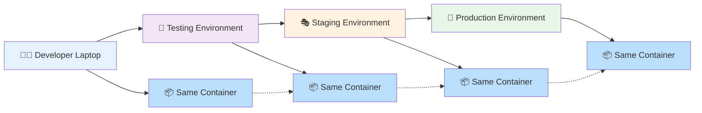
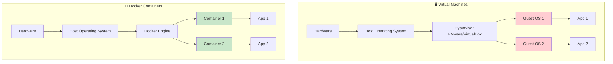

# 🐳 Module 5: Docker and Containerization

<div align="center">


**🎯 Master Container Fundamentals | 🚀 Cloud Native Development | 📦 Containerization Journey**

</div>

---

## 📖 Module Overview

This module will help you **master the core fundamentals of continuous deployment using Docker**. We will simplify and accelerate cloud native application development and start your containerization journey.

### **🎯 What You'll Learn:**
- **Container Fundamentals** - Understanding containerization concepts
- **Docker Basics** - Installation, configuration, and core commands
- **Container Management** - Creating, running, and managing containers
- **Image Creation** - Building custom Docker images
- **Networking** - Container networking and communication

---

## 📚 Docker Theory & Fundamentals

### 🏛️ **Docker History & Founder**

**Founded**: 2013 by **Solomon Hykes** at dotCloud (later renamed Docker Inc.)
**Original Name**: dotCloud Platform-as-a-Service
**Open Source**: March 2013
**Key Milestone**: Docker 1.0 released in June 2014

> 💡 **Fun Fact**: Docker was initially an internal project at dotCloud to solve their own deployment challenges!

### ❌ **Problems Before Docker**

#### **"It Works on My Machine" Problem**
- Applications worked on developer's laptop but failed in production
- Different environments had different configurations
- Dependency conflicts between applications
- Time-consuming environment setup

#### **Resource Wastage**
- Virtual Machines consumed too much memory and CPU
- Slow startup times (minutes to boot)
- Heavy infrastructure overhead
- Difficult to scale applications

#### **Deployment Complexity**
- Manual deployment processes
- Environment-specific configurations
- Difficult rollbacks and updates
- Inconsistent environments across teams

### ✅ **How Docker Solves These Problems**

#### **Traditional vs Docker Deployment**



#### **Consistency Across Environments**



**Key Benefits:**
- ✅ **Same behavior** across all environments
- ✅ **No surprises** during deployment
- ✅ **Faster debugging** - issues are reproducible
- ✅ **Confident releases** - what works in dev works in prod

### 🆚 **Virtual Machines vs Docker Containers**

#### **Comparison Table**

| Feature | Virtual Machines | Docker Containers |
|---------|------------------|-------------------|
| **Startup Time** | 30-60 seconds | 1-3 seconds |
| **Memory Usage** | 1-4 GB | 10-100 MB |
| **Disk Space** | 10-100 GB | 100 MB - 1 GB |
| **OS Required** | Full OS per VM | Shared host OS |
| **Isolation** | Complete | Process level |
| **Performance** | Slower | Near native |
| **Resource Usage** | Heavy | Lightweight |

#### **Architecture Comparison**



**Key Differences:**
- **VMs**: Each has its own complete operating system
- **Containers**: Share the host operating system kernel
- **Result**: Containers are much lighter and faster

#### **Resource Efficiency**
- **Containers share OS kernel** (vs VMs that need separate OS)
- **Lightweight**: MBs instead of GBs
- **Fast startup**: Seconds instead of minutes
- **Better resource utilization**

#### **Simplified Deployment**
- **Package once, run anywhere**
- **Version control for applications**
- **Easy rollbacks and updates**
- **Automated deployment pipelines**

### 🏗️ **Docker Architecture**

```
┌─────────────────────────────────────────────────────────────┐
│                    DOCKER ARCHITECTURE                      │
├─────────────────────────────────────────────────────────────┤
│                                                             │
│  ┌─────────────┐    ┌─────────────────────────────────────┐ │
│  │   CLIENT    │    │           DOCKER HOST               │ │
│  │             │    │                                     │ │
│  │ docker cli  │◄──►│  ┌─────────────┐  ┌─────────────┐   │ │
│  │ docker      │    │  │   DAEMON    │  │   IMAGES    │   │ │
│  │ compose     │    │  │             │  │             │   │ │
│  │             │    │  │ dockerd     │  │ ubuntu      │   │ │
│  └─────────────┘    │  │             │  │ nginx       │   │ │
│                     │  └─────────────┘  │ mysql       │   │ │
│                     │         │         └─────────────┘   │ │
│                     │         ▼                           │ │
│                     │  ┌─────────────┐                    │ │
│                     │  │ CONTAINERS  │                    │ │
│                     │  │             │                    │ │
│                     │  │ web-app     │                    │ │
│                     │  │ database    │                    │ │
│                     │  │ cache       │                    │ │
│                     │  └─────────────┘                    │ │
│                     └─────────────────────────────────────┘ │
│                                                             │
│  ┌─────────────────────────────────────────────────────────┐ │
│  │                   REGISTRY                              │ │
│  │                                                         │ │
│  │  Docker Hub, AWS ECR, Google GCR, Private Registry     │ │
│  └─────────────────────────────────────────────────────────┘ │
└─────────────────────────────────────────────────────────────┘
```

**Key Components:**
- **Docker Client**: Command-line interface (CLI)
- **Docker Daemon**: Background service managing containers
- **Docker Images**: Read-only templates for containers
- **Docker Containers**: Running instances of images
- **Docker Registry**: Storage for Docker images

### ⚡ **Docker Key Features**

#### **🚀 Lightning Fast Startup**
| Technology | Startup Time | Memory Usage |
|------------|--------------|--------------|
| **Virtual Machine** | 30-60 seconds | 1-4 GB |
| **Docker Container** | 1-3 seconds | 10-100 MB |

#### **📦 Portability**
- **Write once, run anywhere**
- Same container runs on laptop, server, cloud
- No environment-specific modifications needed

#### **🔧 Easy Management**
```bash
# Start application stack in seconds
docker-compose up

# Scale application instantly  
docker-compose scale web=5

# Update with zero downtime
docker-compose rolling-update
```

#### **💰 Cost Efficiency**
- **Higher density**: Run more applications per server
- **Reduced infrastructure costs**
- **Faster development cycles**
- **Automated scaling**

#### **🔒 Isolation & Security**
- Applications run in isolated environments
- Resource limits and controls
- Separate network namespaces
- Process isolation

### 🎯 **Why Docker Became Popular**

1. **Developer Productivity**: Faster development and testing
2. **DevOps Integration**: Perfect fit for CI/CD pipelines  
3. **Microservices**: Ideal for microservice architecture
4. **Cloud Native**: Essential for modern cloud applications
5. **Open Source**: Large community and ecosystem

---

## 🐳 Docker Learning Journey

```
┌─────────────────────────────────────────────────────────────────────────────┐
│                           🐳 DOCKER MASTERY PATH                           │
└─────────────────────────────────────────────────────────────────────────────┘

📚 5.1 Docker Basics        📦 5.2 Docker Project        🌐 5.3 Docker Registry
     │                           │                            │
     │ • Installation            │ • Real Application         │ • Docker Hub
     │ • Core Commands           │ • Dockerfile Creation      │ • Image Push/Pull
     │ • Container Lifecycle     │ • Build & Deploy           │ • Registry Management
     │ • Networking Concepts     │ • Port Mapping             │ • Image Versioning
     │                           │                            │
     ▼                           ▼                            ▼
┌─────────────────┐    ┌─────────────────────┐    ┌─────────────────────┐
│  🔧 FOUNDATION  │───►│  🚀 HANDS-ON BUILD  │───►│  🌍 SHARE & DEPLOY  │
│                 │    │                     │    │                     │
│ • docker run    │    │ • Address Book App  │    │ • docker push       │
│ • docker build  │    │ • Tomcat Container  │    │ • docker pull       │
│ • docker ps     │    │ • Maven Integration │    │ • Public Registry   │
│ • docker logs   │    │ • Production Ready  │    │ • Team Collaboration│
└─────────────────┘    └─────────────────────┘    └─────────────────────┘

┌─────────────────────────────────────────────────────────────────────────────┐
│  🎯 Outcome: Container Expert | 📦 Production Skills | 🚀 Cloud Native Ready │
└─────────────────────────────────────────────────────────────────────────────┘
```

*Progressive learning path from Docker basics to production-ready containerization*

---

## 📁 Module Structure

### **[5.1 Docker Basics](./5.1_docker_basics/)**
- **[Docker Commands & Networking Guide](./5.1_docker_basics/README.md)** - Essential commands and networking concepts

### **[5.2 Docker Project](./5.2_docker_project/)**
- **[Address Book Application](./5.2_docker_project/README.md)** - Complete containerization project
- **[Dockerfile](./5.2_docker_project/Dockerfile)** - Container definition
- **[Build Script](./5.2_docker_project/simple-build.sh)** - Automated build and deployment
- **[Maven Configuration](./5.2_docker_project/pom.xml)** - Java project configuration
- **[Source Code](./5.2_docker_project/src/)** - Java application source

### **[5.3 Docker Registry](./5.3_docker_registry/)**
- **[Docker Hub Guide](./5.3_docker_registry/README.md)** - Push images to Docker Hub

---

## 🔧 Docker Installation

### **Amazon Linux 2/2023**
```bash
# Update system
sudo yum update -y

# Install Docker
sudo yum install docker -y

# Start Docker service
sudo systemctl start docker
sudo systemctl enable docker

# Add user to docker group (avoid sudo)
sudo usermod -aG docker $USER

# Verify installation
docker --version
docker run hello-world

# Note: Log out and log back in for group changes to take effect
```

### **Ubuntu/Debian**
```bash
# Update system
sudo apt update

# Install prerequisites
sudo apt install apt-transport-https ca-certificates curl software-properties-common -y

# Add Docker GPG key
curl -fsSL https://download.docker.com/linux/ubuntu/gpg | sudo gpg --dearmor -o /usr/share/keyrings/docker-archive-keyring.gpg

# Add Docker repository
echo "deb [arch=$(dpkg --print-architecture) signed-by=/usr/share/keyrings/docker-archive-keyring.gpg] https://download.docker.com/linux/ubuntu $(lsb_release -cs) stable" | sudo tee /etc/apt/sources.list.d/docker.list > /dev/null

# Update package index
sudo apt update

# Install Docker
sudo apt install docker-ce docker-ce-cli containerd.io -y

# Start Docker service
sudo systemctl start docker
sudo systemctl enable docker

# Add user to docker group
sudo usermod -aG docker $USER

# Verify installation
docker --version
docker run hello-world

# Note: Log out and log back in for group changes to take effect
```

### **Quick Installation (Alternative)**
```bash
# Universal installer script (works on most Linux distributions)
curl -fsSL https://get.docker.com -o get-docker.sh
sudo sh get-docker.sh

# Add user to docker group
sudo usermod -aG docker $USER

# Start Docker service
sudo systemctl start docker
sudo systemctl enable docker

# Verify installation
docker --version
docker run hello-world
```

---

## 📚 Learning Topics

### **🔧 Installation and Configuration**
- Docker installation on different platforms
- Docker daemon configuration
- Basic Docker commands and CLI usage
- Docker system management

### **📦 Managing Containers**
- Container lifecycle management
- Running and stopping containers
- Container logs and monitoring
- Resource management and limits

### **🌐 Node Networking**
- Docker networking concepts
- Bridge, host, and overlay networks
- Container-to-container communication
- Port mapping and exposure

### **🏗️ Build Process in Docker**
- Understanding Docker build context
- Layer caching and optimization
- Multi-stage builds
- Build arguments and environment variables

### **📝 Writing Dockerfiles and Docker Compose**
- Dockerfile syntax and best practices
- Creating efficient Docker images
- Docker Compose file structure
- Multi-container application orchestration

### **🖼️ Managing Local Images and Customization**
- Image management commands
- Tagging and versioning images
- Image cleanup and optimization
- Custom image creation

### **🏪 Docker Registry and Private Registry**
- Understanding Docker Hub
- Pushing and pulling images
- Setting up private registries
- Image security and scanning

---

## 🚀 Hands-On Projects

### **[Project 1: Docker Basics](./5.1_docker_basics/)**
- Learn essential Docker commands
- Understand container networking
- Practice with real examples

### **[Project 2: Address Book Application](./5.2_docker_project/)**
- Containerize a Java web application
- Use Tomcat as application server
- Build and deploy with Docker
- Access at: http://localhost:9090/addressbook/

### **[Project 3: Docker Hub Registry](./5.3_docker_registry/)**
- Push images to Docker Hub
- Share containerized applications
- Pull and run images from registry
- Learn image tagging and versioning

---

## 🎯 Learning Outcomes

By the end of this module, you will:

- ✅ **Understand containerization** concepts and benefits
- ✅ **Install and configure** Docker on your system
- ✅ **Create and manage** Docker containers effectively
- ✅ **Build custom images** using Dockerfiles
- ✅ **Deploy multi-container** applications with Docker Compose
- ✅ **Work with registries** for image distribution
- ✅ **Apply best practices** for container security and optimization

---

## 📋 Prerequisites

### **System Requirements:**
- Linux, macOS, or Windows with WSL2
- Minimum 4GB RAM (8GB recommended)
- 20GB free disk space
- Internet connection for downloading images

### **Knowledge Prerequisites:**
- Basic Linux command line skills
- Understanding of web applications
- Familiarity with text editors
- Basic networking concepts

---

## 🛠️ Tools and Technologies

### **Core Tools:**
- **Docker Engine** - Container runtime
- **Docker CLI** - Command line interface
- **Docker Compose** - Multi-container orchestration
- **Docker Hub** - Public registry

### **Development Tools:**
- **VS Code** - Code editor with Docker extension
- **Git** - Version control
- **Text Editor** - For Dockerfile creation

---

## 🎯 Learning Path

### **Week 1: [Docker Fundamentals](./5.1_docker_basics/)**
- Container concepts and benefits
- Docker installation and setup
- Basic container operations
- Image management

### **Week 2: [Building Images](./5.2_docker_project/)**
- Dockerfile creation
- Build process optimization
- Custom image development
- Best practices

### **Week 3: [Registry Operations](./5.3_docker_registry/)**
- Docker Hub operations
- Image distribution
- Tagging and versioning
- Public and private repositories

---

## 🎉 Getting Started

### **Quick Start Commands:**
```bash
# Install Docker (Ubuntu/Debian)
curl -fsSL https://get.docker.com -o get-docker.sh
sudo sh get-docker.sh

# Verify installation
docker --version
docker run hello-world

# Basic container operations
docker ps
docker images
docker pull nginx
docker run -d -p 8080:80 nginx
```

### **First Dockerfile:**
```dockerfile
FROM node:16-alpine
WORKDIR /app
COPY package*.json ./
RUN npm install
COPY . .
EXPOSE 3000
CMD ["npm", "start"]
```

---

## 🏆 Success Metrics

### **Module Completion Indicators:**
- ✅ Docker installed and running
- ✅ Successfully run multiple containers
- ✅ Built custom Docker images
- ✅ Created Docker Compose applications
- ✅ Pushed images to registry
- ✅ Demonstrated container networking

### **Practical Skills Gained:**
- Container lifecycle management
- Image creation and optimization
- Multi-container orchestration
- Registry operations
- Troubleshooting containers

---

*Start your containerization journey and master the technology that powers modern cloud applications!* 🚀
