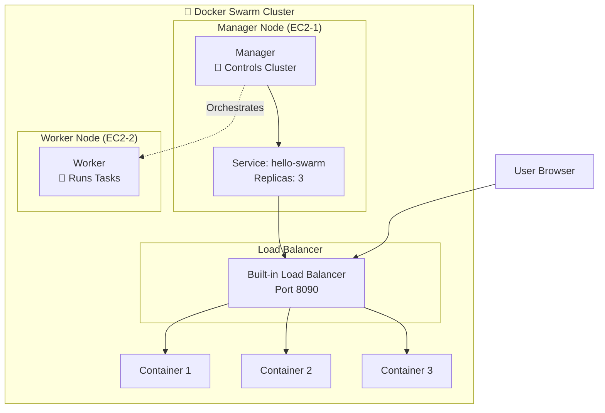
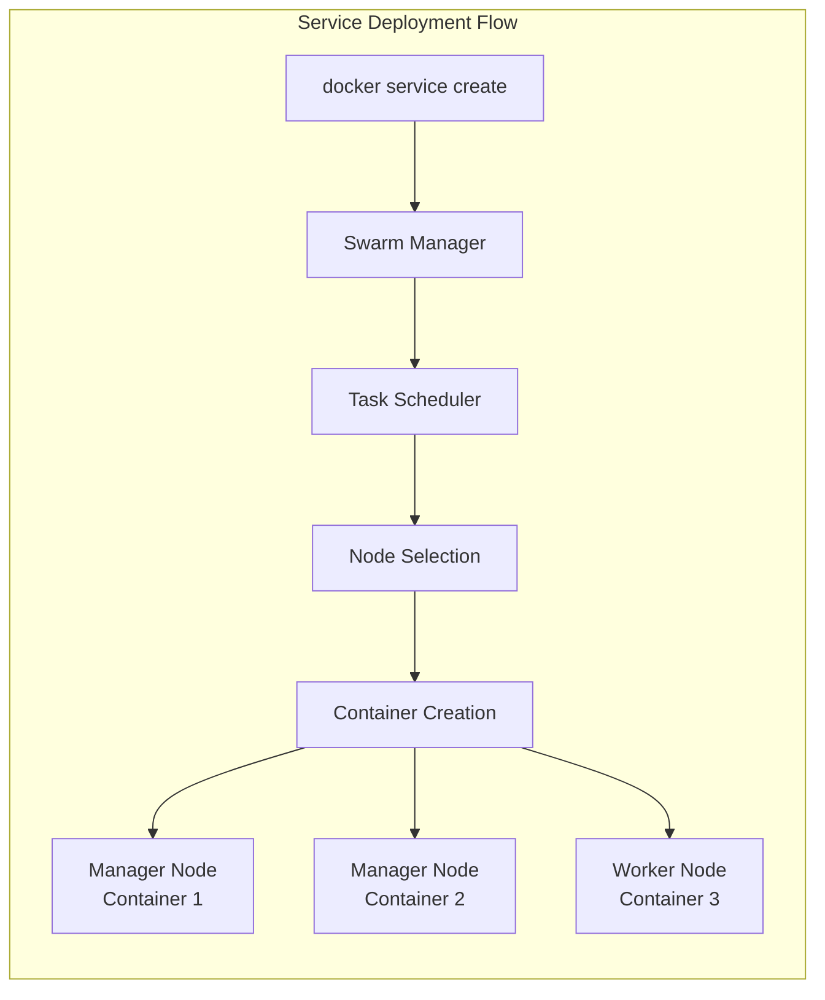

# 🐝 6.1 Docker Swarm Basics & Web Project

<div align="center">


**🎯 Learn Swarm Fundamentals | 🚀 Build Interactive Web App | 📊 Multi-Node Deployment**

</div>

---

## 📋 **What You'll Build**

An interactive color-changing web application deployed across multiple Docker Swarm nodes with:
- ✅ **Multi-node cluster** setup
- ✅ **Load balancing** across replicas
- ✅ **Service scaling** capabilities
- ✅ **Interactive web interface** with color buttons

---

## 🏗️ **Project Architecture**

### **Swarm Cluster Setup:**



### **Service Distribution:**



---

## 🚀 **Step-by-Step Guide**

### **Prerequisites Setup:**
```bash
# Ensure you have 2 EC2 instances with Docker installed
# Security Group: Allow all traffic between instances
```

### **Step 1: Initialize Swarm Cluster**

**On Manager Node (EC2-1):**
```bash
# Initialize swarm
docker swarm init

# Get worker join token (save this output)
docker swarm join-token worker
```

**On Worker Node (EC2-2):**
```bash
# Join the swarm (use token from above)
docker swarm join --token SWMTKN-1-xxxxx <manager-private-ip>:2377
```

**Verify Cluster (on Manager):**
```bash
# Check nodes
docker node ls

# Expected output:
# ID            HOSTNAME   STATUS    AVAILABILITY   MANAGER STATUS
# abc123*       manager    Ready     Active         Leader
# def456        worker     Ready     Active
```

### **Step 2: Get Project Files**

```bash
# Clone repository
git clone https://github.com/manikcloud/cloud-devops-learning-path.git

# Navigate to project
cd cloud-devops-learning-path/Section-2-DevOps/Session-6_Docker-Swarm/6.1_swarm_basics

# Check project files
ls -la
# Expected: index.html, Dockerfile, README.md
```

### **Step 3: Build Application Image**

```bash
# Build the interactive web app image
docker build -t hello-swarm .

# Verify image creation
docker images | grep hello-swarm
```

### **Step 4: Deploy Service Across Cluster**

```bash
# Deploy service with 3 replicas
docker service create \
  --name web \
  --publish 8090:80 \
  --replicas 3 \
  hello-swarm

# Check service status
docker service ls
```

### **Step 5: Verify Deployment**

```bash
# Check service details
docker service ps web

# Expected output shows containers distributed across nodes:
# ID       NAME    IMAGE        NODE      DESIRED STATE   CURRENT STATE
# abc123   web.1   hello-swarm  manager   Running         Running 1 minute ago
# def456   web.2   hello-swarm  worker    Running         Running 1 minute ago
# ghi789   web.3   hello-swarm  manager   Running         Running 1 minute ago
```

### **Step 6: Test Interactive Application**

```bash
# Test with curl
curl http://localhost:8090

# Or open in browser: http://<manager-public-ip>:8090
# You should see an interactive page with color-changing buttons
```

---

## 🎯 **Interactive Features Testing**

### **Load Balancing Test:**
```bash
# Test multiple requests to see load balancing
for i in {1..10}; do 
  echo "Request $i:"
  curl -s http://localhost:8090 | grep -o '[a-f0-9]\{12\}'
done

# You should see different container IDs, proving load balancing works
```

### **Scaling Test:**
```bash
# Scale up to 5 replicas
docker service scale web=5

# Check distribution
docker service ps web

# Scale down to 2 replicas
docker service scale web=2

# Verify scaling
docker service ps web
```

### **High Availability Test:**
```bash
# Find a container ID
docker service ps web

# Remove a container (simulate failure)
docker container rm -f <container-id>

# Check if Swarm recreates it automatically
docker service ps web

# The service should maintain desired replica count
```

---

## 📊 **Essential Swarm Commands**

### **Cluster Management:**
```bash
# Initialize swarm
docker swarm init

# Join as worker
docker swarm join --token <token> <manager-ip>:2377

# List nodes
docker node ls

# Leave swarm
docker swarm leave --force
```

### **Service Management:**
```bash
# Create service
docker service create --name <name> --publish <port>:<port> --replicas <count> <image>

# List services
docker service ls

# Service details
docker service ps <service-name>

# Scale service
docker service scale <service-name>=<replica-count>

# Update service
docker service update --image <new-image> <service-name>

# Remove service
docker service rm <service-name>
```

### **Monitoring Commands:**
```bash
# Service logs
docker service logs <service-name>

# Real-time logs
docker service logs -f <service-name>

# Node information
docker node inspect <node-id>

# Service inspection
docker service inspect <service-name>
```

---

## 🔍 **Troubleshooting Guide**

### **Common Issues:**

#### **Worker Node Can't Join:**
```bash
# Check connectivity
ping <manager-private-ip>

# Verify Docker is running
sudo systemctl status docker
sudo systemctl start docker

# Regenerate join token
docker swarm join-token --rotate worker
```

#### **Service Not Starting:**
```bash
# Check service status
docker service ps web

# View service logs
docker service logs web

# Check node resources
docker node ls
free -h
df -h
```

#### **Load Balancing Not Working:**
```bash
# Verify service is published correctly
docker service inspect web | grep -A 5 "PublishedPorts"

# Check if containers are running
docker service ps web

# Test from different nodes
curl http://<manager-ip>:8090
curl http://<worker-ip>:8090
```

---

## 📁 **Project Files**

```
6.1_swarm_basics/
├── index.html              # Interactive HTML with color buttons
├── Dockerfile              # Apache httpd container definition
└── README.md              # This comprehensive guide
```

### **File Contents:**

**Dockerfile:**
```dockerfile
FROM httpd:2.4
COPY index.html /usr/local/apache2/htdocs/
EXPOSE 80
```

**index.html:**
- Interactive web page with color-changing buttons
- Shows container information
- Demonstrates load balancing across replicas

---

## 🎓 **Learning Outcomes**

After completing this project, you will understand:

### **Technical Skills:**
- ✅ **Swarm Initialization** - Set up multi-node clusters
- ✅ **Service Deployment** - Deploy applications across nodes
- ✅ **Load Balancing** - Distribute traffic automatically
- ✅ **Service Scaling** - Scale applications up and down
- ✅ **High Availability** - Handle container failures gracefully

### **Practical Knowledge:**
- ✅ **Multi-node orchestration** concepts
- ✅ **Container distribution** strategies
- ✅ **Service discovery** mechanisms
- ✅ **Cluster management** best practices

---

## 🧹 **Cleanup**

```bash
# Remove service
docker service rm web

# Leave swarm mode (on both nodes)
docker swarm leave --force

# Remove custom image
docker rmi hello-swarm

# Verify cleanup
docker service ls
docker node ls
```

---

<div align="center">

### 🎯 **Ready for Advanced Stacks?**

**Next: [6.2 Stack Project](../6.2_stack_project/README.md)**

*Build multi-service applications with Flask + Redis!*

</div>
