# 🐝 6.1 Docker Swarm Basics & Web Project

<div align="center">


**🎯 Learn Swarm Fundamentals | 🚀 Build Interactive Web App | 📊 Multi-Node Deployment**

</div>

---

## 📋 **What You'll Build**

An interactive color-changing web application deployed across multiple Docker Swarm nodes with:
- ✅ **Multi-node cluster** setup
- ✅ **Load balancing** across replicas
- ✅ **Service scaling** capabilities
- ✅ **Interactive web interface** with color buttons

---

## 🏗️ **Project Architecture**

### **Swarm Cluster Setup:**

```mermaid
graph TB
    subgraph "🐝 Docker Swarm Cluster"
        subgraph "Manager Node (EC2-1)"
            M1[Manager<br/>🎯 Controls Cluster]
            S1[Service: hello-swarm<br/>Replicas: 3]
        end
        
        subgraph "Worker Node (EC2-2)"
            W1[Worker<br/>🔧 Runs Tasks]
        end
        
        subgraph "Load Balancer"
            LB[Built-in Load Balancer<br/>Port 8090]
        end
        
        M1 --> S1
        M1 -.->|Orchestrates| W1
        S1 --> LB
        LB --> C1[Container 1]
        LB --> C2[Container 2] 
        LB --> C3[Container 3]
    end
    
    U[User Browser] --> LB
```



### **Service Distribution:**


---

## 🚀 **Step-by-Step Guide**

### **Prerequisites Setup:**
```bash
# Ensure you have 2 EC2 instances with Docker installed
# Security Group: Allow all traffic between instances
```

### **Step 1: Initialize Swarm Cluster**

**On Manager Node (EC2-1):**
```bash
# Initialize swarm
docker swarm init

# Get worker join token (save this output)
docker swarm join-token worker
```

**On Worker Node (EC2-2):**
```bash
# Join the swarm (use token from above)
docker swarm join --token SWMTKN-1-xxxxx <manager-private-ip>:2377
```

**Verify Cluster (on Manager):**
```bash
# Check nodes
docker node ls

# Expected output:
# ID            HOSTNAME   STATUS    AVAILABILITY   MANAGER STATUS
# abc123*       manager    Ready     Active         Leader
# def456        worker     Ready     Active
```

### **Step 2: Get Project Files**

```bash
# Clone repository
git clone https://github.com/manikcloud/cloud-devops-learning-path.git

# Navigate to project
cd cloud-devops-learning-path/Section-2-DevOps/Session-6_Docker-Swarm/6.1_swarm_basics

# Check project files
ls -la
# Expected: index.html, Dockerfile, README.md
```

### **Step 3: Build Application Image**

```bash
# Build the interactive web app image
docker build -t hello-swarm .

# Verify image creation
docker images | grep hello-swarm
```

### **Step 4: Deploy Service Across Cluster**

```bash
# Deploy service with 3 replicas
docker service create \
  --name web \
  --publish 8090:80 \
  --replicas 3 \
  hello-swarm

# Check service status
docker service ls
```

### **Step 5: Verify Deployment**

```bash
# Check service details
docker service ps web

# Expected output shows containers distributed across nodes:
# ID       NAME    IMAGE        NODE      DESIRED STATE   CURRENT STATE
# abc123   web.1   hello-swarm  manager   Running         Running 1 minute ago
# def456   web.2   hello-swarm  worker    Running         Running 1 minute ago
# ghi789   web.3   hello-swarm  manager   Running         Running 1 minute ago
```

### **Step 6: Test Interactive Application**

```bash
# Test with curl
curl http://localhost:8090

# Or open in browser: http://<manager-public-ip>:8090
# You should see an interactive page with color-changing buttons
```

---

## 🎯 **Interactive Features Testing**

### **Browser Test - See Container IDs:**
```bash
# 1. Open in browser: http://<your-server-ip>:8090
# 2. Refresh the page multiple times
# 3. Notice different Container IDs appear - this proves load balancing!

# Or test with curl to see container IDs:
for i in {1..10}; do 
  echo "Request $i:"
  curl -s http://localhost:8090 | grep -o '[a-f0-9]\{12\}'
done

# You should see different container IDs, proving load balancing works
```

### **Scaling Test:**
```bash
# Scale up to 5 replicas
docker service scale web=5

# Check distribution
docker service ps web

# Scale down to 2 replicas
docker service scale web=2

# Verify scaling
docker service ps web
```

### **High Availability Test:**
```bash
# Find a container ID
docker service ps web

# Remove a container (simulate failure)
docker container rm -f <container-id>

# Check if Swarm recreates it automatically
docker service ps web

# The service should maintain desired replica count
```

---

## 📁 **Project Files**

```
6.1_swarm_basics/
├── index.html              # Simple web page showing container ID
├── Dockerfile              # Apache httpd container definition
└── README.md              # This guide
```

### **File Contents:**

**Dockerfile:**
```dockerfile
FROM httpd:2.4
COPY index.html /usr/local/apache2/htdocs/
EXPOSE 80
```

**index.html:**
- Simple web page showing container ID and hostname
- Displays current timestamp for each request
- Demonstrates load balancing across replicas

---

## 🎓 **Learning Outcomes**

After completing this project, you will understand:

### **Technical Skills:**
- ✅ **Swarm Initialization** - Set up multi-node clusters
- ✅ **Service Deployment** - Deploy applications across nodes
- ✅ **Load Balancing** - Distribute traffic automatically
- ✅ **Service Scaling** - Scale applications up and down
- ✅ **High Availability** - Handle container failures gracefully

### **Practical Knowledge:**
- ✅ **Multi-node orchestration** concepts
- ✅ **Container distribution** strategies
- ✅ **Service discovery** mechanisms
- ✅ **Cluster management** best practices

---

## 🧹 **Cleanup**

```bash
# Remove service
docker service rm web

# Leave swarm mode (on both nodes)
docker swarm leave --force

# Remove custom image
docker rmi hello-swarm

# Verify cleanup
docker service ls
docker node ls
```

---

<div align="center">

### 🎯 **Ready for Advanced Stacks?**

**Next: [6.2 Stack Project](../6.2_stack_project/README.md)**

*Build multi-service applications with Flask + Redis!*

</div>
