# 🐝 6.2 Docker Stack Project - Flask + Redis Demo

<div align="center">


**🎯 Multi-Service Stack | 🚀 Flask + Redis | 📊 Production Deployment**

</div>

---

## 📋 **What You'll Build**

A production-ready multi-service application featuring:
- ✅ **Flask web application** with visit counter
- ✅ **Redis database** for data persistence
- ✅ **Load balancing** across multiple Flask replicas
- ✅ **Service discovery** and inter-service communication
- ✅ **Overlay networking** for secure communication

---

## 🏗️ **Stack Architecture**

### **Complete Application Flow:**

```mermaid
graph TB
    subgraph "🌐 External Access"
        U[User Browser<br/>Port 8000]
    end
    
    subgraph "🐝 Docker Swarm Cluster"
        subgraph "Load Balancer"
            LB[Swarm Load Balancer<br/>Port 8000]
        end
        
        subgraph "Flask Web Service (3 replicas)"
            F1[Flask App 1<br/>Container]
            F2[Flask App 2<br/>Container]
            F3[Flask App 3<br/>Container]
        end
        
        subgraph "Redis Database Service"
            R1[Redis Database<br/>Single Instance]
        end
        
        subgraph "Overlay Network (webnet)"
            N1[Encrypted Communication]
        end
    end
    
    U --> LB
    LB --> F1
    LB --> F2
    LB --> F3
    
    F1 -.->|redis:6379| R1
    F2 -.->|redis:6379| R1
    F3 -.->|redis:6379| R1
    
    F1 --- N1
    F2 --- N1
    F3 --- N1
    R1 --- N1
```



### **Service Communication Flow:**


### **Docker Stack Components:**


---

## 📚 **What is Docker Stack?**

### **Simple Explanation:**
Docker Stack is like a recipe that tells Docker Swarm how to run multiple containers together as one application.

**Think of it like this:**
- 🍕 **Single Container** = One pizza slice
- 📦 **Docker Stack** = Complete pizza with multiple slices working together

### **Why Use Docker Stack?**
- ✅ **Multiple Services**: Run web app + database together
- ✅ **Easy Management**: One command to start/stop everything
- ✅ **Load Balancing**: Automatically spreads traffic across containers
- ✅ **Service Discovery**: Containers can find each other by name

### **Our Project Goal:**
Build a simple web application that:
1. **Shows a webpage** with a visit counter
2. **Counts visits** using a Redis database
3. **Runs multiple copies** of the web app for load balancing
4. **Demonstrates** how containers talk to each other

**What You'll Learn:**
- How to define multiple services in one file
- How containers communicate with each other
- How Docker Swarm manages multiple containers
- How to test and verify your application works

---

## 🚀 **Step-by-Step Deployment**

### **Prerequisites:**
```bash
# Ensure Docker Swarm is initialized
docker swarm init

# Verify swarm mode
docker node ls
```

### **Step 1: Get Project Files**

```bash
# Clone repository
git clone https://github.com/manikcloud/cloud-devops-learning-path.git

# Navigate to stack project
cd cloud-devops-learning-path/Section-2-DevOps/Session-6_Docker-Swarm/6.2_stack_project

# Check project structure
ls -la
# Expected: app.py, requirements.txt, Dockerfile, docker-compose.yml, README.md
```

### **Step 2: Build Flask Application**

**What we're doing:** Creating a Docker image from our Flask web application code.

**Why this step:** Docker needs to package our Python code into an image before it can run containers.

```bash
# Build the Flask app image
docker build -t stackdemo .

# Verify image creation
docker images | grep stackdemo

# Expected output:
# stackdemo    latest    abc123def456    2 minutes ago    200MB
```

### **Step 3: Deploy Complete Stack**

**What we're doing:** Starting both Flask web app and Redis database together as one stack.

**Why this step:** This creates our complete application with all services running and connected.

```bash
# Deploy Flask + Redis stack
docker stack deploy -c docker-compose.yml mystack

# Wait for services to start (30-60 seconds)
echo "Waiting for services to start..."
sleep 45
```

### **Step 4: Verify Stack Deployment**

**What we're doing:** Checking that our Flask app and Redis database are running correctly.

**Why this step:** We need to confirm all services started successfully before testing the application.

```bash
# Check stack status
docker stack ls

# Expected output:
# NAME      SERVICES   ORCHESTRATOR
# mystack   2          Swarm

# Check individual services
docker stack services mystack

# Expected output:
# ID        NAME           MODE         REPLICAS   IMAGE           PORTS
# abc123    mystack_redis  replicated   1/1        redis:alpine    
# def456    mystack_web    replicated   3/3        stackdemo       *:8000->8000/tcp
```

### **Step 5: Test Application Functionality**

**What we're doing:** Testing that our web app can count visits and store data in Redis.

**Why this step:** This proves that Flask and Redis are communicating correctly and our application works.

```bash
# Test visit counter (first visit)
curl http://localhost:8000
# Expected: "Hello World! I have been seen 1 times."

# Test again (counter should increment)
curl http://localhost:8000
# Expected: "Hello World! I have been seen 2 times."

# Test multiple times to verify persistence
for i in {1..5}; do 
  echo "Visit $i: $(curl -s http://localhost:8000)"
done
```

---

## 📊 **Application Testing & Verification**

### **Load Balancing Test:**
```bash
# Test load balancing across Flask replicas
echo "Testing load balancing..."
for i in {1..10}; do
  response=$(curl -s http://localhost:8000)
  echo "Request $i: $response"
  sleep 1
done

# All requests should increment the same counter (shared Redis data)
# Traffic should be distributed across 3 Flask containers
```

### **Service Discovery Test:**

**What we're doing:** Testing if Flask containers can find and talk to Redis by name.

**Why this matters:** In Docker Stack, containers use service names (like "redis") instead of IP addresses to communicate.

```bash
# Test from any web container - Method 1
docker exec -it $(docker ps -q --filter name=mystack_web | head -1) sh

# Then inside the container:
ping redis
nslookup redis

# Alternative - Direct command test
docker exec -it $(docker ps -q --filter name=mystack_web | head -1) ping redis

# Test Redis connectivity from Flask container
docker exec -it $(docker ps -q --filter name=mystack_web | head -1) nc -zv redis 6379
```

### **High Availability Test:**
```bash
# Remove one Flask container (simulate failure)
flask_container=$(docker ps -q -f name=mystack_web | head -1)
docker container rm -f $flask_container

# Check if Swarm recreates the container
sleep 10
docker service ps mystack_web

# Test if application still works
curl http://localhost:8000
# Should still work with remaining containers
```

---

## 🔧 **Stack Management Operations**

**What this section covers:** How to manage your running stack - scale up/down, update, and clean up.

**Why learn this:** In real applications, you need to adjust resources and maintain your services.

### **Scaling Services:**

**What we're doing:** Changing the number of Flask containers running.

**Why useful:** More containers = handle more users, fewer containers = save resources.

```bash
# Scale Flask web service to 5 replicas
docker service scale mystack_web=5

# Verify scaling
docker service ps mystack_web

# Test with increased load
for i in {1..20}; do curl -s http://localhost:8000 & done
wait
```

### **Service Updates:**
```bash
# Update Flask service (zero-downtime deployment)
docker service update --image stackdemo:v2 mystack_web

# Monitor update progress
docker service ps mystack_web

# Rollback if needed
docker service rollback mystack_web
```

### **Monitoring & Logs:**
```bash
# View Flask service logs
docker service logs mystack_web

# View Redis service logs
docker service logs mystack_redis

# Follow logs in real-time
docker service logs -f mystack_web

# Check service resource usage
docker stats $(docker ps -q -f name=mystack)
```

---

## 📋 **Docker Compose Configuration**

**What this is:** The "recipe file" that tells Docker how to run our Flask + Redis application.

**Why important:** This file defines how many containers to run, which ports to use, and how services connect.

### **Stack Definition (docker-compose.yml):**

**What each part does:**
- **services:** Lists our Flask web app and Redis database
- **replicas:** How many copies of each service to run
- **ports:** Which port users access our app on
- **networks:** How containers talk to each other
```yaml
version: '3.8'

services:
  redis:
    image: redis:alpine
    networks:
      - webnet
    deploy:
      replicas: 1
      placement:
        constraints: [node.role == manager]

  web:
    image: stackdemo
    depends_on:
      - redis
    ports:
      - "8000:8000"
    networks:
      - webnet
    deploy:
      replicas: 3
      update_config:
        parallelism: 1
        delay: 10s
      restart_policy:
        condition: on-failure

networks:
  webnet:
    driver: overlay
```

### **Key Configuration Features:**
- **Overlay Network:** Secure multi-host networking
- **Service Dependencies:** Web service waits for Redis
- **Placement Constraints:** Redis runs on manager node
- **Update Strategy:** Rolling updates with zero downtime
- **Restart Policy:** Automatic recovery on failure

---

## 📁 **Project Structure**

```
6.2_stack_project/
├── app.py                # Flask application with Redis integration
├── requirements.txt      # Python dependencies (flask==2.0.1, redis==3.5.3)
├── Dockerfile           # Multi-stage Flask container build
├── docker-compose.yml   # Complete stack definition
└── README.md           # This guide
```

### **Application Code Overview:**

**What this section shows:** The actual Python code that creates our web application.

**Why look at this:** Understanding the code helps you see how Flask connects to Redis and counts visits.

**app.py - Flask Application:**

**What this code does:**
- **Creates a web server** that responds to browser requests
- **Connects to Redis** database to store the visit counter
- **Increments counter** each time someone visits the page
- **Returns message** showing how many times the page was visited
```python
from flask import Flask
from redis import Redis
import os

app = Flask(__name__)
redis = Redis(host='redis', port=6379)

@app.route('/')
def hello():
    count = redis.incr('hits')
    return f'Hello World! I have been seen {count} times.\n'

if __name__ == "__main__":
    app.run(host="0.0.0.0", port=8000, debug=True)
```

**Key Features:**
- Connects to Redis using service name `redis`
- Increments visit counter on each request
- Returns formatted response with visit count

---

## 🎓 **Learning Outcomes**

### **Technical Skills Mastered:**
- ✅ **Multi-Service Deployment** - Deploy interconnected services
- ✅ **Service Discovery** - Container communication by service name
- ✅ **Overlay Networking** - Secure multi-host container networking
- ✅ **Load Balancing** - Distribute traffic across service replicas
- ✅ **Data Persistence** - Maintain state across container restarts
- ✅ **Rolling Updates** - Zero-downtime application updates

### **Production Concepts:**
- ✅ **Stack Management** - Manage multi-service applications as units
- ✅ **Service Dependencies** - Handle service startup order
- ✅ **High Availability** - Design fault-tolerant applications
- ✅ **Monitoring & Logging** - Track application health and performance

---

## 🧹 **Cleanup**

```bash
# Remove the entire stack
docker stack rm mystack

# Verify stack removal
docker stack ls

# Remove custom images (optional)
docker rmi stackdemo

# Remove unused networks
docker network prune -f

# Verify cleanup
docker service ls
docker network ls
```

---

<div align="center">

### 🎯 **Congratulations!**

You've successfully deployed a production-ready multi-service application using Docker Stack!

**Next Steps:** Explore Kubernetes or advanced Docker Swarm features

*Master container orchestration with real-world applications!*

</div>
