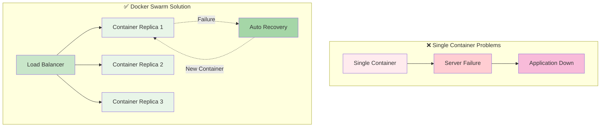
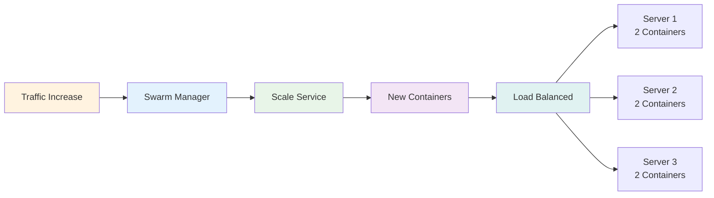
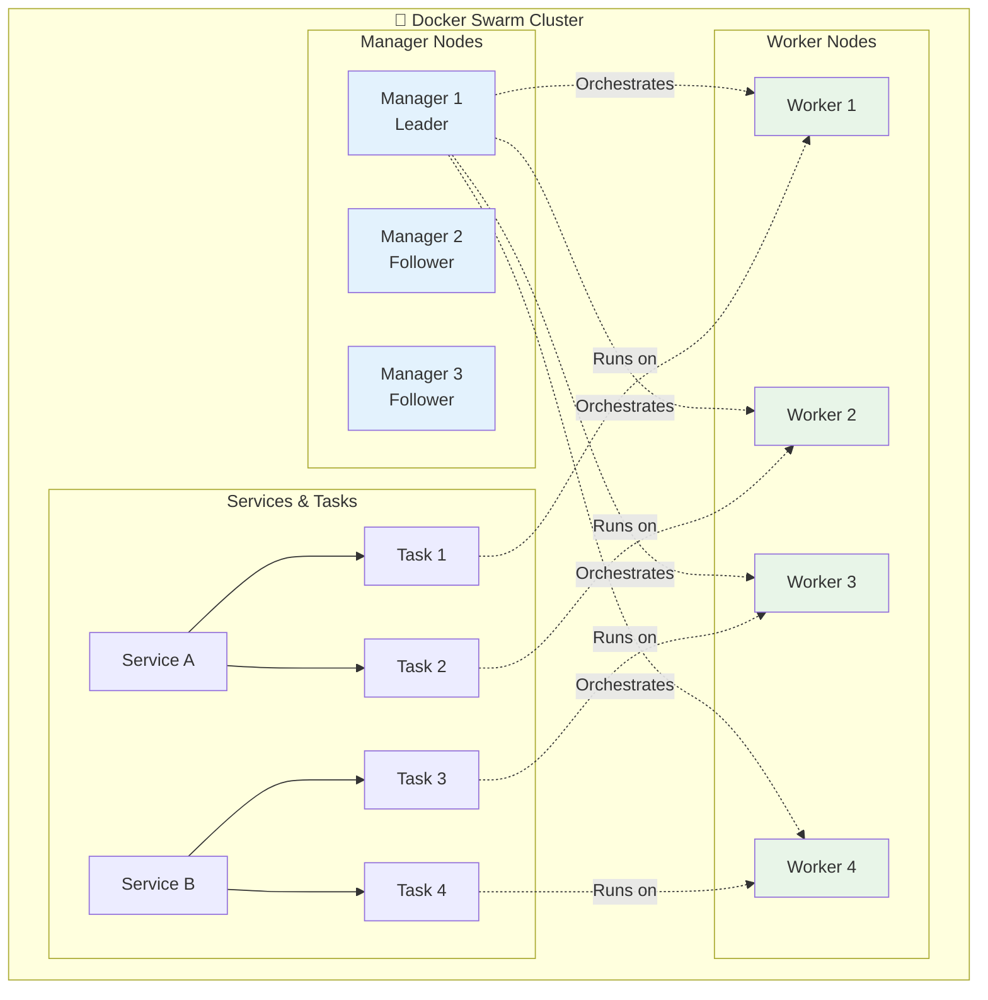

# 🐝 Session-6: Docker Swarm

<div align="center">


**🎯 Container Orchestration | 🚀 Multi-Node Deployment | 📦 Service Management**

</div>

---

## 📑 Table of Contents

1. [📚 Docker Swarm Theory & Fundamentals](#-docker-swarm-theory--fundamentals)
2. [📖 What is Docker Swarm?](#-what-is-docker-swarm)
3. [🐝 Docker Swarm Learning Journey](#-docker-swarm-learning-journey)
4. [📁 Module Structure](#-module-structure)
5. [🚀 Quick Start](#-quick-start)
6. [🎯 Learning Path](#-learning-path)

---

## 📚 Docker Swarm Theory & Fundamentals

### 🏛️ **Docker Swarm History & Evolution**

**Timeline:**
- **2014**: Docker Swarm v1 introduced as separate orchestration tool
- **2016**: Docker Swarm Mode integrated into Docker Engine (v1.12)
- **2017**: Docker Swarm became production-ready with enhanced features
- **Present**: Built-in orchestration solution in Docker Engine

**Key Contributors:**
- **Docker Inc.** - Core development team
- **Andrea Luzzardi** - Original Swarm architect
- **Community** - Extensive contributions and feedback

> 💡 **Evolution**: Docker Swarm evolved from a standalone tool to an integrated part of Docker Engine, making orchestration accessible to all Docker users.

### ❌ **Problems Before Container Orchestration**

#### **Single Container Limitations**
- **No High Availability**: Single point of failure
- **Manual Scaling**: Had to manually start/stop containers
- **No Load Balancing**: Traffic went to single container
- **Resource Wastage**: Underutilized servers

#### **Multi-Container Complexity**
- **Manual Coordination**: Managing multiple containers manually
- **Service Discovery**: Containers couldn't find each other easily
- **Network Management**: Complex networking between containers
- **Rolling Updates**: Downtime during application updates

#### **Infrastructure Challenges**
- **Server Utilization**: Poor resource distribution across servers
- **Fault Tolerance**: No automatic recovery from failures
- **Scaling Issues**: Difficult to scale applications horizontally
- **Deployment Complexity**: Complex multi-server deployments

### ✅ **How Docker Swarm Solves These Problems**

#### **High Availability & Fault Tolerance**



#### **Automatic Scaling & Load Distribution**



**Key Benefits:**
- ✅ **Automatic failover** when containers crash
- ✅ **Load balancing** across multiple containers
- ✅ **Easy scaling** with simple commands
- ✅ **Rolling updates** with zero downtime

### 🏗️ **Docker Swarm Architecture**

#### **Swarm Cluster Components**



#### **Architecture Components**

| Component | Role | Description |
|-----------|------|-------------|
| **Manager Node** | Cluster Management | Orchestrates services, maintains cluster state |
| **Worker Node** | Task Execution | Runs containers as assigned by managers |
| **Service** | Application Definition | Defines desired state of application |
| **Task** | Container Instance | Individual container running on a node |
| **Load Balancer** | Traffic Distribution | Routes traffic to healthy containers |

### ⚡ **Docker Swarm Key Features**

#### **🚀 Performance & Efficiency**

| Feature | Single Container | Docker Swarm |
|---------|------------------|--------------|
| **High Availability** | ❌ Single point of failure | ✅ Multiple replicas |
| **Scaling Time** | Manual (minutes) | Automatic (seconds) |
| **Load Balancing** | ❌ No built-in LB | ✅ Automatic load balancing |
| **Fault Recovery** | ❌ Manual restart | ✅ Auto-healing |
| **Rolling Updates** | ❌ Downtime required | ✅ Zero-downtime updates |
| **Resource Utilization** | Poor (single server) | Excellent (multi-server) |

#### **🔧 Management Features**

**Service Management:**
```bash
# Create service with 3 replicas
docker service create --name web --replicas 3 nginx

# Scale service instantly
docker service scale web=10

# Rolling update with zero downtime
docker service update --image nginx:latest web
```

#### **🌐 Networking Features**
- **Overlay Networks**: Secure multi-host networking
- **Service Discovery**: Containers find each other by name
- **Load Balancing**: Built-in load balancer for services
- **Ingress Routing**: External traffic routing to services

#### **🔒 Security Features**
- **TLS Encryption**: All cluster communication encrypted
- **Node Authentication**: Secure node joining with tokens
- **Secret Management**: Secure storage of sensitive data
- **Role-Based Access**: Manager vs worker node permissions

### 🆚 **Docker Swarm vs Other Orchestrators**

#### **Comparison Table**

| Feature | Docker Swarm | Kubernetes | Docker Compose |
|---------|--------------|------------|----------------|
| **Learning Curve** | Easy | Complex | Very Easy |
| **Setup Time** | Minutes | Hours/Days | Seconds |
| **Multi-Host** | ✅ Yes | ✅ Yes | ❌ No |
| **Auto-Scaling** | ✅ Manual | ✅ Auto | ❌ No |
| **Load Balancing** | ✅ Built-in | ✅ Advanced | ❌ No |
| **Rolling Updates** | ✅ Yes | ✅ Advanced | ❌ No |
| **Community** | Good | Huge | Good |
| **Production Ready** | ✅ Yes | ✅ Yes | ❌ Dev only |

#### **When to Use Docker Swarm**
- ✅ **Simple orchestration** needs
- ✅ **Quick setup** required
- ✅ **Small to medium** applications
- ✅ **Docker-native** environment
- ✅ **Learning orchestration** concepts

### 🎯 **Why Choose Docker Swarm**

1. **Simplicity**: Easy to learn and use
2. **Native Integration**: Built into Docker Engine
3. **Quick Setup**: Cluster ready in minutes
4. **Zero Downtime**: Rolling updates without service interruption
5. **Auto-Healing**: Automatic container replacement on failure
6. **Load Balancing**: Built-in traffic distribution
7. **Secure**: TLS encryption and secure tokens

---

## 📖 What is Docker Swarm?

Docker Swarm is Docker's built-in orchestration tool that manages multiple containers across multiple machines.

### **Why Use Docker Swarm?**
- **Scale applications** - Run multiple copies
- **High availability** - If one container fails, others continue
- **Load balancing** - Distribute traffic automatically
- **Easy management** - Simple commands to manage services

---

## 🐝 Docker Swarm Learning Journey

```
┌─────────────────────────────────────────────────────────────────────────────┐
│                        🐝 DOCKER SWARM MASTERY PATH                        │
└─────────────────────────────────────────────────────────────────────────────┘

📚 6.1 Swarm Basics              📦 6.2 Stack Project
     │                                │
     │ • Cluster Setup                │ • Multi-Service Stack
     │ • Manager & Worker Nodes       │ • Flask + Redis Demo
     │ • Service Creation             │ • Service Scaling
     │ • Load Balancing               │ • Network Management
     │ • Health Checks               │ • Production Deployment
     │                                │
     ▼                                ▼
┌─────────────────────────┐    ┌─────────────────────────┐
│    🏗️ INFRASTRUCTURE    │───►│   🚀 PRODUCTION STACK   │
│                         │    │                         │
│ • docker swarm init     │    │ • docker stack deploy   │
│ • docker node ls        │    │ • Multi-container apps   │
│ • docker service create │    │ • Service dependencies  │
│ • docker service scale  │    │ • Overlay networking    │
│ • Multi-node cluster    │    │ • Rolling updates       │
└─────────────────────────┘    └─────────────────────────┘

        ┌─────────────────────────────────────────┐
        │           🎯 SWARM ARCHITECTURE         │
        │                                         │
        │  Manager Node    ←→    Worker Node      │
        │      │                     │            │
        │   Services              Services        │
        │   Tasks                 Tasks           │
        │   Load Balancer         Containers      │
        └─────────────────────────────────────────┘

┌─────────────────────────────────────────────────────────────────────────────┐
│  🎯 Outcome: Orchestration Expert | 📦 Multi-Node Skills | 🚀 Production Ready │
└─────────────────────────────────────────────────────────────────────────────┘
```

*Master container orchestration from single-node to production multi-service stacks*

---

## 🔧 Prerequisites

### **Infrastructure Requirements**
- **2 EC2 Instances** - One manager, one worker node
- **Security Group Configuration** - Allow Swarm communication ports
- **Docker Installed** - On both EC2 instances

### **EC2 Setup**
```bash
# Instance 1: Manager Node
# Instance 2: Worker Node
# Both should have Docker installed
```

### **Security Group Rules**
Create one Security Group and add these rules:
```
# Inbound Rules:
Type: All Traffic, Protocol: All, Port: All, Source: Your IP Address
Type: All Traffic, Protocol: All, Port: All, Source: Security Group ID (self-reference)

# Outbound Rules:
Type: All Traffic, Protocol: All, Port: All, Destination: 0.0.0.0/0
```

**Simple Setup:**
- **Your IP Access** - Full access from your location
- **Inter-EC2 Communication** - All traffic between EC2 instances in same SG
- **Internet Access** - Outbound traffic allowed

### **Docker Installation (Both EC2s)**
```bash
# Amazon Linux 2
sudo yum update -y
sudo yum install docker -y
sudo systemctl start docker
sudo systemctl enable docker
sudo usermod -aG docker $USER
# Log out and log back in
```

---

## 📁 Module Structure

### **[6.1 Swarm Basics & Project](./6.1_swarm_basics/)**
- **[Commands & Web Project](./6.1_swarm_basics/README.md)** - Essential commands and color-changing web app

### **[6.2 Stack Project](./6.2_stack_project/)**
- **[Multi-Service Stack](./6.2_stack_project/README.md)** - Deploy web + database with docker-compose
- **[Docker Compose File](./6.2_stack_project/docker-compose.yml)** - Stack definition

---

## 🚀 Quick Start

### **Step 1: Initialize Swarm (Manager Node)**
```bash
# On EC2-1 (Manager)
docker swarm init

# Get join token
docker swarm join-token worker
```

### **Step 2: Join Worker Node**
```bash
# On EC2-2 (Worker) - use token from Step 1
docker swarm join --token SWMTKN-1-xxxxx <manager-private-ip>:2377

# Verify on manager
docker node ls
```

### **Step 3: Deploy Service**
```bash
# Deploy service across both nodes
docker service create --name web --publish 8080:80 --replicas 3 nginx

# Check service distribution
docker service ps web
```

---

## 🎯 Learning Path

### **Week 1: [Swarm Basics & Web Project](./6.1_swarm_basics/)**
- Initialize Docker Swarm
- Create interactive web service
- Scale and manage services

### **Week 2: [Stack Management](./6.2_stack_project/)**
- Deploy multi-service applications
- Use docker-compose.yml files
- Manage web + database stacks

---

*Master container orchestration with Docker Swarm!* 🚀
