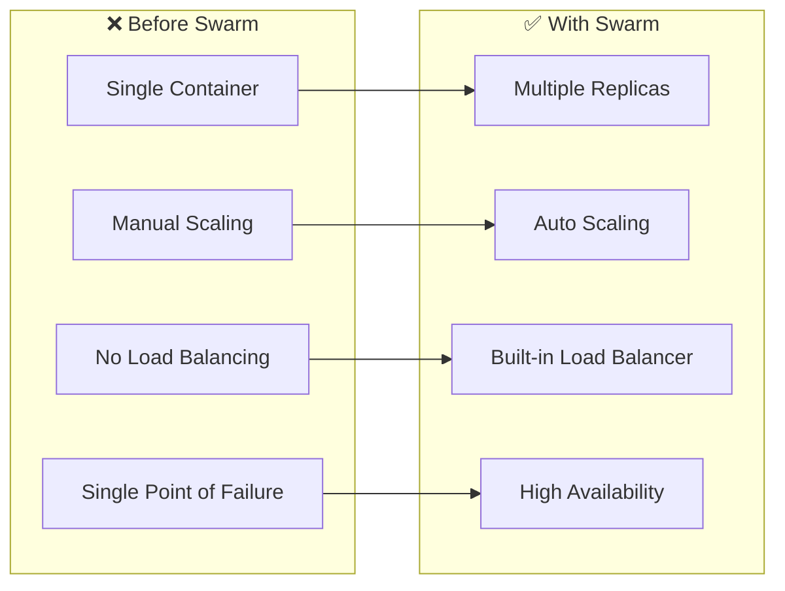
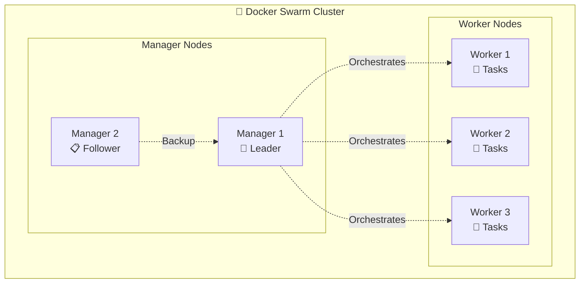
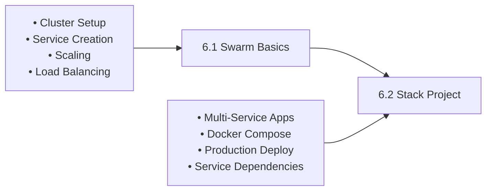

# 🐝 Session 6: Docker Swarm

<div align="center">


**🎯 Container Orchestration | 🚀 Multi-Node Deployment | 📦 Service Management**

</div>

---

## 📋 **What You'll Learn**

By the end of this session, you'll master:
- ✅ **Docker Swarm Setup** - Initialize and manage clusters
- ✅ **Service Orchestration** - Deploy and scale applications
- ✅ **Multi-Node Management** - Coordinate multiple servers
- ✅ **Production Deployment** - Real-world container orchestration

---

## 🚀 **Quick Start Guide**

### **Prerequisites:**
- 2 EC2 instances (or VMs)
- Docker installed on both
- Basic Docker knowledge

### **5-Minute Setup:**
```bash
# 1. Initialize Swarm (Manager Node)
docker swarm init

# 2. Join Worker Node (use token from step 1)
docker swarm join --token SWMTKN-1-xxxxx <manager-ip>:2377

# 3. Deploy Your First Service
docker service create --name web --publish 8090:80 --replicas 3 nginx

# 4. Check Status
docker service ls
docker service ps web
```

**🎉 Congratulations!** You now have a 3-replica web service running across multiple nodes.

---

## 📚 **What is Docker Swarm?**

### **Simple Explanation:**
Docker Swarm turns multiple Docker hosts into a single, virtual Docker host. It's like having a team of servers working together as one powerful machine.

### **The Problem It Solves:**



### **Key Benefits:**
- 🔄 **Auto-healing** - Replaces failed containers automatically
- ⚖️ **Load balancing** - Distributes traffic evenly
- 📈 **Easy scaling** - Scale up/down with simple commands
- 🔒 **Secure** - Built-in TLS encryption
- 🎯 **Simple** - Easy to learn and use

---

## 🏗️ **Docker Swarm Architecture**

### **Cluster Components:**



### **Detailed Architecture Flow:**

```
┌─────────────────────────────────────────────────────────────────┐
│                    DOCKER SWARM ARCHITECTURE                    │
├─────────────────────────────────────────────────────────────────┤
│                                                                 │
│  ┌─────────────┐    ┌─────────────┐    ┌─────────────────────┐  │
│  │   Manager   │    │   Worker    │    │      Services       │  │
│  │    Node     │    │    Node     │    │                     │  │
│  │             │    │             │    │ ┌─────┐ ┌─────────┐ │  │
│  │ ┌─────────┐ │───▶│ ┌─────────┐ │───▶│ │Task1│ │ Task2   │ │  │
│  │ │ Raft    │ │    │ │ Docker  │ │    │ └─────┘ └─────────┘ │  │
│  │ │ Store   │ │    │ │ Engine  │ │    │ ┌─────┐ ┌─────────┐ │  │
│  │ └─────────┘ │    │ └─────────┘ │    │ │Task3│ │ Task4   │ │  │
│  │             │    │             │    │ └─────┘ └─────────┘ │  │
│  │ ┌─────────┐ │    │ ┌─────────┐ │    │                     │  │
│  │ │ API     │ │◀───│ │ Agent   │ │    └─────────────────────┘  │
│  │ │ Server  │ │    │ │         │ │                             │
│  │ └─────────┘ │    │ └─────────┘ │                             │
│  └─────────────┘    └─────────────┘                             │
└─────────────────────────────────────────────────────────────────┘
```

### **Service to Task Distribution:**

```
                    🐝 DOCKER SWARM SERVICE DEPLOYMENT
                    
    Service Definition          Task Distribution           Container Execution
    ┌─────────────────┐        ┌─────────────────┐        ┌─────────────────┐
    │                 │        │                 │        │                 │
    │ Service: web    │───────▶│ Task 1 → Node A │───────▶│ Container 1     │
    │ Replicas: 3     │        │ Task 2 → Node B │        │ Container 2     │
    │ Image: nginx    │        │ Task 3 → Node C │        │ Container 3     │
    │ Port: 80        │        │                 │        │                 │
    │                 │        │ Load Balancer   │        │ Health Checks   │
    └─────────────────┘        └─────────────────┘        └─────────────────┘
            │                           │                           │
            │                           │                           │
            ▼                           ▼                           ▼
    ┌─────────────────┐        ┌─────────────────┐        ┌─────────────────┐
    │ Desired State   │        │ Scheduling      │        │ Running State   │
    │ • 3 replicas    │        │ • Node selection│        │ • Health status │
    │ • nginx:latest  │        │ • Resource alloc│        │ • Performance   │
    │ • Port mapping  │        │ • Constraints   │        │ • Logs          │
    └─────────────────┘        └─────────────────┘        └─────────────────┘
```

### **Component Roles:**

| Component | What It Does | Example |
|-----------|-------------|---------|
| **Manager Node** | Controls the cluster, makes decisions | CEO of the company |
| **Worker Node** | Runs containers as instructed | Employees doing the work |
| **Service** | Defines what you want to run | "Run 3 copies of nginx" |
| **Task** | Individual container instance | One nginx container |

---

## 📁 **Module Structure**

### **Learning Path:**



### **Project Structure:**
```
Session-6_Docker-Swarm/
├── README.md                    # This guide
├── 6.1_swarm_basics/           # Start here
│   └── README.md               # Basic commands & web project
└── 6.2_stack_project/          # Advanced project
    ├── README.md               # Multi-service stack
    └── docker-compose.yml      # Stack definition
```

---

## 🎯 **Learning Journey**

### **🚀 Start Here: [6.1 Swarm Basics](./6.1_swarm_basics/)**
**What you'll build:** Interactive color-changing web application
- Initialize Docker Swarm cluster
- Create and manage services
- Scale applications across nodes
- Implement load balancing

### **📦 Next: [6.2 Stack Project](./6.2_stack_project/)**
**What you'll build:** Multi-service web application with database
- Deploy Flask web app + Redis database
- Use Docker Compose for multi-service stacks
- Manage service dependencies
- Production-ready deployment

### **🐝 Docker Swarm Learning Path Visualization:**

```
┌─────────────────────────────────────────────────────────────────────────────┐
│                        🐝 DOCKER SWARM MASTERY PATH                        │
└─────────────────────────────────────────────────────────────────────────────┘

📚 6.1 Swarm Basics              📦 6.2 Stack Project
     │                                │
     │ • Cluster Setup                │ • Multi-Service Stack
     │ • Manager & Worker Nodes       │ • Flask + Redis Demo
     │ • Service Creation             │ • Service Scaling
     │ • Load Balancing               │ • Network Management
     │ • Health Checks               │ • Production Deployment
     │                                │
     ▼                                ▼
┌─────────────────────────┐    ┌─────────────────────────┐
│    🏗️ INFRASTRUCTURE    │───►│   🚀 PRODUCTION STACK   │
│                         │    │                         │
│ • docker swarm init     │    │ • docker stack deploy   │
│ • docker node ls        │    │ • Multi-container apps   │
│ • docker service create │    │ • Service dependencies  │
│ • docker service scale  │    │ • Overlay networking    │
│ • Multi-node cluster    │    │ • Rolling updates       │
└─────────────────────────┘    └─────────────────────────┘

        ┌─────────────────────────────────────────┐
        │           🎯 SWARM ARCHITECTURE         │
        │                                         │
        │  Manager Node    ←→    Worker Node      │
        │      │                     │            │
        │   Services              Services        │
        │   Tasks                 Tasks           │
        │   Load Balancer         Containers      │
        └─────────────────────────────────────────┘

┌─────────────────────────────────────────────────────────────────────────────┐
│  🎯 Outcome: Orchestration Expert | 📦 Multi-Node Skills | 🚀 Production Ready │
└─────────────────────────────────────────────────────────────────────────────┘
```

*Master container orchestration from single-node to production multi-service stacks*

---

## ⚡ **Essential Commands**

### **Cluster Management:**
```bash
# Initialize swarm
docker swarm init

# Join as worker
docker swarm join --token <token> <manager-ip>:2377

# List nodes
docker node ls

# Leave swarm
docker swarm leave --force
```

### **Service Management:**
```bash
# Create service
docker service create --name web --publish 8090:80 nginx

# List services
docker service ls

# Scale service
docker service scale web=5

# Update service
docker service update --image nginx:latest web

# Remove service
docker service rm web
```

### **Monitoring:**
```bash
# Service details
docker service ps web

# Service logs
docker service logs web

# Node information
docker node inspect <node-id>
```

---

## 🆚 **Docker Swarm vs Alternatives**

| Feature | Docker Swarm | Kubernetes | Docker Compose |
|---------|--------------|------------|----------------|
| **Learning Curve** | ⭐⭐ Easy | ⭐⭐⭐⭐⭐ Complex | ⭐ Very Easy |
| **Setup Time** | 5 minutes | Hours/Days | 30 seconds |
| **Multi-Host** | ✅ Yes | ✅ Yes | ❌ No |
| **Production Ready** | ✅ Yes | ✅ Yes | ❌ Dev Only |
| **Auto-Scaling** | Manual | Automatic | None |
| **Best For** | Simple orchestration | Enterprise | Development |

### **When to Choose Docker Swarm:**
- ✅ Learning container orchestration
- ✅ Simple to medium applications
- ✅ Quick setup needed
- ✅ Docker-native environment
- ✅ Small team projects

---

## 🎉 **Ready to Start?**

### **Next Steps:**
1. **Set up your EC2 instances** with Docker
2. **Start with [6.1 Swarm Basics](./6.1_swarm_basics/)** - Learn the fundamentals
3. **Progress to [6.2 Stack Project](./6.2_stack_project/)** - Build real applications
4. **Practice scaling and management** - Gain hands-on experience

### **Success Criteria:**
By completing this module, you'll be able to:
- [ ] Initialize and manage Docker Swarm clusters
- [ ] Deploy and scale services across multiple nodes
- [ ] Implement load balancing and high availability
- [ ] Deploy multi-service applications in production

---

<div align="center">

### 🚀 **Start Your Orchestration Journey**

**Begin Here: [6.1 Swarm Basics](./6.1_swarm_basics/README.md)**

*Master container orchestration with Docker Swarm!*

</div>
