# 🐝 Session 6: Docker Swarm

<div align="center">


**🎯 Container Orchestration | 🚀 Multi-Node Deployment | 📦 Service Management**

</div>

---

## 📋 **What You'll Learn**

By the end of this session, you'll master:
- ✅ **Docker Swarm Setup** - Initialize and manage clusters
- ✅ **Service Orchestration** - Deploy and scale applications
- ✅ **Multi-Node Management** - Coordinate multiple servers
- ✅ **Production Deployment** - Real-world container orchestration

---

## 🚀 **Quick Start Guide**

### **Prerequisites:**
- 2 EC2 instances (or VMs)
- Docker installed on both
- Basic Docker knowledge

### **5-Minute Setup:**
```bash
# 1. Initialize Swarm (Manager Node)
docker swarm init

# 2. Join Worker Node (use token from step 1)
docker swarm join --token SWMTKN-1-xxxxx <manager-ip>:2377

# 3. Deploy Your First Service
docker service create --name web --publish 8080:80 --replicas 3 nginx

# 4. Check Status
docker service ls
docker service ps web
```

**🎉 Congratulations!** You now have a 3-replica web service running across multiple nodes.

---

## 📚 **What is Docker Swarm?**

### **Simple Explanation:**
Docker Swarm turns multiple Docker hosts into a single, virtual Docker host. It's like having a team of servers working together as one powerful machine.

### **The Problem It Solves:**

```mermaid
graph LR
    subgraph "❌ Before Swarm"
        A1[Single Container]
        A2[Manual Scaling]
        A3[No Load Balancing]
        A4[Single Point of Failure]
    end
    
    subgraph "✅ With Swarm"
        B1[Multiple Replicas]
        B2[Auto Scaling]
        B3[Built-in Load Balancer]
        B4[High Availability]
    end
    
    A1 --> B1
    A2 --> B2
    A3 --> B3
    A4 --> B4
```



### **Key Benefits:**
- 🔄 **Auto-healing** - Replaces failed containers automatically
- ⚖️ **Load balancing** - Distributes traffic evenly
- 📈 **Easy scaling** - Scale up/down with simple commands
- 🔒 **Secure** - Built-in TLS encryption
- 🎯 **Simple** - Easy to learn and use

---

## 🏗️ **Docker Swarm Architecture**

### **Cluster Components:**

```mermaid
graph TB
    subgraph "🐝 Docker Swarm Cluster"
        subgraph "Manager Nodes"
            M1[Manager 1<br/>🎯 Leader]
            M2[Manager 2<br/>📋 Follower]
        end
        
        subgraph "Worker Nodes"
            W1[Worker 1<br/>🔧 Tasks]
            W2[Worker 2<br/>🔧 Tasks]
            W3[Worker 3<br/>🔧 Tasks]
        end
        
        M1 -.->|Orchestrates| W1
        M1 -.->|Orchestrates| W2
        M1 -.->|Orchestrates| W3
        M2 -.->|Backup| M1
    end
```



### **Component Roles:**

| Component | What It Does | Example |
|-----------|-------------|---------|
| **Manager Node** | Controls the cluster, makes decisions | CEO of the company |
| **Worker Node** | Runs containers as instructed | Employees doing the work |
| **Service** | Defines what you want to run | "Run 3 copies of nginx" |
| **Task** | Individual container instance | One nginx container |

---

## 📁 **Module Structure**

### **Learning Path:**

```mermaid
graph LR
    A[6.1 Swarm Basics] --> B[6.2 Stack Project]
    
    A1[• Cluster Setup<br/>• Service Creation<br/>• Scaling<br/>• Load Balancing] --> A
    B1[• Multi-Service Apps<br/>• Docker Compose<br/>• Production Deploy<br/>• Service Dependencies] --> B
```



### **Project Structure:**
```
Session-6_Docker-Swarm/
├── README.md                    # This guide
├── 6.1_swarm_basics/           # Start here
│   └── README.md               # Basic commands & web project
└── 6.2_stack_project/          # Advanced project
    ├── README.md               # Multi-service stack
    └── docker-compose.yml      # Stack definition
```

---

## 🛠️ **Prerequisites Setup**

### **EC2 Instance Requirements:**
- **Instance Type:** t2.micro (free tier eligible)
- **AMI:** Amazon Linux 2
- **Count:** 2 instances (1 manager, 1 worker)

### **Security Group Configuration:**
```bash
# Create Security Group with these rules:
Type: All Traffic, Source: Your IP Address
Type: All Traffic, Source: Security Group ID (self-reference)
```

### **Docker Installation (Run on Both EC2s):**
```bash
# Update system
sudo yum update -y

# Install Docker
sudo yum install docker -y

# Start Docker service
sudo systemctl start docker
sudo systemctl enable docker

# Add user to docker group
sudo usermod -aG docker $USER

# Log out and log back in for changes to take effect
```

---

## 🎯 **Learning Journey**

### **🚀 Start Here: [6.1 Swarm Basics](./6.1_swarm_basics/)**
**What you'll build:** Interactive color-changing web application
- Initialize Docker Swarm cluster
- Create and manage services
- Scale applications across nodes
- Implement load balancing

### **📦 Next: [6.2 Stack Project](./6.2_stack_project/)**
**What you'll build:** Multi-service web application with database
- Deploy Flask web app + Redis database
- Use Docker Compose for multi-service stacks
- Manage service dependencies
- Production-ready deployment

---

## ⚡ **Essential Commands**

### **Cluster Management:**
```bash
# Initialize swarm
docker swarm init

# Join as worker
docker swarm join --token <token> <manager-ip>:2377

# List nodes
docker node ls

# Leave swarm
docker swarm leave --force
```

### **Service Management:**
```bash
# Create service
docker service create --name web --publish 8080:80 nginx

# List services
docker service ls

# Scale service
docker service scale web=5

# Update service
docker service update --image nginx:latest web

# Remove service
docker service rm web
```

### **Monitoring:**
```bash
# Service details
docker service ps web

# Service logs
docker service logs web

# Node information
docker node inspect <node-id>
```

---

## 🆚 **Docker Swarm vs Alternatives**

| Feature | Docker Swarm | Kubernetes | Docker Compose |
|---------|--------------|------------|----------------|
| **Learning Curve** | ⭐⭐ Easy | ⭐⭐⭐⭐⭐ Complex | ⭐ Very Easy |
| **Setup Time** | 5 minutes | Hours/Days | 30 seconds |
| **Multi-Host** | ✅ Yes | ✅ Yes | ❌ No |
| **Production Ready** | ✅ Yes | ✅ Yes | ❌ Dev Only |
| **Auto-Scaling** | Manual | Automatic | None |
| **Best For** | Simple orchestration | Enterprise | Development |

### **When to Choose Docker Swarm:**
- ✅ Learning container orchestration
- ✅ Simple to medium applications
- ✅ Quick setup needed
- ✅ Docker-native environment
- ✅ Small team projects

---

## 🎉 **Ready to Start?**

### **Next Steps:**
1. **Set up your EC2 instances** with Docker
2. **Start with [6.1 Swarm Basics](./6.1_swarm_basics/)** - Learn the fundamentals
3. **Progress to [6.2 Stack Project](./6.2_stack_project/)** - Build real applications
4. **Practice scaling and management** - Gain hands-on experience

### **Success Criteria:**
By completing this module, you'll be able to:
- [ ] Initialize and manage Docker Swarm clusters
- [ ] Deploy and scale services across multiple nodes
- [ ] Implement load balancing and high availability
- [ ] Deploy multi-service applications in production

---

<div align="center">

### 🚀 **Start Your Orchestration Journey**

**Begin Here: [6.1 Swarm Basics](./6.1_swarm_basics/README.md)**

*Master container orchestration with Docker Swarm!*

</div>
