```mermaid
graph TB
    subgraph "🖥️ Your Computer"
        subgraph "☸️ k3s (Lightweight Kubernetes)"
            API[📡 API Server<br/>Receives commands]
            ETCD[🗄️ Database<br/>Stores cluster state]
            KUBELET[🤖 kubelet<br/>Runs containers]
            PROXY[🌐 kube-proxy<br/>Handles networking]
        end
        
        DOCKER[🐳 containerd<br/>Container runtime]
    end
    
    YOU[👨‍💻 You] --> API
    API --> ETCD
    API --> KUBELET
    KUBELET --> DOCKER
    PROXY --> DOCKER
    
    style YOU fill:#e3f2fd
    style API fill:#fff3e0
    style ETCD fill:#f3e5f5
    style KUBELET fill:#e8f5e8
    style PROXY fill:#fce4ec
    style DOCKER fill:#e1f5fe
```

# 1️⃣ Kubernetes Setup - Get Started in 5 Minutes!

<div align="center">


**🎯 Install k3s | ✅ Verify Setup | 🚀 Run First Pod**

</div>

---

## 🎯 What We'll Do

```mermaid
graph LR
    A[💻 Your Computer] --> B[📥 Install k3s]
    B --> C[✅ Verify Works]
    C --> D[🚀 Run First App]
    D --> E[🎉 Success!]
    
    style A fill:#e3f2fd
    style B fill:#fff3e0
    style C fill:#e8f5e8
    style D fill:#f3e5f5
    style E fill:#c8e6c9
```



**Quick and Easy Setup** 🚀

---

## 📥 Get the Setup Files

### **Step 0: Clone Repository & Navigate**
```bash
# Clone the repository (if you haven't already)
git clone https://github.com/manikcloud/cloud-devops-learning-path.git

# Navigate to Kubernetes setup directory
cd cloud-devops-learning-path/Section-2-DevOps/Session-7_Kubernetes/01-setup

# Make setup script executable
chmod +x quick-setup.sh

# Run the automated setup
./quick-setup.sh
```

---

## 🚀 Super Quick Install

### **Step 1: Install k3s (1 minute)**
```bash
# Install k3s (lightweight Kubernetes)
curl -sfL https://get.k3s.io | sh -

# Wait for it to finish...
# You'll see: [INFO] systemd: Starting k3s
```

### **Step 2: Verify It Works (1 minute)**
```bash
# Check the cluster is running
sudo k3s kubectl get nodes

# You should see something like:
# NAME     STATUS   ROLES                  AGE   VERSION
# ubuntu   Ready    control-plane,master   1m    v1.28.2+k3s1
```

### **Step 3: Run Your First App (1 minute)**
```bash
# Create your first deployment
sudo k3s kubectl create deployment hello --image=nginx

# Check it's running
sudo k3s kubectl get pods

# You should see:
# NAME                     READY   STATUS    RESTARTS   AGE
# hello-xxxxxxxxx-xxxxx    1/1     Running   0          30s
```

### **Step 4: Access Your App (1 minute)**
```bash
# Expose the app so you can access it
sudo k3s kubectl expose deployment hello --port=80 --type=NodePort

# Find the port it's running on
sudo k3s kubectl get services

# Test it works
curl http://localhost:XXXXX  # Replace XXXXX with the port number
```

### **Step 5: Celebrate! 🎉**
```bash
# Clean up
sudo k3s kubectl delete deployment hello
sudo k3s kubectl delete service hello

# You now have Kubernetes running!
```

---

## 🔧 Detailed Setup (If Quick Install Didn't Work)

### **Prerequisites Check**
```bash
# Check you have curl
curl --version

# Check you have sudo access
sudo whoami
# Should return: root

# Check system resources
free -h
# Should have at least 1GB RAM available
```

### **Manual k3s Installation**
```bash
# Download k3s binary
curl -Lo k3s https://github.com/k3s-io/k3s/releases/latest/download/k3s
chmod +x k3s
sudo mv k3s /usr/local/bin/

# Start k3s server
sudo k3s server &

# Wait 30 seconds for it to start
sleep 30

# Test it works
sudo k3s kubectl get nodes
```

### **Alternative: Using Docker (If k3s doesn't work)**
```bash
# Install Docker if not already installed
curl -fsSL https://get.docker.com -o get-docker.sh
sh get-docker.sh

# Run k3s in Docker
docker run -d --name k3s-server --privileged \
  -p 6443:6443 -p 80:80 -p 443:443 \
  rancher/k3s:latest server

# Wait for it to start
sleep 30

# Get kubeconfig
docker cp k3s-server:/etc/rancher/k3s/k3s.yaml ~/.kube/config

# Test
kubectl get nodes
```

---

## ✅ Verification Steps

### **1. Check Cluster Status**
```bash
# Node should be Ready
sudo k3s kubectl get nodes

# System pods should be running
sudo k3s kubectl get pods -n kube-system
```

### **2. Check Resources**
```bash
# Should show available resources
sudo k3s kubectl top nodes

# If command fails, that's OK - metrics server might not be installed
```

### **3. Test Pod Creation**
```bash
# Create test pod
sudo k3s kubectl run test --image=busybox --command -- sleep 3600

# Check it's running
sudo k3s kubectl get pods

# Clean up
sudo k3s kubectl delete pod test
```

---

## 🛠️ Make kubectl Easier to Use

### **Option 1: Create Alias**
```bash
# Add to your ~/.bashrc or ~/.zshrc
echo 'alias k="sudo k3s kubectl"' >> ~/.bashrc
source ~/.bashrc

# Now you can use 'k' instead of 'sudo k3s kubectl'
k get nodes
k get pods
```

### **Option 2: Copy kubeconfig**
```bash
# Copy k3s config to standard location
mkdir -p ~/.kube
sudo cp /etc/rancher/k3s/k3s.yaml ~/.kube/config
sudo chown $(whoami) ~/.kube/config

# Now you can use kubectl directly (if installed)
kubectl get nodes
```

### **Option 3: Install kubectl**
```bash
# Install kubectl
curl -LO "https://dl.k8s.io/release/$(curl -L -s https://dl.k8s.io/release/stable.txt)/bin/linux/amd64/kubectl"
chmod +x kubectl
sudo mv kubectl /usr/local/bin/

# Copy config
mkdir -p ~/.kube
sudo cp /etc/rancher/k3s/k3s.yaml ~/.kube/config
sudo chown $(whoami) ~/.kube/config

# Test
kubectl get nodes
```

---

## 🎯 Understanding What You Just Did

### **What is k3s?**


**k3s is:**
- 🪶 **Lightweight** - Uses less memory than full Kubernetes
- 🚀 **Fast** - Starts in seconds
- 📦 **All-in-one** - Everything you need in one binary
- 🎯 **Perfect for learning** - No complex setup

### **What Happened When You Installed?**
1. **Downloaded k3s binary** - The main Kubernetes program
2. **Started API server** - Where you send commands
3. **Started kubelet** - Runs your containers
4. **Started containerd** - Container runtime (like Docker)
5. **Created network** - So containers can talk to each other

---

## 🔍 Troubleshooting

### **Problem: "Permission denied"**
```bash
# Solution: Use sudo
sudo k3s kubectl get nodes
```

### **Problem: "Connection refused"**
```bash
# Check if k3s is running
sudo systemctl status k3s

# If not running, start it
sudo systemctl start k3s

# Enable auto-start on boot
sudo systemctl enable k3s
```

### **Problem: "No space left on device"**
```bash
# Check disk space
df -h

# Clean up if needed
sudo apt clean
docker system prune -f  # If using Docker
```

### **Problem: Port already in use**
```bash
# Check what's using port 6443
sudo netstat -tulpn | grep 6443

# Kill the process if needed
sudo kill -9 <PID>

# Restart k3s
sudo systemctl restart k3s
```

### **Problem: Pods stuck in "Pending"**
```bash
# Check node resources
sudo k3s kubectl describe nodes

# Check pod events
sudo k3s kubectl describe pod <pod-name>

# Usually means not enough resources
```

---

## 🧪 Quick Tests

### **Test 1: Basic Functionality**
```bash
# Create deployment
sudo k3s kubectl create deployment test --image=nginx

# Wait for it to be ready
sudo k3s kubectl wait --for=condition=available deployment/test

# Check it's running
sudo k3s kubectl get pods -l app=test

# Clean up
sudo k3s kubectl delete deployment test
```

### **Test 2: Networking**
```bash
# Create service
sudo k3s kubectl create deployment web --image=nginx
sudo k3s kubectl expose deployment web --port=80 --type=NodePort

# Get service details
sudo k3s kubectl get services

# Test connectivity (replace PORT with actual port)
curl http://localhost:PORT

# Clean up
sudo k3s kubectl delete deployment web
sudo k3s kubectl delete service web
```

### **Test 3: Storage**
```bash
# Create pod with volume
cat <<EOF | sudo k3s kubectl apply -f -
apiVersion: v1
kind: Pod
metadata:
  name: test-storage
spec:
  containers:
  - name: test
    image: busybox
    command: ['sh', '-c', 'echo "Hello World" > /data/hello.txt && sleep 3600']
    volumeMounts:
    - name: data
      mountPath: /data
  volumes:
  - name: data
    emptyDir: {}
EOF

# Check it's running
sudo k3s kubectl get pod test-storage

# Check the file was created
sudo k3s kubectl exec test-storage -- cat /data/hello.txt

# Clean up
sudo k3s kubectl delete pod test-storage
```

---

## ✅ Success Criteria

You're ready to move on when:

- [ ] ✅ `sudo k3s kubectl get nodes` shows your node as "Ready"
- [ ] ✅ You can create and delete pods
- [ ] ✅ You can access services via NodePort
- [ ] ✅ You understand what k3s is and why we use it

---

## 🚀 Next Steps

**Congratulations!** 🎉 You now have Kubernetes running on your machine!

### **What You Accomplished:**
- ✅ Installed k3s (lightweight Kubernetes)
- ✅ Verified the cluster is working
- ✅ Ran your first containerized application
- ✅ Learned basic kubectl commands

### **Ready for More?**

**[→ Next: Learn Kubernetes Basics](../02-basics/)**

Learn about Pods, Services, and Labels - the building blocks of Kubernetes.

---

## 📚 Quick Reference

### **Essential Commands**
```bash
# Check cluster
sudo k3s kubectl get nodes
sudo k3s kubectl cluster-info

# Manage pods
sudo k3s kubectl get pods
sudo k3s kubectl describe pod <name>
sudo k3s kubectl logs <pod-name>

# Manage deployments
sudo k3s kubectl get deployments
sudo k3s kubectl create deployment <name> --image=<image>
sudo k3s kubectl delete deployment <name>

# Manage services
sudo k3s kubectl get services
sudo k3s kubectl expose deployment <name> --port=80 --type=NodePort
sudo k3s kubectl delete service <name>
```

### **Useful Flags**
```bash
# Watch resources change
sudo k3s kubectl get pods -w

# Show more details
sudo k3s kubectl get pods -o wide

# All namespaces
sudo k3s kubectl get pods --all-namespaces

# Help for any command
sudo k3s kubectl <command> --help
```

---

*Great job! You're now ready to learn Kubernetes fundamentals.* 🚀
