# 1️⃣ Kubernetes Setup - Get Started in 5 Minutes!

<div align="center">


**🎯 Install k3s | ✅ Verify Setup | 🚀 Run First Pod**

</div>

---

## 🎯 What We'll Do

```mermaid
graph LR
    A[💻 Your Computer] --> B[📥 Install k3s]
    B --> C[✅ Verify Works]
    C --> D[🚀 Run First App]
    D --> E[🎉 Success!]
    
    style A fill:#e3f2fd
    style B fill:#fff3e0
    style C fill:#e8f5e8
    style D fill:#f3e5f5
    style E fill:#c8e6c9
```



---

## 🚀 Quick Setup (Recommended)

### **Option A: Automated Setup Script**
```bash
# Clone repository and navigate
git clone https://github.com/manikcloud/cloud-devops-learning-path.git
cd cloud-devops-learning-path/Section-2-DevOps/Session-7_Kubernetes/01-setup

# Run automated setup
chmod +x quick-setup.sh
./quick-setup.sh
```

### **Option B: Manual Installation**
```bash
# Install k3s
curl -sfL https://get.k3s.io | sh -

# Verify installation
sudo k3s kubectl get nodes
# Should show: Ready status

# Test with first app
sudo k3s kubectl create deployment hello --image=nginx
sudo k3s kubectl get pods
# Should show: Running status

# Clean up test
sudo k3s kubectl delete deployment hello
```

---

## 🎯 Understanding k3s

```mermaid
graph TB
    subgraph "🖥️ Your Computer"
        subgraph "☸️ k3s (Lightweight Kubernetes)"
            API[📡 API Server<br/>Receives commands]
            ETCD[🗄️ Database<br/>Stores cluster state]
            KUBELET[🤖 kubelet<br/>Runs containers]
            PROXY[🌐 kube-proxy<br/>Handles networking]
        end
        
        DOCKER[🐳 containerd<br/>Container runtime]
    end
    
    YOU[👨‍💻 You] --> API
    API --> ETCD
    API --> KUBELET
    KUBELET --> DOCKER
    PROXY --> DOCKER
    
    style YOU fill:#e3f2fd
    style API fill:#fff3e0
    style ETCD fill:#f3e5f5
    style KUBELET fill:#e8f5e8
    style PROXY fill:#fce4ec
    style DOCKER fill:#e1f5fe
```



**k3s is perfect for learning because it's:**
- 🪶 **Lightweight** - Uses less memory than full Kubernetes
- 🚀 **Fast** - Starts in seconds, not minutes
- 📦 **All-in-one** - Everything you need in one binary
- 🎯 **Production-ready** - Used by many companies

---

## 🛠️ Make kubectl Easier

Choose one option to simplify your commands:

### **Option 1: Create Alias (Recommended)**
```bash
echo 'alias k="sudo k3s kubectl"' >> ~/.bashrc
source ~/.bashrc

# Now use 'k' instead of 'sudo k3s kubectl'
k get nodes
k get pods
```

### **Option 2: Install kubectl + Copy Config**
```bash
# Install kubectl
curl -LO "https://dl.k8s.io/release/$(curl -L -s https://dl.k8s.io/release/stable.txt)/bin/linux/amd64/kubectl"
chmod +x kubectl && sudo mv kubectl /usr/local/bin/

# Copy k3s config
mkdir -p ~/.kube
sudo cp /etc/rancher/k3s/k3s.yaml ~/.kube/config
sudo chown $(whoami) ~/.kube/config

# Test
kubectl get nodes
```

---

## ✅ Verification & Testing

### **1. Cluster Health Check**
```bash
# Check node status
sudo k3s kubectl get nodes
# Should show: Ready

# Check system pods
sudo k3s kubectl get pods -n kube-system
# Should show: Running status for all pods
```

### **2. Application Testing**
```bash
# Deploy nginx
sudo k3s kubectl create deployment web --image=nginx
sudo k3s kubectl expose deployment web --port=80 --type=NodePort

# Get service port
sudo k3s kubectl get services
# Note the NodePort (e.g., 30080)

# Test connectivity
curl http://localhost:30080
# Should return nginx welcome page

# Clean up
sudo k3s kubectl delete deployment web
sudo k3s kubectl delete service web
```

---

## ✅ Success Criteria

You're ready for the next session when:

- [ ] ✅ `sudo k3s kubectl get nodes` shows "Ready" status
- [ ] ✅ You can create and delete deployments
- [ ] ✅ You can access services via NodePort
- [ ] ✅ You understand what k3s is and why we use it

---

## 🚀 Next Steps

**Congratulations!** 🎉 You now have Kubernetes running!

### **What You Accomplished:**
- ✅ Installed k3s (lightweight Kubernetes)
- ✅ Verified cluster functionality
- ✅ Deployed your first application
- ✅ Tested networking and storage

### **Ready for More?**
**[→ Next: Learn Kubernetes Basics](../02-basics/)**

---

## 📚 Quick Reference

### **Essential Commands**
```bash
# Cluster info
sudo k3s kubectl get nodes
sudo k3s kubectl cluster-info

# Workload management
sudo k3s kubectl get pods
sudo k3s kubectl create deployment <name> --image=<image>
sudo k3s kubectl expose deployment <name> --port=80 --type=NodePort
sudo k3s kubectl delete deployment <name>

# Debugging
sudo k3s kubectl describe pod <name>
sudo k3s kubectl logs <pod-name>
sudo k3s kubectl exec <pod-name> -- <command>
```

### **Useful Flags**
```bash
# Watch changes live
sudo k3s kubectl get pods -w

# Detailed output
sudo k3s kubectl get pods -o wide

# All namespaces
sudo k3s kubectl get pods --all-namespaces

# Get help
sudo k3s kubectl <command> --help
```

---

*Great job! You're now ready to learn Kubernetes fundamentals.* 🚀
