# 2️⃣ Kubernetes Basics - Building Blocks

<div align="center">


**🎯 Learn Pods | 🌐 Understand Services | 🏷️ Use Labels**

</div>

---

## 🎯 What We'll Learn

```mermaid
graph TD
    A[📦 Pods<br/>Containers that run your app] --> B[🏷️ Labels<br/>Tags to organize pods]
    B --> C[🌐 Services<br/>Ways to access pods]
    C --> D[🔍 kubectl<br/>Commands to manage everything]
    
    style A fill:#e1f5fe
    style B fill:#fff3e0
    style C fill:#e8f5e8
    style D fill:#f3e5f5
```



**By the end, you'll understand the 3 core Kubernetes concepts!**

---

## 📦 Understanding Pods

### **What is a Pod?**
Think of a Pod as a **wrapper around your container**:

```mermaid
graph TB
    subgraph "📦 Pod (Wrapper)"
        subgraph "🐳 Container"
            APP[🚀 Your App<br/>nginx, node.js, etc.]
        end
        IP[🌐 IP Address<br/>10.42.0.5]
        STORAGE[💾 Shared Storage<br/>Files, logs, etc.]
    end
    
    style APP fill:#e1f5fe
    style IP fill:#e8f5e8
    style STORAGE fill:#fff3e0
```



**Key Points:**
- 📦 **Pod** = Smallest unit in Kubernetes
- 🐳 **Usually 1 container per pod** (but can be more)
- 🌐 **Each pod gets its own IP address**
- 💾 **Containers in a pod share storage and network**

### **Pod Lifecycle**

```mermaid
graph LR
    A[⏳ Pending<br/>Being created] --> B[🏃 Running<br/>Working normally]
    B --> C[✅ Succeeded<br/>Finished successfully]
    B --> D[❌ Failed<br/>Something went wrong]
    B --> E[❓ Unknown<br/>Can't determine status]
    
    style A fill:#fff3e0
    style B fill:#e8f5e8
    style C fill:#c8e6c9
    style D fill:#ffcdd2
    style E fill:#f3e5f5
```


---

## 🧪 Hands-On: Your First Pod

### **Exercise 1: Create a Simple Pod**
```bash
# Create your first pod
k run my-first-pod --image=nginx

# Check if it's running
k get pods

# You should see:
# NAME           READY   STATUS    RESTARTS   AGE
# my-first-pod   1/1     Running   0          30s
```

### **Exercise 2: Explore the Pod**
```bash
# Get detailed information
k describe pod my-first-pod

# Check the logs
k logs my-first-pod

# Get the pod's IP address
k get pod my-first-pod -o wide
```

### **Exercise 3: Access the Pod**
```bash
# Execute commands inside the pod
k exec -it my-first-pod -- /bin/bash

# Inside the pod, try:
# whoami
# hostname
# cat /etc/nginx/nginx.conf
# exit

# Port forward to access from your computer
k port-forward my-first-pod 8080:80

# Open another terminal and test:
# curl http://localhost:8080
```

### **Exercise 4: Clean Up**
```bash
# Delete the pod
k delete pod my-first-pod

# Verify it's gone
k get pods
```

---

## 🏷️ Understanding Labels

### **What are Labels?**
Labels are **tags** you put on pods to organize them:

```mermaid
graph TB
    subgraph "🏷️ Labels (Tags)"
        L1[app: web]
        L2[version: v1.0]
        L3[environment: dev]
    end
    
    subgraph "📦 Pods"
        P1[Pod 1<br/>app: web<br/>version: v1.0<br/>env: dev]
        P2[Pod 2<br/>app: web<br/>version: v1.0<br/>env: dev]
        P3[Pod 3<br/>app: api<br/>version: v2.0<br/>env: prod]
    end
    
    L1 --> P1
    L1 --> P2
    L2 --> P1
    L2 --> P2
    L3 --> P1
    L3 --> P2
    
    style P1 fill:#e1f5fe
    style P2 fill:#e1f5fe
    style P3 fill:#fff3e0
```



**Why Use Labels?**
- 🔍 **Find pods easily** - "Show me all web pods"
- 🎯 **Group related pods** - "All version 1.0 pods"
- 🌐 **Services use labels** - "Send traffic to app=web pods"

### **Exercise 5: Working with Labels**
```bash
# Create pod with labels
k run web-pod --image=nginx --labels="app=web,version=v1.0,env=dev"

# See the labels
k get pods --show-labels

# Filter by labels
k get pods -l app=web
k get pods -l version=v1.0
k get pods -l app=web,env=dev

# Add a label to existing pod
k label pod web-pod team=frontend

# Remove a label
k label pod web-pod team-

# Clean up
k delete pod web-pod
```

---

## 🌐 Understanding Services

### **What is a Service?**
A Service is like a **phone number** for your pods:

```mermaid
graph TB
    USER[👨‍💻 User] --> SERVICE[🌐 Service<br/>Stable IP & DNS name]
    SERVICE --> POD1[📦 Pod 1<br/>IP: 10.42.0.5]
    SERVICE --> POD2[📦 Pod 2<br/>IP: 10.42.0.6]
    SERVICE --> POD3[📦 Pod 3<br/>IP: 10.42.0.7]
    
    style USER fill:#e3f2fd
    style SERVICE fill:#e8f5e8
    style POD1 fill:#e1f5fe
    style POD2 fill:#e1f5fe
    style POD3 fill:#e1f5fe
```



**Why Services?**
- 📱 **Stable access** - Pods come and go, services stay
- ⚖️ **Load balancing** - Spreads traffic across pods
- 🔍 **Service discovery** - Find services by name

### **Types of Services**

```mermaid
graph TB
    subgraph "🌐 Service Types"
        A[🏠 ClusterIP<br/>Internal only<br/>Default type]
        B[🚪 NodePort<br/>External access<br/>via node IP:port]
        C[☁️ LoadBalancer<br/>Cloud load balancer<br/>External IP]
    end
    
    style A fill:#e1f5fe
    style B fill:#fff3e0
    style C fill:#e8f5e8
```


### **Exercise 6: ClusterIP Service (Internal)**
```bash
# Create deployment with multiple pods
k create deployment web-app --image=nginx --replicas=3

# Wait for pods to be ready
k get pods -l app=web-app

# Create ClusterIP service (internal only)
k expose deployment web-app --port=80 --type=ClusterIP

# Check the service
k get services

# Test internal access
k run test-pod --image=busybox --rm -it -- wget -qO- http://web-app

# Clean up test pod (it auto-deletes with --rm)
```

### **Exercise 7: NodePort Service (External)**
```bash
# Create NodePort service (external access)
k expose deployment web-app --port=80 --type=NodePort --name=web-nodeport

# Check the service and note the port
k get services

# Access from your browser or curl
# If port is 30123: curl http://localhost:30123

# Clean up
k delete service web-nodeport
k delete deployment web-app
```

---

## 🧪 Practical Exercises

### **Exercise 8: Blue-Green Deployment**
```bash
# Create blue version
k run blue-app --image=varunmanik/httpd:blue --labels="app=web,version=blue"

# Create green version  
k run green-app --image=varunmanik/httpd:green --labels="app=web,version=green"

# Create service pointing to blue
k create service nodeport web-service --tcp=80:80 --node-port=30080

# Update service to point to blue pods
k patch service web-service -p '{"spec":{"selector":{"app":"web","version":"blue"}}}'

# Test blue version
curl http://localhost:30080

# Switch to green
k patch service web-service -p '{"spec":{"selector":{"version":"green"}}}'

# Test green version
curl http://localhost:30080

# Clean up
k delete pod blue-app green-app
k delete service web-service
```

### **Exercise 9: Multi-Container Pod**
```bash
# Create a pod with multiple containers
cat <<EOF | k apply -f -
apiVersion: v1
kind: Pod
metadata:
  name: multi-container
spec:
  containers:
  - name: web
    image: nginx
    ports:
    - containerPort: 80
  - name: sidecar
    image: busybox
    command: ['sh', '-c', 'while true; do echo "Sidecar running"; sleep 30; done']
EOF

# Check both containers are running
k get pod multi-container

# Check logs from each container
k logs multi-container -c web
k logs multi-container -c sidecar

# Execute into specific container
k exec -it multi-container -c web -- /bin/bash

# Clean up
k delete pod multi-container
```

---

## 🔍 Essential kubectl Commands

### **Pod Management**
```bash
# Create pod
k run <name> --image=<image>

# List pods
k get pods
k get pods -o wide          # More details
k get pods --show-labels    # Show labels
k get pods -l app=web       # Filter by label

# Pod details
k describe pod <name>
k logs <name>
k logs <name> -f           # Follow logs
k logs <name> -c <container>  # Specific container

# Execute commands
k exec <name> -- <command>
k exec -it <name> -- /bin/bash

# Delete pod
k delete pod <name>
```

### **Service Management**
```bash
# Create service
k expose deployment <name> --port=80 --type=ClusterIP
k expose deployment <name> --port=80 --type=NodePort

# List services
k get services
k get svc                  # Short form

# Service details
k describe service <name>

# Delete service
k delete service <name>
```

### **Deployment Management**
```bash
# Create deployment
k create deployment <name> --image=<image> --replicas=3

# List deployments
k get deployments
k get deploy              # Short form

# Scale deployment
k scale deployment <name> --replicas=5

# Delete deployment
k delete deployment <name>
```

---

## 🎯 Understanding What You've Learned

### **The Kubernetes Workflow**

```mermaid
graph TD
    A[👨‍💻 You write YAML<br/>or use kubectl] --> B[📡 API Server<br/>Receives request]
    B --> C[📅 Scheduler<br/>Decides where to put pod]
    C --> D[🤖 kubelet<br/>Starts container on node]
    D --> E[📦 Pod<br/>Running your app]
    
    F[🌐 Service<br/>Provides access] --> E
    G[🏷️ Labels<br/>Help service find pods] --> F
    
    style A fill:#e3f2fd
    style B fill:#fff3e0
    style C fill:#e8f5e8
    style D fill:#f3e5f5
    style E fill:#e1f5fe
    style F fill:#e8f5e8
    style G fill:#fff3e0
```


### **Key Relationships**
- **Pods** run your applications
- **Labels** organize and identify pods
- **Services** provide stable access to pods
- **kubectl** is your tool to manage everything

---

## 🔍 Troubleshooting Common Issues

### **Pod Stuck in Pending**
```bash
# Check what's wrong
k describe pod <name>

# Common causes:
# - Not enough resources
# - Image pull issues
# - Node selector problems
```

### **Pod Crashing (CrashLoopBackOff)**
```bash
# Check logs
k logs <name>
k logs <name> --previous  # Previous container logs

# Common causes:
# - Application error
# - Wrong command/args
# - Missing environment variables
```

### **Can't Access Service**
```bash
# Check service exists
k get services

# Check service endpoints
k get endpoints <service-name>

# Check pod labels match service selector
k describe service <service-name>
k get pods --show-labels
```

### **Image Pull Errors**
```bash
# Check image name is correct
k describe pod <name>

# Common issues:
# - Typo in image name
# - Image doesn't exist
# - Private registry authentication
```

---

## ✅ Knowledge Check

Test your understanding:

### **Quiz Questions**
1. **What's the smallest deployable unit in Kubernetes?**
   - Container ❌
   - Pod ✅
   - Service ❌

2. **What do Services use to find Pods?**
   - IP addresses ❌
   - Labels ✅
   - Names ❌

3. **Which service type allows external access?**
   - ClusterIP ❌
   - NodePort ✅
   - Both ❌

### **Practical Test**
```bash
# Can you do this without looking?
# 1. Create a pod with labels
# 2. Create a service to access it
# 3. Test the connection
# 4. Clean up everything
```

---

## ✅ Success Criteria

You're ready for the next section when you can:

- [ ] ✅ Create and delete pods using kubectl
- [ ] ✅ Use labels to organize and filter pods
- [ ] ✅ Create services to access pods
- [ ] ✅ Understand the difference between ClusterIP and NodePort
- [ ] ✅ Troubleshoot basic pod and service issues
- [ ] ✅ Use kubectl commands confidently

---

## 🚀 Next Steps

**Congratulations!** 🎉 You now understand the building blocks of Kubernetes!

### **What You Learned:**
- ✅ **Pods** - How to run applications in Kubernetes
- ✅ **Labels** - How to organize and identify resources
- ✅ **Services** - How to provide stable access to applications
- ✅ **kubectl** - Essential commands for managing Kubernetes

### **Ready for More?**

**[→ Next: Deploy Applications](../03-deployments/)**

Learn about Deployments and ReplicaSets - how to manage multiple pods reliably.

---

## 📚 Quick Reference

### **Pod YAML Template**
```yaml
apiVersion: v1
kind: Pod
metadata:
  name: my-pod
  labels:
    app: web
    version: v1.0
spec:
  containers:
  - name: web
    image: nginx
    ports:
    - containerPort: 80
```

### **Service YAML Template**
```yaml
apiVersion: v1
kind: Service
metadata:
  name: my-service
spec:
  type: NodePort
  ports:
  - port: 80
    targetPort: 80
    nodePort: 30080
  selector:
    app: web
```

### **Useful Commands**
```bash
# Quick pod creation
k run <name> --image=<image> --labels="app=web,env=dev"

# Quick service creation
k expose pod <name> --port=80 --type=NodePort

# Debug pod issues
k describe pod <name>
k logs <name> -f

# Test connectivity
k run test --image=busybox --rm -it -- wget -qO- http://<service>
```

---

*Great progress! You're building a solid foundation in Kubernetes.* 🚀
