# 2️⃣ Kubernetes Basics - Building Blocks

<div align="center">


**🎯 Learn Pods | 🌐 Understand Services | 🏷️ Use Labels**

</div>

---

## 🎯 What We'll Learn

```mermaid
graph TD
    A[📦 Pods<br/>Containers that run your app] --> B[🏷️ Labels<br/>Tags to organize pods]
    B --> C[🌐 Services<br/>Ways to access pods]
    C --> D[🔍 kubectl<br/>Commands to manage everything]
    
    style A fill:#e1f5fe
    style B fill:#fff3e0
    style C fill:#e8f5e8
    style D fill:#f3e5f5
```



**By the end, you'll understand the 3 core Kubernetes concepts!**

---

## 📦 Understanding Pods

### **What is a Pod?**
Think of a Pod as a **wrapper around your container**:

```mermaid
graph TB
    subgraph "📦 Pod (Wrapper)"
        subgraph "🐳 Container"
            APP[🚀 Your App<br/>nginx, node.js, etc.]
        end
        IP[🌐 IP Address<br/>10.42.0.5]
        STORAGE[💾 Shared Storage<br/>Files, logs, etc.]
    end
    
    style APP fill:#e1f5fe
    style IP fill:#e8f5e8
    style STORAGE fill:#fff3e0
```



**Key Points:**
- 📦 **Pod** = Smallest unit in Kubernetes
- 🐳 **Usually 1 container per pod** (but can be more)
- 🌐 **Each pod gets its own IP address**
- 💾 **Containers in a pod share storage and network**

### **Pod Lifecycle**

```mermaid
graph LR
    A[⏳ Pending<br/>Being created] --> B[🏃 Running<br/>Working normally]
    B --> C[✅ Succeeded<br/>Finished successfully]
    B --> D[❌ Failed<br/>Something went wrong]
    B --> E[❓ Unknown<br/>Can't determine status]
    
    style A fill:#fff3e0
    style B fill:#e8f5e8
    style C fill:#c8e6c9
    style D fill:#ffcdd2
    style E fill:#f3e5f5
```


---

## 🧪 Hands-On: Your First Pod

### **Exercise 1: Create a Simple Pod**
```bash
# Create your first pod
k run my-first-pod --image=nginx

# Check if it's running
k get pods

# You should see:
# NAME           READY   STATUS    RESTARTS   AGE
# my-first-pod   1/1     Running   0          30s
```

### **Exercise 2: Explore the Pod**
```bash
# Get detailed information
k describe pod my-first-pod

# Check the logs
k logs my-first-pod

# Get the pod's IP address
k get pod my-first-pod -o wide
```

### **Exercise 3: Access the Pod**
```bash
# Execute commands inside the pod
k exec -it my-first-pod -- /bin/bash

# Inside the pod, try:
# whoami
# hostname
# cat /etc/nginx/nginx.conf
# exit

# Port forward to access from your computer
k port-forward my-first-pod 8080:80

# Open another terminal and test:
# curl http://localhost:8080
```

### **Exercise 4: Clean Up**
```bash
# Delete the pod
k delete pod my-first-pod

# Verify it's gone
k get pods
```

---

## 🏷️ Understanding Labels

### **What are Labels?**
Labels are **tags** you put on pods to organize them:

```mermaid
graph TB
    subgraph "🏷️ Labels (Tags)"
        L1[app: web]
        L2[version: v1.0]
        L3[environment: dev]
    end
    
    subgraph "📦 Pods"
        P1[Pod 1<br/>app: web<br/>version: v1.0<br/>env: dev]
        P2[Pod 2<br/>app: web<br/>version: v1.0<br/>env: dev]
        P3[Pod 3<br/>app: api<br/>version: v2.0<br/>env: prod]
    end
    
    L1 --> P1
    L1 --> P2
    L2 --> P1
    L2 --> P2
    L3 --> P1
    L3 --> P2
    
    style P1 fill:#e1f5fe
    style P2 fill:#e1f5fe
    style P3 fill:#fff3e0
```



**Why Use Labels?**
- 🔍 **Find pods easily** - "Show me all web pods"
- 🎯 **Group related pods** - "All version 1.0 pods"
- 🌐 **Services use labels** - "Send traffic to app=web pods"

### **Exercise 5: Working with Labels**
```bash
# Create pod with labels
k run web-pod --image=nginx --labels="app=web,version=v1.0,env=dev"

# See the labels
k get pods --show-labels

# Filter by labels
k get pods -l app=web
k get pods -l version=v1.0
k get pods -l app=web,env=dev

# Add a label to existing pod
k label pod web-pod team=frontend

# Remove a label
k label pod web-pod team-

# Clean up
k delete pod web-pod
```

---

## ✅ Success Criteria

You're ready to move on when you can:

- [ ] ✅ Create and delete pods
- [ ] ✅ Use labels to organize pods
- [ ] ✅ Select pods using label selectors
- [ ] ✅ Understand pod lifecycle and states
- [ ] ✅ View pod logs and execute commands

---

## 🚀 Next Steps

**Congratulations!** 🎉 You now understand Kubernetes basics!

### **What You Learned:**
- ✅ **Pods** - The basic unit of Kubernetes
- ✅ **Labels** - How to organize and tag resources
- ✅ **Selectors** - How to find and filter resources
- ✅ **kubectl** - Essential commands for pod management

### **Ready for More?**
- **[→ Services: Connect to Your Pods](./services/)** - Learn how to expose and access pods
- **[→ Next: Deployments](../03-deployments/)** - Scale and manage pods automatically

---

*Great job! You've mastered the building blocks of Kubernetes.* 🚀
