# 2️⃣ Kubernetes Basics - Writing Pod Files Step by Step

<div align="center">


**🎯 Learn Pod YAML | 🏷️ Add Labels | 📝 Build Complexity Step by Step**

</div>

---

## 📥 Get Started

### **Clone Repository & Navigate**
```bash
# Clone the repository (if you haven't already)
git clone https://github.com/manikcloud/cloud-devops-learning-path.git

# Navigate to the basics directory
cd cloud-devops-learning-path/Section-2-DevOps/Session-7_Kubernetes/02-basics

# List all the YAML files we'll be using
ls -la *.yaml
```

---

## 🎯 What We'll Learn

```mermaid
graph TD
    A[📝 Step 1: Simple Pod<br/>Basic YAML structure] --> B[🏷️ Step 2: Add Labels<br/>Organize your pods]
    B --> C[🌈 Step 3: Environment Variables<br/>Configure your apps]
    C --> D[💾 Step 4: Resource Limits<br/>Control CPU & Memory]
    D --> E[🔄 Step 5: Multi-Container<br/>Advanced patterns]
    
    style A fill:#e1f5fe
    style B fill:#fff3e0
    style C fill:#e8f5e8
    style D fill:#f3e5f5
    style E fill:#fce4ec
```



**By the end, you'll write pod YAML files like a pro!**

---

## 📝 Step 1: Your First Simple Pod

Let's start with the absolute basics - a simple pod with just the essentials:

### **01-simple-pod.yaml**
```yaml
apiVersion: v1
kind: Pod
metadata:
  name: simple-pod
spec:
  containers:
  - name: nginx
    image: nginx:1.21
    ports:
    - containerPort: 80
```

**What each line means:**
- `apiVersion: v1` - Which Kubernetes API version to use
- `kind: Pod` - What type of resource we're creating
- `metadata.name` - The name of our pod
- `spec.containers` - List of containers in this pod
- `name: nginx` - Name of the container
- `image: nginx:1.21` - Which Docker image to use
- `containerPort: 80` - Which port the app listens on

### **Try it out:**
```bash
# Create the pod
k apply -f 01-simple-pod.yaml

# Check if it's running
k get pods

# See more details
k describe pod simple-pod

# Clean up
k delete pod simple-pod
```

---

## 🏷️ Step 2: Adding Labels for Organization

Now let's add labels to organize our pods better:

### **02-pod-with-labels.yaml**
```yaml
apiVersion: v1
kind: Pod
metadata:
  name: web-server
  labels:
    app: nginx
    version: v1.0
spec:
  containers:
  - name: nginx-container
    image: nginx:1.21
    ports:
    - containerPort: 80
      name: http
```

**What's new:**
- `labels:` - Key-value pairs to organize pods
- `app: nginx` - What application this is
- `version: v1.0` - Which version
- `name: http` - Named the port for clarity

### **Try it out:**
```bash
# Create the pod
k apply -f 02-pod-with-labels.yaml

# See the labels
k get pods --show-labels

# Filter by label
k get pods -l app=nginx

# Clean up
k delete pod web-server
```

---

## 🏷️ Step 3: More Complex Labels

Let's add more labels for better organization:

### **03-pod-with-more-labels.yaml**
```yaml
apiVersion: v1
kind: Pod
metadata:
  name: myapp
  labels:
    name: myapp
    environment: development
    tier: frontend
spec:
  containers:
  - name: nginx
    image: nginx:1.21
    ports:
    - containerPort: 80
```

**What's new:**
- `environment: development` - Which environment (dev, staging, prod)
- `tier: frontend` - Which tier of the application

### **Try it out:**
```bash
# Create the pod
k apply -f 03-pod-with-more-labels.yaml

# Filter by different labels
k get pods -l environment=development
k get pods -l tier=frontend
k get pods -l environment=development,tier=frontend

# Clean up
k delete pod myapp
```

---

## 🌈 Step 4: Using Custom Images with Environment Variables

Now let's use a custom image and add environment variables:

### **04-blue-pod.yaml**
```yaml
apiVersion: v1
kind: Pod
metadata:
  name: blue-app
  labels:
    application: web-app
    color: blue
    version: v1.0
spec:
  containers:
  - name: httpd
    image: varunmanik/httpd:blue
    ports:
    - containerPort: 80
    env:
    - name: VERSION
      value: "Blue-v1.0"
```

**What's new:**
- `image: varunmanik/httpd:blue` - Custom image with blue theme
- `env:` - Environment variables section
- `name: VERSION` - Environment variable name
- `value: "Blue-v1.0"` - Environment variable value

### **05-green-pod.yaml**
```yaml
apiVersion: v1
kind: Pod
metadata:
  name: green-app
  labels:
    application: web-app
    color: green
    version: v2.0
spec:
  containers:
  - name: httpd
    image: varunmanik/httpd:green
    ports:
    - containerPort: 80
    env:
    - name: VERSION
      value: "Green-v2.0"
```

### **Try it out:**
```bash
# Create both pods
k apply -f 04-blue-pod.yaml
k apply -f 05-green-pod.yaml

# Check they're running
k get pods -l application=web-app

# Check environment variables
k exec blue-app -- env | grep VERSION
k exec green-app -- env | grep VERSION

# Access the apps (if you have services set up)
k port-forward blue-app 8080:80 &
curl http://localhost:8080

# Clean up
k delete pod blue-app green-app
```

---

## 💾 Step 5: Adding Resource Limits

Let's add resource limits to control CPU and memory usage:

### **06-pod-with-resources.yaml**
```yaml
apiVersion: v1
kind: Pod
metadata:
  name: web-server
  labels:
    app: web
    tier: frontend
    environment: development
spec:
  containers:
  - name: nginx
    image: nginx:1.21
    ports:
    - containerPort: 80
    resources:
      requests:
        memory: "64Mi"
        cpu: "250m"
      limits:
        memory: "128Mi"
        cpu: "500m"
```

**What's new:**
- `resources:` - Resource management section
- `requests:` - Minimum resources needed
- `limits:` - Maximum resources allowed
- `memory: "64Mi"` - 64 Megabytes of RAM
- `cpu: "250m"` - 0.25 CPU cores (250 millicores)

### **Try it out:**
```bash
# Create the pod
k apply -f 06-pod-with-resources.yaml

# Check resource usage
k top pod web-server

# See resource limits in description
k describe pod web-server | grep -A 10 "Limits"

# Clean up
k delete pod web-server
```

---

## 🗄️ Step 6: Database Pod with Multiple Environment Variables

Let's create a database pod with multiple environment variables:

### **07-database-pod.yaml**
```yaml
apiVersion: v1
kind: Pod
metadata:
  name: postgres-database
  labels:
    app: database
    tier: backend
spec:
  containers:
  - name: postgres
    image: postgres:13
    ports:
    - containerPort: 5432
    env:
    - name: POSTGRES_DB
      value: "myapp"
    - name: POSTGRES_USER
      value: "postgres"
    - name: POSTGRES_PASSWORD
      value: "password123"
```

**What's new:**
- Multiple environment variables for database configuration
- Different port (5432 for PostgreSQL)
- Backend tier label

### **Try it out:**
```bash
# Create the database pod
k apply -f 07-database-pod.yaml

# Check it's running
k get pods -l tier=backend

# Check the database is ready
k logs postgres-database

# Connect to database (optional)
k exec -it postgres-database -- psql -U postgres -d myapp

# Clean up
k delete pod postgres-database
```

---

## 🔄 Step 7: Multi-Container Pod (Advanced)

Finally, let's create a pod with multiple containers:

### **08-multi-container-pod.yaml**
```yaml
apiVersion: v1
kind: Pod
metadata:
  name: multi-container
  labels:
    app: multi-container-example
spec:
  containers:
  - name: nginx
    image: nginx:1.21
    ports:
    - containerPort: 80
  - name: alpine-sidecar
    image: alpine:3.14
    command: ["/bin/sh"]
    args: ["-c", "while true; do echo 'Sidecar is running'; sleep 30; done"]
```

**What's new:**
- Two containers in one pod
- `command:` - Override the default command
- `args:` - Arguments for the command
- Sidecar pattern (helper container)

### **Try it out:**
```bash
# Create the multi-container pod
k apply -f 08-multi-container-pod.yaml

# Check both containers are running
k get pod multi-container

# Check logs from each container
k logs multi-container -c nginx
k logs multi-container -c alpine-sidecar

# Execute into specific container
k exec -it multi-container -c nginx -- /bin/bash

# Clean up
k delete pod multi-container
```

---

## 🛠️ Hands-On Exercise: Build Your Own Pod

Now it's your turn! Create a pod step by step:

### **Exercise 1: Start Simple**
```bash
# Create a file called my-pod.yaml
# Start with this template:
```

```yaml
apiVersion: v1
kind: Pod
metadata:
  name: my-first-pod
spec:
  containers:
  - name: web
    image: varunmanik/httpd:blue
    ports:
    - containerPort: 80
```

### **Exercise 2: Add Labels**
Add these labels to your pod:
- `app: my-web-app`
- `environment: learning`
- `created-by: [your-name]`

### **Exercise 3: Add Environment Variables**
Add these environment variables:
- `APP_NAME: "My Learning App"`
- `VERSION: "1.0"`

### **Exercise 4: Add Resource Limits**
Add resource requests and limits:
- Request: 128Mi memory, 250m CPU
- Limit: 256Mi memory, 500m CPU

### **Final Solution:**
```yaml
apiVersion: v1
kind: Pod
metadata:
  name: my-first-pod
  labels:
    app: my-web-app
    environment: learning
    created-by: student
spec:
  containers:
  - name: web
    image: varunmanik/httpd:blue
    ports:
    - containerPort: 80
    env:
    - name: APP_NAME
      value: "My Learning App"
    - name: VERSION
      value: "1.0"
    resources:
      requests:
        memory: "128Mi"
        cpu: "250m"
      limits:
        memory: "256Mi"
        cpu: "500m"
```

---

## 📋 YAML Writing Tips

### **Common Mistakes to Avoid:**
```yaml
# ❌ Wrong indentation
apiVersion: v1
kind: Pod
metadata:
name: bad-pod  # Should be indented

# ✅ Correct indentation
apiVersion: v1
kind: Pod
metadata:
  name: good-pod
```

### **YAML Rules:**
- **Indentation matters** - Use 2 spaces, not tabs
- **Colons need spaces** - `name: value` not `name:value`
- **Lists use dashes** - Each item starts with `-`
- **Quotes for strings** - Use quotes for values with spaces

### **Validation Commands:**
```bash
# Check YAML syntax
k apply --dry-run=client -f my-pod.yaml

# Validate without creating
k apply --dry-run=server -f my-pod.yaml

# Explain pod structure
k explain pod.spec.containers
```

---

## 🔍 Understanding Pod Lifecycle

```mermaid
graph LR
    A[📝 YAML Created] --> B[⏳ Pending<br/>Scheduling]
    B --> C[🔄 ContainerCreating<br/>Pulling image]
    C --> D[✅ Running<br/>All containers started]
    D --> E[🏁 Succeeded<br/>Completed successfully]
    D --> F[❌ Failed<br/>Error occurred]
    
    style A fill:#e3f2fd
    style B fill:#fff3e0
    style C fill:#e8f5e8
    style D fill:#c8e6c9
    style E fill:#e1f5fe
    style F fill:#ffebee
```



### **Pod States:**
- **Pending** - Waiting to be scheduled
- **ContainerCreating** - Pulling images and starting
- **Running** - All containers are running
- **Succeeded** - All containers completed successfully
- **Failed** - One or more containers failed

---

## ✅ Success Criteria

You're ready to move on when you can:

- [ ] ✅ Write a basic pod YAML file from scratch
- [ ] ✅ Add meaningful labels to organize pods
- [ ] ✅ Set environment variables for configuration
- [ ] ✅ Define resource requests and limits
- [ ] ✅ Create multi-container pods
- [ ] ✅ Understand pod lifecycle states
- [ ] ✅ Debug YAML syntax errors

---

## 🚀 Next Steps

**Congratulations!** 🎉 You can now write pod YAML files!

### **What You Learned:**
- ✅ **YAML Structure** - How Kubernetes YAML files work
- ✅ **Pod Basics** - Essential pod components
- ✅ **Labels** - How to organize and tag resources
- ✅ **Environment Variables** - How to configure applications
- ✅ **Resource Management** - How to control CPU and memory
- ✅ **Multi-Container Pods** - Advanced pod patterns

### **Ready for More?**
- **[→ Services: Connect to Your Pods](./services/)** - Learn how to expose and access pods
- **[→ Next: Deployments](../03-deployments/)** - Scale and manage pods automatically

---

*Great job! You've mastered writing pod YAML files step by step.* 🚀
