# 🌐 Understanding Services - Step by Step

<div align="center">


**🎯 Connect to Pods | 🌐 Expose Apps | ⚖️ Load Balance**

</div>

---

## 📥 Get Started

### **Navigate to Services Directory**
```bash
# Navigate to the services directory
cd cloud-devops-learning-path/Section-2-DevOps/Session-7_Kubernetes/02-basics/services

# List the service YAML files
ls -la *.yaml
```

---

## 🌐 What is a Service?

A Service is like a **phone number** for your pods:

```mermaid
graph TB
    USER[👨‍💻 User] --> SERVICE[🌐 Service<br/>Stable IP & DNS name]
    SERVICE --> POD1[📦 Pod 1<br/>IP: 10.42.0.5]
    SERVICE --> POD2[📦 Pod 2<br/>IP: 10.42.0.6]
    SERVICE --> POD3[📦 Pod 3<br/>IP: 10.42.0.7]
    
    style USER fill:#e3f2fd
    style SERVICE fill:#e8f5e8
    style POD1 fill:#e1f5fe
    style POD2 fill:#e1f5fe
    style POD3 fill:#e1f5fe
```



**Why Services?**
- 📱 **Stable access** - Pods come and go, services stay
- ⚖️ **Load balancing** - Spreads traffic across pods
- 🔍 **Service discovery** - Find services by name

---

## 📝 Step 1: ClusterIP Service (Internal Only)

Let's start with the simplest service - ClusterIP for internal communication:

### **01-clusterip-service.yaml**
```yaml
apiVersion: v1
kind: Service
metadata:
  name: web-service
  labels:
    app: web
spec:
  type: ClusterIP
  ports:
  - port: 80
    targetPort: 80
    protocol: TCP
  selector:
    app: web
    tier: frontend
```

**What each line means:**
- `kind: Service` - We're creating a service
- `name: web-service` - Name of our service
- `type: ClusterIP` - Internal only (default type)
- `port: 80` - Port the service listens on
- `targetPort: 80` - Port on the pod to forward to
- `selector:` - Which pods this service connects to

### **Try it out:**
```bash
# First, create a pod that matches the selector
k run web-pod --image=varunmanik/httpd:blue --labels="app=web,tier=frontend"

# Create the ClusterIP service
k apply -f 01-clusterip-service.yaml

# Check the service
k get services

# Test internal access
k run test --image=busybox --rm -it -- wget -qO- http://web-service

# Clean up
k delete service web-service
k delete pod web-pod
```

---

## 📝 Step 2: NodePort Service (External Access)

Now let's create a NodePort service for external access:

### **02-nodeport-service.yaml**
```yaml
apiVersion: v1
kind: Service
metadata:
  name: web-nodeport
  labels:
    app: web
spec:
  type: NodePort
  ports:
  - port: 80
    targetPort: 80
    nodePort: 30080
    protocol: TCP
  selector:
    application: web-app
    color: blue
```

**What's new:**
- `type: NodePort` - Allows external access
- `nodePort: 30080` - Specific port on the node (30000-32767 range)
- `selector:` - Matches pods with `application=web-app` and `color=blue`

### **Try it out:**
```bash
# Create a pod that matches the selector
k run blue-app --image=varunmanik/httpd:blue --labels="application=web-app,color=blue"

# Create the NodePort service
k apply -f 02-nodeport-service.yaml

# Check the service
k get services

# Access from outside the cluster
curl http://localhost:30080

# Or open in browser: http://localhost:30080

# Clean up
k delete service web-nodeport
k delete pod blue-app
```

---

## 🔧 Types of Services

```mermaid
graph TB
    subgraph "🌐 Service Types"
        A[🏠 ClusterIP<br/>Internal only<br/>Default type]
        B[🚪 NodePort<br/>External access<br/>via node IP:port]
        C[☁️ LoadBalancer<br/>Cloud load balancer<br/>External IP]
    end
    
    style A fill:#e1f5fe
    style B fill:#fff3e0
    style C fill:#e8f5e8
```



### **ClusterIP (Internal Only)**
- Default service type
- Only accessible within the cluster
- Perfect for internal communication

### **NodePort (External Access)**
- Exposes service on each node's IP
- Accessible from outside the cluster
- Uses port range 30000-32767

### **LoadBalancer (Cloud)**
- Creates external load balancer
- Gets external IP address
- Only works in cloud environments

---

## 🛠️ Hands-On Exercise: Create Your Own Service

### **Exercise 1: Blue-Green Service Switching**
```bash
# Step 1: Create blue and green pods
k run blue-app --image=varunmanik/httpd:blue --labels="app=web,version=blue"
k run green-app --image=varunmanik/httpd:green --labels="app=web,version=green"

# Step 2: Create a service pointing to blue
cat <<EOF | k apply -f -
apiVersion: v1
kind: Service
metadata:
  name: web-switch
spec:
  type: NodePort
  ports:
  - port: 80
    targetPort: 80
    nodePort: 30090
  selector:
    app: web
    version: blue
EOF

# Step 3: Test blue version
curl http://localhost:30090

# Step 4: Switch to green
k patch service web-switch -p '{"spec":{"selector":{"version":"green"}}}'

# Step 5: Test green version
curl http://localhost:30090

# Clean up
k delete service web-switch
k delete pod blue-app green-app
```

---

## 📋 Service Commands

### **Create Services**
```bash
# Create ClusterIP service
k expose pod <pod-name> --port=80 --type=ClusterIP

# Create NodePort service
k expose pod <pod-name> --port=80 --type=NodePort

# Apply from YAML file
k apply -f service.yaml
```

### **Manage Services**
```bash
# List services
k get services
k get svc                  # Short form

# Service details
k describe service <name>

# Check service endpoints
k get endpoints <service-name>

# Delete service
k delete service <name>
```

### **Test Services**
```bash
# Test internal service
k run test --image=busybox --rm -it -- wget -qO- http://<service-name>

# Port forward for testing
k port-forward service/<service-name> 8080:80

# Check service connectivity
k exec <pod-name> -- curl http://<service-name>
```

---

## ✅ Key Takeaways

**Services are simple:**
- 🎯 **Purpose** - Stable way to access pods
- 🏷️ **Selection** - Use labels to find pods
- 🌐 **Types** - ClusterIP (internal), NodePort (external)
- ⚖️ **Load Balancing** - Automatic across healthy pods

**Remember:**
- Services don't create pods, they find them
- Labels connect services to pods
- Services provide stable DNS names
- NodePort gives external access

---

## ✅ Success Criteria

You're ready to move on when you can:

- [ ] ✅ Write a basic service YAML file
- [ ] ✅ Understand ClusterIP vs NodePort
- [ ] ✅ Use selectors to connect services to pods
- [ ] ✅ Test service connectivity
- [ ] ✅ Switch services between different pods

---

## 🚀 Next Steps

**Congratulations!** 🎉 You now understand services!

### **What You Learned:**
- ✅ **Service YAML** - How to write service files
- ✅ **ClusterIP** - Internal service communication
- ✅ **NodePort** - External service access
- ✅ **Selectors** - How services find pods
- ✅ **Blue-Green** - Service switching patterns

### **Ready for More?**
- **[→ Back to Pods](../)** - Review pod concepts
- **[→ Next: Deployments](../../03-deployments/)** - Scale and manage pods automatically

---

*Ready to learn about Deployments? Services make your pods accessible!* 🚀
