# 🌐 Understanding Services

<div align="center">


**🎯 Connect to Pods | 🌐 Expose Apps | ⚖️ Load Balance**

</div>

---

## 🌐 What is a Service?

A Service is like a **phone number** for your pods:

```mermaid
graph TB
    USER[👨‍💻 User] --> SERVICE[🌐 Service<br/>Stable IP & DNS name]
    SERVICE --> POD1[📦 Pod 1<br/>IP: 10.42.0.5]
    SERVICE --> POD2[📦 Pod 2<br/>IP: 10.42.0.6]
    SERVICE --> POD3[📦 Pod 3<br/>IP: 10.42.0.7]
    
    style USER fill:#e3f2fd
    style SERVICE fill:#e8f5e8
    style POD1 fill:#e1f5fe
    style POD2 fill:#e1f5fe
    style POD3 fill:#e1f5fe
```



**Why Services?**
- 📱 **Stable access** - Pods come and go, services stay
- ⚖️ **Load balancing** - Spreads traffic across pods
- 🔍 **Service discovery** - Find services by name

---

## 🔧 Types of Services

```mermaid
graph TB
    subgraph "🌐 Service Types"
        A[🏠 ClusterIP<br/>Internal only<br/>Default type]
        B[🚪 NodePort<br/>External access<br/>via node IP:port]
        C[☁️ LoadBalancer<br/>Cloud load balancer<br/>External IP]
    end
    
    style A fill:#e1f5fe
    style B fill:#fff3e0
    style C fill:#e8f5e8
```



### **ClusterIP (Internal Only)**
- Default service type
- Only accessible within the cluster
- Perfect for internal communication

### **NodePort (External Access)**
- Exposes service on each node's IP
- Accessible from outside the cluster
- Uses port range 30000-32767

### **LoadBalancer (Cloud)**
- Creates external load balancer
- Gets external IP address
- Only works in cloud environments

---

## 🛠️ Hands-On Exercises

### **Exercise 1: ClusterIP Service**
```bash
# Create deployment with multiple pods
k create deployment web-app --image=nginx --replicas=3

# Wait for pods to be ready
k get pods -l app=web-app

# Create ClusterIP service (internal only)
k expose deployment web-app --port=80 --type=ClusterIP

# Check the service
k get services

# Test internal access
k run test-pod --image=busybox --rm -it -- wget -qO- http://web-app

# Clean up
k delete deployment web-app
k delete service web-app
```

### **Exercise 2: NodePort Service**
```bash
# Create deployment
k create deployment web-app --image=nginx --replicas=2

# Create NodePort service (external access)
k expose deployment web-app --port=80 --type=NodePort

# Check the service and note the port
k get services

# Access from your browser or curl
# If port is 30123: curl http://localhost:30123

# Clean up
k delete service web-app
k delete deployment web-app
```

### **Exercise 3: Service with Labels**
```bash
# Create pods with different labels
k run blue-app --image=nginx --labels="app=web,version=blue"
k run green-app --image=nginx --labels="app=web,version=green"

# Create service pointing to blue version
k create service nodeport web-service --tcp=80:80

# Update service to select blue pods
k patch service web-service -p '{"spec":{"selector":{"app":"web","version":"blue"}}}'

# Test blue version
k get services
curl http://localhost:[PORT]

# Switch to green version
k patch service web-service -p '{"spec":{"selector":{"version":"green"}}}'

# Test again
curl http://localhost:[PORT]

# Clean up
k delete pod blue-app green-app
k delete service web-service
```

---

## 📋 Service Commands

### **Create Services**
```bash
# Expose deployment as ClusterIP
k expose deployment <name> --port=80 --type=ClusterIP

# Expose deployment as NodePort
k expose deployment <name> --port=80 --type=NodePort

# Create service with specific selector
k create service nodeport <name> --tcp=80:80
```

### **Manage Services**
```bash
# List services
k get services
k get svc                  # Short form

# Service details
k describe service <name>

# Delete service
k delete service <name>
```

### **Test Services**
```bash
# Test internal service
k run test --image=busybox --rm -it -- wget -qO- http://<service-name>

# Check service endpoints
k get endpoints <service-name>
```

---

## ✅ Key Takeaways

**Services are simple:**
- 🎯 **Purpose** - Stable way to access pods
- 🏷️ **Selection** - Use labels to find pods
- 🌐 **Types** - ClusterIP (internal), NodePort (external)
- ⚖️ **Load Balancing** - Automatic across healthy pods

**Remember:**
- Services don't create pods, they find them
- Labels connect services to pods
- Services provide stable DNS names
- NodePort gives external access

---

*Ready to learn about Deployments? Services make your pods accessible!* 🚀
