# 3️⃣ Deployment and Scaling - Managing Applications at Scale

<div align="center">

**🎯 Manage Multiple Pods | 📈 Scale Applications | 🔄 Zero-Downtime Updates**

</div>

---

## 🎯 What We'll Learn

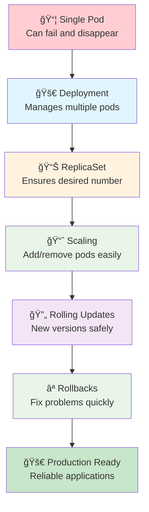

**Learn how to run applications reliably at scale!**

---

## 📚 Theoretical Foundation

### **Understanding Application Lifecycle in Production**

In production environments, applications face numerous challenges that single pods cannot handle effectively:

**🔍 Production Challenges:**
- **Hardware Failures** - Servers crash, network issues occur
- **Software Bugs** - Applications may hang or consume excessive resources  
- **Traffic Variations** - Load fluctuates throughout the day
- **Updates Required** - New features, security patches, bug fixes
- **Scaling Needs** - Business growth requires handling more users

**💡 The Kubernetes Solution:**
Kubernetes addresses these challenges through a declarative approach where you specify the desired state, and the system continuously works to maintain that state. This is achieved through several key abstractions working together.

---

## 🤔 Why Do We Need Deployments?

### **The Problem with Single Pods**

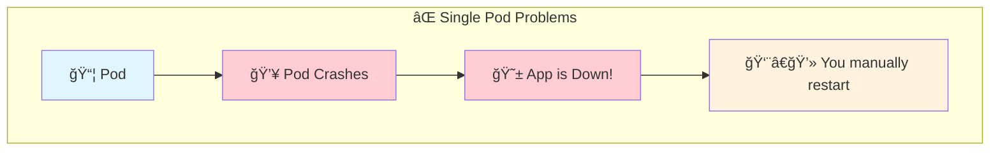

**🔍 Detailed Problem Analysis:**

**1. Single Point of Failure:**
- When you run a single pod, if it fails, your entire application becomes unavailable
- Pod failures can occur due to node failures, resource exhaustion, or application crashes
- Manual intervention is required to restart failed pods

**2. No Load Distribution:**
- A single pod can only handle limited concurrent requests
- All traffic goes to one instance, creating a bottleneck
- No redundancy means no fault tolerance

**3. Update Challenges:**
- Updating a single pod requires stopping the old version first
- This creates downtime during updates
- If the update fails, you need manual rollback procedures

**4. Resource Limitations:**
- Single pods are constrained by the resources of one node
- Cannot scale beyond the capacity of a single machine
- No ability to distribute load across multiple nodes

### **The Solution: Deployments**

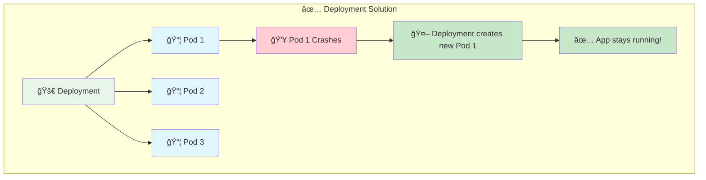

**🔍 Deployment Benefits Explained:**

**1. Self-Healing (High Availability):**
- Deployments continuously monitor the health of pods
- When a pod fails, the deployment controller immediately creates a replacement
- This happens automatically without human intervention
- The system maintains the desired number of healthy replicas at all times

**2. Horizontal Scaling:**
- Easy to increase or decrease the number of pod replicas
- Load is distributed across multiple pod instances
- Can scale across multiple nodes for better resource utilization
- Supports both manual and automatic scaling based on metrics

**3. Rolling Updates (Zero Downtime):**
- Updates happen gradually, replacing pods one by one
- Old pods continue serving traffic while new pods are being created
- Only when new pods are ready and healthy, old pods are terminated
- If issues are detected, the update can be paused or rolled back

**4. Desired State Management:**
- You declare what you want (desired state)
- Kubernetes continuously works to maintain that state
- If the actual state drifts from desired state, corrective actions are taken
- This provides consistency and reliability

---

## 🏗️ Understanding the Architecture

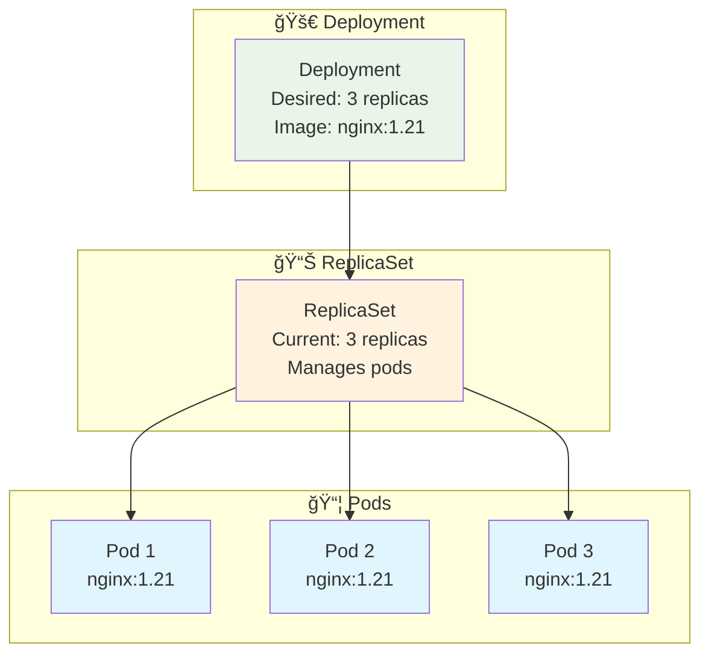

**🔍 Architecture Deep Dive:**

**1. Deployment Controller:**
- **Purpose:** High-level abstraction for managing application deployments
- **Responsibilities:** 
  - Creates and manages ReplicaSets
  - Handles rolling updates and rollbacks
  - Maintains deployment history
  - Provides declarative updates to pods and ReplicaSets

**2. ReplicaSet Controller:**
- **Purpose:** Ensures a specified number of pod replicas are running
- **Responsibilities:**
  - Creates and deletes pods to match desired replica count
  - Monitors pod health and replaces failed pods
  - Uses label selectors to identify which pods it manages
  - Provides the foundation for scaling operations

**3. Pod Lifecycle Management:**
- **Creation:** ReplicaSet creates pods based on the pod template
- **Monitoring:** Continuous health checks ensure pods are running
- **Replacement:** Failed pods are automatically recreated
- **Termination:** Graceful shutdown when scaling down or updating

**4. Control Loop Pattern:**
```
Observe Current State → Compare with Desired State → Take Action → Repeat
```

This control loop runs continuously, ensuring the system self-heals and maintains the desired state.

---

## 📊 Deployment Specifications Explained

### **Key Deployment Fields:**

**1. Replica Management:**
```yaml
spec:
  replicas: 3  # Desired number of pod instances
```
- Defines how many identical pods should be running
- ReplicaSet ensures this number is maintained
- Can be changed to scale the application

**2. Selector Configuration:**
```yaml
spec:
  selector:
    matchLabels:
      app: my-app  # Labels that identify managed pods
```
- Defines which pods belong to this deployment
- Must match the labels in the pod template
- Used by ReplicaSet to track and manage pods

**3. Pod Template:**
```yaml
spec:
  template:
    metadata:
      labels:
        app: my-app  # Labels applied to created pods
    spec:
      containers:
      - name: web
        image: nginx:1.21
```
- Blueprint for creating new pods
- Contains container specifications, volumes, etc.
- Used by ReplicaSet when creating new pods

**4. Update Strategy:**
```yaml
spec:
  strategy:
    type: RollingUpdate
    rollingUpdate:
      maxUnavailable: 1  # Max pods that can be down during update
      maxSurge: 1       # Max extra pods during update
```
- Controls how updates are performed
- RollingUpdate ensures zero downtime
- Parameters control the pace of updates

---

## 🧪 Hands-On: Your First Deployment

### **Exercise 1: Create a Deployment**
```bash
# Create deployment with 3 replicas
k create deployment web-app --image=nginx --replicas=3

# Check the deployment
k get deployments

# Check the replicaset (created automatically)
k get replicasets

# Check the pods (created by replicaset)
k get pods

# See the relationship
k get all -l app=web-app
```

**🔍 What Happens Behind the Scenes:**
1. **Deployment Creation:** Kubernetes creates a Deployment object
2. **ReplicaSet Generation:** Deployment controller creates a ReplicaSet
3. **Pod Creation:** ReplicaSet controller creates 3 pods
4. **Scheduling:** Kubernetes scheduler assigns pods to nodes
5. **Container Startup:** Kubelet on each node starts the containers

### **Exercise 2: Test Self-Healing**
```bash
# Delete one pod and watch it get recreated
k get pods -l app=web-app

# Delete one pod (replace POD_NAME with actual name)
k delete pod <POD_NAME>

# Watch new pod being created
k get pods -l app=web-app -w

# Press Ctrl+C to stop watching
```

**🔍 Self-Healing Process:**
1. **Pod Deletion:** Pod is removed from the cluster
2. **State Detection:** ReplicaSet controller notices the discrepancy
3. **Corrective Action:** New pod is created to maintain desired count
4. **Scheduling:** New pod is scheduled to an available node
5. **Health Monitoring:** System ensures new pod becomes ready

---

## 📈 Scaling Theory and Practice

### **Understanding Application Scaling**

**🔍 Scaling Fundamentals:**

**1. Horizontal vs Vertical Scaling:**
- **Horizontal (Scale Out):** Add more pod instances
  - Distributes load across multiple instances
  - Better fault tolerance
  - Can scale beyond single node limits
  - Preferred approach in Kubernetes

- **Vertical (Scale Up):** Increase resources per pod
  - More CPU/memory for existing pods
  - Limited by node capacity
  - Single point of failure remains
  - Used for resource optimization

**2. Load Distribution Patterns:**
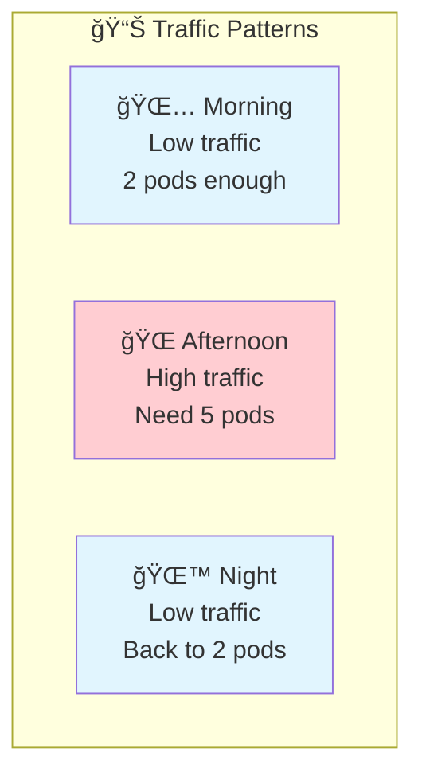

**3. Scaling Benefits:**
- **Cost Efficiency:** Pay only for resources you use
- **Performance:** Handle more concurrent users
- **Reliability:** Distribute risk across multiple instances
- **Flexibility:** Adapt to changing business needs

**4. Scaling Considerations:**
- **Stateless Applications:** Easy to scale (recommended)
- **Stateful Applications:** Require special handling
- **Resource Limits:** Node capacity constraints
- **Network Overhead:** Communication between instances

### **Exercise 3: Manual Scaling**
```bash
# Scale up to 5 replicas
k scale deployment web-app --replicas=5

# Check the new pods being created
k get pods -l app=web-app

# Scale down to 2 replicas
k scale deployment web-app --replicas=2

# Watch pods being terminated
k get pods -l app=web-app -w
```

### **Understanding Scaling Process**
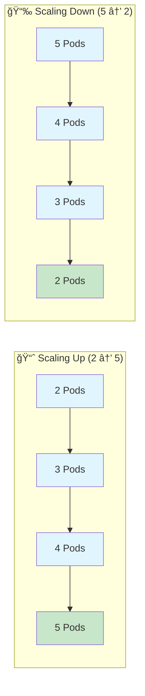

**🔍 Scaling Process Details:**

**Scale Up Process:**
1. **Command Execution:** kubectl updates deployment spec
2. **ReplicaSet Update:** New desired replica count is set
3. **Pod Creation:** ReplicaSet creates additional pods
4. **Scheduling:** Scheduler assigns pods to available nodes
5. **Startup:** Containers start and become ready
6. **Load Distribution:** New pods start receiving traffic

**Scale Down Process:**
1. **Command Execution:** kubectl reduces replica count
2. **Pod Selection:** ReplicaSet selects pods for termination
3. **Graceful Shutdown:** SIGTERM sent to containers
4. **Grace Period:** Containers have time to finish requests
5. **Force Kill:** SIGKILL sent if grace period expires
6. **Cleanup:** Pod resources are released

---
## 🔄 Rolling Updates - Zero Downtime Deployments

### **Rolling Update Theory**

**🔍 Understanding Rolling Updates:**

Rolling updates are the cornerstone of modern application deployment strategies. They enable you to update applications without service interruption, which is critical for production systems.

**1. Traditional Deployment Problems:**
- **Big Bang Deployments:** Stop all instances, deploy new version, restart
- **Downtime Required:** Service unavailable during deployment
- **High Risk:** If deployment fails, entire service is down
- **Rollback Complexity:** Difficult to revert to previous version quickly

**2. Rolling Update Solution:**
- **Gradual Replacement:** Replace instances one by one
- **Continuous Availability:** Service remains available throughout
- **Risk Mitigation:** Problems affect only a subset of users
- **Easy Rollback:** Can quickly revert to previous version

### **Rolling Update Process**
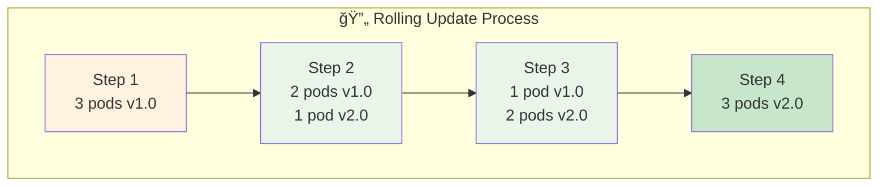

**🔍 Detailed Process Flow:**

**Phase 1 - Preparation:**
1. **New ReplicaSet Creation:** Deployment creates new ReplicaSet with updated image
2. **Resource Allocation:** Kubernetes reserves resources for new pods
3. **Image Pull:** New container images are pulled to nodes
4. **Health Check Setup:** Readiness and liveness probes are configured

**Phase 2 - Gradual Replacement:**
1. **Pod Creation:** New ReplicaSet creates first new pod
2. **Startup Wait:** System waits for new pod to become ready
3. **Health Verification:** Readiness probes confirm pod is healthy
4. **Traffic Routing:** Load balancer starts sending traffic to new pod
5. **Old Pod Termination:** One old pod is gracefully terminated
6. **Repeat:** Process continues until all pods are updated

**Phase 3 - Completion:**
1. **Final Verification:** All new pods are healthy and receiving traffic
2. **Old ReplicaSet Cleanup:** Old ReplicaSet is scaled to zero
3. **History Update:** Deployment history is updated with new revision
4. **Status Update:** Deployment status reflects successful update

**Benefits:**
- ✅ **Zero downtime** - App stays available
- 🔄 **Gradual** - Problems affect fewer users
- ⏪ **Reversible** - Easy to rollback
- 📊 **Controlled** - You set the pace

### **Exercise 4: Rolling Update**
```bash
# Check current image version
k describe deployment web-app | grep Image

# Update to new version
k set image deployment/web-app nginx=nginx:1.21

# Watch the rolling update
k rollout status deployment/web-app

# Check pods during update (in another terminal)
k get pods -l app=web-app -w

# Verify new image
k describe deployment web-app | grep Image
```

**🔍 Monitoring Rolling Updates:**

**Key Metrics to Watch:**
- **Pod Status:** Ready/NotReady states during update
- **ReplicaSet Status:** Old vs new ReplicaSet pod counts
- **Rollout Progress:** Percentage of pods updated
- **Health Checks:** Readiness and liveness probe results

**Common Update Patterns:**
- **Canary Updates:** Update small percentage first
- **Blue-Green:** Maintain two complete environments
- **A/B Testing:** Route traffic based on user segments

---

## ⏪ Rollback Theory and Practice

### **Understanding Rollbacks**

**🔍 Why Rollbacks Are Critical:**

Even with careful testing, production deployments can fail. Rollbacks provide a safety net that allows you to quickly revert to a known good state.

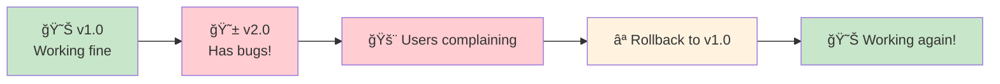

**1. Common Rollback Scenarios:**
- **Application Bugs:** New version has critical bugs
- **Performance Issues:** New version is slower or uses more resources
- **Integration Problems:** New version doesn't work with other services
- **Configuration Errors:** Wrong environment variables or settings
- **Database Migration Issues:** Schema changes cause problems

**2. Rollback Mechanisms:**
- **Deployment History:** Kubernetes maintains revision history
- **ReplicaSet Preservation:** Old ReplicaSets are kept for rollback
- **Automated Rollback:** Can be triggered by health check failures
- **Manual Rollback:** Operator-initiated when issues are detected

**3. Rollback Process:**
1. **Issue Detection:** Problem identified in new version
2. **Rollback Decision:** Determine need to revert
3. **History Check:** Identify target revision for rollback
4. **Rollback Execution:** Kubernetes reverts to previous ReplicaSet
5. **Verification:** Confirm rollback was successful
6. **Post-Mortem:** Analyze what went wrong

### **Exercise 5: Rollback Demo**
```bash
# Update to a "bad" version
k set image deployment/web-app nginx=nginx:bad-version

# Check what happens
k get pods -l app=web-app

# Check rollout history
k rollout history deployment/web-app

# Rollback to previous version
k rollout undo deployment/web-app

# Watch the rollback
k rollout status deployment/web-app

# Verify pods are healthy
k get pods -l app=web-app
```

**🔍 Rollback Best Practices:**

**1. Monitoring and Alerting:**
- Set up comprehensive monitoring for new deployments
- Configure alerts for error rates, response times, and resource usage
- Implement automated rollback triggers for critical failures

**2. Rollback Testing:**
- Regularly test rollback procedures in staging environments
- Ensure rollback process is well-documented and practiced
- Verify that rollbacks don't cause data loss or corruption

**3. Rollback Strategy:**
- Define clear criteria for when to rollback
- Establish rollback time windows (e.g., rollback within 15 minutes)
- Plan for database rollbacks if schema changes are involved

---

## 🎯 Deployment Strategies Deep Dive

### **Strategy Comparison**

**1. Recreate Strategy**
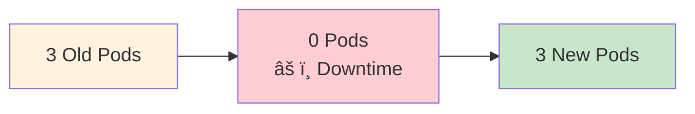

**When to use:** 
- Applications that cannot run multiple versions simultaneously
- Development/testing environments where downtime is acceptable
- Applications with complex state that's difficult to migrate

**Pros:**
- Simple and straightforward
- No resource overhead during deployment
- No version compatibility issues

**Cons:**
- Service downtime during deployment
- Higher risk if deployment fails
- Not suitable for production systems

**2. Rolling Update Strategy (Default)**


**When to use:**
- Production applications requiring high availability
- Stateless applications that can run multiple versions
- Most common strategy for web applications

**Pros:**
- Zero downtime deployments
- Gradual rollout reduces risk
- Easy rollback capability
- Resource efficient

**Cons:**
- Temporary mixed version state
- Requires version compatibility
- Slightly more complex than recreate

### **Exercise 10: Configure Update Strategy**
```bash
# Create deployment with specific strategy
cat <<EOF | k apply -f -
apiVersion: apps/v1
kind: Deployment
metadata:
  name: strategy-demo
spec:
  replicas: 4
  strategy:
    type: RollingUpdate
    rollingUpdate:
      maxUnavailable: 1         # Max pods that can be down
      maxSurge: 1              # Max extra pods during update
  selector:
    matchLabels:
      app: strategy-demo
  template:
    metadata:
      labels:
        app: strategy-demo
    spec:
      containers:
      - name: nginx
        image: nginx:1.20
EOF

# Test the strategy
k set image deployment/strategy-demo nginx=nginx:1.21

# Watch the update process
k get pods -l app=strategy-demo -w

# Clean up
k delete deployment strategy-demo
```

**🔍 Rolling Update Parameters:**

**maxUnavailable:**
- Maximum number of pods that can be unavailable during update
- Can be absolute number (e.g., 2) or percentage (e.g., 25%)
- Lower values = slower updates but higher availability
- Higher values = faster updates but more risk

**maxSurge:**
- Maximum number of pods that can be created above desired replica count
- Allows for faster updates by creating new pods before terminating old ones
- Requires additional cluster resources during update
- Can be absolute number or percentage

---

## 📊 Health Checks and Monitoring

### **Health Check Theory**

**🔍 Understanding Kubernetes Health Checks:**

Health checks are critical for ensuring application reliability and enabling automated recovery from failures.

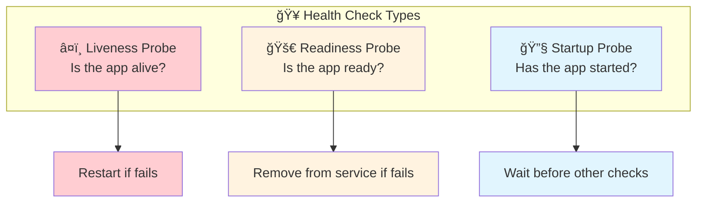

**1. Liveness Probe:**
- **Purpose:** Determines if container is running properly
- **Action on Failure:** Kubernetes restarts the container
- **Use Cases:** Detect deadlocks, infinite loops, or crashed processes
- **Example:** HTTP endpoint that returns 200 if app is healthy

**2. Readiness Probe:**
- **Purpose:** Determines if container is ready to serve traffic
- **Action on Failure:** Pod is removed from service endpoints
- **Use Cases:** App startup, dependency checks, temporary overload
- **Example:** Database connection check before serving requests

**3. Startup Probe:**
- **Purpose:** Determines if container has started successfully
- **Action on Failure:** Container is restarted
- **Use Cases:** Slow-starting applications, complex initialization
- **Example:** Check if application has completed initialization

**Health Check Methods:**
- **HTTP GET:** Most common, checks HTTP endpoint
- **TCP Socket:** Checks if port is open
- **Exec Command:** Runs command inside container

### **Exercise 8: Health Checks**
```bash
# Create deployment with health checks
cat <<EOF | k apply -f -
apiVersion: apps/v1
kind: Deployment
metadata:
  name: healthy-app
spec:
  replicas: 3
  selector:
    matchLabels:
      app: healthy-app
  template:
    metadata:
      labels:
        app: healthy-app
    spec:
      containers:
      - name: nginx
        image: nginx
        ports:
        - containerPort: 80
        livenessProbe:
          httpGet:
            path: /
            port: 80
          initialDelaySeconds: 10
          periodSeconds: 10
        readinessProbe:
          httpGet:
            path: /
            port: 80
          initialDelaySeconds: 5
          periodSeconds: 5
EOF

# Check pod health
k get pods -l app=healthy-app
k describe pod -l app=healthy-app | grep -A 10 "Liveness\|Readiness"

# Clean up
k delete deployment healthy-app
```
---

## 🧪 Advanced Practical Exercises

### **Exercise 6: Load Balancing Test**
```bash
# Create service for the deployment
k expose deployment web-app --port=80 --type=NodePort

# Get the service port
k get services

# Test load balancing (run multiple times)
curl http://localhost:<PORT>

# Each request might go to a different pod!
```

**🔍 Load Balancing Theory:**

**1. Service Discovery:**
- Services provide stable endpoints for accessing pods
- Load balancing distributes traffic across healthy pods
- Automatic failover when pods become unhealthy

**2. Load Balancing Algorithms:**
- **Round Robin:** Default, distributes requests evenly
- **Session Affinity:** Routes requests from same client to same pod
- **Least Connections:** Routes to pod with fewest active connections

### **Exercise 7: Blue-Green Deployment**
```bash
# Create blue deployment
k create deployment blue-app --image=varunmanik/httpd:blue --replicas=3

# Create green deployment
k create deployment green-app --image=varunmanik/httpd:green --replicas=3

# Create service pointing to blue
k create service nodeport web-service --tcp=80:80 --node-port=30080
k patch service web-service -p '{"spec":{"selector":{"app":"blue-app"}}}'

# Test blue version
curl http://localhost:30080

# Switch to green (instant traffic switch!)
k patch service web-service -p '{"spec":{"selector":{"app":"green-app"}}}'

# Test green version
curl http://localhost:30080

# Clean up
k delete deployment blue-app green-app
k delete service web-service
```

**🔍 Blue-Green Deployment Theory:**

**1. Concept:**
- Maintain two identical production environments (Blue and Green)
- Only one environment serves production traffic at a time
- Switch traffic instantly between environments

**2. Benefits:**
- **Zero Downtime:** Instant traffic switching
- **Easy Rollback:** Switch back if issues occur
- **Full Testing:** Test complete environment before switching
- **Risk Reduction:** Problems don't affect production traffic

**3. Considerations:**
- **Resource Cost:** Requires double the resources
- **Data Synchronization:** Database changes need careful handling
- **State Management:** Stateful applications require special consideration

---

## 📝 YAML Configuration Deep Dive

### **Complete Deployment YAML Explained**

```yaml
apiVersion: apps/v1              # Kubernetes API version
kind: Deployment                 # Resource type
metadata:
  name: my-app                   # Deployment name
  labels:                        # Labels for the deployment
    app: my-app
    version: v1.0
  annotations:                   # Additional metadata
    deployment.kubernetes.io/revision: "1"
spec:
  replicas: 3                    # Desired number of pods
  selector:                      # Pod selector
    matchLabels:
      app: my-app
  strategy:                      # Update strategy
    type: RollingUpdate
    rollingUpdate:
      maxUnavailable: 1
      maxSurge: 1
  template:                      # Pod template
    metadata:
      labels:                    # Pod labels
        app: my-app
        version: v1.0
    spec:
      containers:
      - name: web                # Container name
        image: nginx:1.21        # Container image
        ports:
        - containerPort: 80      # Container port
        resources:               # Resource limits
          requests:
            memory: "64Mi"
            cpu: "250m"
          limits:
            memory: "128Mi"
            cpu: "500m"
        livenessProbe:           # Health checks
          httpGet:
            path: /
            port: 80
          initialDelaySeconds: 30
          periodSeconds: 10
        readinessProbe:
          httpGet:
            path: /
            port: 80
          initialDelaySeconds: 5
          periodSeconds: 5
```

### **Exercise 9: Create from YAML**
```bash
# Create the deployment YAML file
cat <<EOF > my-deployment.yaml
apiVersion: apps/v1
kind: Deployment
metadata:
  name: yaml-demo
  labels:
    app: yaml-demo
spec:
  replicas: 2
  selector:
    matchLabels:
      app: yaml-demo
  template:
    metadata:
      labels:
        app: yaml-demo
    spec:
      containers:
      - name: web
        image: nginx
        ports:
        - containerPort: 80
EOF

# Apply the YAML
k apply -f my-deployment.yaml

# Check it worked
k get deployment yaml-demo

# Clean up
k delete -f my-deployment.yaml
rm my-deployment.yaml
```

---

## 💰 Resource Management Theory

### **Understanding Resource Requests and Limits**

**🔍 Resource Management Concepts:**

**1. Resource Types:**
- **CPU:** Measured in millicores (m) or cores
- **Memory:** Measured in bytes (Mi, Gi)
- **Storage:** Persistent volume claims
- **Custom Resources:** GPU, network bandwidth

**2. Requests vs Limits:**
- **Requests:** Guaranteed resources for the container
- **Limits:** Maximum resources the container can use
- **Quality of Service:** Determined by requests/limits configuration

**3. QoS Classes:**
- **Guaranteed:** Requests = Limits for all resources
- **Burstable:** Some containers have requests < limits
- **BestEffort:** No requests or limits specified

### **Exercise 11: Resource Limits**
```bash
# Create deployment with resource limits
cat <<EOF | k apply -f -
apiVersion: apps/v1
kind: Deployment
metadata:
  name: resource-demo
spec:
  replicas: 2
  selector:
    matchLabels:
      app: resource-demo
  template:
    metadata:
      labels:
        app: resource-demo
    spec:
      containers:
      - name: nginx
        image: nginx
        resources:
          requests:              # Guaranteed resources
            memory: "64Mi"
            cpu: "250m"
          limits:                # Maximum resources
            memory: "128Mi"
            cpu: "500m"
EOF

# Check the deployment
k describe deployment resource-demo

# Clean up
k delete deployment resource-demo
```

**🔍 Resource Management Best Practices:**

**1. Setting Appropriate Requests:**
- Monitor actual resource usage in production
- Set requests based on typical usage patterns
- Ensure cluster has enough capacity for all requests

**2. Setting Appropriate Limits:**
- Prevent containers from consuming excessive resources
- Set limits higher than requests to allow for bursts
- Consider the impact of hitting limits (throttling vs termination)

**3. Monitoring Resource Usage:**
- Use metrics server to monitor actual usage
- Set up alerts for high resource utilization
- Regularly review and adjust resource settings

---

## 🔍 Essential Commands Reference

### **Deployment Management Commands**
```bash
# Create deployment
k create deployment <name> --image=<image> --replicas=<number>

# List deployments
k get deployments
k get deploy                    # Short form

# Deployment details
k describe deployment <name>

# Scale deployment
k scale deployment <name> --replicas=<number>

# Update image
k set image deployment/<name> <container>=<new-image>

# Check rollout status
k rollout status deployment/<name>

# Rollout history
k rollout history deployment/<name>

# Rollback
k rollout undo deployment/<name>
k rollout undo deployment/<name> --to-revision=<number>

# Pause/Resume rollout
k rollout pause deployment/<name>
k rollout resume deployment/<name>

# Delete deployment
k delete deployment <name>
```

### **Monitoring and Debugging Commands**
```bash
# Check pod status
k get pods -l app=<name>
k describe pod <pod-name>

# Check logs
k logs -l app=<name>
k logs <pod-name> -f          # Follow logs

# Check events
k get events --sort-by=.metadata.creationTimestamp
k get events --field-selector involvedObject.name=<name>

# Resource usage (if metrics server available)
k top nodes
k top pods
k top pods -l app=<name>

# Port forwarding for testing
k port-forward deployment/<name> 8080:80
```

---

## 🔍 Troubleshooting Guide

### **Common Issues and Solutions**

#### **1. Deployment Stuck in Progress**
```bash
# Check deployment status
k describe deployment <name>

# Look for conditions and events
k get deployment <name> -o yaml | grep -A 10 conditions

# Check replicaset status
k get rs -l app=<name>
k describe rs <replicaset-name>
```

**Common Causes:**
- Insufficient cluster resources
- Image pull errors
- Invalid configuration
- Health check failures

#### **2. Pods Not Starting**
```bash
# Check pod status and events
k get pods -l app=<name>
k describe pod <pod-name>

# Check container logs
k logs <pod-name>
k logs <pod-name> -c <container-name>  # Multi-container pods
```

**Common Causes:**
- Wrong image name or tag
- Missing secrets or config maps
- Resource constraints
- Application startup errors

#### **3. Rolling Update Failing**
```bash
# Check rollout status
k rollout status deployment/<name>

# Check rollout history
k rollout history deployment/<name>

# Check new replicaset
k get rs -l app=<name>
k describe rs <new-replicaset-name>
```

**Common Causes:**
- Health check failures
- Resource constraints
- Configuration errors
- Image pull errors

#### **4. Performance Issues**
```bash
# Check resource usage
k top pods -l app=<name>

# Check resource limits
k describe deployment <name> | grep -A 10 Limits

# Check node resources
k top nodes
k describe node <node-name>
```

**Common Causes:**
- Insufficient CPU/memory requests
- Resource limits too low
- Node resource exhaustion
- Application inefficiencies

---

## 📝 Production Best Practices

### **Deployment Best Practices**

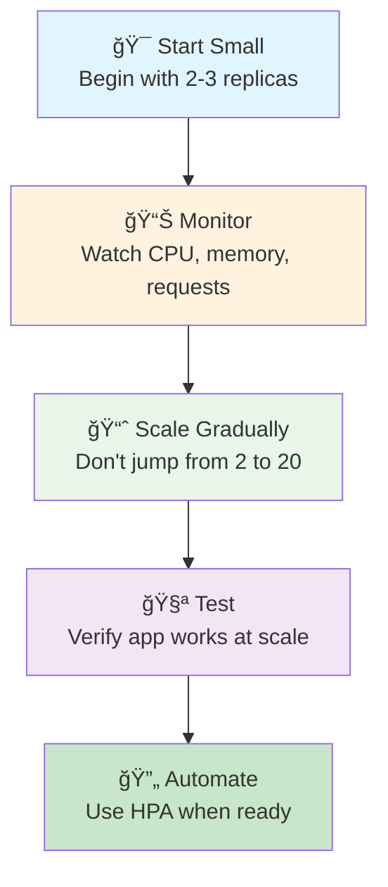

**1. Planning and Design:**
- Design applications to be stateless when possible
- Implement proper health checks from the beginning
- Plan for horizontal scaling rather than vertical
- Consider data persistence and state management

**2. Configuration Management:**
- Use ConfigMaps and Secrets for configuration
- Avoid hardcoding values in container images
- Implement proper environment-specific configurations
- Version control all YAML configurations

**3. Security Considerations:**
- Use specific image tags, avoid 'latest'
- Implement resource limits to prevent resource exhaustion
- Use security contexts and pod security policies
- Regularly update base images and dependencies

**4. Monitoring and Observability:**
- Implement comprehensive logging
- Set up metrics collection and monitoring
- Configure alerting for critical issues
- Use distributed tracing for complex applications

**5. Update and Rollback Strategies:**
- Test updates in staging environments first
- Use health checks to verify pod health
- Monitor during updates for issues
- Have rollback plans ready and tested
- Update during low traffic periods when possible

**6. Scaling Strategies:**
- Start with conservative replica counts
- Monitor resource usage and performance
- Scale gradually and test at each level
- Consider implementing Horizontal Pod Autoscaler (HPA)
- Plan for both scale-up and scale-down scenarios

---

## ✅ Knowledge Check

### **Theoretical Questions**
1. **What creates and manages pods in a deployment?**
   - Deployment ❌
   - ReplicaSet ✅
   - Service ❌

2. **What happens during a rolling update?**
   - All pods replaced at once ❌
   - Pods replaced gradually ✅
   - Service goes down ❌

3. **How do you rollback a deployment?**
   - Delete and recreate ❌
   - kubectl rollout undo ✅
   - Scale to 0 and back ❌

4. **What is the purpose of a liveness probe?**
   - Check if pod is ready for traffic ❌
   - Check if container is running properly ✅
   - Check if pod has started ❌

5. **What does maxSurge control in rolling updates?**
   - Maximum pods that can be unavailable ❌
   - Maximum extra pods during update ✅
   - Maximum time for update ❌

### **Practical Test Scenarios**
```bash
# Scenario 1: Basic Deployment Management
# 1. Create a deployment with 3 replicas
# 2. Scale it to 5 replicas
# 3. Update the image
# 4. Rollback the update
# 5. Clean up

# Scenario 2: Health Check Implementation
# 1. Create deployment with health checks
# 2. Verify health checks are working
# 3. Simulate a failure
# 4. Observe automatic recovery

# Scenario 3: Blue-Green Deployment
# 1. Deploy blue version
# 2. Deploy green version
# 3. Switch traffic between versions
# 4. Verify traffic routing
```

---

## ✅ Success Criteria

You're ready for the next section when you can:

- [ ] ✅ **Understand deployment architecture** - Explain the relationship between Deployments, ReplicaSets, and Pods
- [ ] ✅ **Create deployments** - Use both kubectl commands and YAML files
- [ ] ✅ **Scale applications** - Manually scale deployments up and down
- [ ] ✅ **Perform rolling updates** - Update applications with zero downtime
- [ ] ✅ **Handle rollbacks** - Revert to previous versions when issues occur
- [ ] ✅ **Configure health checks** - Implement liveness and readiness probes
- [ ] ✅ **Manage resources** - Set appropriate requests and limits
- [ ] ✅ **Troubleshoot issues** - Diagnose and fix common deployment problems
- [ ] ✅ **Apply best practices** - Follow production-ready deployment patterns

---

## 🚀 Next Steps

**Excellent work!** 🎉 You now have comprehensive knowledge of deployment and scaling in Kubernetes!

### **What You've Mastered:**
- ✅ **Deployment Theory** - Deep understanding of how deployments work
- ✅ **Scaling Concepts** - Manual and automated scaling strategies
- ✅ **Rolling Updates** - Zero-downtime deployment techniques
- ✅ **Rollback Procedures** - Recovery from failed deployments
- ✅ **Health Monitoring** - Proactive application health management
- ✅ **Resource Management** - Efficient resource utilization
- ✅ **Production Practices** - Real-world deployment strategies

### **Ready for More Advanced Topics?**

**[→ Next: Services and Networking](../04-services-networking/)**

Learn how to expose your applications and enable communication between services in your Kubernetes cluster.

---

## 📚 Quick Reference

### **Essential Commands**
```bash
# Deployment lifecycle
k create deployment <name> --image=<image> --replicas=3
k scale deployment <name> --replicas=5
k set image deployment/<name> <container>=<new-image>
k rollout status deployment/<name>
k rollout undo deployment/<name>

# Monitoring and debugging
k get deployments
k describe deployment <name>
k get pods -l app=<name>
k logs -l app=<name>
k top pods -l app=<name>

# Cleanup
k delete deployment <name>
```

### **Complete Deployment YAML Template**
```yaml
apiVersion: apps/v1
kind: Deployment
metadata:
  name: my-app
  labels:
    app: my-app
spec:
  replicas: 3
  strategy:
    type: RollingUpdate
    rollingUpdate:
      maxUnavailable: 1
      maxSurge: 1
  selector:
    matchLabels:
      app: my-app
  template:
    metadata:
      labels:
        app: my-app
    spec:
      containers:
      - name: web
        image: nginx:1.21
        ports:
        - containerPort: 80
        resources:
          requests:
            memory: "64Mi"
            cpu: "250m"
          limits:
            memory: "128Mi"
            cpu: "500m"
        livenessProbe:
          httpGet:
            path: /
            port: 80
          initialDelaySeconds: 30
          periodSeconds: 10
        readinessProbe:
          httpGet:
            path: /
            port: 80
          initialDelaySeconds: 5
          periodSeconds: 5
```

---

*Congratulations! You've mastered Kubernetes deployments and scaling. You're now ready to build production-ready applications.* 🚀
