# 3️⃣ Deployment and Scaling - Managing Applications at Scale

<div align="center">

**🎯 Manage Multiple Pods | 📈 Scale Applications | 🔄 Zero-Downtime Updates**

</div>

---

## 🎯 What We'll Learn

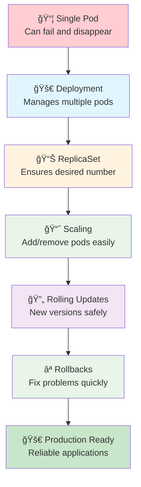

**Learn how to run applications reliably at scale!**

---

## 📚 Available YAML Files

This section includes several pre-configured YAML files for different scenarios:

| File | Purpose | Use Case |
|------|---------|----------|
| `simple-deployment.yaml` | Basic deployment | Getting started |
| `basic-deployment-template.yaml` | Template for exercises | Learning YAML structure |
| `health-check-deployment.yaml` | Health checks example | Production readiness |
| `resource-limits-deployment.yaml` | Resource management | Performance optimization |
| `rolling-update-strategy.yaml` | Update strategy config | Zero-downtime deployments |
| `blue-green-deployments.yaml` | Blue-green pattern | Advanced deployment strategy |
| `complete-deployment-example.yaml` | Full-featured example | Production template |

---

## 📚 Theoretical Foundation

### **Understanding Application Lifecycle in Production**

In production environments, applications face numerous challenges that single pods cannot handle effectively:

**🔍 Production Challenges:**
- **Hardware Failures** - Servers crash, network issues occur
- **Software Bugs** - Applications may hang or consume excessive resources  
- **Traffic Variations** - Load fluctuates throughout the day
- **Updates Required** - New features, security patches, bug fixes
- **Scaling Needs** - Business growth requires handling more users

**💡 The Kubernetes Solution:**
Kubernetes addresses these challenges through a declarative approach where you specify the desired state, and the system continuously works to maintain that state.

---

## 🤔 Why Do We Need Deployments?

### **The Problem with Single Pods**

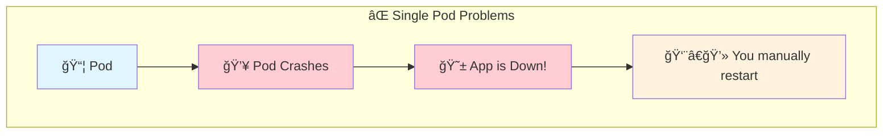

**🔍 Detailed Problem Analysis:**

**1. Single Point of Failure:**
- When you run a single pod, if it fails, your entire application becomes unavailable
- Pod failures can occur due to node failures, resource exhaustion, or application crashes
- Manual intervention is required to restart failed pods

**2. No Load Distribution:**
- A single pod can only handle limited concurrent requests
- All traffic goes to one instance, creating a bottleneck
- No redundancy means no fault tolerance

### **The Solution: Deployments**

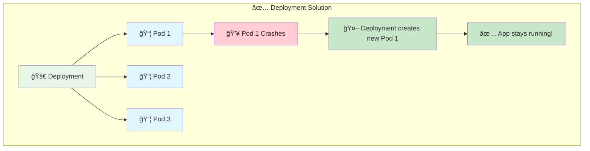

**🔍 Deployment Benefits:**
- 🔄 **Self-healing** - Automatically replaces failed pods
- 📈 **Scaling** - Easy to add/remove pods
- 🚀 **Updates** - Rolling updates with zero downtime
- 📊 **Desired state** - Always maintains the number you want

---

## 🏗️ Understanding the Architecture

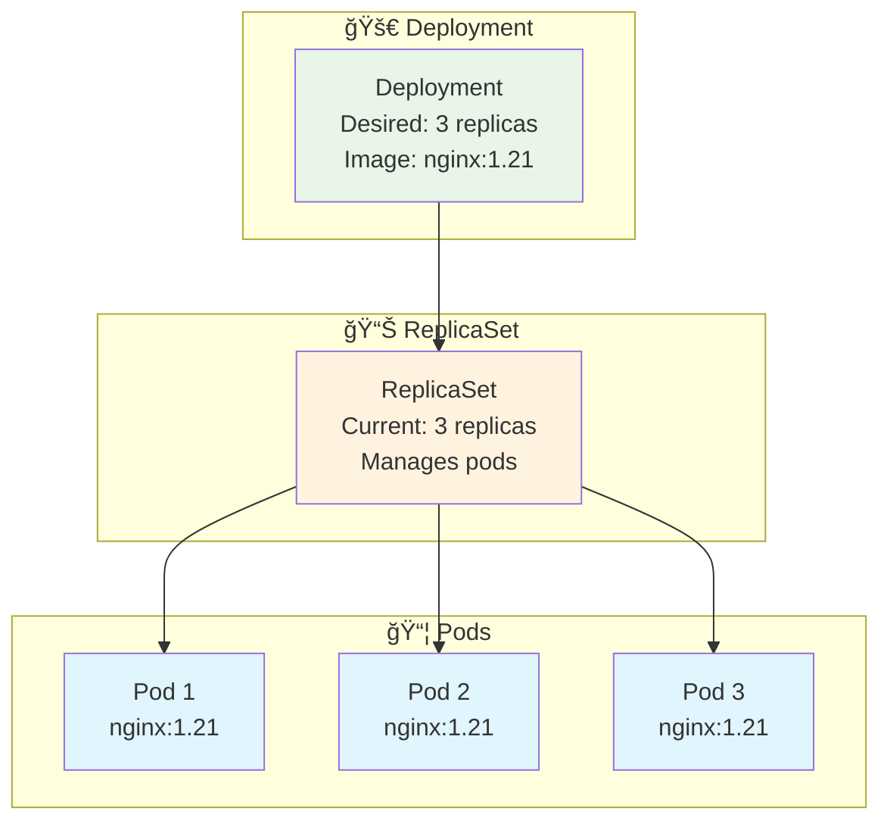

**🔍 Architecture Components:**

**1. Deployment Controller:**
- Creates and manages ReplicaSets
- Handles rolling updates and rollbacks
- Maintains deployment history

**2. ReplicaSet Controller:**
- Ensures specified number of pod replicas are running
- Monitors pod health and replaces failed pods
- Uses label selectors to identify managed pods

**3. Control Loop Pattern:**
```
Observe Current State → Compare with Desired State → Take Action → Repeat
```

---

## 🧪 Hands-On: Your First Deployment

### **Exercise 1: Create a Deployment**
```bash
# Create deployment with 3 replicas
k create deployment web-app --image=nginx --replicas=3

# Check the deployment
k get deployments

# Check the replicaset (created automatically)
k get replicasets

# Check the pods (created by replicaset)
k get pods

# See the relationship
k get all -l app=web-app
```

### **Exercise 2: Test Self-Healing**
```bash
# Delete one pod and watch it get recreated
k get pods -l app=web-app

# Delete one pod (replace POD_NAME with actual name)
k delete pod <POD_NAME>

# Watch new pod being created
k get pods -l app=web-app -w

# Press Ctrl+C to stop watching
```

---

## 📈 Scaling Applications

### **Why Scale Applications?**
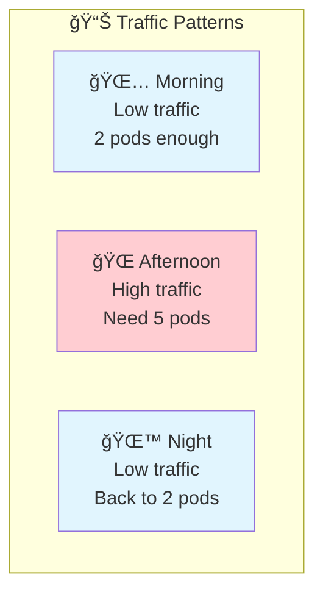

**Scaling Benefits:**
- 💰 **Cost efficiency** - Use only what you need
- 🚀 **Performance** - Handle more users
- 🔄 **Reliability** - Spread load across pods
- 📈 **Growth** - Adapt to changing demands

### **Exercise 3: Manual Scaling**
```bash
# Scale up to 5 replicas
k scale deployment web-app --replicas=5

# Check the new pods being created
k get pods -l app=web-app

# Scale down to 2 replicas
k scale deployment web-app --replicas=2

# Watch pods being terminated
k get pods -l app=web-app -w
```

### **Understanding Scaling Process**
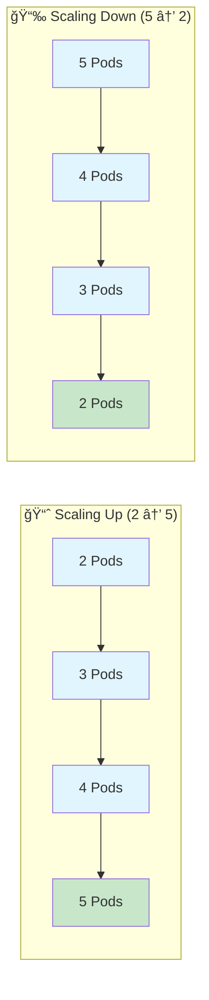

---

## 🔄 Rolling Updates

### **What is a Rolling Update?**
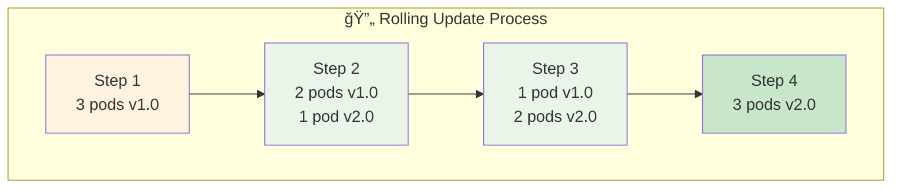

**Benefits:**
- ✅ **Zero downtime** - App stays available
- 🔄 **Gradual** - Problems affect fewer users
- ⏪ **Reversible** - Easy to rollback
- 📊 **Controlled** - You set the pace

### **Exercise 4: Rolling Update**
```bash
# Check current image version
k describe deployment web-app | grep Image

# Update to new version
k set image deployment/web-app nginx=nginx:1.21

# Watch the rolling update
k rollout status deployment/web-app

# Verify new image
k describe deployment web-app | grep Image
```

---

## ⏪ Rollbacks

### **When Things Go Wrong**
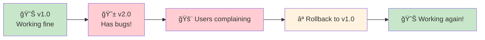

### **Exercise 5: Rollback Demo**
```bash
# Update to a "bad" version
k set image deployment/web-app nginx=nginx:bad-version

# Check what happens
k get pods -l app=web-app

# Check rollout history
k rollout history deployment/web-app

# Rollback to previous version
k rollout undo deployment/web-app

# Watch the rollback
k rollout status deployment/web-app

# Verify pods are healthy
k get pods -l app=web-app
```

---

## 🧪 YAML-Based Exercises

### **Exercise 6: Basic YAML Deployment**

**📁 File:** `basic-deployment-template.yaml`

```bash
# Apply the basic deployment
k apply -f basic-deployment-template.yaml

# Check it worked
k get deployment yaml-demo

# Scale the deployment
k scale deployment yaml-demo --replicas=4

# Clean up
k delete -f basic-deployment-template.yaml
```

### **Exercise 7: Health Checks**

**📁 File:** `health-check-deployment.yaml`

```bash
# Deploy with health checks
k apply -f health-check-deployment.yaml

# Check pod health
k get pods -l app=healthy-app

# Describe pods to see health check details
k describe pod -l app=healthy-app | grep -A 10 "Liveness\|Readiness"

# Clean up
k delete -f health-check-deployment.yaml
```

### **Exercise 8: Resource Management**

**📁 File:** `resource-limits-deployment.yaml`

```bash
# Deploy with resource limits
k apply -f resource-limits-deployment.yaml

# Check resource settings
k describe deployment resource-demo

# Monitor resource usage (if metrics server available)
k top pods -l app=resource-demo

# Clean up
k delete -f resource-limits-deployment.yaml
```

### **Exercise 9: Rolling Update Strategy**

**📁 File:** `rolling-update-strategy.yaml`

```bash
# Deploy with custom update strategy
k apply -f rolling-update-strategy.yaml

# Test the strategy by updating image
k set image deployment/strategy-demo nginx=nginx:1.21

# Watch the controlled update process
k get pods -l app=strategy-demo -w

# Clean up
k delete -f rolling-update-strategy.yaml
```

### **Exercise 10: Blue-Green Deployment**

**📁 File:** `blue-green-deployments.yaml`

```bash
# Deploy both blue and green versions
k apply -f blue-green-deployments.yaml

# Check both deployments
k get deployments -l app=web-app

# Test blue version (service points to blue initially)
curl http://localhost:30080

# Switch to green version
k patch service web-service -p '{"spec":{"selector":{"version":"green"}}}'

# Test green version
curl http://localhost:30080

# Clean up
k delete -f blue-green-deployments.yaml
```

### **Exercise 11: Complete Production Example**

**📁 File:** `complete-deployment-example.yaml`

```bash
# Deploy production-ready configuration
k apply -f complete-deployment-example.yaml

# Check all aspects
k get deployment my-app
k describe deployment my-app
k get pods -l app=my-app

# Test health checks
k describe pod -l app=my-app | grep -A 5 "Liveness\|Readiness"

# Clean up
k delete -f complete-deployment-example.yaml
```

---

## 🎯 Understanding Deployment Strategies

### **Recreate Strategy**
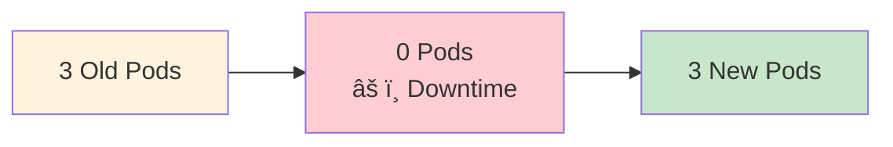

**When to use:** Development environments, applications that can't run multiple versions

### **Rolling Update Strategy (Default)**


**When to use:** Production applications requiring high availability

---

## 📊 Health Checks and Monitoring

### **Health Check Types**
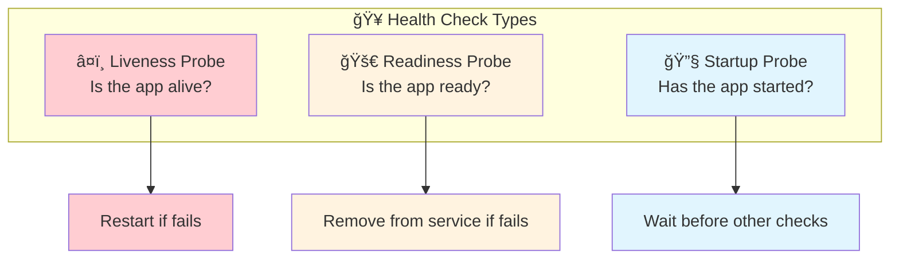

**Health Check Methods:**
- **HTTP GET:** Most common, checks HTTP endpoint
- **TCP Socket:** Checks if port is open
- **Exec Command:** Runs command inside container

---

## 🔍 Essential Commands

### **Deployment Management**
```bash
# Create deployment
k create deployment <name> --image=<image> --replicas=<number>

# List deployments
k get deployments

# Deployment details
k describe deployment <name>

# Scale deployment
k scale deployment <name> --replicas=<number>

# Update image
k set image deployment/<name> <container>=<new-image>

# Check rollout status
k rollout status deployment/<name>

# Rollout history
k rollout history deployment/<name>

# Rollback
k rollout undo deployment/<name>

# Delete deployment
k delete deployment <name>
```

### **YAML Operations**
```bash
# Apply YAML file
k apply -f <filename>.yaml

# Delete resources from YAML
k delete -f <filename>.yaml

# Validate YAML without applying
k apply -f <filename>.yaml --dry-run=client

# View applied configuration
k get deployment <name> -o yaml
```

---

## 🔍 Troubleshooting Guide

### **Common Issues**

#### **1. Deployment Stuck**
```bash
# Check deployment status
k describe deployment <name>

# Check replicaset
k get rs -l app=<name>
k describe rs <replicaset-name>
```

#### **2. Pods Not Starting**
```bash
# Check pod status and events
k get pods -l app=<name>
k describe pod <pod-name>

# Check container logs
k logs <pod-name>
```

#### **3. Image Pull Errors**
```bash
# Check pod events
k describe pod <pod-name>

# Common causes:
# - Wrong image name or tag
# - Missing image pull secrets
# - Network connectivity issues
```

---

## 📝 Best Practices

### **Deployment Best Practices**
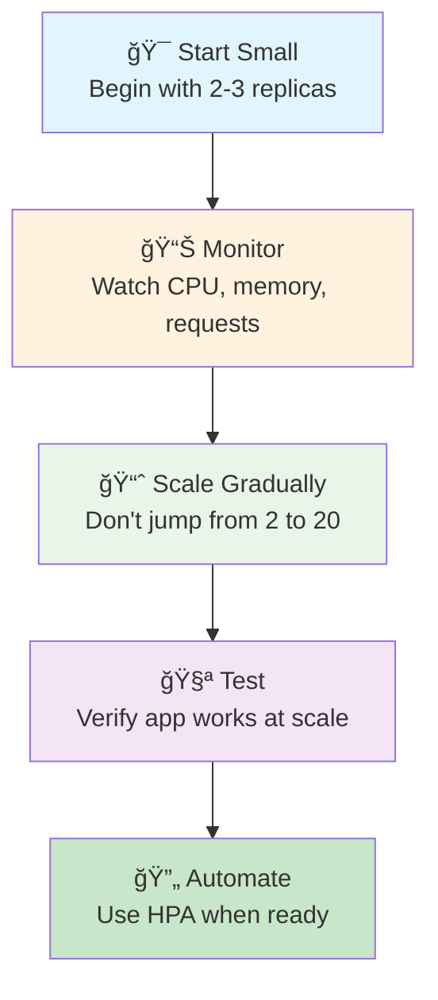

**Key Recommendations:**
- ✅ **Use specific image tags** - Avoid 'latest'
- ✅ **Implement health checks** - Enable automatic recovery
- ✅ **Set resource limits** - Prevent resource exhaustion
- ✅ **Test rollbacks** - Practice recovery procedures
- ✅ **Monitor deployments** - Watch for issues during updates

---

## ✅ Knowledge Check

### **Quiz Questions**
1. **What creates and manages pods in a deployment?**
   - Deployment ❌
   - ReplicaSet ✅
   - Service ❌

2. **What happens during a rolling update?**
   - All pods replaced at once ❌
   - Pods replaced gradually ✅
   - Service goes down ❌

3. **How do you rollback a deployment?**
   - Delete and recreate ❌
   - kubectl rollout undo ✅
   - Scale to 0 and back ❌

### **Practical Test**
```bash
# Can you complete this scenario?
# 1. Deploy using health-check-deployment.yaml
# 2. Scale it to 5 replicas
# 3. Update the image version
# 4. Rollback if there are issues
# 5. Clean up using the YAML file
```

---

## ✅ Success Criteria

You're ready for the next section when you can:

- [ ] ✅ Create deployments using kubectl and YAML files
- [ ] ✅ Scale deployments up and down
- [ ] ✅ Understand the relationship between Deployments, ReplicaSets, and Pods
- [ ] ✅ Perform rolling updates and rollbacks
- [ ] ✅ Configure health checks for reliability
- [ ] ✅ Troubleshoot deployment issues
- [ ] ✅ Use YAML files for configuration management

---

## 🚀 Next Steps

**Excellent work!** 🎉 You now know how to manage applications reliably at scale!

### **What You Learned:**
- ✅ **Deployments** - How to manage multiple pods reliably
- ✅ **Scaling** - How to handle varying load
- ✅ **Rolling Updates** - How to deploy new versions safely
- ✅ **Rollbacks** - How to recover from bad deployments
- ✅ **YAML Management** - How to use configuration files effectively

### **Ready for More?**

**[→ Next: Services and Networking](../04-services-networking/)**

Learn how to expose your applications and enable communication between services.

---

## 📚 Quick Reference

### **YAML Files Summary**
| File | Command | Purpose |
|------|---------|---------|
| `simple-deployment.yaml` | `k apply -f simple-deployment.yaml` | Basic deployment |
| `health-check-deployment.yaml` | `k apply -f health-check-deployment.yaml` | Health checks |
| `resource-limits-deployment.yaml` | `k apply -f resource-limits-deployment.yaml` | Resource management |
| `rolling-update-strategy.yaml` | `k apply -f rolling-update-strategy.yaml` | Update strategy |
| `blue-green-deployments.yaml` | `k apply -f blue-green-deployments.yaml` | Blue-green pattern |
| `complete-deployment-example.yaml` | `k apply -f complete-deployment-example.yaml` | Production template |

### **Essential Commands**
```bash
# YAML operations
k apply -f <file>.yaml          # Deploy from file
k delete -f <file>.yaml         # Delete from file

# Deployment management
k create deployment <name> --image=<image> --replicas=3
k scale deployment <name> --replicas=5
k set image deployment/<name> <container>=<new-image>
k rollout status deployment/<name>
k rollout undo deployment/<name>

# Monitoring
k get deployments
k describe deployment <name>
k get pods -l app=<name>
k logs -l app=<name>
```

---

*You're becoming a Kubernetes expert! The YAML files make it easy to practice and learn.* 🚀
